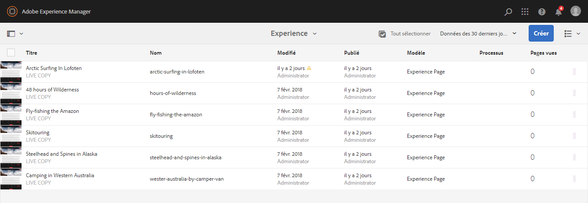
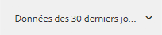

# Affichage des données d’analyse de page{#seeing-page-analytics-data}

Utilisez les données d’analyse de page pour mesurer l’efficacité du contenu de page.

## Les données d’analyse sont visibles à partir de la console {#analytics-visible-from-the-console}

Les données d’analyse de page s’affichent en [mode Liste](/help/sites-authoring/basic-handling.md#list-view) dans la console Sites. Lorsque les pages sont affichées sous forme de liste, les colonnes suivantes sont disponibles par défaut :

* Pages vues
* Visiteurs uniques
* Temps sur la page

Chaque colonne indique une valeur pour la période de création de rapports actuelle et indique également si la valeur a augmenté ou diminué depuis la période de création de rapports précédente. Les données affichées sont mises à jour toutes les 12 heures.

>[!NOTE]
>
>Pour modifier la période de mise à jour, [configurez l’intervalle d’importation](/help/sites-administering/adobeanalytics-connect.md#configuring-the-import-interval).

1. Ouvrez la console **Sites**; par exemple [https://localhost:4502/sites.html/content](https://localhost:4502/sites.html/content)
1. À l’extrême droite de la barre d’outils (dans le coin supérieur droit), appuyez ou cliquez sur l’icône pour sélectionner **Mode Liste** (l’icône affichée dépendra du [mode actuel](/help/sites-authoring/basic-handling.md#viewing-and-selecting-resources)).

1. À nouveau à l’extrême droite de la barre d’outils (dans le coin supérieur droit), cliquez ou appuyez sur l’icône, puis sélectionnez **Paramètres**. La boîte de dialogue **Configurer les colonnes** s’ouvre. Apportez les modifications requises et confirmez-les avec la commande **Mettre à jour**.

   

### Sélection de la période de création de rapports {#selecting-the-reporting-period}

Sélectionnez la période de création de rapports pour laquelle les données d’analyse s’affichent sur la console Sites :

* Données  Données
* Données des 90 derniers jours
* Données de cette année

La période de création de rapports actuelle apparaît sur la barre d’outils de la console Sites (à droite dans la barre d’outils supérieure). Utilisez le menu déroulant pour sélectionner la période de création de rapports requise. 

### Configuration des colonnes Données disponibles {#configuring-available-data-columns}

Les membres du groupe d’utilisateurs administrateurs d’analyse peuvent configurer la console Sites pour permettre aux auteurs de voir des colonnes Analyses supplémentaires.

>[!NOTE]
>
>Lorsqu’une arborescence de pages contient des enfants associés à différentes configurations de cloud d’Adobe Analytics, vous ne pouvez pas configurer les colonnes de données disponibles pour les pages.

1. Dans Liste Vue, utilisez les sélecteurs de vue (à droite de la barre d’outils), sélectionnez **Paramètres de Vue**, puis **Ajouter les données Analytics personnalisées**.

   

1. Sélectionnez les mesures à présenter aux auteurs dans la console Sites, puis cliquez sur **Ajouter**.

   Les colonnes affichées sont obtenues à partir d’Adobe Analytics.

   

### Ouverture de Content Insights à partir de la console Sites {#opening-content-insights-from-sites}

Ouvrez [Content Insight](/help/sites-authoring/content-insights.md) à partir de la console Sites pour en savoir plus sur l&#39;efficacité des pages.

1. Dans la console Sites, sélectionnez la page pour laquelle vous souhaitez voir Content Insight.
1. Sur la barre d’outils, cliquez sur l’icône Analyses et recommandations.

   

## Les données d’analyse sont visibles dans l’éditeur de page (carte d’activité)  {#analytics-visible-from-the-page-editor-activity-map}

>[!CAUTION]
>
>En raison de modifications de sécurité dans l’API Adobe Analytics, il n’est plus possible d’utiliser la version d’Activity Map incluse dans AEM.
>
>Le [module externe ActivityMap fourni par Adobe Analytics](https://docs.adobe.com/content/help/fr-FR/analytics/analyze/activity-map/getting-started/get-started-users/activitymap-install.html) doit maintenant être utilisé.
