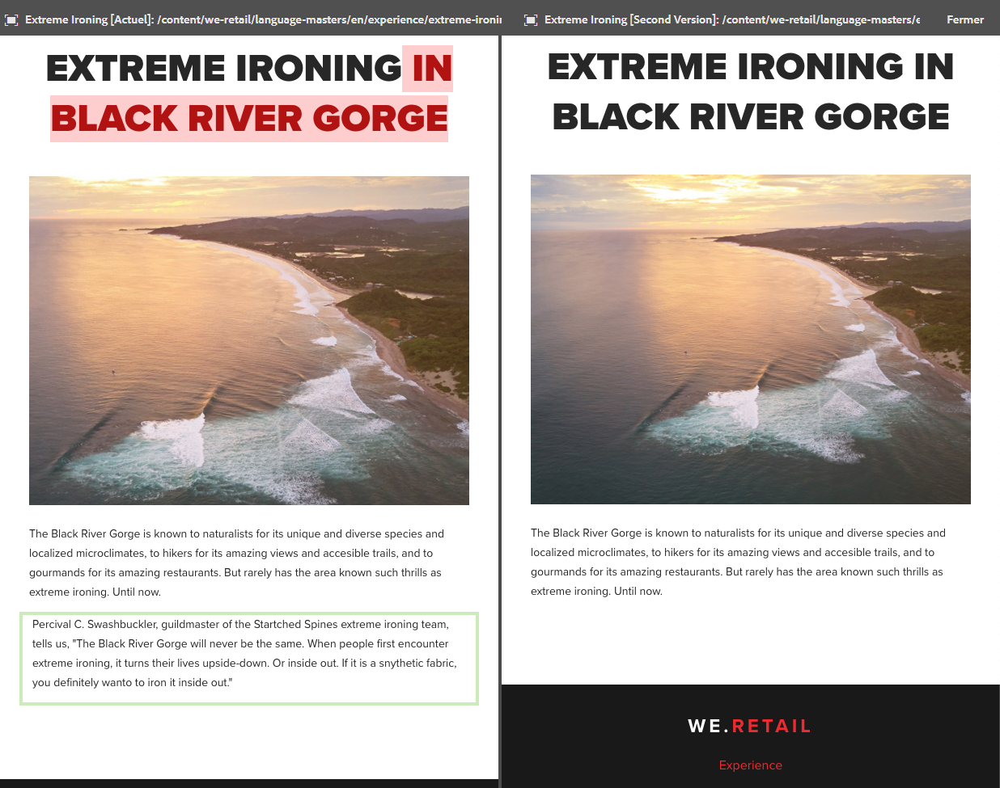
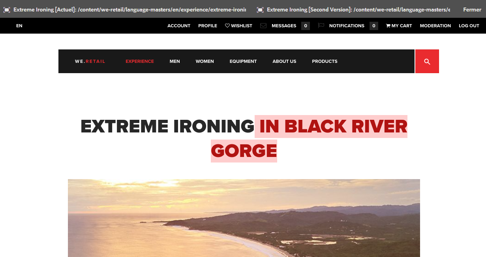

# Outil de comparaison des pages{#page-diff}

## Présentation {#introduction}

La création de contenu est un processus itératif. Pour être efficace lorsque vous créez du contenu, vous devez pouvoir voir ce qui a changé d’une version à l’autre. Afficher les versions en alternance est une méthode inefficace avec un fort risque d’erreur. Pour comparer deux pages, il est plus facile pour un auteur d’avoir côte à côte la page en cours et une version antérieure.

De fait, l’outil de comparaison des pages permet d’afficher côte à côte deux pages pour les comparer en mettant en évidence leurs différences.

>[!TIP]
>
>Consultez la section consacrée à l’[outil de comparaison des pages](/help/sites-developing/pagediff.md#operation-details) pour plus d’informations sur cette fonction.

## Utilisation {#use}

L’outil de comparaison côte à côte permet de comparer les éléments suivants :

* [Versions](/help/sites-authoring/working-with-page-versions.md#comparing-a-version-with-current-page) : la version actuelle d’une page et sa version antérieure.
* Live Copies : une Live Copy et son plan directeur
* [Lancements](/help/sites-authoring/launches-editing.md#comparing-a-launch-page-to-its-source-page) : un lancement et sa source
* Copies de langue : une page avant et après (re)traduction

Reportez-vous aux rubriques correspondantes afin de connaître la procédure de comparaison pour ces différents éléments.

### Présentation des différences {#presentation-of-differences}

La présentation des différences reste la même, quel que soit le contenu à comparer.

* Le contenu sélectionné en premier pour la comparaison est affiché à gauche (premier contenu).
* Le contenu « à comparer » (auquel le premier contenu sélectionné est comparé) est affiché à droite.

Par exemple, si vous comparez deux versions, la version en cours est affichée à gauche et la version précédente est affichée à droite.

La source des deux pages est clairement indiquée dans la barre d’en-tête en haut de la fenêtre du navigateur.

L’outil de comparaison détecte les modifications effectuées sur les composants et le code HTML. Les éléments modifiés sont présentés en surbrillance avec des couleurs différentes.

**Modifications des composants**

* Vert clair : composant ajouté
* Rose : composant supprimé

**Modifications HTML**

* Vert foncé : HTML ajouté
* Rouge : HTML supprimé

>[!NOTE]
>
>Lorsque vous comparez des copies de langue, la mise en surbrillance est désactivée. En effet, dans la mesure où la traduction modifie tout le contenu, la mise en surbrillance ne présente aucun intérêt.

### Affichage en mode plein écran  {#fullscreen-and-exiting}

Si vous souhaitez vous concentrer sur un contenu spécifique, vous pouvez cliquer sur l’icône du mode plein écran pour l’un ou l’autre des deux « côtés » de votre comparaison. Cela vous permet d’afficher la version en plein écran dans la fenêtre du navigateur.

Le côté sélectionné s’affiche dans la totalité de la fenêtre, mais la barre d’en-tête reste disponible en haut de la fenêtre pour vous permettre de basculer d’une page à l’autre si vous le souhaitez.

Vous pouvez également quitter le mode plein écran en cliquant sur l’icône de fermeture du mode plein écran.

Vous pouvez quitter le mode de comparaison côte à côte à tout moment en cliquant sur le bouton Fermer dans l’en-tête.

## Restrictions {#limitations}

Dans certaines situations, l’outil de comparaison des pages peut ne pas détecter toutes les différences.

* C’est le cas lorsque vous comparez des versions et des lancements. La fonctionnalité ne prend pas en compte les composants dynamiques comme les chemins de navigation, les menus, les listes de produits ou les logos (des composants qui dépendent de la structure du site pour le rendu du contenu).
* Pour les versions, l’outil de comparaison ne recrée pas la règle de contrôle d’accès ni les relations Live Copy.
* Si une page est déplacée, vous ne pouvez plus effectuer de comparaison avec les versions antérieures au déplacement.

   * Si vous rencontrez des problèmes avec une comparaison, vérifiez dans la [chronologie](/help/sites-authoring/basic-handling.md#timeline) si la page a été déplacée.

>[!NOTE]
>
>Les versions ne peuvent pas être comparées entre elles. Seule la version en cours peut être comparée aux autres versions de la page. La version dont les modifications sont mises en surbrillance est toujours la version en cours.

>[!NOTE]
>
>Pour plus d’informations sur le fonctionnement de l’outil de comparaison des pages, ainsi que les limites pouvant affecter cette comparaison, consultez la [documentation du développeur](/help/sites-developing/pagediff.md) liée à cette fonctionnalité.
