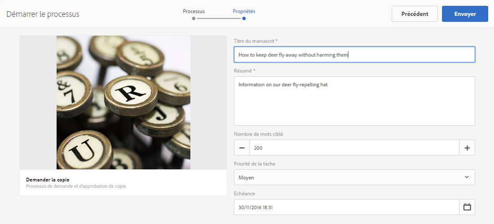
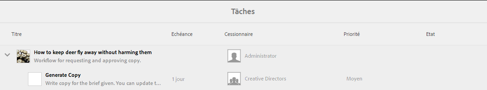
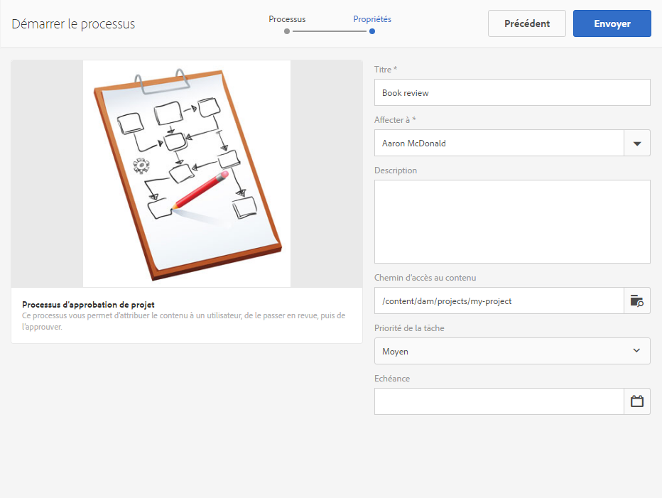
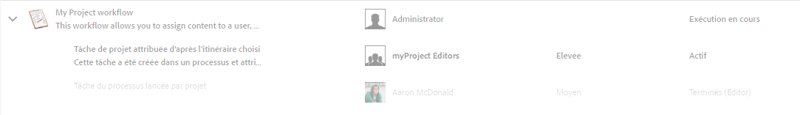
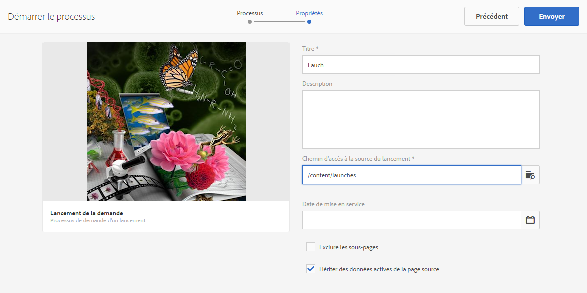
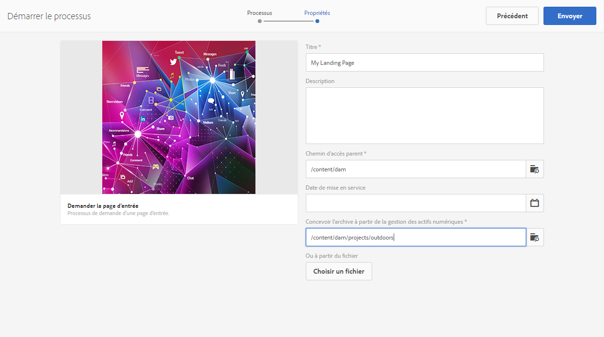
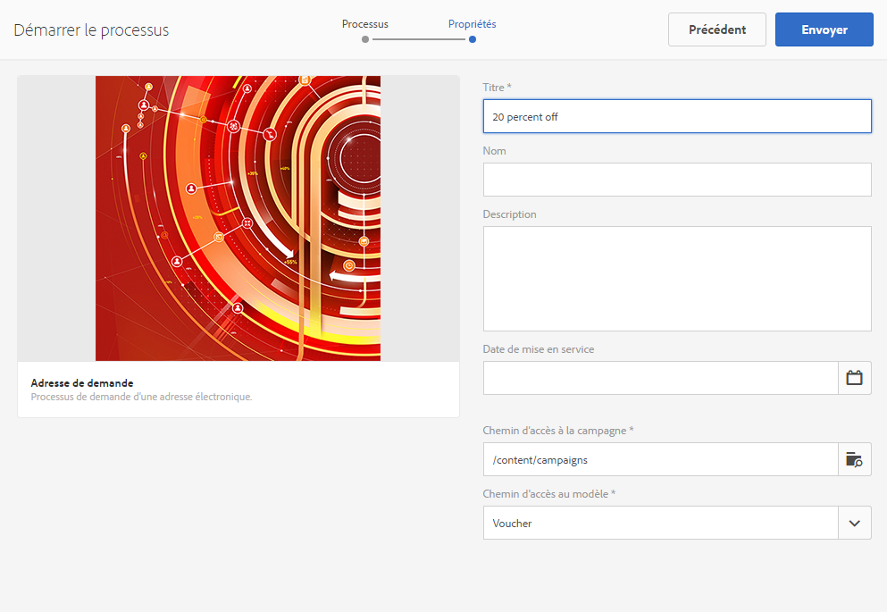
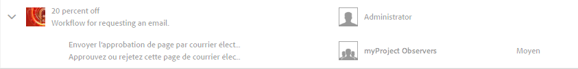

# Utilisation des workflows de projet{#working-with-project-workflows}

Les workflows de projet disponibles et prêts à l’emploi sont les suivants :

* **Workflow d’approbation de projet** : Ce workflow vous permet d’attribuer le contenu à un utilisateur, de le passer en revue, puis de l’approuver.
* **Demander le lancement** : ce workflow demande un lancement.
* **Demander la page d’entrée** : ce workflow demande une page d’entrée.
* **Demander l’adresse électronique** : ce workflow demande une adresse électronique.
* **Séance photo du produit et séance photo du produit (Commerce)** - associe les ressources aux produits.
* **Gestion des actifs numériques – Créer et traduire la copie et Gestion des actifs numériques – Créer une copie de langue** : crée des fichiers binaires, des métadonnées et des balises traduits pour les ressources et les dossiers.

Selon le modèle de projet sélectionné, certains workflows sont disponibles :

|  | **Projet simple** | **Projet de média** | **Projet de séance photo du produit** | **Projet de traduction** |
|---|:-:|:-:|:-:|:-:|
| Demander la copie |  | x |  |  |
| Séance photo du produit |  | x | x |  |
| Séance photo du produit (Commerce) |  |  | x |  |
| Approbation de projet | x |  |  |  |
| Demander le lancement | x |  |  |  |
| Demander la page d’entrée | x |  |  |  |
| Adresse de demande | x |  |  |  |
| DAM Créer copie de langue&amp;ast; |  |  |  | x |
| DAM Créer et traduire copie de langue&amp;ast; |  |  |  | x |

>[!NOTE]
>
>&amp;ast;Ces workflows ne sont pas lancés via la mosaïque **Workflow** dans les projets. Reportez-vous à la section [Création de copies de langue pour les ressources](/help/sites-administering/tc-manage.md). 

Les étapes permettant de lancer et de terminer les workflows sont identiques quel que soit le workflow choisi. Seules les étapes changent.

Vous commencez un workflow directement dans les projets (à l’exception de Gestion des actifs numériques – Créer une copie de langue ou Gestion des actifs numériques – Créer et traduire la copie de langue). Les informations sur les tâches en attente d’un projet sont répertoriées dans la mosaïque **Tâches**. Les notifications correspondant aux tâches à achever s’affichent en regard de l’icône d’utilisateur.

Pour plus d’informations sur l’utilisation des workflows dans AEM, reportez-vous aux sections suivantes :

* [Participation aux workflows](/help/sites-authoring/workflows-participating.md)
* [Application de workflows aux pages](/help/sites-authoring/workflows-applying.md)
* [Configuration de workflow](/help/sites-administering/workflows.md)

Cette section décrit les workflows disponibles pour les projets.

## Workflow de demande de copie   {#request-copy-workflow}

Ce workflow vous permet de demander un manuscrit à un utilisateur, puis de l’approuver. Pour démarrer le workflow de demande de copie :

1. Dans votre projet de média, sélectionnez l’option de connexion **+** dans la mosaïque **Workflows**, puis sélectionnez le workflow **Demander la copie**.
1. Saisissez un titre de manuscrit et un bref résumé de votre demande. Le cas échéant, entrez un nombre de mots cible, la priorité de la tâche et une date d’échéance.

   

1. Cliquez sur **Créer**. Le workflow commence. La tâche apparaît dans la mosaïque **Tâches**.

   

## Workflow Séance photo du produit {#product-photo-shoot-workflow}

Les workflows Séance photo du produit (commerce et sans commerce) sont abordés en détail dans la section [Projet créatif](/help/sites-authoring/managing-product-information.md).

## Workflow d’approbation de projet {#project-approval-workflow}

Dans le workflow d’approbation de projet, vous attribuez du contenu à un utilisateur et passez en revue ce contenu, puis vous l’approuvez.

1. Dans votre projet Simple, sélectionnez le signe **`+`** dans la mosaïque **Workflows**, puis sélectionnez **Worfklow d’approbation de projet**.
1. Entrez un titre et sélectionnez la personne à laquelle l’affecter dans la liste Équipe. Le cas échéant, entrez une description, le chemin d’accès au contenu, la priorité de tâche et la date d’échéance.

   

1. Cliquez sur **Créer**. Le workflow commence. La tâche apparaît dans la mosaïque **Tâches**.

   

## Worfklow Demander le lancement {#request-launch-workflow}

Ce workflow vous permet de demander un lancement.

1. Dans votre projet simple, sélectionnez l’option de connexion **+** dans la mosaïque **Workflows**, puis sélectionnez **Worfklow Demander le lancement**.
1. Entrez le titre du lancement et indiquez le chemin d’accès à la source du lancement. Vous pouvez également ajouter une description et une date active, le cas échéant. Sélectionnez l’option Hériter des données actives de la page source ou excluez les sous-pages selon la manière dont le lancement doit se produire.

   

1. Cliquez sur **Créer**. Le workflow commence. Le workflow apparaît dans la liste **Workflows** (cliquez sur les points de suspension **...** de la mosaïque **Workflows** pour accéder à cette liste).

## Worfklow Demander la page d’entrée {#request-landing-page-workflow}

Ce workflow vous permet de demander une page d’entrée.

1. Dans votre projet simple, sélectionnez l’option de connexion **+** dans la mosaïque **Workflows**, puis sélectionnez Worfklow de demande de page d’entrée.
1. Saisissez un titre pour votre page d’entrée et le chemin d’accès parent. Le cas échéant, entrez une date active ou choisissez un fichier pour votre page d’entrée.

   

1. Cliquez sur **Créer**. Le workflow commence. La tâche apparaît dans la mosaïque **Tâches**.

## Worfklow de demande d’adresse électronique  {#request-email-workflow}

Ce workflow vous permet de demander une adresse électronique. Il s’agit du même workflow que celui qui s’affiche dans la mosaïque **Courriels**.

1. Dans votre projet de média ou simple, sélectionnez l’option de connexion **+** dans la mosaïque **Workflows**, puis sélectionnez **Worfklow de demande d’adresse électronique**.
1. Entrez un titre de courrier électronique, ainsi que les chemins d’accès à la campagne et au modèle. Vous pouvez également spécifier un nom, une description et une date active.

   

1. Cliquez sur **Créer**. Le workflow commence. La tâche apparaît dans la mosaïque **Tâches**.

   

## Workflow Créer (et traduire) la copie de la langue pour les ressources {#create-and-translate-language-copy-workflow-for-assets}

Les workflows **Créer une copie de langue** et **Créer et traduire la copie de langue** sont présentés en détail dans la section [Création de copies de langue pour les ressources.](/help/assets/translation-projects.md)
