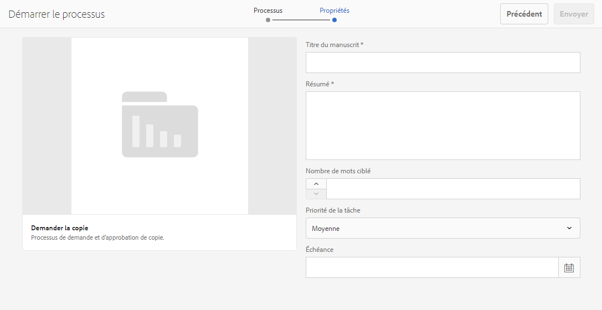
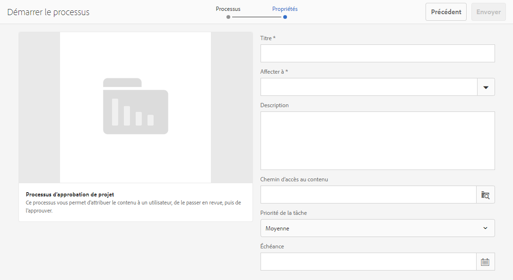
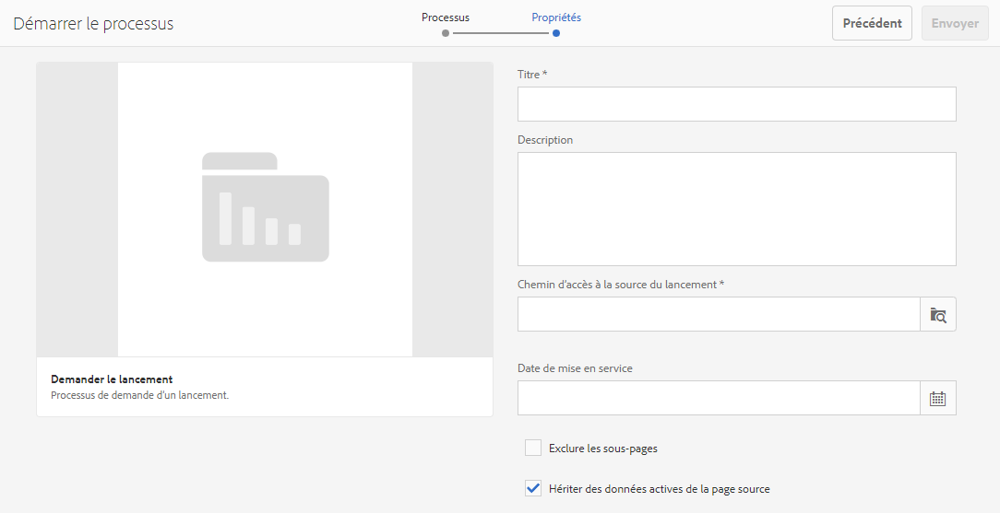
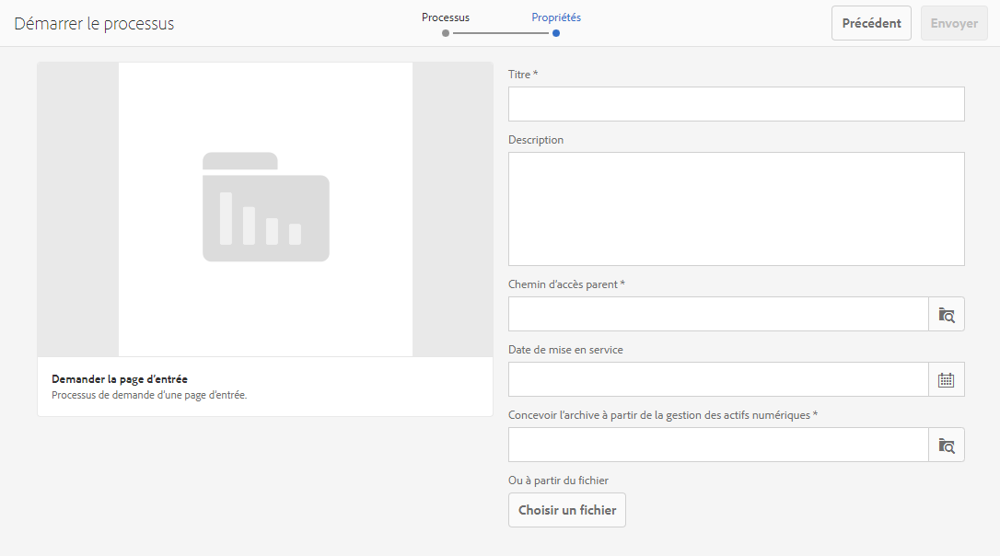
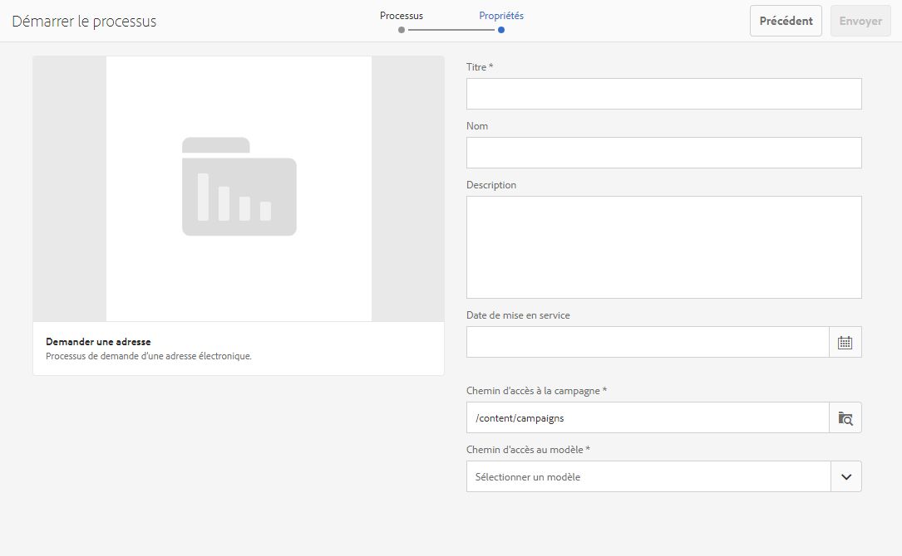

# Utilisation des workflows de projet {#working-with-project-workflows}

Les workflows de projet disponibles et prêts à l’emploi sont les suivants :

* **Workflow d’approbation de projet** : ce workflow vous permet d’attribuer le contenu à un utilisateur ou une utilisatrice, de le passer en revue, puis de l’approuver.
* **Demander le lancement** : ce workflow demande un lancement.
* **Demander la page de destination** : ce workflow demande une page de destination.
* **Demander l’adresse électronique** : ce workflow demande une adresse électronique.
* **Séance photo du produit et séance photo du produit (Commerce)** - Associe les ressources aux produits.
* **Gestion des actifs numériques (DAM) – Créer et traduire la copie et Gestion des actifs numériques (DAM) – Créer une copie de langue** : crée des fichiers binaires, des métadonnées et des balises traduits pour les ressources et les dossiers.

Selon le modèle de projet que vous sélectionnez, certains workflows sont disponibles :

|   | **Projet simple** | **Projet de médias** | **Projet de séance photo du produit** | **Projet de traduction** |
|---|:-:|:-:|:-:|:-:|
| Demander une copie |  | x |  |  |
| Séance photo du produit |  | x | x |  |
| Séance photo du produit (Commerce) |  |  | x |  |
| Approbation du projet | x |  |  |  |
| Demander le lancement | x |  |  |  |
| Demander une page de destination | x |  |  |  |
| Demander un e-mail | x |  |  |  |
| DAM Créer copie de langue&amp;ast; |  |  |  | x |
| DAM Créer et traduire copie de langue&amp;ast; |  |  |  | x |

>[!NOTE]
>
>&amp;ast; Ces workflows ne sont pas lancés via la mosaïque **Workflow** dans les projets. Reportez-vous à la section [Création de copies de langue pour les ressources](/help/sites-administering/tc-manage.md).

Les étapes de démarrage et d’achèvement des workflows sont les mêmes, quel que soit le workflow choisi. Seules les étapes changent.

Vous commencez un workflow directement dans les projets (à l’exception de Gestion des actifs numériques (DAM) – Créer une copie de langue ou Gestion des actifs numériques (DAM) – Créer et traduire la copie de langue). Les informations sur les tâches en attente d’un projet sont répertoriées dans la vignette **Tâches**. Les notifications relatives aux tâches à effectuer s’affichent en regard de l’icône de l’utilisateur ou de l’utilisatrice.

Pour plus d’informations sur l’utilisation des workflows dans AEM, reportez-vous aux documents suivants :

* [Participation aux workflows](/help/sites-authoring/workflows-participating.md)
* [Application de workflows aux pages](/help/sites-authoring/workflows-applying.md)
* [Configuration de workflow](/help/sites-administering/workflows.md)

Cette section décrit les workflows disponibles pour les projets.

## Workflow de demande de copie {#request-copy-workflow}

Ce workflow permet de demander un manuscrit à un utilisateur ou une utilisatrice, puis de l’approuver. Pour démarrer le workflow de demande de copie :

1. Dans un projet multimédia, cliquez sur le chevron descendant en haut à droite de la mosaïque **Workflows** et sélectionnez **Démarrer le workflow**.
1. Dans l’assistant de workflow, sélectionnez **Demander la copie** et cliquez sur **Suivant**.
1. Saisissez un titre de manuscrit et un bref résumé de ce que vous demandez. Le cas échéant, entrez le nombre de mots cibles, la priorité de tâche et la date d’échéance.

   

1. Cliquez sur **Envoyer**.

Le workflow commence. La tâche apparaît sur la carte **Tâches**.

## Workflow Séance photo du produit {#product-photo-shoot-workflow}

Les workflows **Séance photo du produit** (avec commerce et sans commerce) sont abordés en détail dans la section [Projets créatifs](/help/sites-authoring/managing-product-information.md)

## Workflow d’approbation de projet {#project-approval-workflow}

Dans le workflow d’**approbation de projet**, vous attribuez du contenu à un utilisateur et passez en revue ce contenu, puis vous l’approuvez.

1. Dans un projet simple, cliquez sur le chevron descendant en haut à droite de la mosaïque **Workflows** et sélectionnez **Démarrer le workflow**.
1. Dans l’assistant de workflow, sélectionnez **Workflow d’approbation de projet** et cliquez sur **Suivant**.
1. Saisissez un titre et sélectionnez la personne à qui l’affecter. Le cas échéant, entrez une description, le chemin d’accès au contenu, la priorité de tâche et la date d’échéance.

   

1. Cliquez sur **Envoyer**.

Le workflow commence. La tâche apparaît sur la carte **Tâches**.

## Workflow Demander le lancement {#request-launch-workflow}

Ce workflow vous permet de demander un lancement.

1. Dans un projet simple, cliquez sur le chevron descendant en haut à droite de la mosaïque **Workflows** et sélectionnez **Démarrer le workflow**.
1. Dans l’assistant de workflow, sélectionnez **Workflow de lancement de requête** et cliquez sur **Suivant**.
1. Saisissez un titre pour le lancement et indiquez le chemin d’accès source de ce dernier. Vous pouvez également ajouter une description et une date d’activation, le cas échéant. Sélectionnez Hériter des données actives de la page source ou excluez des sous-pages selon le comportement souhaité du lancement.

   

1. Cliquez sur **Envoyer**.

Le workflow commence. Le workflow apparaît dans la liste **Workflows**.

## Workflow Demander la page de destination {#request-landing-page-workflow}

Ce workflow vous permet de demander une page de destination.

1. Dans un projet simple, cliquez sur le chevron descendant en haut à droite de la mosaïque **Workflows** et sélectionnez **Démarrer le workflow**.
1. Dans l’assistant de workflow, sélectionnez **Demander la page de destination** et cliquez sur **Suivant**.
1. Saisissez un titre pour votre page de destination et le chemin parent. Le cas échéant, saisissez une date d’activation ou choisissez un fichier pour votre page de destination.

   

1. Cliquez sur **Envoyer**.

Le workflow commence. La tâche apparaît sur la carte **Tâches**.

## Workflow de demande d’e-mail {#request-email-workflow}

Ce workflow permet de demander un e-mail. Il s’agit du même workflow qui apparaît dans la vignette **E-mails**.

1. Dans un projet simple, cliquez sur le chevron descendant en haut à droite de la mosaïque **Workflows** et sélectionnez **Démarrer le workflow**.
1. Dans l’assistant de workflow, sélectionnez **Demander l’e-mail** et cliquez sur **Suivant**.
1. Saisissez un titre d’e-mail et les chemins d’accès aux campagnes et aux modèles. En outre, vous pouvez fournir un nom, une description et une date d’activation.

   

1. Cliquez sur **Envoyer**.

Le workflow commence. La tâche apparaît sur la carte **Tâches**.

## Workflow Créer (et traduire) la copie de la langue pour les ressources {#create-and-translate-language-copy-workflow-for-assets}

Les workflows **Créer une copie de langue** et **Créer et traduire la copie de langue** sont présentés en détail dans le document [Création de copies de langue pour les ressources.](/help/assets/translation-projects.md)
