# Projets {#projects}

Les projets vous permettent de regrouper des ressources dans une seule entité. Un environnement commun et partagé facilite la gestion de vos projets. Les types de ressources que vous pouvez associer à un projet sont appelés volets dans AEM. Les mosaïques peuvent inclure des informations de projet et d’équipe, des ressources numériques, des workflows et d’autres types d’informations, comme le précise en détail la section [Mosaïques de projet](#project-tiles).

En tant qu’utilisateur, vous pouvez effectuer les actions suivantes :

* Créer et supprimer des projets
* Associer du contenu et des dossiers de ressources à un projet
* Supprimer les liens de contenu d’un projet

## Conditions d’accès {#access-requirements}

Envoie une fonction d’AEM standard sans nécessiter de configuration supplémentaire.

Cependant, pour que les utilisateurs participant à des projets puissent voir d’autres utilisateurs/groupes lorsqu’ils se servent des fonctionnalités de la console Projets, telles que créer des projets, créer des tâches/workflows ou afficher et gérer l’équipe, ils doivent disposer d’un accès en lecture à `/home/users` et à `/home/groups`.

Pour ce faire, le plus facile consiste à octroyer au groupe **projects-users** un accès en lecture à `/home/users` et à `/home/groups`.

## Console Projets {#projects-console}

Dans AEM, la console Projets permet d’accéder à vos projets et de les gérer.

La console Projets est similaire aux autres consoles d’AEM, elle permet plusieurs actions sur des projets individuels et permet d’ajuster l’affichage des projets.

### Activation et désactivation de mode {#modes}

Vous pouvez utiliser le sélecteur de rail pour passer d’un mode console à un autre.

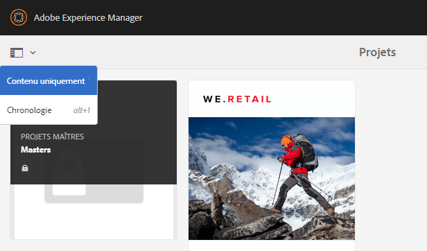

#### Contenu uniquement {#content-only}

« Contenu uniquement » est le mode par défaut lors de l’ouverture de la console. Tous vos projets s’affichent.

#### Chronologie {#timeline}

La vue chronologique vous permet de sélectionner un projet individuel et d’afficher l’activité sur celui-ci. Utilisez le sélecteur de rail ou la touche rapide `alt+1` pour accéder à cette vue.

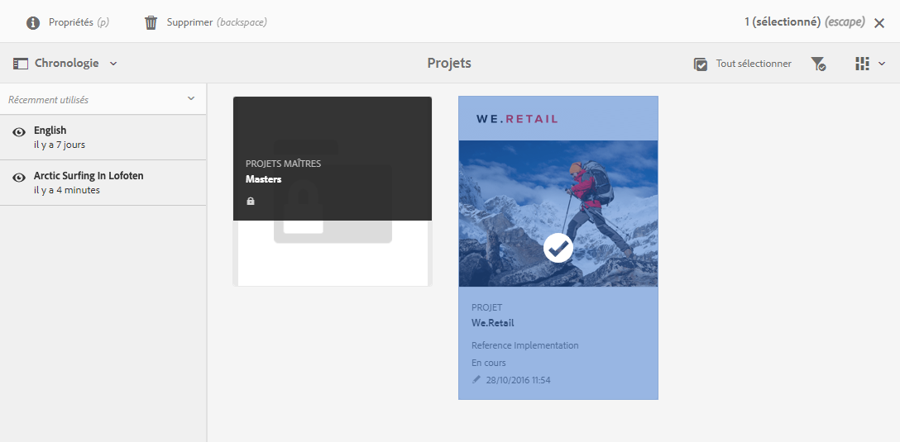

### Activation et désactivation de la vue {#views}

Vous pouvez utiliser le sélecteur d’affichage pour passer de l’affichage de projets sous forme de mosaïques de grande taille (valeur par défaut) à leur affichage sous forme de liste ou dans un calendrier.

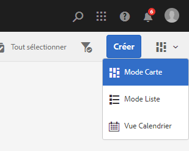

### Filtrer votre vue {#filter}

Vous pouvez utiliser le filtre pour afficher tous les projets ou uniquement ceux qui sont actifs.

### Sélection et affichage de projets {#selecting}

Sélectionnez un projet en pointant la souris sur la mosaïque du projet et en cliquant sur la coche.

Affichez les détails d’un projet en cliquant dessus pour en parcourir les détails.

### Création de projets {#creating}

Cliquez sur **Créer** pour créer un projet.

## Mosaïques de projet {#project-tiles}

Les projets sont constitués de différents types d’informations que vous voudrez gérer ensemble. Ces informations sont représentées par différentes **Mosaïques**.

Vous pouvez associer les mosaïques suivantes à votre projet.

* [Ressources](#assets)
* [Collections de ressources](#asset-collections)
* [Expériences](#experiences)
* [Liens](#links)
* [Informations sur le projet](#project-info)
* [Équipe](#team)
* [Pages de destination](#landing-pages)
* [E-mails](#emails)
* [Workflows](#workflows)
* [Lancements](#launches)
* [Tâches](#tasks)

Cliquez sur le menu déroulant dans le coin supérieur droit d’une mosaïque pour ajouter d’autres données à la mosaïque.

Cliquez sur le bouton représentant des points de suspension en bas à droite d’une mosaïque pour ouvrir les données de la mosaïque dans la console qui lui est associée.

### Ressources {#assets}

Dans la mosaïque **Ressources**, vous pouvez regrouper tous les éléments dont vous avez besoin pour un projet particulier.

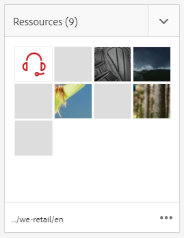

Vous chargez des ressources directement dans la mosaïque.

### Collections de ressources {#asset-collections}

Comme avec les ressources, vous pouvez ajouter des [collections de ressources](/help/assets/manage-collections.md) directement à votre projet. Vous définissez les collections dans Assets.

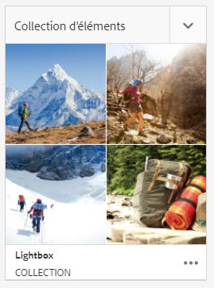

Ajoutez une collection en cliquant sur **Ajouter une collection** et en sélectionnant la collection appropriée dans la liste.

### Expériences {#experiences}

La mosaïque **Expériences** permet d’ajouter au projet une application mobile, un site web ou une publication.

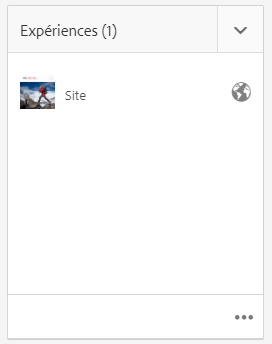

Les icônes indiquent le type d’expérience représenté.

* Site web
* Application mobile

### Liens {#links}

La mosaïque **Liens** permet d’associer des liens externes à votre projet.

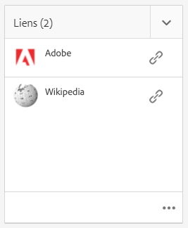

Vous pouvez donner au lien un nom facile à reconnaître et changer de miniature.

### Informations sur le projet {#project-info}

La mosaïque **Informations sur le projet** fournit des informations générales sur le projet, notamment sa description, son statut (actif ou inactif), son échéance et ses membres. En outre, vous pouvez ajouter une miniature de projet qui sera visible dans la page principale Projets.

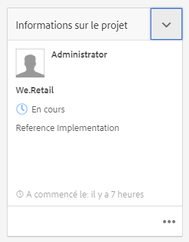

### Tâche de traduction {#translation-job}

La mosaïque **Tâche de traduction** est l’endroit où vous commencez une traduction et où vous pouvez voir le statut de toutes vos traductions.

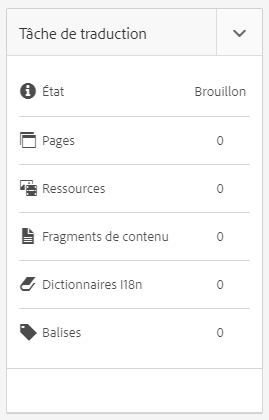

Pour configurer votre traduction, consultez le document [Création de projets de traduction.](/help/assets/translation-projects.md)

### Équipe {#team}

Dans cette mosaïque, vous pouvez définir les membres de l’équipe de projet. Lors de la modification, vous pouvez saisir le nom de la personne membre de l’équipe et attribuer le rôle d’utilisateur ou d’utilisatrice.

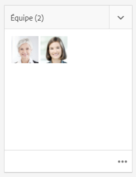

Vous pouvez ajouter et supprimer des membres de l’équipe. De plus, vous pouvez modifier le [rôle utilisateur](#userroles) attribué à chaque membre de l’équipe.

### Pages de destination {#landing-pages}

La mosaïque **pages d’entrée** vous permet de demander une nouvelle page de destination.

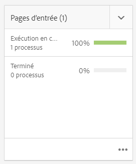

Ce workflow est décrit dans le document [Création d’un workflow de page de destination.](/help/sites-authoring/projects-with-workflows.md#request-landing-page-workflow)

### E-mails {#emails}

Le volet **E-mails** permet de gérer les demandes pour les e-mails. Elle lance le workflow de **demande d’e-mail**.

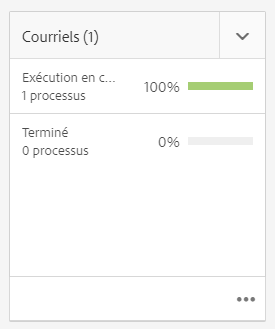

Pour plus d’informations, voir la section [Workflow de demande d’e-mails](/help/sites-authoring/projects-with-workflows.md#request-email-workflow).

### Workflows {#workflows}

Vous pouvez démarrer des workflows pour votre projet. Si des workflows sont actifs, leur statut s’affiche dans la mosaïque **Workflows**.

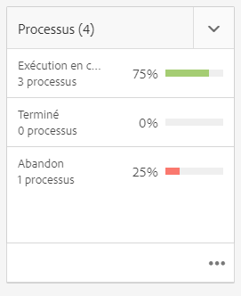

Selon le projet que vous créez, différents workflows sont disponibles.

Ils sont décrits à la section [Utilisation des workflows de projet](/help/sites-authoring/projects-with-workflows.md).

### Lancements {#launches}

La mosaïque **Lancements** présente tous les programmes qui dont l’objet d’une demande avec un [workflow de demande de lancement.](/help/sites-authoring/projects-with-workflows.md)

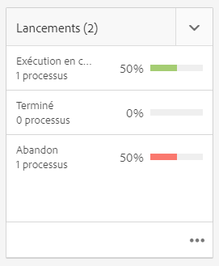

### Tâches {#tasks}

Les tâches vous permettent de surveiller le statut de toutes les activités associées à un projet, y compris des workflows. Les tâches sont décrites en détail à la section [Utilisation des tâches](/help/sites-authoring/task-content.md).

## Modèles de projet {#project-templates}

Les modèles servent de base pour démarrer votre projet. AEM fournit ces modèles de projet standard.

* **Projet média** - Il s’agit d’un exemple de projet de référence pour les activités liées aux médias. Il comprend plusieurs rôles de projet liés aux médias et inclut également des workflows liés au contenu multimédia.
* **[Projet de séance photo du produit](/help/sites-authoring/managing-product-information.md)** - Il s’agit d’un modèle de référence pour gérer les photos de produit associées au e-commerce.
* **[Projet de traduction](/help/sites-administering/translation.md)** - Il s’agit d’un modèle de référence pour gérer les activités liées la traduction. Il comprend des rôles de base et des workflows pour gérer la traduction.
* **Projet simple** - Il s’agit d’un exemple de référence pour les projets qui ne correspondent pas à d’autres catégories. Il comprend trois rôles de base et quatre workflows AEM généraux.

En fonction du modèle que vous sélectionnez, vous disposez de différentes options disponibles dans le projet, telles que les rôles utilisateur et les workflows fournis.

## Rôles utilisateur dans un projet {#user-roles-in-a-project}

Différents rôles utilisateur sont définis dans le modèle de projet et utilisés pour deux principales raisons :

1. Autorisations : les rôles utilisateur peuvent faire partie de l’une des trois catégories répertoriées : Observateur, Éditeur, Propriétaire. Par exemple, un photographe ou un rédacteur aura les mêmes privilèges qu’un éditeur. Les autorisations déterminent ce que les utilisateurs peuvent faire avec le contenu d’un projet.
1. Workflows : les workflows déterminent l’utilisateur associé à telles ou telles tâches d’un projet. Les tâches peuvent être associées à un rôle de projet. Par exemple, une tâche peut être attribuée à des photographes, de sorte que tous les membres de l’équipe disposant du rôle Photographe se la voient attribuer.

Pour vous permettre de gérer les autorisations de sécurité et de contrôle, tous les projets prennent en charge les rôles par défaut suivants.

| Rôle | Description | Autorisations | Appartenance à un groupe |
|---|---|---|---|
| Observateur | Un utilisateur disposant de ce rôle peut afficher les détails du projet, y compris son statut. | Autorisations en lecture seule sur un projet | Groupe `workflow-users` |
| Éditeur | Un utilisateur disposant de ce rôle peut charger et modifier le contenu d’un projet. | Accès en lecture et en écriture à un projet, aux métadonnées associées et aux ressources connexes Droits permettant à l’utilisateur de charger une liste de plans ou une séance photo et de passer en revue et d’approuver des ressources Droits en écriture sur `/etc/commerce` Droits de modification sur un projet spécifique | Groupe `workflow-users` |
| Propriétaire | Un utilisateur disposant de ce rôle peut créer un projet, lancer le travail dans un projet et déplacer les ressources approuvées dans le dossier d’exploitation. Toutes les autres tâches de projet peuvent également être visualisées et implémentées par le propriétaire. | Droits en écriture sur `/etc/commerce` | « `dam-users` » (pour pouvoir créer un projet)«  `projects-administrators` » (pour pouvoir déplacer des ressources) |

Pour des projets créatifs, des rôles supplémentaires, par exemple, « photographe », sont également proposés. Vous pouvez utiliser ces rôles pour créer des rôles personnalisés liés à un projet spécifique.

### Création automatique de groupe {#auto-group-creation}

Lorsque vous créez le projet et ajoutez des utilisateurs aux différents rôles, les groupes associés au projet sont automatiquement créés pour gérer les autorisations associées.

Par exemple, un projet appelé Myproject aurait trois groupes **Propriétaires Myproject**, **Éditeurs Myproject**, **Observateurs Myproject**.

Si le projet est supprimé, ces groupes ne sont supprimés que si vous sélectionnez l’option appropriée [ lors de la suppression du projet.](/help/sites-authoring/touch-ui-managing-projects.md#deleting-a-project) L’équipe d’administration peut également supprimer manuellement les groupes dans **Outils** > **Sécurité** > **Groupes**.

## Ressources supplémentaires {#additional-resources}

Pour plus d’informations sur l’utilisation des projets, consultez les documents supplémentaires suivants :

* [Gestion de projets](/help/sites-authoring/touch-ui-managing-projects.md)
* [Utilisation de tâches](/help/sites-authoring/task-content.md)
* [Utilisation des workflows de projet](/help/sites-authoring/projects-with-workflows.md)
* [Projet de création et intégration à PIM](/help/sites-authoring/managing-product-information.md)
