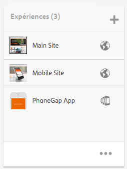
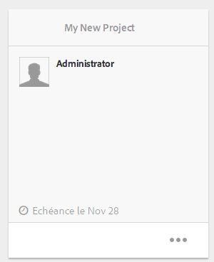
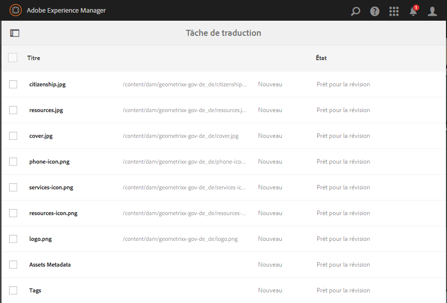
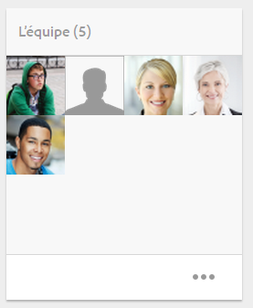

# Projets{#projects}

Les projets permettent de regrouper des ressources dans une seule entité. Un environnement commun et partagé permet de gérer facilement vos projets. Dans AEM, les types de ressources que vous pouvez associer à un projet s’appellent des mosaïques. Les mosaïques peuvent inclure des informations de projet et d’équipe, des ressources numériques, des workflows et d’autres types d’informations, comme le précise en détail la section [Mosaïques de projet](#project-tiles).

>[!CAUTION]
>
>Pour que les utilisateurs des projets voient d’autres utilisateurs/groupes lors de l’utilisation de la fonctionnalité Projets, comme la création de projets, la création de tâches/workflows, la consultation et la gestion de l’équipe, ces utilisateurs doivent avoir accès en lecture à **/home/users** et **/home/groups**. Le moyen le plus simple de mettre en oeuvre cette stratégie consiste à donner au groupe **projects-users** l’accès en lecture à **/home/users** et**/home/groups**.

En tant qu’utilisateur, vous pouvez effectuer les opérations suivantes :

* Créer des projets
* Associer du contenu et des dossiers de ressources à un projet
* Supprimer des projets
* Supprimer les liens de contenu d’un projet

Reportez-vous aux rubriques supplémentaires suivantes :

* [Gestion de projets](/help/sites-authoring/touch-ui-managing-projects.md)
* [Utilisation des tâches](/help/sites-authoring/task-content.md)
* [Utilisation des workflows de projet](/help/sites-authoring/projects-with-workflows.md)
* [Projet de création et intégration à PIM](/help/sites-authoring/managing-product-information.md)

## Console Projets {#projects-console}

Dans AEM, la console Projets permet d’accéder à vos projets et de les gérer.

* Sélectionnez **Chronologie**, puis un projet pour afficher sa chronologie.
* Cliquez/appuyez sur **Sélectionner** pour passer en mode de sélection.
* Cliquez sur **Créer** pour ajouter des projets.
* L’option **Activer/désactiver les projets actifs** vous permet de basculer entre tous les projets et uniquement ceux qui sont actifs.
* L’option **Afficher la vue Statistiques** permet d’afficher les statistiques de projet relatives à la réalisation de tâches.

## Mosaïques de projet {#project-tiles}

Dans la console Projets, vous devez associer différents types d’informations à vos projets. Elles sont connues sous le nom de **mosaïques**. Toutes les mosaïques, ainsi que le type d’informations qu’elles contiennent, sont décrites dans cette section.

Vous pouvez associer les mosaïques suivantes à votre projet. Chacune d’elles est décrite dans les sections ci-après :

* Ressources et collections de ressources
* Expériences
* Liens
* Informations sur le projet
* Équipe
* Pages d’entrée
* Courriels
* Workflows
* Lancements
* Tâches

### Ressources {#assets}

Dans la mosaïque **Ressources**, vous pouvez regrouper tous les éléments dont vous avez besoin pour un projet particulier.

Vous chargez des ressources directement dans la mosaïque. En outre, vous pouvez créer des visionneuses d’images, des visionneuses à 360° ou des visionneuses de médias mixtes si vous avez installé le complément Dynamic Media.

### Collections de ressources {#asset-collections}

Comme avec les ressources, vous pouvez ajouter des [collections de ressources](/help/assets/manage-collections.md) directement à votre projet. Vous définissez les collections dans Assets.

Ajoutez une collection en cliquant sur **Ajouter une collection** et en sélectionnant la collection appropriée dans la liste.

### Expériences {#experiences}

La mosaïque **Expériences** permet d’ajouter au projet une application mobile, un site web ou une publication.

Les icônes indiquent le type d’expérience représenté : site web, application mobile ou publication. Ajoutez des expériences en cliquant sur le signe + ou en cliquant sur **Ajouter une expérience** et en sélectionnant le type d’expérience.

Sélectionnez le chemin des miniatures, et le cas échéant, modifiez la miniature de l’expérience. Les expériences sont regroupées dans la mosaïque **Expériences**.

### Liens {#links}

La mosaïque Liens permet d’associer des liens externes à votre projet.

Vous pouvez donner au lien un nom facile à reconnaître et changer de miniature.

### Informations sur le projet {#project-info}

La mosaïque Informations sur le projet fournit des informations générales sur le projet, notamment sa description, son état (actif ou inactif), son échéance et ses membres. En outre, vous pouvez ajouter une miniature de projet qui sera visible dans la page principale Projets.

Des membres d’équipe peuvent être attribués et supprimés de cette mosaïque (ou leurs rôles peuvent être modifiés) et de la mosaïque Équipe.

### Tâche de traduction {#translation-job}

La mosaïque Tâche de traduction est l’endroit où vous commencez une traduction et où vous pouvez voir l’état de toutes vos traductions. Pour configurer votre traduction, consultez [Création de projets de traduction](/help/assets/translation-projects.md).

Cliquez sur les points de suspension en bas de la carte **Tâche de traduction** pour afficher les ressources du workflow de traduction. La liste des tâches de traduction contient également des entrées pour les balises et les métadonnées des ressources. Ces entrées indiquent que les métadonnées et les balises des ressources sont également traduites.

### Équipe {#team}

Dans cette mosaïque, vous pouvez définir les membres de l’équipe de projet. En mode d’édition, vous pouvez saisir le nom des membres d’équipe et attribuer des rôles utilisateur.

Vous pouvez ajouter et supprimer des membres de l’équipe. De plus, vous pouvez modifier le [rôle utilisateur](#userroles) attribué à chaque membre de l’équipe.

### Pages d’entrée {#landing-pages}

La mosaïque **Pages d’entrée** vous permet de demander une nouvelle page d’entrée.

Ce workflow est décrit à la section [Création d’un workflow de page d’entrée](/help/sites-authoring/projects-with-workflows.md#request-landing-page-workflow).

### Courriels  {#emails}

La mosaïque **Courriels** permet de gérer les demandes de courrier électronique. Elle lance le workflow de demande de courrier électronique.

Pour plus d’informations, se reporter à [Worfklow de demande de courrier électronique.](/help/sites-authoring/projects-with-workflows.md#request-email-workflow) 

### Workflows {#workflows}

Vous pouvez configurer votre projet pour qu’il suive certains workflows. Si des workflows sont actifs, leur état s’affiche dans la mosaïque **Workflows** de la console Projets.

Vous pouvez configurer votre projet pour qu’il suive certains workflows. Selon le type de projet que vous sélectionnez, différents workflows sont disponibles.

Ils sont décrits à la section [Utilisation des workflows de projet](/help/sites-authoring/projects-with-workflows.md).

### Lancements {#launches}

La mosaïque Lancements présente tous les programmes qui ont été demandés avec un [workflow de demande de lancement](/help/sites-authoring/projects-with-workflows.md).

### Tâches {#tasks}

Les tâches vous permettent de surveiller l’état de toutes les activités associées à un projet, y compris des workflows. Les tâches sont décrites en détail à la section [Utilisation des tâches](/help/sites-authoring/task-content.md).

## Modèles de projet {#project-templates}

AEM est fourni avec trois modèles prêts à l’emploi :

* Un projet simple : un modèle de référence pour tous les projets auxquels les autres catégories ne sont pas adaptées. Il comprend trois rôles de base (propriétaires, éditeurs et observateurs) et quatre workflows (Approbation de projet, Demander un lancement, Demander la page d’entrée et Demander un courrier électronique).
* Un projet de média : un modèle de référence pour des activités multimédias. Il comprend plusieurs rôles de projet relatifs aux médias (photographes, éditeurs, rédacteurs, concepteurs, propriétaires et observateurs). Il comprend également deux workflows liés au contenu multimédia : Demander la copie (pour demander et réviser du texte) et Projet de séance photo du produit (pour gérer des photos relatives à des produits).
* [Projet](/help/sites-authoring/managing-product-information.md)  de prise de vue de photos de produit - Un échantillon de référence pour la gestion de la photographie de produit liée au commerce électronique. Il comprend les rôles suivants : photographes, éditeurs, retoucheurs de photos, propriétaires, directeurs créatifs, marketeurs de réseaux sociaux, directeurs marketing, réviseurs et observateurs.
* [Un projet de traduction](/help/sites-administering/translation.md) : modèle de référence pour gérer des activités liées à la traduction. Il prévoit trois rôles de base (propriétaires, éditeurs et observateurs). Il comprend deux workflows accessibles dans l’interface utilisateur Workflows.

En fonction du modèle sélectionné, plusieurs options s’offrent à vous, notamment en termes de rôles utilisateur et de workflows.

## Rôles utilisateur dans un projet   {#user-roles-in-a-project}

Différents rôles utilisateur sont définis dans un modèle de projet et utilisés pour deux principales raisons :

1. Autorisations. Les rôles utilisateur peuvent faire partie de l’une des trois catégories répertoriées : Observateur, Éditeur, Propriétaire. Par exemple, un photographe ou un rédacteur aura les mêmes privilèges qu’un éditeur. Les autorisations déterminent ce que les utilisateurs peuvent faire avec le contenu d’un projet.
1. Workflows. Les workflows déterminent l’utilisateur associé à telles ou telles tâches d’un projet. Les tâches peuvent être associées à un rôle de projet. Par exemple, une tâche peut être attribuée à des photographes, de sorte que tous les membres de l’équipe disposant du rôle Photographe se la voient attribuer.

Pour vous permettre de gérer les autorisations de sécurité et de contrôle, tous les projets prennent en charge les rôles par défaut suivants :

<table>
 <tbody>
  <tr>
   <td>
<strong>Rôle</strong>
 </td>
   <td>
<strong>Description</strong>
 </td>
   <td>
<strong>Autorisations</strong>
 </td>
   <td>
<strong>Appartenance à un groupe</strong>
 </td>
  </tr>
  <tr>
   <td>
Observateur
 </td>
   <td>
Un utilisateur disposant de ce rôle peut afficher les détails du projet, y compris son état.
 </td>
   <td>
Droits en lecture seule sur un projet
 </td>
   <td>
Groupe workflow-users
 </td>
  </tr>
  <tr>
   <td>
Éditeur
 </td>
   <td>
Un utilisateur disposant de ce rôle peut charger et modifier le contenu d’un projet.
 
 
 </td>
   <td>
    <ul>
     <li>Accès en lecture et écriture sur un projet, les métadonnées correspondantes et les ressources connexes.</li>
     <li>Droits permettant à l’utilisateur de transférer une liste de plans ou une séance photo et de réviser et approuver des ressources</li>
     <li>Droits en écriture sur /etc/commerce</li>
     <li>Droits de modification sur un projet spécifique</li>
    </ul> </td>
   <td>
Groupe workflow-users
 </td>
  </tr>
  <tr>
   <td>
Propriétaire
 </td>
   <td>
Un utilisateur disposant de ce rôle peut lancer un projet. Le propriétaire peut créer un projet, lancer une tâche pour un projet et déplacer les ressources approuvées vers le dossier Production. Toutes les autres tâches de projet peuvent également être visualisées et implémentées par le propriétaire.
 </td>
   <td>
    <ul>
     <li>Droits en écriture sur /etc/commerce</li>
    </ul> </td>
   <td>
    <ul>
     <li>Groupe d’utilisateurs DAM (pour pouvoir créer un projet)</li>
     <li>groupe d’administrateurs de projet (pour pouvoir déplacer des ressources)</li>
    </ul> </td>
  </tr>
 </tbody>
</table>

Pour des projets créatifs, des rôles supplémentaires, par exemple, de photographe, sont également proposés. Vous pouvez utiliser ces rôles pour créer des rôles personnalisés liés à un projet spécifique.

>[!NOTE]
>
>Lorsque vous créez le projet et ajoutez des utilisateurs aux différents rôles, les groupes associés au projet sont automatiquement créés pour gérer les autorisations associées. Par exemple, un projet appelé Myproject aurait trois groupes **Myproject Owners**, **Myproject Editors**, **Myproject Observators**. Toutefois, si le projet est supprimé, ces groupes ne sont pas automatiquement supprimés. Un administrateur doit supprimer manuellement les groupes dans **Outils** > **Sécurité** > **Groupes**.
