# Mise en page réactive  {#responsive-layout}

AEM permet de réaliser une mise en page réactive pour vos pages à l’aide du composant **Conteneur de mises en page**.

Vous obtenez ainsi un système de paragraphes qui permet de positionner les composants dans une grille réactive. Cette grille peut réorganiser la mise en page selon l’appareil ou la taille de la fenêtre et le format. Le composant est utilisé avec le mode [**Mise en page**](/help/sites-authoring/responsive-layout.md#defining-layouts-layout-mode), ce qui permet de créer et de modifier votre mise en page réactive en fonction de l’appareil.

Le conteneur de mises en page présente les caractéristiques suivantes :

* Il permet un alignement horizontal sur la grille et offre aussi la possibilité de placer les composants côte à côte dans la grille et de définir quand ils doivent être réduits ou développés.
* Il utilise des points d’arrêt prédéfinis (Téléphone ou Tablette, par exemple) pour que vous puissiez définir le comportement du contenu pour l’orientation ou les appareils associés.

   * Vous pouvez par exemple personnaliser la taille du composant ou spécifier si le composant doit être affiché ou non sur des appareils spécifiques.

* Il peut être imbriqué pour permettre le contrôle des colonnes.

L’utilisateur peut ensuite afficher un aperçu du contenu pour des appareils spécifiques à l’aide de l’émulateur.

>[!CAUTION]
>
>Bien que le composant Conteneur de mises en page soit disponible dans l’IU classique, il n’est entièrement fonctionnel et pris en charge que dans l’interface utilisateur optimisée pour les écrans tactiles.

AEM effectue une mise en page réactive de vos pages en combinant plusieurs mécanismes :

* Composant [**Conteneur de mises en page**](#adding-a-layout-container-and-its-content-edit-mode)

   Ce composant, qui est disponible dans l’[explorateur de composants](/help/sites-authoring/author-environment-tools.md#components-browser), fournit un système de paragraphes/grille qui permet d’ajouter et de positionner des composants dans une grille réactive. Il peut également être défini comme le système de paragraphes par défaut de votre page.

* [**Mode Mise en page**](/help/sites-authoring/responsive-layout.md#defining-layouts-layout-mode)

   Une fois que le conteneur de mises en page est positionné sur la page, vous pouvez utiliser le mode **Mise en page** pour placer le contenu dans la grille réactive.

* [**Émulateur**](#selecting-a-device-to-emulate)
Permet de créer et de modifier des sites web réactifs qui réorganisent la mise en page en fonction de l’appareil ou de la taille de la fenêtre en redimensionnant les composants de manière interactive. L’utilisateur peut ensuite afficher un aperçu du contenu à l’aide de l’émulateur.

À l’aide de ces mécanismes de grille réactive, vous pouvez effectuer les opérations suivantes :

* utiliser des points d’arrêt pour définir différentes mises en page en fonction de la largeur d’appareil (associée au type d’appareil et à l’orientation) ;
* utiliser ces points d’arrêt et les mises en page de contenu pour veiller à ce que le contenu s’ajuste à la taille de la fenêtre du navigateur sur le poste de travail ;
* utiliser l’alignement horizontal sur la grille, ce qui permet de placer les composants dans la grille, de les redimensionner selon les besoins et de définir quand ils doivent être réduits ou développés pour être côte à côte ou l’un au-dessus de l’autre ;
* masquer des composants pour des mises en page spécifiques à certains appareils ;
* contrôler les colonnes.

En fonction de votre projet, le conteneur de mises en page peut être utilisé en tant que système de paragraphes par défaut pour vos pages ou en tant que composant pouvant être ajouté à votre page via l’explorateur de composants (ou les deux).

>[!NOTE]
>
>Adobe propose une [documentation GitHub](https://adobe-marketing-cloud.github.io/aem-responsivegrid/) sur la mise en page réactive. Celle-ci peut servir de référence et être distribuée aux développeurs d’applications frontales pour leur permettre d’utiliser la grille AEM en dehors d’AEM, par exemple lorsqu’ils créent des maquettes HTML statiques pour un site AEM en préparation.

>[!NOTE]
>
>L’utilisation des mécanismes ci-dessus est activée par une configuration du modèle. Voir [Configuration de la mise en page réactive](/help/sites-administering/configuring-responsive-layout.md) pour plus d’informations.

## Définitions de mise en page, émulation d’appareil et points d’arrêt {#layout-definitions-device-emulation-and-breakpoints}

Lorsque vous créez le contenu de votre site web, vous voulez être certain que celui-ci sera affiché correctement sur l’appareil utilisé pour le consulter :

Dans AEM, vous pouvez définir des mises en page qui dépendent de la largeur de l’appareil :

* L’émulateur permet d’émuler ces mises en page sur divers appareils. Tout comme le type d’appareil, l’orientation, qui est sélectionnée à l’aide de l’option **Rotation du périphérique**, peut avoir une incidence sur le point d’arrêt sélectionné lors du changement de largeur.
* Les points d’arrêt sont des points qui séparent les définitions de mise en page.

   * Ils définissent la largeur maximale (en pixels) de n’importe quel appareil à l’aide d’une mise en page spécifique.
   * Les points d’arrêt sont généralement valides pour plusieurs appareils en fonction de la largeur de leur écran.
   * La plage d’un point d’arrêt s’étend sur la gauche, jusqu’au point d’arrêt suivant.
   * Vous ne pouvez pas sélectionner le point d’arrêt. La sélection de l’appareil et de l’orientation permet de sélectionner automatiquement le point d’arrêt adéquat.

L’appareil **Bureau**, qui ne possède pas de largeur spécifique, est associé au point d’arrêt par défaut (c’est-à-dire tout ce qui se trouve au-dessus du dernier point d’arrêt configuré).

>[!NOTE]
>
>Il est possible de définir des points d’arrêt pour chaque appareil, mais cela augmenterait la charge de travail requise pour la définition des mises en page et la maintenance.

Lorsque vous sélectionnez, à l’aide de l’émulateur, un appareil spécifique pour l’émulation et la définition de la mise en page, le point d’arrêt associé est également sélectionné. Toute modification de mise en page est applicable aux appareils auxquels s’applique le point d’arrêt (c.-à-d. les appareils placés à gauche du marqueur du point d’arrêt actif, mais avant le marqueur du point d’arrêt suivant).

Par exemple, lorsque vous sélectionnez l’appareil **iPhone 6 Plus** (défini avec une largeur de 540 pixels) pour l’émulation et la mise en page, le point d’arrêt **Téléphone** (défini à 768 pixels) est également activé. Toute modification de mise en page apportée à l’appareil **iPhone 6** est applicable aux autres appareils sous le point d’arrêt **Téléphone**, tels que l’**iPhone 5** (défini à 320 pixels).

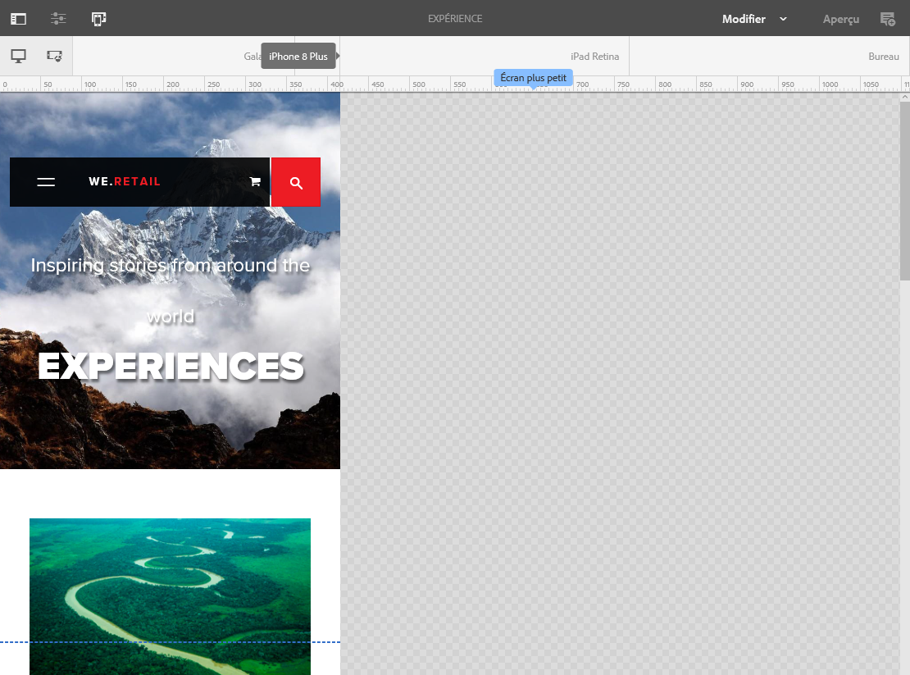

## Sélection d’un appareil à émuler {#selecting-a-device-to-emulate}

1. Ouvrez la page requise en vue de la modifier. Par exemple :

   `http://localhost:4502/editor.html/content/we-retail/us/en/experience.html`

1. Sélectionnez l’icône **Émulateur** dans la barre d’outils supérieure :

   

1. La barre d’outils de l’émulateur s’ouvre.

   

   La barre d’outils de l’émulateur affiche des options de mise en page supplémentaires :

   * **Faire pivoter le périphérique** : permet de faire pivoter un appareil de l’orientation verticale (portrait) à l’orientation horizontale (paysage), et inversement.

    

   * **Sélectionner un périphérique** : permet de sélectionner un appareil spécifique à émuler dans une liste (pour plus d’informations, voir l’étape suivante).

   

1. Pour sélectionner un appareil spécifique à émuler, vous pouvez effectuer l’une des opérations suivantes :

   * utiliser l’icône Sélectionner un périphérique et sélectionner l’appareil dans la liste déroulante ;
   * appuyer ou cliquer sur l’indicateur de l’appareil dans la barre d’outils de l’émulateur.

   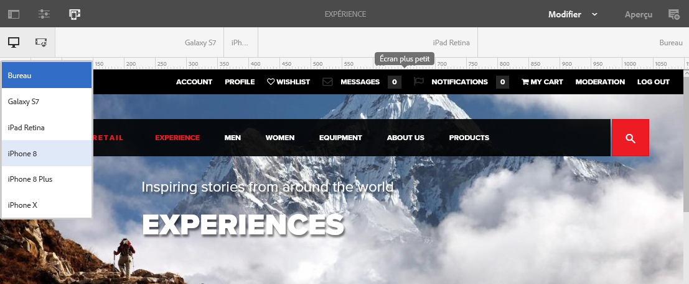

1. Une fois un appareil spécifique sélectionné, vous pouvez visualiser les éléments suivants :

   * Marqueurs actifs de l’appareil sélectionné (**iPad**, par exemple).
   * Marqueurs actifs du [point d’arrêt](/help/sites-authoring/responsive-layout.md#layout-definitions-device-emulation-and-breakpoints) approprié (**Tablette**, par exemple).

   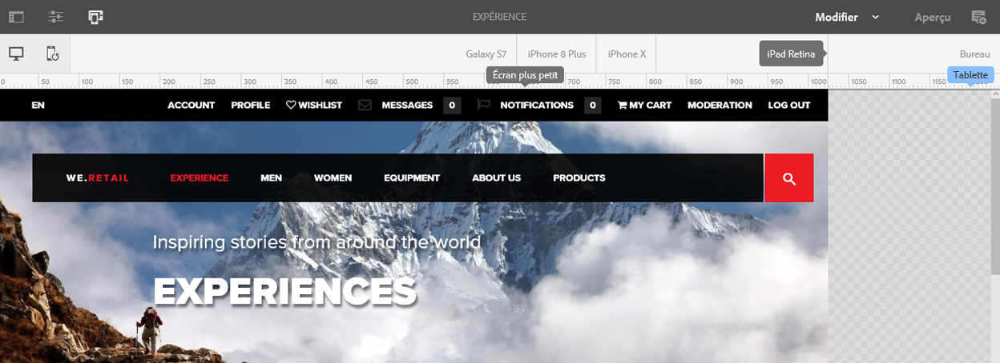

   * La ligne pointillée bleue représente le *pli* pour l’appareil sélectionné (ici, **iPhone 6**).

   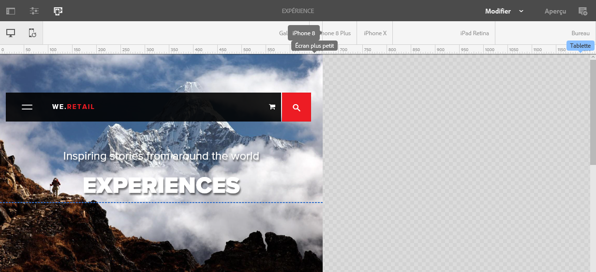

   * Le pli peut également être considéré comme le saut de ligne dans la page (à ne pas confondre avec les [points d’arrêt](/help/sites-authoring/responsive-layout.md#layout-definitions-device-emulation-and-breakpoints)) pour le contenu. Il est affiché à titre de référence pour indiquer quelle partie du contenu l’utilisateur verra sur son appareil avant de faire défiler.
   * La ligne du pli ne s’affiche pas si la hauteur de l’appareil émulé est supérieure à la taille de l’écran.
   * Le pli est affiché pour faciliter le travail de l’auteur et n’apparaît pas sur la page publiée.

## Ajout d’un conteneur de mises en page et de son contenu (mode d’édition) {#adding-a-layout-container-and-its-content-edit-mode}

Un **conteneur de mises en page** est un système de paragraphes qui présente les caractéristiques suivantes :

* Il contient d’autres composants.
* Il définit la mise en page.
* Il est réactif face aux modifications.

>[!NOTE]
>
>S’il n’est pas déjà disponible, le **conteneur de mises en page** doit être explicitement [activé pour un système de paragraphes ou une page](/help/sites-administering/configuring-responsive-layout.md) (en utilisant le mode de [**conception**, par exemple](/help/sites-authoring/default-components-designmode.md)).

1. Le **conteneur de mise en page** est disponible en tant que composant standard dans l’[explorateur de composants](/help/sites-authoring/author-environment-tools.md#components-browser). De là, vous pouvez le faire glisser vers l’emplacement souhaité sur la page, après lequel vous verrez l’espace réservé **Faire glisser les composants ici**.
1. Vous pouvez ensuite ajouter des composants au conteneur de mises en page, qui contiendront le contenu proprement dit :

   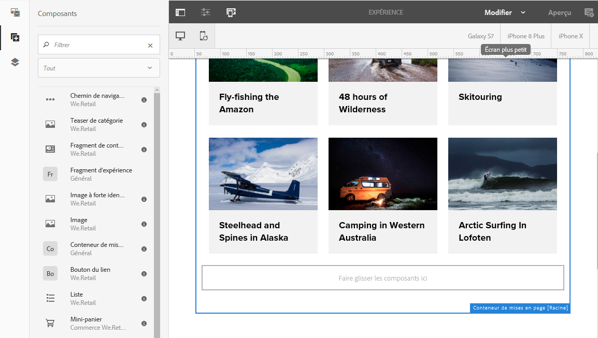

## Sélection et exécution d’une action sur un conteneur de mises en page (mode d’édition) {#selecting-and-taking-action-on-a-layout-container-edit-mode}

À l’instar des autres composants, vous pouvez sélectionner un conteneur de mises en page, puis effectuer une opération (couper, copier, supprimer) sur ce dernier (en mode d’**édition**) :

>[!CAUTION]
>
>Un conteneur de mises en page étant un système de paragraphes, sa suppression entraîne celle de la grille de mise en page et de tous les composants (et de leur contenu) qu’il contient.

1. Si vous pointez ou appuyez sur l’espace réservé de la grille, le menu Action s’affiche.

   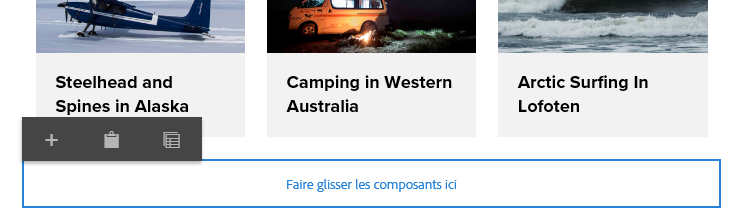

   Vous devez sélectionner l’option **Parent**.

   

1. Si le composant de mise en page est imbriqué, sélectionnez l’option **Parent** pour afficher une liste déroulante et sélectionner le conteneur de mises en page imbriqué, ou son ou ses parents.

   Lorsque vous pointez sur le nom d’un conteneur dans la liste déroulante, ses contours s’affichent sur la page.

   * Les contours du conteneur de mises en page imbriqué du plus bas niveau s’affichent en noir.
   * Les contours du conteneur de mises en page imbriqué du niveau immédiatement supérieur s’affichent en gris foncé.
   * Les contours de chaque conteneur successif s’affichent dans une nuance de gris plus claire.

   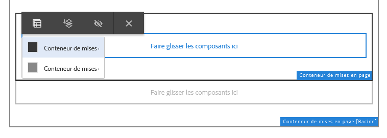

1. Cette opération sélectionne l’ensemble de la grille avec son contenu. La barre d’outils s’affiche. Vous pouvez alors sélectionner une action comme **Supprimer**.

   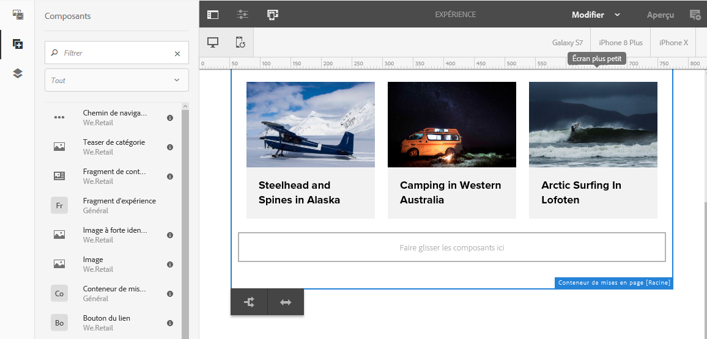

## Définition des mises en page (mode Mise en page) {#defining-layouts-layout-mode}

>[!NOTE]
>
>Vous pouvez définir une mise en page distincte pour chaque [point d’arrêt](#layout-definitions-device-emulation-and-breakpoints) (déterminée par l’orientation et le type d’appareil émulé).

Pour configurer la mise en page d’une grille réactive mise en œuvre avec le composant Conteneur de mises en page, vous devez utiliser le mode **Mise en page**.

Le mode **Mise en page** peut être activé de deux façons.

* À l’aide du [menu de mode de la barre d’outils](/help/sites-authoring/author-environment-tools.md#page-modes), en sélectionnant le mode **Mise en page**.

   * Sélectionnez le mode **Mise en page** de la même façon que vous passeriez en mode **Édition** ou en mode **Ciblage**.
   * Le mode **Mise en page** est un mode persistant, ce qui signifie qu’il reste sélectionné jusqu’à ce que vous choisissiez un autre mode à l’aide du sélecteur de mode.****

* Lors de la [modification d’un composant individuel.](/help/sites-authoring/editing-content.md#edit-component-layout)

   * L’option **Mise en page** du menu Actions rapides du composant permet de passer au mode **Mise en page**.
   * Le mode **Mise en page** persiste pendant la modification du composant et bascule vers le mode d’**édition** lorsqu’un autre composant est sélectionné.

Une fois le mode Mise en page sélectionné, vous pouvez effectuer diverses actions sur une grille :

* Redimensionnez les composants de contenu à l’aide des points bleus. Le redimensionnement s’aligne toujours sur la grille. Lors du redimensionnement, la grille d’arrière-plan s’affiche pour faciliter l’alignement :

   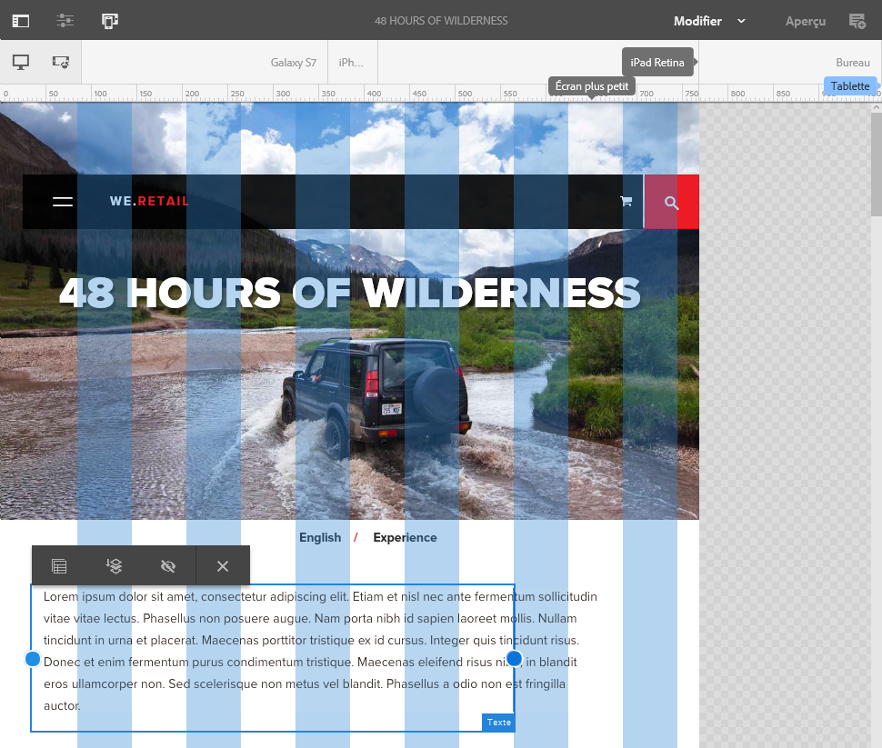

   >[!NOTE]
   >
   >Les proportions et les rapports sont conservés lorsque des composants, tels que des **images**, sont redimensionnés.

* Cliquez ou appuyez sur un composant de contenu. La barre d’outils propose les options suivantes :

   * **Parent**

      Permet de sélectionner l’intégralité du composant Conteneur de mises en pages pour effectuer une opération.

   * **Flotter sur une nouvelle ligne**

      Le composant sera déplacé sur une nouvelle ligne, en fonction de l’espace disponible dans la grille.

   * **Masquer le composant**

      Le composant sera rendu invisible (il peut être restauré à partir de la barre d’outils du conteneur de mise en page).
   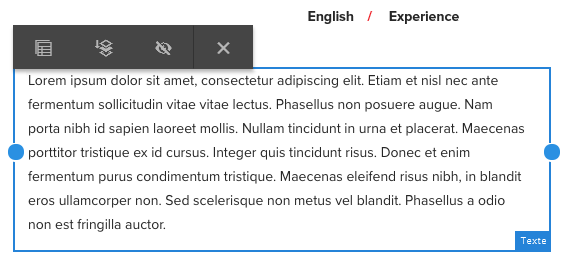

* En mode **Mise en page**, appuyez ou cliquez sur **Faire glisser les composants ici** pour sélectionner l’intégralité du composant. La barre d’outils pour ce mode s’affiche.

   La barre d’outils propose des options différentes selon l’état du composant de mise en page et des composants associés. Par exemple :

   * **Parent** : permet de sélectionner le composant parent.

   

   * **Afficher les composants**  masqués - Afficher tous les composants ou les composants individuels. Le nombre indique le nombre de composants masqués actuellement.Le compteur indique le nombre de composants masqués.

   

   * **Rétablir la disposition du point d’arrêt** : rétablit la mise en page par défaut. Aucune mise en page personnalisée n’est donc imposée.

   

   * **Flotter sur une nouvelle ligne** : déplace le composant d’une position vers le haut si l’espace est suffisant.

   

   * **Masquer le composant** : masque le composant actif.

   

   >[!NOTE]
   >
   >Dans l’exemple ci-dessus, les actions de flottement et de masquage sont disponibles, car ce conteneur de mises en page est imbriqué dans un conteneur de mises en page parent.

   * **Afficher les**
composantsSélectionnez les composants parents pour afficher la barre d&#39;outils d&#39;action avec la fonction 
**Afficher les** composants masqués, option. Dans cet exemple, deux composants sont masqués.
   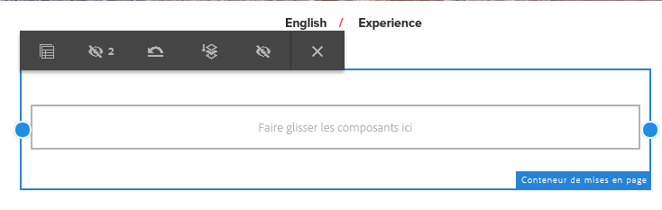

   Si vous sélectionnez l’option **Afficher les composants masqués**, les composants actuellement masqués s’affichent en bleu à leur position initiale.

   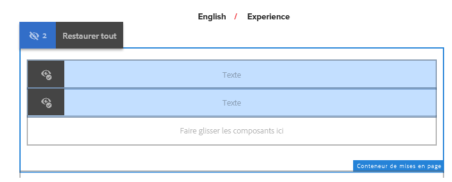

   Sélectionnez **Restaurer tout** pour afficher tous les composants masqués.

