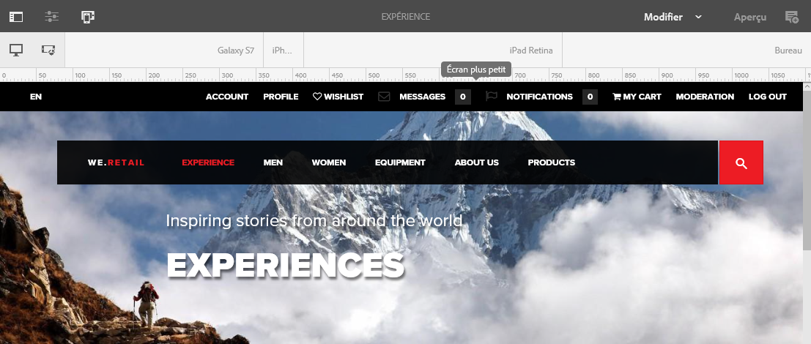

# Mise en page réactive{#responsive-layout}

AEM permet de réaliser une mise en page réactive pour vos pages à l’aide du composant **Conteneur de mises en page**.

Vous obtenez ainsi un système de paragraphes qui permet de positionner les composants dans une grille réactive. Cette grille peut réorganiser la mise en page selon l’appareil ou la taille de la fenêtre et le format. The component is used in conjunction with the [**Layout **mode](/help/sites-authoring/responsive-layout.md#defining-layouts-layout-mode), which allows you to create and edit your responsive layout dependent on device.

Le conteneur de mises en page présente les caractéristiques suivantes :

* Il permet un alignement horizontal sur la grille et offre aussi la possibilité de placer les composants côte à côte dans la grille et de définir quand ils doivent être réduits ou développés.
* Il utilise des points d’arrêt prédéfinis (Téléphone ou Tablette, par exemple) pour que vous puissiez définir le comportement du contenu pour l’orientation ou les appareils associés. 

   * Vous pouvez par exemple personnaliser la taille du composant ou spécifier si le composant doit être affiché ou non sur des appareils spécifiques.

* Il peut être imbriqué pour permettre le contrôle des colonnes.

L’utilisateur peut ensuite afficher un aperçu du contenu pour des appareils spécifiques à l’aide de l’émulateur.

>[!CAUTION]
>
>Bien que le composant Conteneur de mises en page soit disponible dans l’IU classique, il n’est entièrement fonctionnel et pris en charge que dans l’interface utilisateur optimisée pour les écrans tactiles.

AEM réalise une mise en page réactive pour vos pages en combinant plusieurs mécanismes :

* [**Composant Conteneur **](#adding-a-layout-container-and-its-content-edit-mode)de mise en page

   Ce composant est disponible dans l’explorateur [de](/help/sites-authoring/author-environment-tools.md#components-browser) composants et fournit un système de paragraphe de grille qui vous permet d’ajouter et de positionner des composants dans une grille réactive. Il peut également être défini comme système de paragraphe par défaut sur votre page.

* [**Mode Disposition **](/help/sites-authoring/responsive-layout.md#defining-layouts-layout-mode)

   Once the layout container is positioned on your page you can use the **Layout** mode to position content within the responsive grid.

* [**Émulateur **](#selecting-a-device-to-emulate)Permet de créer et de modifier des sites web réactifs qui réorganisent la mise en page en fonction de l’appareil ou de la taille de la fenêtre en redimensionnant les composants de manière interactive. L’utilisateur peut ensuite afficher un aperçu du contenu à l’aide de l’émulateur.

À l’aide de ces mécanismes de grille réactive, vous pouvez effectuer les opérations suivantes :

* utiliser des points d’arrêt pour définir différentes mises en page en fonction de la largeur d’appareil (associée au type d’appareil et à l’orientation) ;
* utiliser ces points d’arrêt et les mises en page de contenu pour veiller à ce que le contenu s’ajuste à la taille de la fenêtre du navigateur sur le poste de travail ;
* utiliser l’alignement horizontal sur la grille, ce qui vous permet de placer les composants dans la grille, de les redimensionner selon les besoins et de définir quand ils doivent être réduits ou développés pour être côte à côte ou l’un au-dessus de l’autre ;
* masquer des composants pour des mises en page d’appareil spécifiques ;
* Contrôler les colonnes.

Selon votre projet, le conteneur de mise en page peut être utilisé comme système de paragraphe par défaut pour vos pages ou comme composant disponible à ajouter à votre page via l’explorateur de composants (ou les deux).

>[!NOTE]
>
>Adobe provides [GitHub documentation](https://adobe-marketing-cloud.github.io/aem-responsivegrid/) of the responsive layout as a reference that can be given to front-end developers allowing them to use the AEM grid outside of AEM, for example when creating static HTML mock-ups for a future AEM site.

>[!NOTE]
>
>L’utilisation des mécanismes ci-dessus est activée par une configuration du modèle. See [Configuring Responsive Layout](/help/sites-administering/configuring-responsive-layout.md) for further information.

## Définitions de mise en page, émulation d’appareil et points d’arrêt {#layout-definitions-device-emulation-and-breakpoints}

Lorsque vous créez le contenu de votre site web, vous voulez être certain que celui-ci sera affiché correctement sur l’appareil utilisé pour le consulter :

Dans AEM, vous pouvez définir des mises en page qui dépendent de la largeur de l’appareil :

* L’émulateur permet d’émuler ces mises en page sur divers appareils. In addition to the device type, the orientation, selected by the **Rotate device** option, can impact the breakpoint selected as the width changes.
* Les points d’arrêt sont des points qui séparent les définitions de mise en page.

   * Ils définissent la largeur maximale (en pixels) de n’importe quel appareil à l’aide d’une mise en page spécifique.
   * Les points d’arrêt sont généralement valides pour plusieurs appareils en fonction de la largeur de leur écran.
   * La plage d’un point d’arrêt s’étend de la gauche jusqu’au point d’arrêt suivant.
   * Vous ne pouvez pas spécifiquement sélectionner le point d’arrêt. La sélection d’un appareil et d’une orientation permet de sélectionner automatiquement le point d’arrêt adéquat.

L’appareil **Bureau**, qui ne possède pas de largeur spécifique, est associé au point d’arrêt par défaut (c.-à-d. tout ce qui se trouve au-dessus du dernier point d’arrêt configuré).

>[!NOTE]
>
>Il serait possible de définir des points d’arrêt pour chaque appareil, mais cela augmenterait toutefois la charge de travail requise pour la définition des mises en page et la maintenance.

Lorsque vous sélectionnez, à l’aide de l’émulateur, un appareil spécifique pour l’émulation et la définition de la mise en page, le point d’arrêt associé est également sélectionné. Toute modification de mise en page est applicable aux appareils auxquels s’applique le point d’arrêt (c.-à-d. les appareils placés à gauche du marqueur du point d’arrêt actif, mais avant le marqueur du point d’arrêt suivant).

Par exemple, lorsque vous sélectionnez l’appareil **iPhone 6 Plus** (défini avec une largeur de 540 pixels) pour l’émulation et la mise en page, le point d’arrêt **Téléphone** (défini à 768 pixels) est également activé. Toute modification de mise en page apportée à l’appareil **iPhone 6** est applicable aux autres appareils sous le point d’arrêt **Téléphone**, tels que l’**iPhone 5** (défini à 320 pixels).

## Selecting a Device to Emulate {#selecting-a-device-to-emulate}

1. Ouvrez la page requise en vue de la modifier. Par exemple :

   `http://localhost:4502/editor.html/content/we-retail/us/en/experience.html`

1. Sélectionnez l’icône **Émulateur** dans la barre d’outils supérieure :

   

1. La barre d’outils de l’émulateur s’ouvre.

   

   La barre d’outils de l’émulateur affiche des options de mise en page supplémentaires :

   * **Faire pivoter le périphérique** : permet de faire pivoter un appareil de l’orientation verticale (portrait) à l’orientation horizontale (paysage), et inversement.
    

   * **Sélectionner un périphérique** : permet de sélectionner un appareil spécifique à émuler dans une liste (pour plus d’informations, voir l’étape suivante).
   

1. Pour sélectionner un appareil spécifique à émuler, vous pouvez effectuer l’une des opérations suivantes :

   * utiliser l’icône Sélectionner un périphérique et sélectionner l’appareil dans la liste déroulante.
   * appuyer ou cliquer sur l’indicateur de l’appareil dans la barre d’outils de l’émulateur.
   

1. Une fois un appareil spécifique sélectionné, vous pouvez visualiser les éléments suivants :

   * See the active marker for the selected device, such as **iPad.**
   * See the active marker for the appropriate [breakpoint](/help/sites-authoring/responsive-layout.md#layout-definitions-device-emulation-and-breakpoints) such as **Tablet.**
   

   * La ligne pointillée bleue représente le *pli* pour l’appareil sélectionné (ici, **iPhone 6**).
   

   * Le pli peut également être considéré comme le saut de ligne dans la page (à ne pas confondre avec les [points d’arrêt](/help/sites-authoring/responsive-layout.md#layout-definitions-device-emulation-and-breakpoints)) pour le contenu. Il est affiché à titre de référence pour indiquer quelle partie du contenu l’utilisateur verra sur son appareil avant de faire défiler.
   * La ligne du pli ne s’affiche pas si la hauteur de l’appareil émulé est supérieure à la taille de l’écran.
   * Le pli est affiché pour faciliter le travail de l’auteur et n’apparaît pas sur la page publiée.

## Adding a Layout Container and its Content (Edit mode) {#adding-a-layout-container-and-its-content-edit-mode}

Un **conteneur de mises en page** est un système de paragraphes qui présente les caractéristiques suivantes :

* Il contient d’autres composants.
* Il définit la mise en page.
* Il est réactif face aux modifications.

>[!NOTE]
>
>S’il n’est pas déjà disponible, le **conteneur de mises en page** doit être explicitement [activé pour un système de paragraphes ou une page](/help/sites-administering/configuring-responsive-layout.md) (en utilisant le mode de [**conception **, par exemple](/help/sites-authoring/default-components-designmode.md)).

1. Le **conteneur de mises en page** est disponible en tant que composant standard dans l’[explorateur de composants](/help/sites-authoring/author-environment-tools.md#components-browser). Vous pouvez le faire glisser depuis l’explorateur de composants jusqu’à l’emplacement requis dans la page. L’espace réservé **Faire glisser les composants ici** s’affiche alors.
1. Vous pouvez ensuite ajouter des composants au conteneur de mises en page, qui contiendront le contenu actuel :

   

## Sélection et exécution d’une action sur un conteneur de mises en page (mode d’édition) {#selecting-and-taking-action-on-a-layout-container-edit-mode}

À l’instar des autres composants, vous pouvez sélectionner un conteneur de mises en page, puis effectuer une opération (couper, copier, supprimer) sur ce dernier (en mode d’**édition**) :

>[!CAUTION]
>
>Un conteneur de mises en page étant un système de paragraphes, sa suppression entraîne celle de la grille de mise en page et de tous les composants (et de leur contenu) qu’il contient.

1. Si vous pointez ou appuyez sur l’espace réservé de la grille, le menu Action s’affiche.

   

   You need to select the **Parent** option.

   

1. Si le composant de mise en page est imbriqué, sélectionnez l’option **Parent** pour afficher une liste déroulante et sélectionner le conteneur de mises en page imbriqué, ou son ou ses parents.

   Lorsque vous pointez sur le nom d’un conteneur dans la liste déroulante, ses contours s’affichent sur la page.

   * Les contours du conteneur de mises en page imbriqué du plus bas niveau s’affichent en noir.
   * Les contours du conteneur de mises en page imbriqué du niveau immédiatement supérieur s’affichent en gris foncé.
   * Les contours de chaque conteneur successif s’affichent dans une nuance de gris plus claire.
   

1. Cette opération sélectionne l’ensemble de la grille avec son contenu. The action toolbar will be shown, from where you can select an action such as **Delete.**

   

## Définition des mises en page (mode Mise en page) {#defining-layouts-layout-mode}

>[!NOTE]
>
>Vous pouvez définir une mise en page distincte pour chaque [point d’arrêt](#layout-definitions-device-emulation-and-breakpoints) (déterminée par l’orientation et le type d’appareil émulé).

To configure the layout of a responsive grid implemented with the Layout Container you need to use the **Layout** mode.

Le mode **Mise en page** peut être activé de deux façons.

* By using the [mode menu in the toolbar](/help/sites-authoring/author-environment-tools.md#page-modes) and choosing **Layout** mode

   * Select the **Layout** mode just as you would switch to **Edit** mode or **Targeting** mode.
   * **Le mode Disposition** reste persistant et vous ne quittez pas le mode **Disposition** tant que vous n’avez pas sélectionné un autre mode via le sélecteur de mode.

* Lors de la [modification d’un composant individuel.](/help/sites-authoring/editing-content.md#edit-component-layout)

   * L’option **Mise en page** du menu Actions rapides du composant permet de passer au mode **Mise en page**.
   * Le mode **Mise en page** persiste pendant la modification du composant et bascule vers le mode d’**édition** lorsqu’un autre composant est sélectionné. 

Une fois le mode Mise en page sélectionné, vous pouvez effectuer diverses actions sur une grille :

* Redimensionnez les composants de contenu à l’aide des points bleus. Le redimensionnement s’aligne toujours sur la grille. Lors du redimensionnement, la grille d’arrière-plan s’affiche pour faciliter l’alignement :

   

   >[!NOTE]
   >
   >Les proportions et les rapports sont conservés lorsque des composants tels que des **images** sont redimensionnés.

* Cliquez ou appuyez sur un composant de contenu. La barre d’outils propose les options suivantes :

   * **Parent**

      Permet de sélectionner l’intégralité du composant Conteneur de mises en pages pour effectuer une opération.

   * **Flotter sur une nouvelle ligne**

      Le composant sera déplacé vers une nouvelle ligne, selon l’espace disponible dans la grille.

   * **Masquer le composant**

      Le composant sera rendu invisible (il peut être restauré à partir de la barre d’outils du conteneur de dispositions).
   

* In **Layout** mode you can tap/click on the **Drag components here** to select the entire component. La barre d’outils pour ce mode s’affiche.

   La barre d’outils propose des options différentes selon l’état du composant de mise en page et des composants associés. Par exemple :

   * **Parent** : sélectionnez le composant parent.
   

   * **Afficher les composants** masqués : affiche tous les composants ou des composants individuels. Le nombre indique le nombre de composants masqués présents actuellement.Le compteur indique le nombre de composants masqués.
   

   * **Rétablir la disposition** des points d’arrêt - Rétablir la disposition par défaut. Cela signifie qu’aucune disposition personnalisée ne sera imposée.
   

   * **Flotter sur une nouvelle ligne** - Déplace le composant vers le haut si l&#39;espacement le permet.
   

   * **Masquer le composant** - Masquer le composant actif.
   

   >[!NOTE]
   >
   >Dans l’exemple ci-dessus, les actions de flottement et de masquage sont disponibles, car ce conteneur de mises en page est imbriqué dans un conteneur de mises en page parent.

   * **Afficher les composants**
Sélectionnez les composants parents pour afficher la barre d’outils comportant l’option **Afficher les composants masqués**. Dans cet exemple, deux composants sont masqués.
   

   Si vous sélectionnez l’option **Afficher les composants masqués**, les composants actuellement masqués s’affichent en bleu à leur position initiale.

   

   Sélectionnez **Restaurer tout** pour afficher tous les composants masqués.

