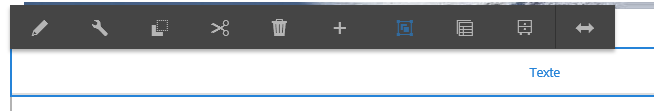
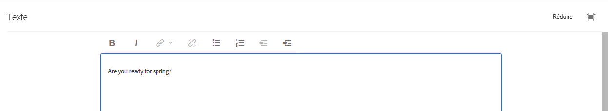

# Utilisation de l’éditeur de texte enrichi pour créer du contenu {#use-rich-text-editor-to-author-content}

L’éditeur de texte enrichi est une composante essentielle pour la saisie de contenu texte dans AEM. Il constitue la base de divers composants, dont :

* Texte
* Texte et Image
* Tableau

## Édition statique {#in-place-editing}

Selecting a text-based component with a single tap or click will reveal the [component toolbar](/help/sites-authoring/editing-content.md#editmovecopypastedeletetouchoptimizedui) as with any component.

Si vous cliquez/appuyez à nouveau sur le composant ou si vous l’avez sélectionné initialement en cliquant/appuyant deux fois lentement, il s’ouvre en mode d’édition statique, avec sa propre barre d’outils. Vous pouvez alors modifier le contenu et apporter des modifications de base à la mise en forme :

Cette barre d’outils propose les options suivantes :

* **Format**: Cela vous permet de définir Gras, Italique et Souligné.
* **Listes**: Vous pouvez ainsi créer des listes à puces ou numérotées ou définir le retrait.
* **Lien hypertexte**
* **Dissocier**
* **Plein écran**
* **Fermer**
* **Enregistrer**

## Édition en mode Plein écran {#full-screen-editing}

For text-based components, tapping the full screen mode from the [toolbar](#componenttoolbar)  opens the rich text editor and hides the rest of the page content.

Le mode Plein écran affiche toutes les options configurées que vous pouvez utiliser pour la création. Les options disponibles [dépendent de la configuration](/help/sites-administering/rich-text-editor.md).

Les options supplémentaires de l’éditeur de texte enrichi sont les suivantes :

* **Ancre**: Créez une ancre dans le texte à laquelle vous pourrez ultérieurement lier/référencer.
* **Aligner le texte à gauche**
* **Texte centré**
* **Aligner le texte à droite**

Pour fermer le mode Plein écran, cliquez sur l’icône Réduire.

>[!NOTE]
>
>La copie de listes imbriquées de Microsoft Word dans RTE peut donner des résultats incohérents et peut nécessiter un ajustement manuel après avoir collé le texte dans RTE.
