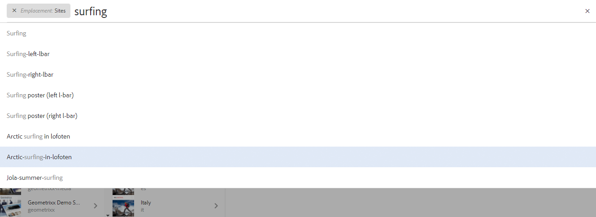

# Rechercher{#searching}

L’environnement de création d’AEM comporte divers mécanismes de recherche de contenu, selon le type de ressource que vous utilisez.

>[!NOTE]
>
>En dehors de l’environnement de création, d’autres méthodes de recherche sont également disponibles, telles que le [Query Builder](/help/sites-developing/querybuilder-api.md) et [CRXDE Lite](/help/sites-developing/developing-with-crxde-lite.md).

## Principes de base de la recherche {#search-basics}

La recherche est disponible dans la barre d’outils supérieure :

Avec le rail de recherche, vous pouvez accomplir ce qui suit :

* Recherchez un mot-clé, chemin ou balise spécifique.
* Filtrez selon des critères spécifiques à une ressource, tels que les dates de modification, l’état de la page, la taille du fichier, etc.
* Définissez et utilisez un [recherche enregistrée](#saved-searches) - selon les critères ci-dessus.

>[!NOTE]
>
>Vous pouvez également accéder à la fonction de recherche en appuyant sur la touche `/` (barre oblique) lorsque le rail de recherche est visible.

## Rechercher et filtrer {#search-and-filter}

Pour rechercher et filtrer vos ressources :

1. Ouvrez **Rechercher** (avec la loupe dans la barre d’outils) et saisissez le terme à rechercher. Des suggestions sont faites et peuvent être sélectionnées :

   

   Par défaut, les résultats de la recherche sont limités à votre emplacement actuel (c’est-à-dire la console et le type de ressource associé) :

   

1. Si nécessaire, vous pouvez supprimer le filtre d’emplacement (sélectionnez **X** sur le filtre que vous souhaitez supprimer) pour effectuer une recherche dans toutes les consoles/tous les types de ressources.
1. Les résultats s’affichent, regroupés selon la console et le type de ressource associé.

   Vous pouvez sélectionner une ressource spécifique (pour effectuer d’autres actions) ou effectuer une analyse en sélectionnant le type de ressource requis ; par exemple : **Afficher tous les sites**:

   

1. Si vous souhaitez accéder à plus d’options, sélectionnez le symbole représentant un rail (en haut à gauche) pour ouvrir le panneau latéral **Filtres et options**.

   

   Selon le type de ressource, la fonction Recherche affiche une sélection prédéfinie de critères de recherche/filtrage.

   Le panneau latéral vous permet de sélectionner :

   * Recherches enregistrées
   * Répertoire de recherche
   * Balises
   * Critères de recherche, par exemple, les dates de modification, l’état de publication, l’état LiveCopy.

   >[!NOTE]
   >
   >Les critères de recherche peuvent varier :
   >
   >
   >
   >    * selon le type de ressource que vous avez sélectionné ; par exemple, les critères Assets et Communities sont spécialisé, de manière compréhensible.
   >    * Votre instance en tant que [Formulaires de recherche](/help/sites-administering/search-forms.md) peut être personnalisée (en fonction de l’emplacement dans AEM).
   >
   >

   

1. Vous pouvez également ajouter des termes de recherche :

   

1. Fermez **Rechercher** à l’aide du **X** (en haut à droite).

>[!NOTE]
>
>Les critères de recherche sont conservés lors de la sélection d’un élément dans les résultats de recherche.
>
>Lorsque vous sélectionnez un élément sur la page de résultats de recherche et lorsque vous revenez à la page de recherche après avoir utilisé le bouton Précédent du navigateur, les critères de recherche restent inchangés.

## Recherches enregistrées {#saved-searches}

Outre la recherche à partir de nombreuses facettes, vous pouvez enregistrer une configuration de recherche spécifique pour la récupérer et l’utiliser ultérieurement :

1. Définissez vos critères de recherche et sélectionnez **Enregistrer**.

   

1. Attribuez-lui un nom, puis cliquez sur **Enregistrer** pour confirmer :

   

1. La recherche enregistrée sera disponible dans le sélecteur lors de votre prochain accès au panneau de recherche :

   

1. Une fois l’enregistrement effectué, vous pouvez :

   * cliquer sur la **croix** (à côté du nom de la recherche enregistrée) pour lancer une nouvelle requête (la recherche enregistrée elle-même ne sera pas supprimée) ;
   * **modifier la recherche enregistrée**, modifier les critères de recherche, puis **enregistrer** la recherche une nouvelle fois.

Les recherches enregistrées peuvent être modifiées en sélectionnant la recherche enregistrée et en cliquant sur **Modifier la recherche enregistrée** au bas du panneau de recherche.

