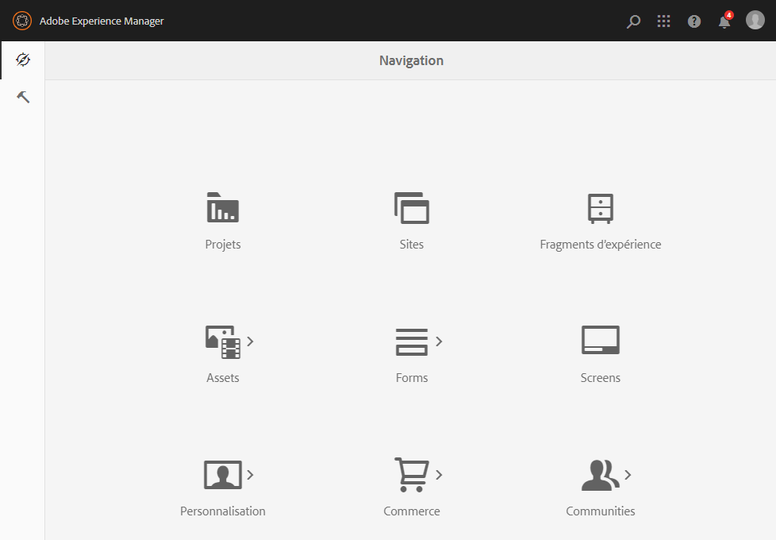
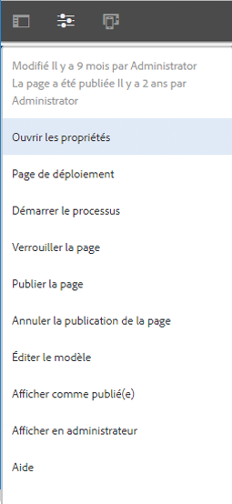

# Choisir votre interface utilisateur{#selecting-your-ui}

L’interface utilisateur optimisée pour les écrans tactiles d’Adobe Experience Manager (AEM) est désormais l’interface utilisateur standard et la parité des fonctionnalités a presque été atteinte avec l’administration et la modification des sites. Cependant, il peut arriver que l’utilisateur ou l’utilisatrice souhaite passer à l’[interface utilisateur classique](/help/sites-classic-ui-authoring/classicui.md). Il existe plusieurs options pour ce faire.

>[!NOTE]
>
>Pour plus d’informations sur le statut de parité des fonctionnalités avec l’IU classique, consultez le document [Parité des fonctionnalités de l’IU tactile](/help/release-notes/touch-ui-features-status.md).

Il existe différents emplacements où vous pouvez définir l’interface utilisateur à utiliser :

* [Configuration de l’interface utilisateur par défaut pour votre instance](#configuring-the-default-ui-for-your-instance)
Cette option définit l’interface utilisateur par défaut à afficher lors de la connexion de l’utilisateur ou l’utilisatrice. L’utilisateur ou l’utilisatrice peut être en mesure d’ignorer ce paramètre et de sélectionner une autre interface utilisateur pour son compte ou la session en cours.

* [Définition de l’IU de création classique pour votre compte](/help/sites-authoring/select-ui.md#setting-classic-ui-authoring-for-your-account) 
Détermine l’interface utilisée par défaut lors de la modification des pages. Cependant, l’utilisateur ou l’utilisatrice peut ignorer ce paramètre et sélectionner une autre interface pour le compte ou la session en cours.

* [Activation de l’IU classique pour la session en cours](#switching-to-classic-ui-for-the-current-session)
Active l’IU classique pour la session en cours.

* Dans le cas de la [création de pages, le système effectue certains remplacements dans la relation avec l’interface utilisateur](#ui-overrides-for-the-editor).

>[!CAUTION]
>
>Plusieurs options permettant de passer à l’interface utilisateur classique ne sont pas immédiatement prêtes à l’emploi. Elles doivent être configurées pour votre instance.
>
>Pour plus d’informations, reportez-vous à la section [Activation de l’accès à l’IU classique](/help/sites-administering/enable-classic-ui.md).

>[!NOTE]
>
>Les instances mises à niveau à partir d’une version précédente conservent l’IU classique pour la création de pages.
>
>Après la mise à niveau, la création de pages ne bascule pas automatiquement vers l’IU optimisée pour les écrans tactiles. Vous pouvez cependant configurer ce basculement à l’aide de la [configuration OSGi](/help/sites-deploying/configuring-osgi.md) du **service Mode d’IU de création de la gestion de contenu web** (service `AuthoringUIMode`). Consultez la section [IU par défaut en fonction de l’éditeur](#ui-overrides-for-the-editor).

## Configurer l’UI par défaut pour votre instance {#configuring-the-default-ui-for-your-instance}

Un administrateur ou une administratrice système peut configurer l’interface utilisateur qui s’affiche au démarrage et lors de la connexion à l’aide du [Mappage racine](/help/sites-deploying/osgi-configuration-settings.md#daycqrootmapping).

Ceci peut être remplacé par les paramètres par défaut de l’utilisateur ou de l’utilisatrice, ou les paramètres de session.

## Définir l’UI classique pour la création sur votre compte {#setting-classic-ui-authoring-for-your-account}

Chaque utilisateur et utilisatrice peut accéder à ses [préférences](/help/sites-authoring/user-properties.md#userpreferences) pour définir si l’IU classique doit être utilisée pour la création de pages (au lieu de l’interface par défaut).

Ceci peut être remplacé par les paramètres de session.

## Passer à l’UI classique pour la session en cours {#switching-to-classic-ui-for-the-current-session}

Ainsi, si l’IU optimisée pour les écrans tactiles est activée sur un ordinateur de bureau, les utilisateurs et utilisatrices peuvent souhaiter revenir à l’IU classique (ordinateur de bureau uniquement). Plusieurs méthodes permettent de passer à l’UI classique pour la session en cours :

* **Liens de navigation**

  >[!CAUTION]
  >
  >Cette option permettant de passer à l’UI classique n’est pas immédiatement disponible, elle doit être configurée pour votre instance.
  >
  >
  >Pour plus d’informations, reportez-vous à la section [Activation de l’accès à l’IU classique](/help/sites-administering/enable-classic-ui.md).

  Si cette option est activée, une icône s’affiche (un symbole de moniteur) chaque fois que vous pointez la souris sur une console appropriée. Appuyez/cliquez sur cette option pour ouvrir l’emplacement approprié dans l’IU classique.

  Par exemple, les liens de **Sites** à **siteadmin** :

  

* **URL**

  Pour accéder à l’IU classique, utilisez l’URL de l’écran d’accueil à l’adresse `welcome.html`. Par exemple :

  `https://localhost:4502/welcome.html`

  >[!NOTE]
  >
  >L’IU tactile est accessible via `sites.html`. Par exemple :
  >
  >
  >`https://localhost:4502/sites.html`

### Activation de l’IU classique en cours de modification de page {#switching-to-classic-ui-when-editing-a-page}

>[!CAUTION]
>
>Cette option permettant de passer à l’UI classique n’est pas immédiatement disponible, elle doit être configurée pour votre instance.
>
>Pour plus d’informations, reportez-vous à la section [Activation de l’accès à l’IU classique](/help/sites-administering/enable-classic-ui.md).

Si cette option est activée, l’option **Ouvrir l’IU classique** est disponible dans la boîte de dialogue **Informations sur la page** :

### Remplacements d’UI pour l’éditeur {#ui-overrides-for-the-editor}

Les paramètres définis par un utilisateur ou une utilisatrice, ou un administrateur ou une administratrice système, peuvent être remplacés par le système dans le cas de la création de pages.

* Lors de la création de pages :

   * le recours à l’éditeur classique est forcé lors de l’accès à la page à l’aide de `cf#` dans l’URL. Par exemple :
     `https://localhost:4502/cf#/content/geometrixx/en/products/triangle.html`

   * Le recours à l’éditeur tactile est forcé lors de l’utilisation de `/editor.html` dans l’URL ou lors de l’utilisation d’un appareil tactile. Par exemple :
     `https://localhost:4502/editor.html/content/geometrixx/en/products/triangle.html`

* Tout recours forcé à un certain éditeur est temporaire et valide uniquement pour la session en cours.

   * Un jeu de cookies est défini selon qu’il s’agit de l’IU optimisée pour les écrans tactiles (`editor.html`) ou classique (`cf#`).

* Lors de l’ouverture de pages par `siteadmin`, des vérifications sont effectuées pour contrôler l’existence des éléments suivants :

   * Présence du cookie
   * Préférence utilisateur
   * En l’absence de tels paramètres, l’IU définie par défaut dans la [configuration OSGi](/help/sites-deploying/configuring-osgi.md) du service **Mode d’IU de création de la gestion de contenu web** (service `AuthoringUIMode`) est utilisée.

>[!NOTE]
>
>Si [un utilisateur ou une utilisatrice a déjà défini une préférence pour la création de pages](#settingthedefaultauthoringuiforyouraccount), elle n’est pas remplacée par la modification de la propriété OSGi.

>[!CAUTION]
>
>En raison de l’utilisation de cookies, comme décrit plus haut, il n’est pas recommandé de :
>
>* Modifier manuellement l’URL : une URL non standard peut entraîner une situation inconnue et un manque de fonctionnalité.
>* Ouvrir les deux éditeurs en même temps ; dans des fenêtres distinctes, par exemple.
