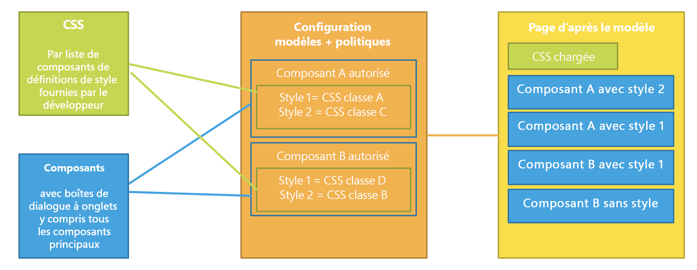
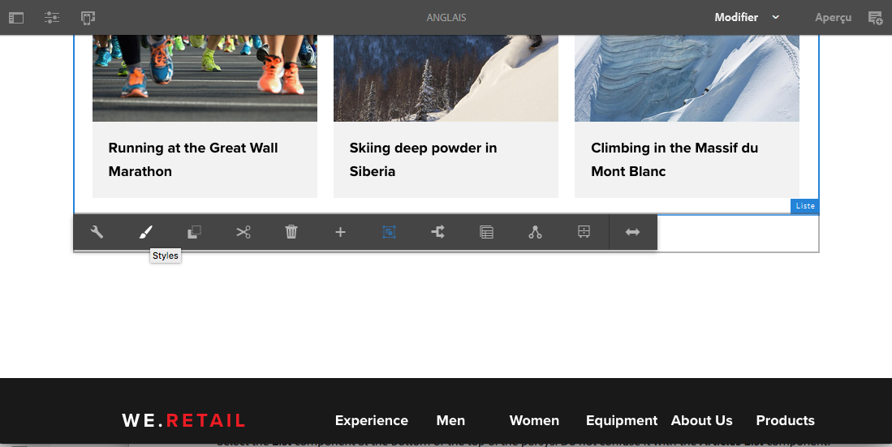
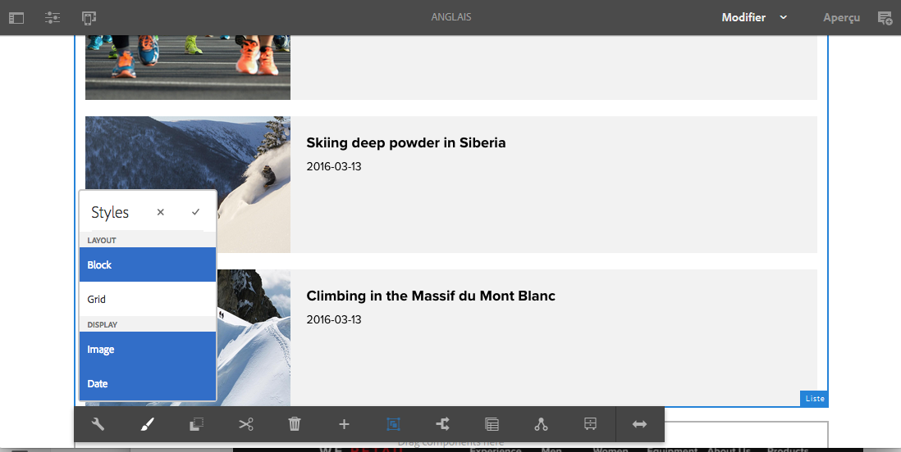
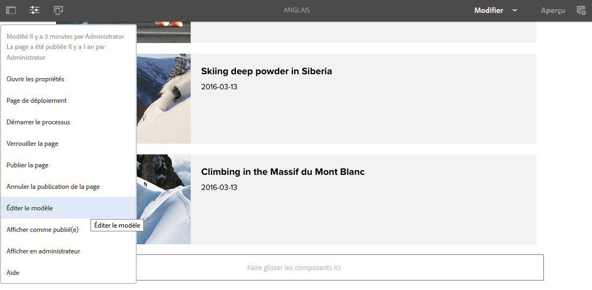
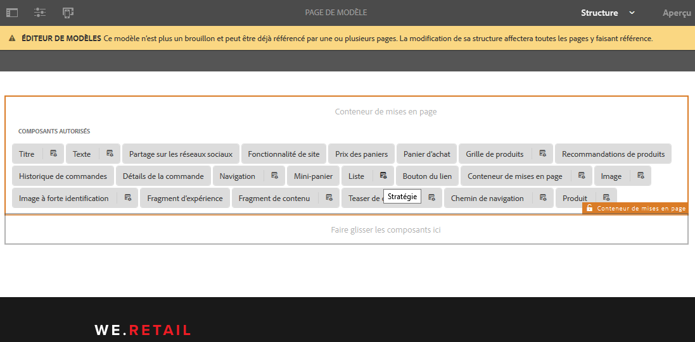
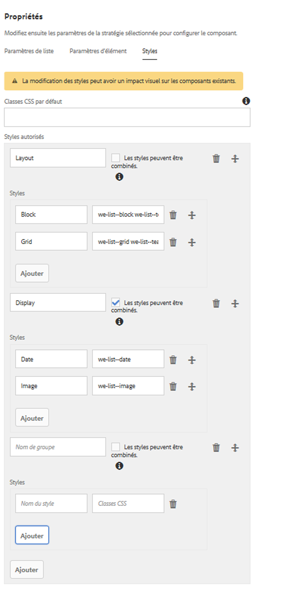

# Système de style{#style-system}

Le système de style permet à un auteur de modèles de définir des classes de style dans la stratégie de contenu d’un composant, de façon à pouvoir sélectionner ces classes lors de la modification du composant sur une page. Ces styles peuvent être des variantes visuelles d’un composant, le rendant ainsi plus flexible.

Cela rend inutile le développement d’un composant personnalisé pour chaque style ou la personnalisation d’une boîte de dialogue de composant pour activer une telle fonctionnalité de style. On obtient ainsi des composants plus réutilisables, pouvant être adaptés, rapidement et aisément, aux besoins des auteurs de contenu sans développement back-end dans AEM.

## Exemple d’utilisation {#use-case}

Les auteurs de modèles doivent être en mesure de configurer non seulement le mode de fonctionnement des composants pour les auteurs de contenu, mais aussi diverses variantes visuelles d’un composant.

De même, les auteurs de contenu ne doivent pas seulement pouvoir structurer et organiser leur contenu. Ils doivent également être en mesure de choisir leur présentation visuelle.

Le système de style constitue une solution unifiée pour répondre aux exigences des auteurs de contenu comme de modèles :

* Les auteurs de modèles peuvent définir des classes de style dans la stratégie de contenu des composants.
* Les auteurs de contenu peuvent sélectionner ces classes dans un menu déroulant lorsqu’ils modifient le composant sur une page pour appliquer les styles correspondants.

La classe de style est ensuite insérée sur l’élément wrapper du composant, de façon à ce que le développeur de composants n’ait pas besoin de gérer les styles (en plus de fournir leurs règles CSS).

## Présentation {#overview}

L’utilisation du système de style se passe généralement comme suit.

1. Le concepteur web crée différentes variantes visuelles d’un composant.

1. Le développeur HTML dispose de la sortie HTML des composants et des variantes visuelles à mettre en œuvre.

1. Le développeur HTML définit les classes CSS qui correspondent à chaque variation visuelle et qui doivent être insérées dans l’élément enveloppant les composants.

1. Le développeur HTML implémente le code CSS correspondant (et éventuellement le code JS) pour chacune des variations visuelles afin qu’elles apparaissent comme définies.

1. Le développeur AEM place le code CSS (et en option, JS) fourni dans une [bibliothèque cliente](/help/sites-developing/clientlibs.md) et le déploie.

1. Le développeur ou auteur de modèles AEM configure les modèles de page et modifie la stratégie de chaque composant de style, en ajoutant les classes CSS définies, en attribuant des noms conviviaux à chaque style et en indiquant les styles pouvant être combinés.

1. L’auteur des pages AEM peut alors choisir les styles conçus dans l’éditeur de page via le menu de style de la barre d’outils du composant.

Notez que seules les trois dernières étapes sont réalisées dans AEM. Cela signifie que l’ensemble du développement des codes CSS et Javascript peut être réalisé sans AEM.

La mise en œuvre des styles nécessite uniquement le déploiement dans AEM et la sélection des modèles souhaités parmi les composants.

Le diagramme suivant illustre l’architecture du système de style.

## Utilisation {#use}

Pour découvrir la fonctionnalité, il faut d’abord créer des styles pour un composant. En vous basant sur l’implémentation [We.Retail](/help/sites-developing/we-retail.md) du [composant de liste](https://helpx.adobe.com/experience-manager/core-components/using/list.html) du composant principal, vous pouvez installer le module joint contenant des styles afin de découvrir la fonctionnalité.

Télécharger le package de démonstration du système de [style](assets/package_-_style_systemdemo.zip)

>[!NOTE]
>
>Le module de démonstration est conçu pour montrer comment les auteurs peuvent utiliser le système de style plutôt que pour montrer la meilleure manière de le mettre en œuvre.
>
>Ce module ne sera plus nécessaire lorsque We.Retail aura fourni un exemple intégré et indiqué les meilleures pratiques de mise en œuvre.

Les sections suivantes, [En tant qu’auteur de contenu](/help/sites-authoring/style-system.md#as-a-content-author) et [En tant qu’auteur de modèles](/help/sites-authoring/style-system.md#as-a-template-author), décrivent comment tester le système de style à l’aide du module de démonstration et de We.Retail.

Si vous souhaitez utiliser le système de style pour vos propres composants, procédez comme suit :

1. Installez les CSS en tant que bibliothèques clientes, comme évoqué dans la section [Aperçu](/help/sites-authoring/style-system.md#overview).
1. Configurez les classes CSS que vous souhaitez rendre disponibles à vos auteurs de contenu, comme décrit dans la section [En tant qu’auteur de modèles](/help/sites-authoring/style-system.md#as-a-template-author).
1. Les auteurs de contenu peuvent alors utiliser les styles, comme décrit dans la section [En tant qu’auteur de contenu](/help/sites-authoring/style-system.md#as-a-content-author).

### En tant qu’auteur de contenu {#as-a-content-author}

1. After installing the style system demo package, navigate to We.Retail&#39;s English language master home page at `http://localhost:4502/sites.html/content/we-retail/language-masters/en` and edit the page.
1. Sélectionnez le composant **Liste** en bas ou en haut du parsys. Do not confuse it with the **Articles List** component.

   

1. Appuyez ou cliquez sur le bouton **Styles** dans la barre d’outils du composant **Liste** pour ouvrir le menu des styles et changer l’apparence du composant.

   

   >[!NOTE]
   >
   >In this example, the **Layout** styles (**Block** and **Grid**) are mutually exclusive, while the **Display** options (**Image** or **Date**) can be combined. Cela peut être [configuré dans le modèle par l’auteur de modèles](/help/sites-authoring/style-system.md#as-a-template-author).

### En tant qu’auteur de modèles {#as-a-template-author}

1. While editing We.Retail&#39;s English language master home page at `http://localhost:4502/sites.html/content/we-retail/language-masters/en`, edit the template of the page via **Page Information -> Edit Template**.

   

1. Modifiez la police du composant **Liste** en appuyant ou cliquant sur le bouton **Stratégie** du composant. Ne le confondez pas avec le composant **Liste d’articles**.

   

1. Dans l’onglet Styles des propriétés, vous pouvez voir comment les styles ont été configurés.

   

   * **Nom de groupe :** les styles peuvent être regroupés dans le menu des styles que l’auteur du contenu voit pendant la configuration du style du composant.
   * **Les styles peuvent être combinés :** permet de sélectionner simultanément plusieurs styles au sein de ce groupe.
   * **Nom du style :** description du style que l’auteur de contenu verra pendant la configuration du style du composant.
   * **Classes CSS :** nom réel de la classe CSS associée au style.
   Utilisez les poignées pour définir l’ordre des groupes et des styles au sein des groupes. Utilisez les icônes d’ajout ou de suppression pour ajouter ou supprimer des groupes ou des styles dans les groupes.

>[!CAUTION]
>
>The CSS classes (as well as any necessary Javascript) configured as style properties of a component&#39;s policy must be deployed as [Client Libraries](/help/sites-developing/clientlibs.md) in order to work.

## Configuration {#setup}

>[!NOTE]
>
>La version 2 des composants principaux est entièrement équipée pour tirer parti du système de style. Elle ne nécessite aucune configuration supplémentaire.
>
>Suivez les étapes ci-dessous pour activer le système de style pour vos propres composants personnalisés ou pour étendre les composants principaux de la version 1 afin d’utiliser la fonctionnalité.

Pour qu’un composant fonctionne avec le système de style d’AEM et affiche l’onglet Style dans sa boîte de dialogue de conception, le développeur de composants doit inclure cet onglet à partir du produit, avec les paramètres suivants sur le composant :

* `path = "/mnt/overlay/cq/gui/components/authoring/dialog/style/tab_design/styletab"`
* `sling:resourceType = "granite/ui/components/coral/foundation/include"`

Une fois le composant configuré, les styles définis par les auteurs de pages seront automatiquement insérés par AEM sur l’élément de décoration qu’AEM ajoute automatiquement autour de chaque composant modifiable. Le composant lui-même n’a besoin d’effectuer aucune autre action pour que cela se produise.

### Styles avec noms d’éléments {#styles-with-element-names}

Les développeurs peuvent aussi configurer une liste de noms d’éléments autorisés pour les styles du composant avec la propriété de table de chaînes `cq:styleElements`. Ensuite, dans l’onglet Styles de la stratégie, dans la boîte de dialogue de conception, l’auteur de modèles peut aussi choisir un nom d’élément pour chaque style. Cela permet de définir le nom de l’élément wrapper.

This property is set on the `cq:Component` node. Par exemple :

* `/apps/weretail/components/content/list@cq:styleElements=[div,section,span]`

>[!CAUTION]
>
>Évitez de définir des noms d’éléments pour les styles pouvant être combinés. Lorsque plusieurs noms d’éléments sont définis, l’ordre de priorité est le suivant :
>
>1. HTL prévaut sur tout : `data-sly-resource="${'path/to/resource' @ decorationTagName='span'}`
>1. Ensuite, au sein de plusieurs styles actifs, le premier style de la liste des styles configurés dans la stratégie du composant est sélectionné.
>1. Finally, the component&#39;s `cq:htmlTag`/ `cq:tagName` will be considered as a fallback value.
>

Cette capacité à définir des noms de styles est utile pour les composants génériques, tels que le conteneur de mise en page ou le composant Fragment de contenu. Cela permet de leur donner davantage de sens.

For instance it allows a Layout Container to be given semantics like `<main>`, `<aside>`, `<nav>`, etc.
