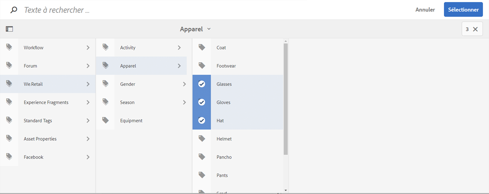

# Utilisation des balises{#using-tags}

Les balises sont un moyen simple et rapide de classer le contenu de votre site web. Les balises sont en quelque sorte des mots-clés ou des libellés qu’il est possible d’associer à une page, à une ressource ou à tout autre type de contenu, pour permettre aux fonctions de recherche de retrouver le contenu en question et son contenu associé.

* Consultez la section [Administration des balises](/help/sites-administering/tags.md) pour savoir comment créer et gérer des balises et déterminer à quel contenu elles ont été appliquées.
* Consultez la section [Balisage pour l’équipe de développement](/help/sites-developing/tags.md) pour plus d’informations sur l’environnement de balisage et sur l’inclusion et l’extension de balises dans les applications personnalisées.

## Dix raisons d’utiliser les balises {#ten-reasons-to-use-tagging}

1. **Organisation du contenu** : le balisage simplifie les activités des développeurs qui peuvent rapidement organiser le contenu, presque sans effort.
1. **Organisation des balises** : si les balises permettent d’organiser le contenu, les taxonomies/espaces de noms hiérarchiques permettent d’organiser les balises.
1. **Organisation avancée des balises** : dans la mesure où il est possible de créer des balises et des sous-balises, vous pouvez formuler des systèmes taxonomiques complets, couvrant des termes, des sous-termes, ainsi que leurs relations. Cela vous permet de créer une deuxième (ou une troisième) hiérarchie de contenu, parallèlement à la hiérarchie officielle.
1. **Balisage contrôlé** : le balisage peut être contrôlé en appliquant des autorisations aux balises ou aux espaces de noms pour contrôler la création et l’application de balises.
1. **Balisage flexible** : les balises se présentent sous de nombreuses formes et portent différents noms (balises, termes de taxonomie, catégories, libellés, etc.). Ils se distinguent par une grande souplesse au niveau de leur modèle de contenu et de leur mode d’exploitation ; par exemple, lors de la description des données démographiques cibles, de la classification et de l’évaluation du contenu, ou encore de la création d’une hiérarchie de contenu secondaire.
1. **Amélioration de la recherche** : dans AEM, le composant de recherche par défaut inclut les balises créées et les balises appliquées auxquelles des filtres peuvent être appliqués pour que seuls les résultats pertinents soient renvoyés.
1. **Optimisation pour les moteurs de recherche** : les balises appliquées sous forme de propriétés de page s’affichent automatiquement dans les métabalises de la page pour que les moteurs de recherche puissent les identifier.
1. **Utilisation simple** : les balises se créent facilement à partir d’un mot et en cliquant sur un bouton. Ensuite, un titre, une description et un nombre illimité de libellés peuvent être utilisés pour associer plus de termes à la balise.
1. **Cohérence** : le système de balisage est un composant central d’AEM. Il est utilisé par toutes les applications AEM pour catégoriser le contenu. En outre, l’API de balisage est mise à la disposition des développeurs pour leur permettre de créer des applications prenant en charge le balisage avec un accès aux mêmes taxonomies.
1. **Structuration et souplesse** : AEM est idéal pour travailler avec des informations structurées, grâce à l’imbrication des pages et des chemins d’accès. Il s’avère tout aussi puissant pour le traitement des informations non structurées grâce à sa fonctionnalité intégrée de recherche en texte intégral. Le balisage combine les avantages liés à la structuration et à la souplesse.

Lors de la conception de la structure du contenu d’un site et du schéma de métadonnées des ressources, pensez à l’approche légère et accessible qu’offre le balisage.

## Application de balises {#applying-tags}

Dans l’environnement de développement de contenu, les auteurs peuvent appliquer des balises en accédant aux propriétés de la page et en entrant une ou plusieurs balises dans le champ **Balises/Mots-clés**.

Pour appliquer les [balises prédéfinies](/help/sites-administering/tags.md), dans la fenêtre **Propriétés de la page**, utilisez le champ **Balises** et la fenêtre **Sélectionner les balises**. L’onglet **Balises standard** est l’espace de noms par défaut, ce qui signifie qu’il n’y a pas de `namespace-string:` préfixé à la taxonomie.

### Publication de balises {#publishing-tags}

Comme c’est le cas avec les pages, vous pouvez effectuer les opérations suivantes sur les tags et espaces de noms :

**Activer**

* Activez individuellement des balises.

   A l’instar des pages, les nouvelles balises doivent être activées avant d’être disponibles dans l’environnement de publication.

>[!NOTE]
>
>Lorsque vous activez une page, une boîte de dialogue s’ouvre automatiquement pour vous permettre d’activer les balises inactivées qui en font partie.

**Désactiver**

* Désactivez les balises sélectionnées.
