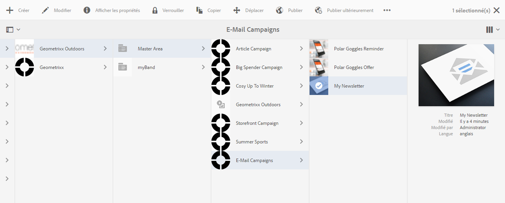
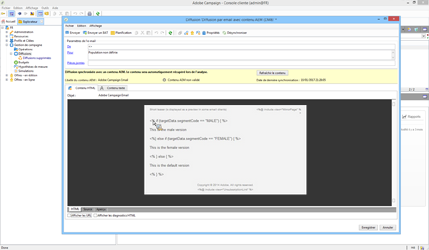

# Cibler votre campagne Adobe Campaign{#targeting-your-adobe-campaign}

Pour cibler votre newsletter Adobe Campaign, vous devez d’abord configurer la segmentation, qui n’est disponible que dans l’UI classique (pour le contexte client). Ensuite, vous pouvez créer des expériences ciblées pour Adobe Campaign. Ces deux opérations sont décrites dans cette section.

## Configurer la segmentation dans AEM {#setting-up-segmentation-in-aem}

Pour configurer la segmentation, vous devez utiliser l’UI classique pour configurer les segments. Les étapes restantes peuvent être effectuées dans l’UI standard.

La configuration de la segmentation comprend la création de segments, d’une marque, d’une campagne et d’expériences.

>[!NOTE]
>
>L’ID de segment doit être mappé sur celui du côté Adobe Campaign.

### Créer des segments {#creating-segments}

Pour créer des segments :

1. Ouvrez la [console de segmentation](http://localhost:4502/miscadmin#/etc/segmentation) à l’adresse **&lt;host>:&lt;port>/miscadmin#/etc/segmentation**.
1. Créez une page et saisissez un titre, par exemple : **Segments AC**- et sélectionnez la variable **Segment (Adobe Campaign)** modèle.
1. Sélectionnez la page créée dans l’arborescence située à gauche.
1. Créez un segment, ciblant par exemple les utilisateurs masculins, en créant une page sous le segment que vous avez créé, appelée Masculin, puis sélectionnez l’option **Segment (Adobe Campaign)** modèle.
1. Ouvrez la page de segment créée et effectuez un glisser-déposer d’un **identifiant de segment** du sidekick sur la page.
1. Double-cliquez sur la caractéristique, entrez l’ID représentant le segment Masculin défini dans Adobe Campaign, par exemple, **MASCULIN**, puis cliquez sur **OK**. Le message suivant doit apparaître : *`targetData.segmentCode == "MALE"`*
1. Répétez les étapes pour un autre segment, par exemple un segment ciblant les utilisatrices.

### Créer une marque {#creating-a-brand}

Pour créer une marque :

1. Dans **Sites**, accédez à la **Campagnes** (par exemple, dans We.Retail).
1. Cliquez sur **Créer une page** et saisissez un titre pour la page, par exemple, Marque We.Retail et sélectionnez l’événement **Marque** modèle.

### Créer une campagne {#creating-a-campaign}

Pour créer une campagne :

1. Ouvrez le **Marque** page que vous avez créée.
1. Cliquez sur **Créer une page** et saisissez un titre pour votre page, par exemple, Campagne We.Retail, puis sélectionnez le modèle **Campagne** et cliquez sur **Créer**.

### Créer des expériences {#creating-experiences}

Pour créer des expériences pour les segments :

1. Ouvrez le **Campagne** page que vous avez créée.
1. Créez des expériences pour vos segments en cliquant sur **Créer une page** et entrez le titre de la page, par exemple, Masculin puisque vous créez une expérience pour le segment Masculin, puis sélectionnez le modèle **Expérience**.
1. Ouvrez la page Expérience créée.
1. Cliquez sur **Modifier**, puis sous Segments, cliquez sur **Ajouter un élément**.
1. Entrez le chemin d’accès au segment masculin, par exemple : **/etc/segmentation/ac-segments/male** et cliquez sur **OK**. Le message suivant apparaît : *Expérience ciblée au niveau de : Masculin*.
1. Répétez les étapes précédentes pour créer une expérience pour tous les segments, par exemple la cible femme.

## Créer une newsletter avec du contenu ciblé {#creating-a-newsletter-with-targeted-content}

Après avoir créé des segments, une marque, une campagne et une expérience, vous pouvez créer une newsletter avec du contenu ciblé. Après avoir créé l’expérience, vous liez les expériences à vos segments.

>[!NOTE]
>
>[Les exemples d’e-mails ne sont disponibles que dans Geometrixx](/help/sites-developing/we-retail.md). Téléchargez un exemple de contenu de Geometrixx à partir de Package Share.

Pour créer une newsletter avec du contenu ciblé :

1. Créer une newsletter avec du contenu ciblé : sous Campagnes par e-mail en Geometrixx Outdoors, cliquez sur **Créer** > **Page**, puis sélectionnez l’un des modèles Adobe Campaign Mail.

   

1. Dans la newsletter, ajoutez des composants Texte et Personnalisation.
1. Ajoutez le texte dans les composants Texte et Personnalisation, par exemple « Newsletter par défaut. »
1. Cliquez sur la flèche située à côté de **Modifier** et sélectionnez **Ciblage**.
1. Sélectionnez votre marque dans le menu déroulant Marque et sélectionnez votre campagne. (Il s’agit de la marque et de la campagne que vous avez créées précédemment.)
1. Cliquez sur **Commencer le ciblage**. Vous voyez vos segments apparaître dans la zone Audiences. L’expérience par défaut est utilisée si aucun des segments définis ne correspond.

   >[!NOTE]
   >
   >Par défaut, les exemples d’e-mails inclus avec AEM utilisent Adobe Campaign comme moteur de ciblage. Pour les newsletters personnalisées, vous devrez peut-être sélectionner Adobe Campaign comme moteur de ciblage. Lors du ciblage, cliquez sur + dans la barre d’outils, saisissez le titre de la nouvelle activité, puis sélectionnez **Adobe Campaign** comme moteur de ciblage.

1. Cliquez sur **Par défaut**, puis sur le composant Texte et personnalisation que vous avez ajouté, et vous verrez une cible comportant une flèche. Cliquez sur l’icône pour cibler ce composant.

   

1. Accédez à un autre segment (Masculin), puis cliquez sur **Ajouter une offre** et sur l’icône +. Puis, modifiez l’offre.
1. Accédez à un autre segment (Féminin) et cliquez sur **Ajouter une offre**, puis sur l’icône +. Modifiez ensuite cette offre.
1. Cliquez sur **Suivant** pour afficher la correspondance, puis sur **Suivant** pour afficher les paramètres, ce qui ne s’applique pas à Adobe Campaign, puis cliquez sur **Enregistrer**.

   AEM génère automatiquement le code de ciblage correct pour Adobe Campaign lorsque le contenu est utilisé dans une diffusion dans Adobe Campaign.

1. Dans Adobe Campaign, créez votre diffusion : sélectionnez **Diffusion d’e-mail avec contenu AEM** et sélectionnez le compte AEM local, le cas échéant, et confirmez vos modifications.

   Dans la vue HTML, les différentes expériences des composants ciblés sont incluses dans le code de ciblage Adobe Campaign.

   

   >[!NOTE]
   >
   >Si vous configurez également les segments dans Adobe Campaign, cliquez sur **Aperçu** vous montrera les expériences de chaque segment.
