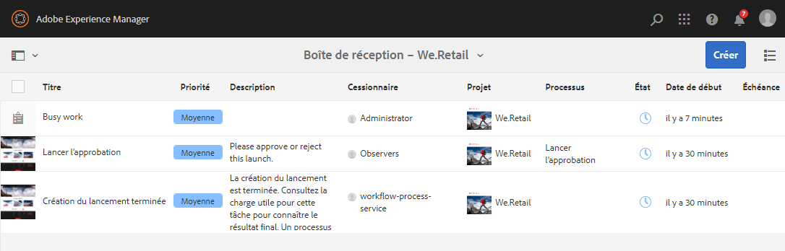

# Utilisation de tâches {#working-with-tasks}

Les tâches représentent les tâches à effectuer par rapport au contenu. Lorsqu’une tâche vous est assignée, elle apparaît dans la Boîte de réception de Workflow. Les éléments de tâche peuvent être distingués des éléments de workflow par la valeur dans la colonne **Type**.

Les tâches sont également utilisées dans les projets pour déterminer le niveau d’exhaustivité du projet.

## Suivi de la progression du projet {#tracking-project-progress}

Vous pouvez suivre la progression du projet en examinant les tâches actives/terminées dans un projet représenté par la mosaïque **Tâches**. La progression du projet peut être déterminée par les éléments suivants :

* **Mosaïque Tâches :** un statut d’avancement global du projet est présenté dans la mosaïque Tâches disponible sur la page des détails du projet.

* **Liste Tâches :** lorsque vous cliquez sur la mosaïque Tâches, la liste des tâches s’affiche. Cette liste contient des informations détaillées sur toutes les tâches liées au projet.

Ces deux options répertorient les tâches de workflow, ainsi que les tâches que vous créez directement dans la mosaïque des tâches.

### Mosaïque Tâches {#task-tile}

Si un projet contient des tâches associées, une mosaïque Tâches s’affiche au sein du projet. La mosaïque Tâches affiche le statut actuel du projet. Cet état inclut les tâches existantes dans le workflow et ne contient aucune tâche générée ultérieurement à mesure que se déroule le workflow. Les informations suivantes sont visibles dans la mosaïque de la tâche :

* Pourcentage de tâches terminées
* Pourcentage de tâches actives
* Pourcentage de tâches en retard

### Affichage ou modification des tâches dans un projet {#viewing-or-modifying-the-tasks-in-a-project}

Outre le suivi de l’avancée du projet, vous pouvez également afficher plus d’informations sur le projet ou le modifier.

#### Liste de tâches {#task-list}

Cliquez sur le bouton représentant des points de suspension en bas à droite de la mosaïque des tâches pour afficher votre boîte de réception filtrée en fonction des tâches liées au projet. Les détails de la tâche s’affichent avec les métadonnées, comme la date d’échéance, la personne désignée, la priorité et le statut.

#### Détails de la tâche {#task-details}

Pour plus d’informations sur une tâche particulière, dans la boîte de réception, cliquez sur la tâche pour la sélectionner, puis sur **Ouvrir** dans la barre d’outils.

Vous pouvez afficher, modifier ou ajouter des informations dans la tâche via différents onglets.

* **Tâche** - Informations générales sur les tâches
* **Informations sur le projet** - Résumé du projet auquel la tâche est associée
* **Informations sur le workflow** - Résumé du workflow associé à la tâche (le cas échéant)
* **Commentaires** - Commentaires généraux sur la tâche elle-même

### Ajout de tâches {#adding-tasks}

Vous pouvez ajouter de nouvelles tâches aux projets. Ces tâches apparaissent ensuite dans la mosaïque Tâches et sont disponibles dans la boîte de réception des notifications afin que vous sachiez quelles sont vos tâches en suspens.

Pour ajouter une tâche, procédez comme suit :

1. Dans le projet, recherchez la mosaïque **Tâches**.
1. Cliquez sur le chevron descendant en haut à droite de la mosaïque et sélectionnez **Créer une tâche**.
1. Dans la fenêtre **Ajouter une tâche**, fournissez les informations sur la tâche, telles que la priorité, la personne désignée et la date d’échéance.

   

1. Cliquez sur **Envoyer**.

## Utilisation des tâches dans la boîte de réception {#working-with-tasks-in-the-inbox}

Au lieu d’accéder aux tâches de votre projet à partir du projet lui-même, vous pouvez y accéder directement à partir de votre boîte de réception. Votre boîte de réception vous donne un aperçu de vos tâches dans l’ensemble des projets afin que vous puissiez comprendre l’ensemble de votre workflow.

Dans la boîte de réception, vous pouvez ouvrir les tâches et définir le statut de la tâche. Les tâches s’affichent également dans votre boîte de réception lorsqu’elles sont affectées à un groupe de personnes auquel vous appartenez. Dans ce cas, tout membre du groupe peut effectuer le travail et terminer la tâche.

Pour terminer une tâche, sélectionnez la tâche et cliquez sur **Terminé** dans la barre d’outils. Ajoutez des informations à la tâche, puis cliquez sur **Terminé**. Voir [Votre boîte de réception](/help/sites-authoring/inbox.md) pour plus d’informations.
