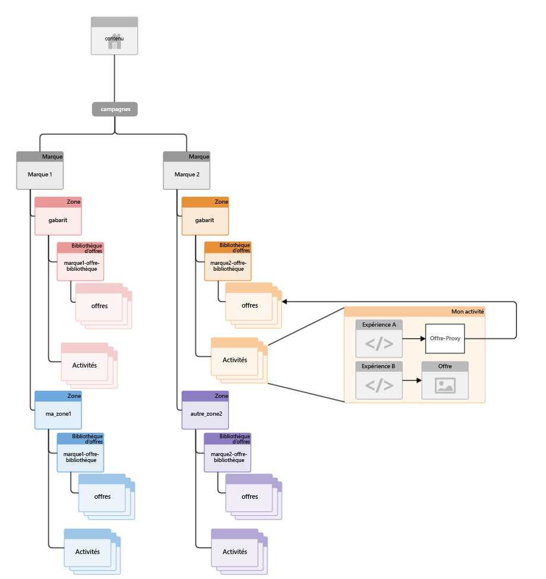
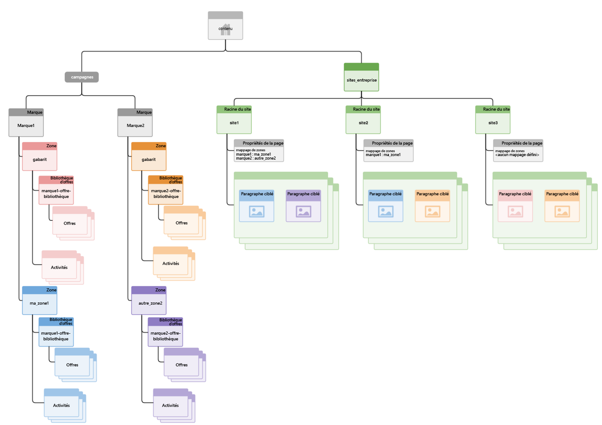

# Structuration de la gestion multisite du contenu ciblé{#how-multisite-management-for-targeted-content-is-structured}

Le diagramme suivant indique comment est structurée la prise en charge multisite du contenu ciblé.

Les zones apparaissent sous **/content/campaigns/&lt;marque>** et par défaut chaque marque comporte une zone maître, qui est créée automatiquement. Chaque zone contient son propre ensemble d’activités, d’expériences et d’offres.

Pour consulter du contenu ciblé, les pages ou les sites peuvent être mappés à une zone. Si aucune zone n’est configurée, AEM utilise la zone maître de cette marque spécifique.

Le diagramme suivant illustre le fonctionnement de la logique pour trois sites, nommés site1, site2 et site3.

* Le site1 consulte mazone1 pour la marque1 et l’autrezone2 pour la marque2 en fonction du mappage de zone.
* Le site2 consulte mazone1 pour la marque1 et la zone maître pour la marque2, car seul le mappage de zone de la zone1 est défini.
* Le site3 consulte la zone maître de la marque1 et de la marque2, car aucun autre mappage de zone n’est défini pour ce site.

