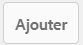
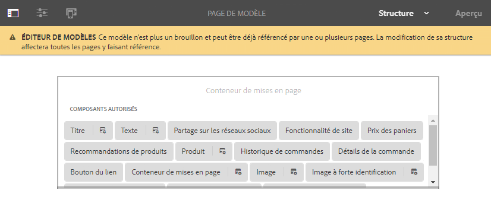
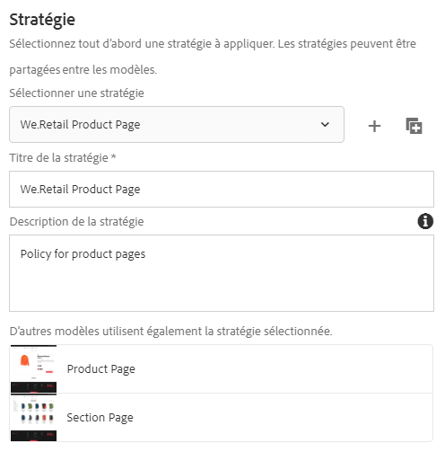
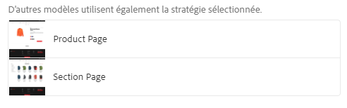
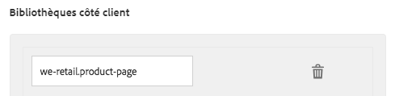
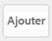

# Création de modèles de page{#creating-page-templates}

Lors de la création d’une page, vous devez sélectionner un modèle, qui est utilisé comme base pour créer la page. Le modèle définit la structure de la page créée, le contenu initial éventuel et les composants qui peuvent être utilisés.

Grâce à **Éditeur de modèles**, la création et la maintenance de modèles ne sont plus des tâches réservées aux développeurs. Un type d’utilisateur avancé, appelé **auteur de modèles**, peut également être impliqué. Les développeurs doivent encore configurer l’environnement, créer des bibliothèques clientes et créer les composants à utiliser. Cependant, une fois ces bases en place, l’**auteur de modèles** peut créer et configurer des modèles sans projet de développement.

La **Console de modèles** permet aux auteurs et autrices de modèles de :

* Créez un modèle ou copiez un modèle existant.
* Gérer le cycle de vie du modèle.

L’**Éditeur de modèles** permet aux auteurs et autrices de modèles de :

* Ajouter des composants au modèle et les positionner sur une grille réactive.
* de préconfigurer les composants ;
* Définir les composants qui peuvent être modifiés sur les pages créées avec le modèle.

Ce document explique comment un **auteur ou une autrice de modèles** peut utiliser la console de modèles et l’éditeur pour créer et gérer des modèles modifiables.

Pour plus d’informations sur le fonctionnement des modèles modifiables à un niveau technique, consultez le document destiné aux développeurs . [Modèles de page - Modifiables](/help/sites-developing/page-templates-editable.md) pour plus d’informations.

>[!NOTE]
>
>L’**éditeur de modèles** ne prend pas en charge le ciblage directement au niveau du modèle. Les pages créées à partir d’un modèle modifiable peuvent être ciblées, mais les modèles eux-mêmes ne le peuvent pas.

>[!CAUTION]
>
>Les pages et les modèles créés à l’aide de la **console de modèles** ne sont pas conçus pour être utilisés dans l’IU classique. Cette utilisation n’est pas prise en charge.

## Avant de commencer {#before-you-start}

>[!NOTE]
>
>Un administrateur doit configurer un dossier de modèles dans le **navigateur des configurations** et appliquer les autorisations appropriées permettant au créateur de modèles de créer un modèle dans ce dossier.

Il est important de tenir compte des points suivants avant de commencer :

* La création d’un modèle nécessite une collaboration. Pour cette raison, le [rôle](#roles) est indiqué pour chaque tâche.

* En fonction de la configuration de votre instance, AEM fournit désormais [deux types de modèle de base](/help/sites-authoring/templates.md#editable-and-static-templates). Cela n’a aucune incidence sur la manière dont vous [utilisez un modèle pour créer une page](#using-a-template-to-create-a-page), mais cela a un impact sur le type de modèle que vous pouvez créer et sur la façon dont une page est liée à son modèle.

### Rôles {#roles}

Création d’un modèle à l’aide du **Console de modèles** et la variable **Éditeur de modèles** nécessite une collaboration entre les rôles suivants :

* **Administrateur** :

   * La création d’un dossier pour les modèles nécessite des droits `admin`.

   * Ces tâches peuvent souvent être aussi effectuées par un développeur ou une développeuse.

* **Développeur** :

   * Se concentre sur les détails techniques/internes
   * Requiert une expérience de l’environnement de développement.
   * Fournit au créateur de modèles les informations nécessaires.

* **Créateur de modèles** :

   * Il s’agit d’un créateur particulier qui est membre du groupe `template-authors`

      * Ce groupe affecte les privilèges et les autorisations nécessaires.

   * Peut configurer l’utilisation de composants et d’autres détails de haut niveau qui nécessitent les éléments suivants :

      * Quelques connaissances techniques

         * Par exemple, l’utilisation de modèles lors de la définition de chemins.

      * Des informations techniques provenant du développeur.

En raison de la nature de certaines tâches, telles que la création d’un dossier, un environnement de développement est nécessaire, lequel nécessite des connaissances/de l’expérience.

Les tâches présentées dans ce document sont répertoriées avec le rôle responsable de leur exécution.

### Modèles modifiables et statiques {#editable-and-static-templates}

AEM propose désormais deux types de modèles de base :

* [Modèles modifiables](/help/sites-authoring/templates.md#creatingandmanagingnewtemplates)

   * Peuvent être [créés](#creatinganewtemplate) et [modifiés](#editingatemplate) à l’aide de la **console de modèles** et de l’éditeur de modèles. La **console de modèles** est accessible dans la section **Général** de la console **Outils**. 

   * Une fois la page créée, une connexion dynamique est maintenue entre la page et le modèle. Cela signifie que les modifications apportées à la structure du modèle et/ou au contenu verrouillé seront répercutées sur toutes les pages créées avec ce modèle. Les modifications apportées au contenu déverrouillé (c’est-à-dire initial) ne sont pas répercutées.
   * Pour conserver les propriétés de conception, utilisez des politiques de contenu que vous pouvez définir à partir de l’éditeur de modèles. Le mode de conception de l’éditeur de page n’est plus utilisé pour les modèles modifiables.

* Modèles statiques

   * Ces modèles sont disponibles dans différentes versions d’AEM.
   * Ils sont [fournis par l’équipe de développement](/help/sites-developing/page-templates-static.md), et ne peuvent pas être créés ou modifiés par les créateurs.
   * Ils sont copiés pour créer la page. Il n’y a ensuite aucune connexion dynamique (même si le nom du modèle est enregistré pour information).
   * Utilisez le [mode Création](/help/sites-authoring/default-components-designmode.md) pour conserver les propriétés de conception.
   * La modification des modèles statiques étant la tâche exclusive d’un développeur, reportez-vous au document destiné aux développeurs. [Modèles de page - Statiques](/help/sites-developing/page-templates-static.md) pour plus d’informations.

Par définition, la console de modèles et l’éditeur de modèles permettent uniquement la création et l’édition de modèles modifiables. Par conséquent, ce document traite exclusivement des modèles modifiables.

### Utiliser un modèle pour créer une page {#using-a-template-to-create-a-page}

Lorsque vous utilisez un modèle pour [création d’une page](/help/sites-authoring/managing-pages.md#creating-a-new-page) il n’existe aucune différence visible et aucune indication entre les modèles statiques et modifiables. Pour la création de pages, le processus est transparent.

## Création et gestion des modèles {#creating-and-managing-templates}

Lors de la création d’un modèle modifiable :

* Utilisez la variable **Modèle** console. Cette option est disponible dans la **Général** de la **Outils** console.

   * Ou directement à l’adresse : [https://localhost:4502/libs/wcm/core/content/sites/templates.html/conf](https://localhost:4502/libs/wcm/core/content/sites/templates.html/conf)

* Si besoin, vous pouvez [créer un dossier pour les modèles](#creating-a-template-folder-admin).
* [Créer un modèle](#creatinganewtemplateauthor), initialement vide

* [Définition de propriétés supplémentaires](#definingtemplatepropertiesauthor) pour le modèle, si nécessaire
* [Modifiez le modèle](#editingtemplates) pour définir :

   * [Structure](#editingatemplatestructureauthor) : contenu prédéfini ne pouvant pas être modifié dans les pages créées avec le modèle.
   * [Contenu initial](#editing-a-template-initial-content-author) : contenu prédéfini pouvant être modifié dans les pages créées avec le modèle.
   * [Mise en page](#editingatemplatelayoutauthor) : pour de nombreux appareils.
   * [Styles](/help/sites-authoring/style-system.md) : définissez les styles à utiliser avec le modèle et ses composants.

* [Activer le modèle](#enablingatemplateauthor) à utiliser lors de la création d’une page
* [Autoriser le modèle](#allowing-a-template-author) pour la page ou la branche requise de votre site web
* [Publier le modèle](#publishingatemplateauthor) pour le rendre disponible dans l’environnement de publication

>[!NOTE]
>
>Les **modèles autorisés** sont souvent prédéfinis lors de la configuration initiale de votre site web.

>[!CAUTION]
>
>Ne saisissez jamais d’informations qui doivent être [internationalisées](/help/sites-developing/i18n.md) dans un modèle. Pour l’internalisation, il est recommandé d’utiliser les [fonctions de localisation des composants principaux](https://experienceleague.adobe.com/docs/experience-manager-core-components/using/get-started/localization.html?lang=fr).

### Création d’un dossier de modèles - Administrateur {#creating-a-template-folder-admin}

Vous devez créer un dossier de modèles pour votre projet afin de contenir les modèles spécifiques au projet. Il s’agit d’une tâche administrative qui est décrite dans le document [Modèles de page - Modifiables](/help/sites-developing/page-templates-editable.md#template-folders).

### Création d’un modèle - Créateur de modèles {#creating-a-new-template-template-author}

1. Ouvrez le **Console de modèles** (via **Outils >** **Général**), puis accédez au dossier requis.

   >[!NOTE]
   >
   >Dans une instance AEM standard, le dossier **Global** existe déjà dans la console de modèles. Il contient les modèles par défaut et fait office de dossier de rechange si le dossier actif ne contient pas de politiques et/ou de types de modèles.
   >
   >
   >Il est recommandé d’utiliser un [dossier de modèles créé pour votre projet](/help/sites-developing/page-templates-editable.md#template-folders).

1. Pour ouvrir l’Assistant, sélectionnez **Créer**, puis **Créer un modèle**.

1. Sélectionnez un **Type de modèle**, puis choisissez **Suivant**.

   >[!NOTE]
   >
   >Les types de modèle sont des mises en page de modèle prédéfinies qui peuvent être considérées comme des modèles pour un modèle. Ils sont prédéfinis par les développeurs ou développeuses ou l’administrateur ou administratrice système. Vous trouverez plus d’informations à ce sujet dans le document [Modèles de page - Modifiables](/help/sites-developing/page-templates-editable.md#template-type) destiné aux développeurs et développeuses.

1. Indiquez les **Détails du modèle** :

   * **Nom du modèle**
   * **Description**

1. Sélectionnez **Créer**. Une confirmation s’affiche, sélectionnez **Ouvrir** pour commencer [modification du modèle](#editingatemplate) ou **Terminé** pour revenir à la console de modèles.

   >[!NOTE]
   >
   >Lorsque vous créez un modèle, il est marqué comme **Brouillon** dans la console pour indiquer qu’il n’est pas encore actif.

### Définition des propriétés des modèles - Créateur de modèles  {#defining-template-properties-template-author}

Un modèle peut avoir les propriétés suivantes :

* Image

   * Image à utiliser comme [miniature du modèle](/help/sites-authoring/templates.md#template-thumbnail-image) pour faciliter la sélection, par exemple dans l’assistant Créer une page.

      * Peut être chargé
      * Peut être générée en fonction du contenu du modèle

* Titre

   * Titre utilisé pour identifier le modèle, comme dans l’assistant **Créer une page**.

* Description

   * Description facultative permettant de fournir plus d’informations sur le modèle et son utilisation. Elle peut être affichée, par exemple, dans la variable **Créer une page** assistant.

Pour afficher et/ou modifier les propriétés :

1. Dans la **console de modèles**, sélectionnez le modèle.
1. Sélectionnez **Afficher les propriétés** dans la barre d’outils ou les options rapides pour ouvrir la boîte de dialogue.
1. Vous pouvez maintenant afficher ou modifier les propriétés du modèle.

>[!NOTE]
>
>Les modèles sont des outils puissants pour rationaliser votre processus de création de page. Cependant, un nombre excessif de modèles peut submerger les auteurs et semer la confusion dans la création de pages. Une bonne règle d’or consiste à maintenir le nombre de modèles au-dessous de 100.
>
>Adobe ne recommande pas d’avoir plus de 1 000 modèles en raison des impacts potentiels sur le rendement.

>[!NOTE]
>
>Le statut du modèle (brouillon, activé ou désactivé) est indiqué dans la console.

#### Miniature du modèle {#template-thumbnail-image}

Pour définir la miniature du modèle :

1. Modifiez les propriétés du modèle.
1. Choisissez si vous souhaitez charger une miniature ou la générer à partir du contenu du modèle.

   * Si vous souhaitez télécharger une miniature, cliquez sur **Télécharger l’image**
   * Si vous souhaitez générer une miniature, cliquez sur **Générer l’aperçu**

1. Pour les deux méthodes, un aperçu de la miniature s’affiche.

   Si ce n’est pas le cas, cliquez sur **Effacer** pour charger une autre image ou générer à nouveau la miniature.

1. Lorsque la miniature vous satisfait, cliquez sur **Enregistrer et fermer**.

### Activation et autorisation d’un modèle – Créateur de modèles {#enabling-and-allowing-a-template-template-author}

Pour utiliser un modèle lors de la création d’une page, vous devez effectuer les deux tâches suivantes :

* [Activer le modèle](#enablingatemplate) : permet de le rendre disponible lors de la création de pages.
* [Autoriser le modèle](#allowingatemplate) : permet de spécifier les branches de contenu dans lesquelles le modèle peut être utilisé.

#### Activation d’un modèle - Créateur de modèles {#enabling-a-template-template-author}

Un modèle peut être activé ou désactivé afin de le rendre disponible ou indisponible dans l’assistant **Créer une page**.

>[!CAUTION]
>
>Une fois qu’un modèle est activé, un avertissement s’affiche lorsqu’un auteur ou une autrice de modèle commence à le mettre à jour. Cela permet d’informer l’utilisateur ou l’utilisatrice que le modèle peut être référencé. Toute modification peut donc avoir une incidence sur les pages qui le référencent.

1. Dans la **console de modèles**, sélectionnez le modèle.
1. Sélectionnez **Activer** ou **Désactiver** dans la barre d’outils, puis de nouveau dans la boîte de dialogue de confirmation.
1. Vous pouvez désormais utiliser votre modèle lorsque [créer une page](/help/sites-authoring/managing-pages.md#creating-a-new-page), même si vous souhaitez probablement [modifier le modèle ;](#editingatemplate) selon vos besoins.

>[!NOTE]
>
>Le statut du modèle (brouillon, activé ou désactivé) est indiqué dans la console.

#### Autorisation d’un modèle - Créateur {#allowing-a-template-author}

Un modèle peut être rendu disponible ou indisponible pour certaines branches de la page.

1. Ouvrez [Propriétés de la page](/help/sites-authoring/editing-page-properties.md) pour la page principale de la branche dans laquelle vous souhaitez que le modèle soit disponible.

1. Ouvrez l’onglet **Avancé**.

1. Sous **Paramètres du modèle**, utilisez **Ajouter un champ** pour spécifier le ou les chemins d’accès vers vos modèles.

   Le chemin d’accès peut être explicite ou utiliser des modèles. Par exemple :

   `/conf/<your-folder>/settings/wcm/templates/.*`

   L’ordre des chemins n’est pas important, tous les chemins sont analysés et tous les modèles sont récupérés.

   >[!NOTE]
   >
   >Si la liste **Modèles autorisés** est vide, l’arborescence est ascendante jusqu’à ce qu’une valeur/liste soit trouvée.
   >
   >
   >Voir [Disponibilité des modèles](/help/sites-developing/templates.md#template-availability) : les principes des modèles autorisés restent identiques.

1. Cliquez sur **Enregistrer** pour enregistrer les modifications apportées aux propriétés de la page.

>[!NOTE]
>
>Souvent, les modèles autorisés sont prédéfinis pour le site entier lorsqu’il est configuré.

### Publication d’un modèle - Créateur de modèles {#publishing-a-template-template-author}

Dans la mesure où il est référencé lors du rendu d’une page, le modèle (totalement configuré) doit être publié afin d’être disponible dans l’environnement de publication.

1. Dans la **console de modèles**, sélectionnez le modèle.
1. Sélectionnez **Publier** dans la barre d’outils pour ouvrir l’Assistant.
1. Sélectionnez les **Politiques de contenu** à publier en tandem.

1. Sélectionnez **Publier** dans la barre d’outils pour terminer l’action.

## Modification de modèles - Créateurs de modèles {#editing-templates-template-authors}

Lors de la création ou de la modification d’un modèle, vous pouvez définir différents aspects. La modification de modèles est similaire à la création de pages.

Les aspects suivants d’un modèle peuvent être modifiés :

* [Structure](#editingatemplatestructure)

  Les composants ajoutés ici ne peuvent pas être déplacés/supprimés dans les pages créées par les auteurs ou autrices de pages. Si vous souhaitez que les créateurs de pages puissent ajouter et supprimer des composants aux pages créées, vous devez ajouter un système de paragraphes dans le modèle.

  Lorsque les composants sont verrouillés, vous pouvez ajouter du contenu qui ne pourra pas être modifié par les auteurs ou autrices de pages. Vous pouvez déverrouiller des composants pour vous permettre de définir un [Contenu initial](#editingatemplateinitialcontent).

  >[!NOTE]
  >
  >En mode Structure, les composants qui sont le parent d’un composant déverrouillé ne peuvent pas être déplacés, coupés ni supprimés.

* [Contenu initial](#editingatemplateinitialcontent)

  Lorsqu’un composant a été déverrouillé, vous pouvez définir le contenu initial qui sera copié dans les pages créées à partir du modèle. Ces composants déverrouillés peuvent être modifiés dans les pages créées.

  >[!NOTE]
  >
  >En mode **Contenu initial** (et dans les pages créées), les composants déverrouillés qui possèdent un parent accessible (c’est-à-dire, les composants dans un conteneur de mises en page) peuvent être supprimés.

* [Disposition](#editingatemplatelayout)

  Vous pouvez prédéfinir la mise en page du modèle pour les formats de disposition de votre choix. Le mode **Disposition** pour la création de modèles comporte la même fonctionnalité que le mode [**Disposition** pour la création de pages](/help/sites-authoring/responsive-layout.md#defining-layouts-layout-mode).

* [Politiques de page](#editingatemplatepagepolicies)

  Dans le cadre des politiques de page, vous pouvez relier des politiques de page prédéfinies à la page. Ces politiques de page définissent les différentes configurations de conception.

* [Styles](/help/sites-authoring/style-system.md)

  Le système de style permet à un auteur de modèles de définir des classes de style dans la politique de contenu d’un composant, de façon à pouvoir sélectionner ces classes lors de la modification du composant sur une page. Ces styles peuvent être des variantes visuelles d’un composant, le rendant ainsi plus flexible.

  Pour plus d’informations, voir la [documentation sur le système de style](/help/sites-authoring/style-system.md).

Le sélecteur **Mode** de la barre d’outils permet de sélectionner et de modifier l’aspect approprié du modèle :

* [Structure](#editingatemplatestructure)
* [Contenu initial](#editingatemplateinitialcontent)
* [Mise en page](#editingatemplatelayout)

Tandis que l’option **Politique de page** du menu **Informations sur la page** vous permet de [sélectionner les politiques de page requises](#editingatemplatepagepolicies) :

>[!CAUTION]
>
>Si un auteur ou une autrice commence à modifier un modèle qui a déjà été activé, un avertissement s’affiche. Cela permet d’informer l’utilisateur ou l’utilisatrice que le modèle peut être référencé. Toute modification peut donc avoir une incidence sur les pages qui le référencent.

### Modification d’un modèle - Structure - Créateur de modèles {#editing-a-template-structure-template-author}

En mode **Structure**, vous définissez les composants et le contenu de votre modèle, ainsi qu’une politique pour le modèle et ses composants.

* Les composants définis dans la structure du modèle ne peuvent pas être déplacés sur une page créée ni supprimés des pages créées.
* Si vous souhaitez que les personnes créant les pages puissent ajouter et supprimer des composants, ajoutez un système de paragraphes au modèle.
* Les composants peuvent être déverrouillés (et reverrouillés) pour que vous puissiez définir le [contenu initial](#editingatemplateinitialcontent).

* Les politiques de conception des composants et de la page sont définies.

Dans le mode **Structure** de l’éditeur de modèles :

* **Ajouter des composants**

  Plusieurs mécanismes permettent d’ajouter des composants au modèle :

   * Dans le navigateur **Composants** du panneau latéral.
   * En utilisant l’option **Insérer le composant** (icône **+**) disponible dans la barre d’outils des composants figurant déjà dans le modèle ou la zone **Faire glisser les composants ici**.

   * En faisant glisser une ressource (à partir du navigateur **Ressources** du panneau latéral) directement sur le modèle pour générer le composant approprié in situ.

  Une fois ajouté, chaque composant est marqué par :

   * Une bordure
   * Une marque pour afficher le type de composant
   * Une marque indiquant le moment où le composant a été déverrouillé

  >[!NOTE]
  >
  >Lorsque vous ajoutez un composant **Titre** prêt à l’emploi au modèle, il contient le texte **structure** par défaut.
  >
  >
  >Si vous le modifiez et que vous ajoutez votre propre texte, le texte mis à jour est utilisé pour les pages créées à partir du modèle.
  >
  >
  >Si vous laissez le texte par défaut (structure), le titre propose par défaut le nom de la page suivante.

  >[!NOTE]
  >
  >Même si l’ajout de composants et de ressources à un modèle n’est pas identique à des actions comparables lors de la [création de pages](/help/sites-authoring/editing-content.md), il présente de nombreuses similitudes avec ces actions.

* **Actions des composants**

  Agissez sur les composants une fois qu’ils ont été ajoutés au modèle. Chaque instance individuelle dispose d’une barre d’outils qui permet d’accéder aux actions disponibles. La barre d’outils dépend du type de composant.

  

  Elle peut également dépendre des actions exécutées. Par exemple, lorsqu’une politique a été associée au composant, l’icône de configuration de la conception est disponible.

* **Modification et configuration**

  Avec ces deux actions, vous pouvez ajouter du contenu aux composants.

* **Bordure indiquant la structure**

  Lorsque vous travaillez en mode **Structure**, une bordure orange signale le composant actuellement sélectionné. Une ligne pointillée indique également le composant parent.

  Par exemple, sur la capture d’écran ci-dessous, le composant **Texte** est sélectionné, dans un **Conteneur de mise en page** (responsivegrid). 

  

* **Politique et propriétés (générales)**

  Les politiques de contenu (ou de conception) définissent les propriétés de conception d’un composant. Par exemple, les composants disponibles ou les dimensions minimales/maximales. Elles s’appliquent au modèle (et aux pages créées avec le modèle).

  Créez une politique de contenu ou sélectionnez-en une existante pour un composant. Cela permet de définir les détails de la conception.

   

  La fenêtre de configuration est divisée en deux.

   * Dans la partie gauche de la boîte de dialogue, sous **Politique**, vous avez la possibilité de sélectionner une politique existante.
   * Dans la partie droite de la boîte de dialogue, sous **Propriétés**, vous pouvez définir les propriétés spécifiques au type de composant.

  Les propriétés disponibles dépendent du composant sélectionné. Par exemple, pour un composant de texte, les propriétés définissent les options de copier-coller, de mise en forme et de style de paragraphe, entre autres options.

  ***Politique***

  Les politiques de contenu (ou de conception) définissent les propriétés de conception d’un composant. Par exemple, les composants disponibles ou les dimensions minimales/maximales. Elles s’appliquent au modèle (et aux pages créées avec le modèle).

  Sous **Politique**, vous pouvez sélectionner, dans le menu déroulant, une politique à appliquer au composant.

  

  Vous pouvez ajouter une nouvelle politique en sélectionnant le bouton d’ajout en regard du menu déroulant **Sélectionner une politique**. Vous devez ensuite attribuer un nouveau titre dans le champ **Titre de la politique**.

  

  La politique existante sélectionnée dans le menu déroulant **Sélectionner une politique** peut être copiée comme nouvelle politique à l’aide du bouton de copie en regard du menu déroulant. Vous devez ensuite attribuer un nouveau titre dans le champ **Titre de la politique**. Par défaut, la politique copiée sera intitulée **Copie de X**, X étant le titre de la politique copiée.

  

  Vous pouvez saisir la description de la politique dans le champ **Description de la politique** (facultatif).

  Dans la section **D’autres modèles utilisent également la politique sélectionnée**, vous pouvez facilement voir les autres modèles qui utilisent la politique sélectionnée dans le menu déroulant **Sélectionner une politique**.

  

  >[!NOTE]
  >
  >Si plusieurs composants du même type sont ajoutés comme contenu initial, la même politique s’applique à tous les composants. Cela correspond à la même restriction en [**mode Création** que pour les modèles statiques](/help/sites-authoring/default-components-designmode.md).

  ***Propriétés***

  Sous le titre **Propriétés**, vous pouvez définir les paramètres du composant. Le titre comporte deux onglets :

   * Principal
   * Fonctions

  *Principal*

  L’onglet **Principal** définit les paramètres les plus importants du composant.

  Par exemple, pour un composant d’image, les largeurs autorisées peuvent être définies, ainsi que l’activation du chargement différé.

  Si un paramètre permet plusieurs configurations, cliquez sur le bouton **Ajouter** pour ajouter une autre configuration.

  

  Pour supprimer une configuration, cliquez sur le bouton **Supprimer** situé à droite de la configuration.

  Pour supprimer une configuration, cliquez sur le bouton ** Supprimer**.

  

  *Fonctionnalités*

  L’onglet **Fonctions** permet d’activer ou de désactiver des fonctions supplémentaires du composant.

  Par exemple, pour un composant d’image, vous pouvez définir les proportions de recadrage et les orientations d’image autorisées, puis indiquer si les chargements sont autorisés.

  

  >[!CAUTION]
  >
  >Remarque : Dans AEM, les rapports de recadrage sont définis sous forme de **hauteur/largeur**. Cela diffère de la définition conventionnelle de la largeur/hauteur, à des fins de compatibilité avec les versions héritées. Les utilisateurs de la création de pages ne percevront aucune différence à condition que vous définissiez clairement le **Nom**, car c’est ce dernier qui s’affiche dans l’interface utilisateur.

  >[!NOTE]
  >
  >[Stratégies de contenu pour les composants implémentant l’éditeur de texte enrichi](/help/sites-administering/rich-text-editor.md#main-pars-header-206036638) ne peut être défini que pour les options rendues disponibles par l’éditeur de texte enrichi via ses paramètres d’interface utilisateur.  

* **Politique et propriétés (conteneur de mise en page)**

  Les paramètres de politique et de propriétés d’un conteneur de mises en page sont similaires à ceux généralement utilisés, à quelques différences près.

  >[!NOTE]
  >
  >La configuration d’une politique est obligatoire pour les composants de conteneur, car elle permet de définir les composants qui seront disponibles dans le conteneur.

  La fenêtre de configuration est divisée en deux, comme dans les cas d’utilisation générale de la fenêtre.

  ***Politique***

  Les politiques de contenu (ou de conception) définissent les propriétés de conception d’un composant. Par exemple, les composants disponibles ou les dimensions minimales/maximales. Elles s’appliquent au modèle (et aux pages créées avec le modèle).

  Sous **Politique**, vous pouvez sélectionner, dans le menu déroulant, une politique à appliquer au composant. Cela fonctionne exactement comme dans l’utilisation générale de la fenêtre.

  ***Propriétés***

  Sous le titre **Propriétés**, vous pouvez choisir les composants disponibles pour le conteneur de mises en page et définir leurs paramètres. Le titre se compose de trois onglets :

   * Composants autorisés
   * Composants par défaut
   * Paramètres réactifs

  *Composants autorisés*

  Dans l’onglet **Composants autorisés**, vous définissez les composants disponibles pour le conteneur de mises en page.

   * Les composants sont regroupés par groupes de composants, qui peuvent être développés et réduits.
   * Vous pouvez sélectionner un groupe entier en cochant le nom du groupe et tout peut être désélectionné en décochant la case.
   * Un signe moins représente au moins un élément, mais tous les éléments d’un groupe ne sont pas sélectionnés.
   * Une recherche est disponible pour filtrer un composant par nom.
   * Les nombres répertoriés à droite du nom du groupe de composants représentent le nombre total de composants sélectionnés dans ces groupes, quel que soit le filtre.

  

  *Composants par défaut*

  Dans l’onglet **Composants par défaut**, vous définissez les composants qui sont automatiquement associés à des types de médias donnés. Ainsi, lorsqu’un créateur fait glisser une ressource depuis le navigateur des ressources, AEM sait avec quel composant l’associer. Notez que seuls les composants avec des zones de dépôt sont disponibles pour cette configuration.

  Cliquez sur **Ajouter un mappage** pour ajouter un nouveau mappage de composant et de type MIME.

  Sélectionnez un composant dans la liste, puis cliquez sur **Ajouter un type** pour ajouter un type MIME supplémentaire à un composant déjà mappé. Cliquez sur l’icône **Supprimer** pour supprimer un type MIME.

  

  *Paramètres réactifs*

  Dans l’onglet **Paramètres réactifs**, vous pouvez configurer le nombre de colonnes de la grille résultante du conteneur de mise en page.

* **Déverrouiller/verrouiller des composants**

  Vous déverrouillez/verrouillez des composants pour définir si le contenu peut être modifié dans le mode **Contenu initial**.

  Lorsqu’un composant a été déverrouillé :

   * Un indicateur de cadenas ouvert s’affiche dans la bordure.
   * La barre d’outils du composant sera ajustée en conséquence.
   * Le contenu déjà saisi ne s’affichera plus en mode **Structure**.

      * Le contenu déjà saisi est considéré comme du contenu initial et n’est visible qu’en mode **Contenu initial**.

   * Les parents du composant déverrouillé ne peuvent être ni déplacés, ni coupés, ni supprimés.

  

  Cela comprend le déverrouillage des composants de conteneur afin que d’autres composants puissent être ajoutés, soit en mode **Contenu initial**, soit sur les pages résultantes. Si vous avez déjà ajouté des composants/du contenu au conteneur avant de le déverrouiller, ceux-ci ne s’affichent plus lorsque dans **Structure** , mais elles s’affichent dans **Contenu initial** mode . En mode **Structure**, seul le composant de conteneur est affiché avec sa liste de **Composants autorisés**.

  

  Pour économiser de l’espace, le conteneur de mise en page ne se développe pas pour s’adapter à la liste des composants autorisés. En revanche, le conteneur se transforme en liste déroulante.

  Les composants configurables s’affichent avec une icône **Politique**, sur laquelle vous pouvez appuyer ou cliquer pour modifier la politique et les propriétés de ce composant.

  

* **Relation avec les pages existantes**

  Si la structure est mise à jour après la création de pages en fonction du modèle, ces pages répercutent les modifications apportées au modèle. Un avertissement, ainsi que des boîtes de dialogue de confirmation, s’affichent dans la barre d’outils pour vous rappeler cette répercussion.

  

### Modification d’un modèle - Contenu initial - Créateur {#editing-a-template-initial-content-author}

Le mode **Contenu initial** est utilisé pour définir le contenu qui s’affichera lors de la première création d’une page en fonction du modèle. Le contenu initial peut ensuite être modifié par les auteurs et autrices de pages.

Même si l’ensemble du contenu créé en mode **Structure** est visible en mode **Contenu initial**, seuls les composants déverrouillés peuvent être sélectionnés et modifiés.

>[!NOTE]
>
>Le mode **Contenu initial** peut être envisagé comme mode d’édition pour les pages créées avec ce modèle. Par conséquent, les politiques ne sont pas définies en mode **Contenu initial**, mais plutôt en mode [**Structure**](/help/sites-authoring/templates.md#editing-a-template-structure-template-author).

* Les composants déverrouillés pouvant être modifiés sont marqués. Lorsqu’ils sont sélectionnés, ils affichent une bordure bleue :

  

* Les composants déverrouillés comportent une barre d’outils permettant de modifier et de configurer le contenu :

  

* Si un composant de conteneur a été déverrouillé (en mode **Structure**), vous pouvez ajouter de nouveaux composants au conteneur (en mode **Contenu initial**). Les composants ajoutés en mode **Contenu initial** peuvent être déplacés ou supprimés dans les pages créées.

  Vous pouvez ajouter le composant à l’aide de la zone **Faire glisser les composants ici** ou de l’option **Insérer un nouveau composant** de la barre d’outils du conteneur approprié.

   

* Si le contenu initial du modèle est mis à jour après la création des pages en fonction du modèle, ces pages ne seront pas affectées par les modifications apportées au contenu initial du modèle.

>[!NOTE]
>
>Le contenu initial est destiné à préparer les composants et la mise en page, point de départ de la création du contenu. Il n’est pas destiné à constituer un contenu réel laissé tel quel. Pour cette raison, le contenu initial ne peut pas être traduit.
>
>Si vous devez inclure du texte traduisible dans votre modèle, par exemple dans les en-têtes ou les pieds de page, vous pouvez utiliser les [fonctions de localisation des composants principaux](https://experienceleague.adobe.com/docs/experience-manager-core-components/using/get-started/localization.html?lang=fr).

### Modification d’un modèle - Disposition - Créateur de modèles {#editing-a-template-layout-template-author}

Vous pouvez définir la disposition du modèle pour différents appareils. La [mise en page réactive](/help/sites-authoring/responsive-layout.md) pour les modèles fonctionne de la même manière que pour la création de pages.

>[!NOTE]
>
>Les modifications apportées à la mise en page se répercutent en mode **Contenu initial**, mais aucune modification n’est visible en mode **Structure**.

### Modification d’un modèle - Conception de page - Créateur/développeur de modèles {#editing-a-template-page-design-template-author-developer}

La conception de la page, y compris les bibliothèques côté client requises et les politiques de page, sont conservées sous l’option **Conception de pages** du menu **Informations sur la page**.

Pour accéder à la boîte de dialogue **Conception de page** :

1. Dans l’**éditeur de modèles**, sélectionnez **Informations sur la page** dans la barre d’outils, puis **Conception de page** pour ouvrir la boîte de dialogue.
1. La boîte de dialogue **Conception de page** s’ouvre. Elle est divisée en deux sections :

   * La moitié gauche définit les [politiques de page](/help/sites-authoring/templates.md#page-policies).
   * La moitié droite définit les [propriétés de page](/help/sites-authoring/templates.md#page-properties).

   

#### Politiques de page {#page-policies}

Vous pouvez appliquer une politique de contenu au modèle ou aux pages créées. Cette opération définit la politique de contenu pour le système de paragraphes principal dans la page.

* Vous pouvez sélectionner une politique existante pour la page dans le menu déroulant **Sélectionner une politique**.

  

  Vous pouvez ajouter une nouvelle politique en sélectionnant le bouton d’ajout en regard du menu déroulant **Sélectionner une politique**. Vous devez ensuite attribuer un nouveau titre dans le champ **Titre de la politique**.

  

  La politique existante sélectionnée dans le menu déroulant **Sélectionner une politique** peut être copiée comme nouvelle politique à l’aide du bouton de copie en regard du menu déroulant. Vous devez ensuite attribuer un nouveau titre dans le champ **Titre de la politique**. Par défaut, la politique copiée sera intitulée **Copie de X**, X étant le titre de la politique copiée.

  

* Définissez le titre de la politique dans le champ **Titre de la politique**. Une politique doit comporter un titre pour faciliter sa sélection dans le menu déroulant **Sélectionner une politique**.

  

* Vous pouvez saisir la description de la politique dans le champ **Description de la politique** (facultatif).
* Dans la section **D’autres modèles utilisent également la politique sélectionnée**, vous pouvez facilement voir les autres modèles qui utilisent la politique sélectionnée dans le menu déroulant **Sélectionner une politique**.

  

#### Propriétés de page {#page-properties}

À l’aide des propriétés de page, vous pouvez définir les bibliothèques clientes requises avec la boîte de dialogue **Conception de page**. Ces bibliothèques clientes incluent des feuilles de style et du code JavaScript à charger avec le modèle et les pages créées avec ce modèle.

* Spécifiez les bibliothèques clientes à appliquer aux pages créées avec ce modèle. Saisissez le nom d’une bibliothèque dans le champ de la section **Bibliothèques clientes**.

  

* Si plusieurs bibliothèques s’avèrent nécessaires, cliquez sur le bouton Ajouter pour ajouter un champ supplémentaire pour le nom de la bibliothèque.

  

  Ajoutez autant de champs que nécessaire pour les bibliothèques clientes.

  

* Définissez la position relative des bibliothèques, en fonction de vos besoins, en faisant glisser les champs à l’aide de la poignée.

  

>[!NOTE]
>
>Bien que l’auteur du modèle puisse spécifier la stratégie de page sur le modèle, il doit obtenir des informations sur les bibliothèques clientes appropriées de la part du développeur.

### Modification d’un modèle - Propriétés de page initiales - Créateur {#editing-a-template-initial-page-properties-author}

À l’aide de l’option **Propriétés de page initiales**, vous pouvez définir les [propriétés initiales de la page](/help/sites-authoring/editing-page-properties.md) à utiliser lors de la création des pages.

1. Dans l’éditeur de modèles, sélectionnez **Informations sur la page** dans la barre d’outils, puis **Propriétés de page initiales** pour ouvrir la boîte de dialogue.

1. Dans la boîte de dialogue, vous pouvez définir les propriétés à appliquer aux pages créées avec ce modèle.

   

1. Confirmez vos définitions en cliquant/appuyant sur **Terminé**.

## Bonnes pratiques {#best-practices}

Lors de la création de modèles, tenez compte des points suivants :

1. L’impact des modifications apportées au modèle une fois que les pages ont été créées à partir de ce modèle.

   Vous trouverez ci-dessous la liste des différentes opérations possibles sur les modèles, ainsi que leur répercussion sur les pages créées à partir de ces derniers :

   * Modifications apportées à la structure :

      * Elles sont immédiatement appliquées aux pages concernées.
      * La publication du modèle modifié est toujours nécessaire pour que les visiteurs et visiteuses puissent voir les modifications.

   * Modifications apportées aux politiques de contenu et aux configurations de conception :

      * Elles s’appliquent immédiatement aux pages concernées.
      * La publication des modifications est nécessaire pour que les visiteurs et visiteuses puissent voir les modifications.

   * Modifications apportées au contenu initial :

      * Elles s’appliquent uniquement aux pages créées après les modifications apportées au modèle.

   * Les modifications apportées à la mise en page dépendent du fait que le composant modifié appartient ou non aux éléments suivants :

      * Structure seule : appliquée immédiatement
      * Contenir le contenu initial : uniquement sur les pages créées après la modification

   Procédez avec prudence lors des opérations suivantes :

   * Verrouillage ou déverrouillage de composants sur des modèles activés.
   * Cela peut avoir des effets indésirables, car les pages existantes risquent de déjà l’utiliser. En règle générale :

      * Le déverrouillage des composants (qui étaient verrouillés) est manquant sur les pages existantes.
      * Le verrouillage des composants (modifiables) empêche l’affichage de ce contenu sur les pages.

   >[!NOTE]
   >
   >AEM affiche des avertissements explicites lorsque vous modifiez le statut de verrouillage des composants sur les modèles qui ne sont plus des brouillons.

1. [Créer vos propres dossiers](#creatingatemplatefolderdeveloper) pour les modèles spécifiques à votre site.
1. [Publiez vos modèles](#publishingatemplateauthor) à partir de la console **Modèles**.
