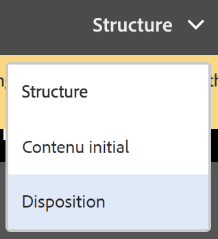
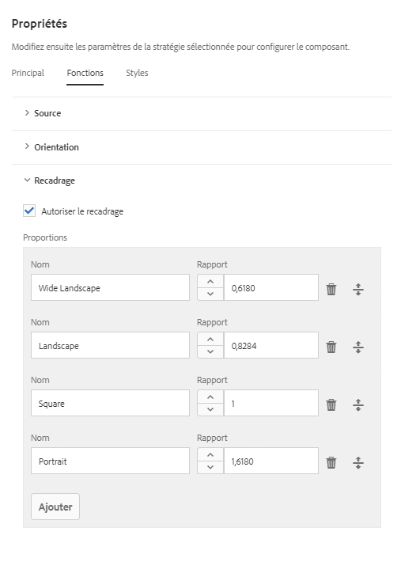
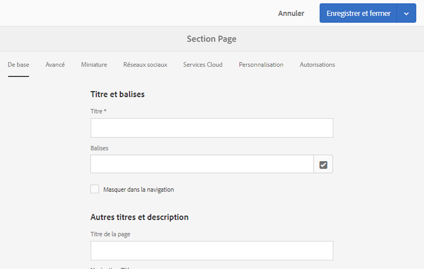

# Création de modèles de page   {#creating-page-templates}

Lors de la création d’une page, vous devez sélectionner un modèle. C’est la base pour la création de la page. Le modèle définit la structure de la page créée, le contenu initial et les composants pouvant être utilisés.

Grâce à **Éditeur de modèles**, la création et la maintenance de modèles ne sont plus des tâches réservées aux développeurs. Un type d’utilisateur avancé, appelé **auteur de modèles**, peut également être impliqué. Les développeurs doivent encore configurer l’environnement, créer des bibliothèques clientes et créer les composants à utiliser. Cependant, une fois ces bases en place, l’**auteur de modèles** peut créer et configurer des modèles sans projet de développement.

La **console de modèles** permet aux créateurs de modèles :

* de créer ou de copier un modèle ;
* de gérer le cycle de vie du modèle.

L’**éditeur de modèles** permet aux créateurs de modèles :

* d’ajouter des composants au modèle et de les positionner sur une grille réactive.
* de préconfigurer les composants ;
* de définir les composants qui peuvent être publiés dans les pages créées à partir du modèle.

Ce document explique comment un **créateur de modèles** peut utiliser la console et l’éditeur de modèles pour créer et gérer des modèles modifiables.

Pour obtenir des informations détaillées sur le fonctionnement des modèles modifiables à un niveau technique, voir le document destiné aux développeurs [Modèles de page - Modifiables](/help/sites-developing/page-templates-editable.md).

>[!NOTE]
>
>L’**éditeur de modèles** ne prend pas en charge le ciblage directement au niveau du modèle. Les pages créées à partir d’un modèle modifiable peuvent être ciblées, mais pas les modèles eux-mêmes.

>[!CAUTION]
>
>Pages and templates created with the **Templates Console** are not meant to be used with the classic UI and such use is not supported.

## Avant de commencer {#before-you-start}

>[!NOTE]
>
>Un administrateur doit configurer un dossier de modèles dans le **navigateur des configurations** et appliquer les autorisations appropriées permettant au créateur de modèles de créer un modèle dans ce dossier.

Avant de commencer, vous devez tenir compte des points importants suivants :

* La création d’un modèle nécessite une collaboration. Pour cette raison, le [rôle](#roles) est indiqué pour chaque tâche.

* En fonction de la configuration de votre instance, il peut s’avérer utile de savoir qu’AEM comporte maintenant [deux types de modèles standard](/help/sites-authoring/templates.md#editable-and-static-templates). Cela n’a pas d’incidence sur la façon dont vous [utilisez un modèle pour créer une page](#using-a-template-to-create-a-page), mais cela affecte le type de modèle que vous pouvez créer et la façon dont la page fait référence à son modèle.

### Rôles {#roles}

La création d’un modèle à l’aide de la **console Modèles** et de l’**éditeur de modèles** exige une collaboration entre les rôles suivants :

* **Administrateur** :

   * La création d’un dossier pour les modèles nécessite des droits `admin`.

   * Souvent, ces tâches peuvent également être effectuées par un développeur.

* **Développeur** :

   * Se concentre sur les détails techniques/internes.
   * Requiert une expérience de l’environnement de développement.
   * Fournit au créateur de modèles les informations nécessaires.

* **Créateur de modèles** :

   * Il s’agit d’un créateur particulier qui est membre du groupe `template-authors`

      * Ce groupe affecte les privilèges et les autorisations nécessaires.
   * Peut configurer l’utilisation des composants et d’autres détails importants nécessitant :

      * Quelques connaissances techniques

         * Par exemple, l’utilisation de modèles lors de la définition des tracés.
      * Des informations techniques provenant du développeur.

En raison de la nature de certaines tâches (comme la création d’un dossier), un environnement de développement est nécessaire et implique des connaissances et de l’expérience.

Les tâches détaillées dans ce document sont répertoriées avec le rôle responsable de leur exécution.

### Modèles modifiables et statiques {#editable-and-static-templates}

AEM comporte maintenant deux types de modèles standard :

* [Modèles modifiables](/help/sites-authoring/templates.md#creatingandmanagingnewtemplates)

   * Peuvent être [créés](#creatinganewtemplate) et [modifiés](#editingatemplate) à l’aide de la **console de modèles** et de l’éditeur de modèles. La **console de modèles** est accessible dans la section **Général** de la console **Outils**. 

   * Une fois la page créée, une connexion dynamique est conservée entre la page et le modèle. Cela signifie que les modifications apportées à la structure et/ou au contenu verrouillé des modèles se répercutent dans toutes les pages créées avec ce modèle. Les modifications apportées au contenu déverrouillé (c’est-à-dire initial) ne sont pas répercutées.
   * Utilisez les stratégies de contenu, que vous pouvez définir à partir de l’éditeur de modèles, pour conserver les propriétés de conception. Le mode Création de l’éditeur de page n’est plus utilisé pour les modèles modifiables.

* Modèles statiques

   * Ces modèles sont disponibles dans différentes versions d’AEM.
   * Ils sont [fournis par les développeurs](/help/sites-developing/page-templates-static.md), et ne peuvent pas être créés ou modifiés par les créateurs.
   * Ils sont copiés pour créer la page. Il n’y a ensuite aucune connexion dynamique (même si le nom du modèle est enregistré pour information).
   * Utilisez le [mode Création](/help/sites-authoring/default-components-designmode.md) pour conserver les propriétés de conception.
   * Because editing static templates is the exclusive task of a developer, please see the developer document [Page Templates - Static](/help/sites-developing/page-templates-static.md) for more information.

Par définition, la console de modèles et l’éditeur de modèles permettent uniquement la création et la modification des modèles modifiables. Par conséquent, ce document décrit exclusivement les modèles modifiables.

### Utilisation d’un modèle pour créer une page {#using-a-template-to-create-a-page}

Lorsque vous utilisez un modèle pour [créer une page](/help/sites-authoring/managing-pages.md#creating-a-new-page), il n’existe aucune différence visible ni indication permettant de distinguer les modèles statiques des modèles modifiables. Pour le créateur de pages, le processus est transparent.

## Création et gestion des modèles {#creating-and-managing-templates}

Lors de la création d’un modèle modifiable :

* Utilisez la **console de modèles**. Elle est accessible dans la section **Général** de la console **Outils**.

   * Ou directement à l’adresse : [https://localhost:4502/libs/wcm/core/content/sites/templates.html/conf](https://localhost:4502/libs/wcm/core/content/sites/templates.html/conf)

* Si besoin, vous pouvez [créer un dossier pour les modèles](#creating-a-template-folder-admin).
* [Créez un modèle](#creatinganewtemplateauthor), qui est initialement vide. 

* Si besoin, [définissez des propriétés supplémentaires](#definingtemplatepropertiesauthor) pour le modèle.
* [Modifiez le modèle](#editingtemplates) pour définir ce qui suit :

   * [Structure](#editingatemplatestructureauthor) : contenu prédéfini ne pouvant pas être modifié dans les pages créées avec le modèle.
   * [Contenu initial](#editing-a-template-initial-content-author) : contenu prédéfini pouvant être modifié dans les pages créées avec le modèle.
   * [Mise en page](#editingatemplatelayoutauthor) : pour de nombreux appareils.
   * [Styles](/help/sites-authoring/style-system.md) : définissez les styles à utiliser avec le modèle et ses composants.

* [Activez le modèle](#enablingatemplateauthor) à utiliser lors de la création d’une page.
* [Autorisez le modèle](#allowing-a-template-author) de la page ou de la branche souhaitée du site web.
* [Publiez le modèle](#publishingatemplateauthor) pour le rendre disponible dans l’environnement de publication.

>[!NOTE]
>
>Les **modèles autorisés** sont souvent prédéfinis lors de la configuration initiale de votre site web.

>[!CAUTION]
>
>Ne saisissez jamais d’informations qui doivent[ être internationalisées](/help/sites-developing/i18n.md) dans un modèle.

### Création d’un dossier de modèles - Administrateur {#creating-a-template-folder-admin}

Vous devez créer un dossier de modèles pour votre projet afin de contenir les modèles spécifiques au projet. Il s’agit d’une tâche de l’administrateur qui est décrite dans le document [Modèles de page - Modifiables](/help/sites-developing/page-templates-editable.md#template-folders).

### Création d’un modèle - Créateur de modèles {#creating-a-new-template-template-author}

1. Ouvrez la **console de modèles** (en sélectionnant **Outils ->** **Général**), puis accédez au dossier souhaité.

   >[!NOTE]
   >
   >Dans une instance AEM standard, le dossier **Global** existe déjà dans la console de modèles. Il contient les modèles par défaut et fait office de dossier de rechange si le dossier actif ne contient pas de stratégies et/ou de types de modèles.
   >
   >
   >Il est recommandé d’utiliser un [dossier de modèles créé pour le projet](/help/sites-developing/page-templates-editable.md#template-folders).

1. Pour ouvrir l’Assistant, sélectionnez **Créer**, puis **Créer un modèle**.

1. Sélectionnez un **type de modèle**, puis cliquez sur **Suivant**.

   >[!NOTE]
   >
   >Les types de modèles sont des mises en page de modèles prédéfinies et peuvent être considérés comme les modèles d’un modèle. Ils sont prédéfinis par les développeurs ou l’administrateur système. Vous trouverez plus d’informations à ce sujet dans le document [Modèles de page - Modifiables](/help/sites-developing/page-templates-editable.md#template-type).

1. Renseignez les **détails du modèle** :

   * **Nom du modèle**
   * **Description**

1. Sélectionnez **Créer**. Un message de confirmation s’affiche. Sélectionnez **Ouvrir** pour commencer à modifier le modèle ou **Terminé** pour revenir à la console de modèles.

   >[!NOTE]
   >
   >Lorsque vous créez un modèle, il est marqué comme **Brouillon** dans la console pour indiquer qu’il n’est pas encore actif.

### Définition des propriétés des modèles - Créateur de modèles    {#defining-template-properties-template-author}

Un modèle peut posséder les propriétés suivantes :

* Image

   * Image à utiliser comme [miniature du modèle](/help/sites-authoring/templates.md#template-thumbnail-image) pour faciliter la sélection, par exemple dans l’assistant Créer une page.

      * Peut être téléchargée
      * Peut être générée en fonction du contenu du modèle

* Titre

   * Titre servant à identifier le modèle, par exemple dans l’assistant **Créer une page**.

* Description

   * Description facultative permettant de fournir des informations supplémentaires sur le modèle et son utilisation. Elle peut s’afficher, par exemple, dans l’assistant **Créer une page**.

Pour afficher et/ou modifier les propriétés :

1. Dans la **console de modèles**, sélectionnez le modèle.
1. Sélectionnez **Afficher les propriétés** dans la barre d’outils ou les options rapides pour ouvrir la boîte de dialogue.
1. Vous pouvez maintenant afficher ou modifier les propriétés du modèle.

>[!NOTE]
>
>L’état du modèle (brouillon, activé ou désactivé) est indiqué dans la console.

#### Miniature du modèle {#template-thumbnail-image}

Pour définir la miniature du modèle :

1. Modifiez les propriétés du modèle.
1. Choisissez si vous souhaitez télécharger une miniature ou la générer à partir du contenu du modèle.

   * Si vous souhaitez télécharger une miniature, cliquez ou appuyez sur **Télécharger l’image**
   * Si vous souhaitez générer une miniature, cliquez ou appuyez sur **Générer l’aperçu**

1. Pour les deux méthodes, un aperçu de la miniature s’affiche.

   Si l’aperçu ne vous satisfait pas, cliquez ou appuyez sur **Effacer** pour télécharger une autre image ou pour générer à nouveau la miniature.

1. Lorsque vous êtes satisfait de la miniature, cliquez ou appuyez sur **Enregistrer et Fermer**.

### Activation et autorisation d’un modèle - Créateur de modèles    {#enabling-and-allowing-a-template-template-author}

Pour utiliser un modèle lors de la création d’une page, vous devez effectuer les deux tâches suivantes :

* [Activer le modèle](#enablingatemplate) : permet de le rendre disponible lors de la création de pages.
* [Autoriser le modèle](#allowingatemplate) : permet de spécifier les branches de contenu dans lesquelles le modèle peut être utilisé.

#### Activation d’un modèle - Créateur de modèles {#enabling-a-template-template-author}

Un modèle peut être activé ou désactivé pour être mis à disposition (ou non) dans l’assistant **Créer une page**.

>[!CAUTION]
>
>Une fois qu’un modèle est activé, un avertissement s’affiche lorsqu’un créateur de modèles commence à le mettre à jour. Cela permet d’avertir l’utilisateur que le modèle peut être référencé et que donc des modifications sont susceptibles d’affecter les pages faisant référence à ce modèle.

1. Dans la **console de modèles**, sélectionnez le modèle.
1. Sélectionnez **Activer** ou **Désactiver** dans la barre d’outils, puis de nouveau dans la boîte de dialogue de confirmation.
1. Vous pouvez maintenant utiliser le modèle lors de la [création d’une page](/help/sites-authoring/managing-pages.md#creating-a-new-page). Cependant, vous souhaiterez sans doute [modifier le modèle](#editingatemplate) en fonction de vos besoins.

>[!NOTE]
>
>L’état du modèle (brouillon, activé ou désactivé) est indiqué dans la console.

#### Autorisation d’un modèle - Créateur {#allowing-a-template-author}

Un modèle peut être rendu disponible ou indisponible pour certaines branches de la page.

1. Ouvrez [Propriétés de la page](/help/sites-authoring/editing-page-properties.md) pour la page principale de la branche dans laquelle vous souhaitez que le modèle soit disponible.

1. Ouvrez l’onglet **Avancé**.

1. Sous **Paramètres du modèle**, utilisez **Ajouter un champ** pour spécifier le ou les chemins d’accès de vos modèles.

   Le chemin d’accès peut être explicite ou utiliser des modèles. Par exemple :

   `/conf/<your-folder>/settings/wcm/templates/.*`

   L’ordre des chemins d’accès n’a pas d’importance. La recherche porte sur tous les chemins d’accès, et tous les modèles sont extraits.

   >[!NOTE]
   >
   >Si la liste **Modèles autorisés** reste vide, l’arborescence est remontée jusqu’à ce qu’une valeur/liste soit détectée.
   >
   >
   >See [Template Availability](/help/sites-developing/templates.md#template-availability) - the principles for allowed templates remain the same.

1. Cliquez sur **Enregistrer** pour enregistrer les modifications apportées aux propriétés de la page.

>[!NOTE]
>
>Souvent, les modèles autorisés sont prédéfinis pour le site entier lorsqu’il est configuré.

### Publication d’un modèle - Créateur de modèles {#publishing-a-template-template-author}

Dans la mesure où il est référencé lors du rendu d’une page, le modèle (totalement configuré) doit être publié afin d’être disponible dans l’environnement de publication.

1. Dans la **console de modèles**, sélectionnez le modèle.
1. Sélectionnez **Publier** dans la barre d’outils pour ouvrir l’Assistant.
1. Sélectionnez les **Politiques de contenu** à publier en tandem.

1. Sélectionnez **Publier** dans la barre d’outils pour terminer l’action.

## Modification des modèles    - Créateurs de modèles    {#editing-templates-template-authors}

Lors de la création ou de la modification d’un modèle, vous pouvez définir différents aspects. La modification de modèles est similaire à la création de pages.

Les aspects suivants d’un modèle peuvent être modifiés :

* [Structure](#editingatemplatestructure)

   Les composants ajoutés ici ne peuvent pas être déplacés/supprimés dans les pages créées par les créateurs de pages. Si vous souhaitez que les créateurs de pages puissent ajouter et supprimer des composants aux pages créées, vous devez ajouter un système de paragraphes dans le modèle.

   Lorsque les composants sont verrouillés, vous pouvez ajouter du contenu, que les créateurs de pages ne peuvent pas modifier. Vous pouvez déverrouiller des composants pour pouvoir définir le [contenu initial](#editingatemplateinitialcontent).

   >[!NOTE]
   >
   >En mode Structure, les composants parents d’un composant déverrouillé ne peuvent être ni déplacés, ni coupés, ni supprimés.

* [Contenu initial](#editingatemplateinitialcontent)

   Lorsqu’un composant a été déverrouillé, vous pouvez définir le contenu initial qui sera copié dans les pages créées à partir du modèle. Ces composants déverrouillés peuvent être modifiés dans les pages créées.

   >[!NOTE]
   >
   >En mode **Contenu initial** (et dans les pages créées), les composants déverrouillés qui possèdent un parent accessible (c’est-à-dire, les composants dans un conteneur de mises en page) peuvent être supprimés.

* [Mise en page](#editingatemplatelayout)

   Vous pouvez prédéfinir la mise en page du modèle pour les formats de dispositif de votre choix. Le mode **Mise en page** pour la création de modèles comporte la même fonctionnalité que le mode [**Mise en page** pour la création de pages](/help/sites-authoring/responsive-layout.md#defining-layouts-layout-mode).

* [Stratégies de page](#editingatemplatepagepolicies)

   Dans le cadre des stratégies de page, vous pouvez attribuer des stratégies de page prédéfinies à la page. Ces stratégies de page définissent les différentes configurations de conception.

* [Styles](/help/sites-authoring/style-system.md)

   Le système de style permet à un auteur de modèles de définir des classes de style dans la stratégie de contenu d’un composant, de façon à pouvoir sélectionner ces classes lors de la modification du composant sur une page. Ces styles peuvent être des variantes visuelles d’un composant, le rendant ainsi plus flexible.

   Pour plus d’informations, voir la [documentation sur le système de style](/help/sites-authoring/style-system.md).

Le sélecteur **Mode** de la barre d’outils permet de sélectionner et de modifier l’aspect approprié du modèle :

* [Structure](#editingatemplatestructure)
* [Contenu initial](#editingatemplateinitialcontent)
* [Mise en page](#editingatemplatelayout)

Lorsque l’option **Stratégie de page** du menu **Informations sur la page**, vous pouvez [sélectionner les stratégies de page de votre choix](#editingatemplatepagepolicies) :

>[!CAUTION]
>
>Si un créateur commence à modifier un modèle qui a déjà été activé, un avertissement s’affiche. Cela permet d’avertir l’utilisateur que le modèle peut être référencé et que donc des modifications sont susceptibles d’affecter les pages faisant référence à ce modèle.

### Modification d’un modèle - Structure - Créateur de modèles {#editing-a-template-structure-template-author}

En mode **Structure**, vous définissez les composants et le contenu de votre modèle, ainsi qu’une stratégie pour le modèle et ses composants.

* Les composants définis dans la structure du modèle ne peuvent être ni déplacés ni supprimés dans les pages créées.
* Si vous souhaitez que les créateurs de pages puissent ajouter et supprimer des composants, ajoutez un système de paragraphes au modèle.
* Les composants peuvent être déverrouillés (et reverrouillés) pour que vous puissiez définir le [contenu initial](#editingatemplateinitialcontent).

* Les stratégies de conception des composants et de la page sont définies.

En mode **Structure** de l’éditeur de modèles :

* **Ajout de composants**

   Différents mécanismes permettent d’ajouter des composants au modèle :

   * Dans l’Explorateur de **composants** du panneau latéral.
   * En utilisant l’option **Insérer le composant** (icône **+**) disponible dans la barre d’outils des composants figurant déjà dans le modèle ou la zone **Faire glisser les composants ici**.

   * En faisant glisser une ressource (de l’Explorateur de **ressources** dans le panneau latéral) directement dans le modèle pour générer le composant approprié in situ.

   Une fois ajouté, chaque composant est identifié par :

   * Une bordure
   * Un marqueur indiquant le type de composant
   * Un marqueur indiquant quand le composant a été déverrouillé

   >[!NOTE]
   >
   >Lorsque vous ajoutez un composant **Titre** prêt à l’emploi au modèle, il contient le texte **structure** par défaut.
   >
   >
   >Si vous le modifiez et que vous ajoutez votre propre texte, le texte mis à jour sera utilisé pour les pages créées à partir du modèle.
   >
   >
   >Si vous laissez le texte par défaut (structure), le titre propose par défaut le nom de la page suivante.

   >[!NOTE]
   >
   >Même si l’ajout de composants et de ressources à un modèle n’est pas identique à des actions comparables lors de la [création de pages](/help/sites-authoring/editing-content.md), il présente de nombreuses similitudes avec ces actions.

* **Actions des composants**

   Intervenez sur les composants une fois qu’ils ont été ajoutés au modèle. Chaque instance individuelle comporte une barre d’outils qui permet d’accéder aux actions disponibles. La barre d’outils dépend du type de composant.

   

   Elle peut également dépendre des actions exécutées. Par exemple, lorsqu’une stratégie a été associée au composant, l’icône de configuration de la conception est disponible.

* **Modification et configuration**

   Avec ces deux actions, vous pouvez ajouter du contenu aux composants.

* **Bordure indiquant la structure**

   Lorsque vous travaillez en mode **Structure**, une bordure orange indique le composant actuellement sélectionné. Une ligne pointillée indique le composant parent.

   Par exemple, sur la capture d’écran ci-dessous, le composant **Texte** est sélectionné, dans un **Conteneur de mise en page** (responsivegrid). 

   

* **Stratégie et propriétés (général)**

   Les stratégies de contenu (ou de conception) définissent les propriétés de conception d’un composant. Par exemple, les composants disponibles ou les dimensions minimales/maximales. Elles s’appliquent au modèle (et aux pages créées avec le modèle).

   Créez une stratégie de contenu ou sélectionnez-en une existante pour un composant. Cela permet de définir les détails de la conception.

    

   La fenêtre de configuration est divisée en deux.

   * Dans la partie gauche de la boîte de dialogue, sous **Stratégie**, vous avez la possibilité de sélectionner une stratégie existante.
   * Dans la partie droite de la boîte de dialogue, sous **Propriétés**, vous pouvez définir les propriétés spécifiques au type de composant.

   Les propriétés disponibles dépendent du composant sélectionné. Par exemple, pour un composant de texte, les propriétés définissent entre autres les options de copie et de collage, de mise en forme, et le style des paragraphes.

   ***Stratégie***

   Les stratégies de contenu (ou de conception) définissent les propriétés de conception d’un composant. Par exemple, les composants disponibles ou les dimensions minimales/maximales. Elles s’appliquent au modèle (et aux pages créées avec le modèle).

   Sous **Stratégie**, vous pouvez sélectionner, dans le menu déroulant, une stratégie à appliquer au composant.

   

   Vous pouvez ajouter une nouvelle stratégie en sélectionnant le bouton d’ajout en regard du menu déroulant **Sélectionner une stratégie**. Vous devez ensuite attribuer un nouveau titre dans le champ **Titre de la stratégie**.

   

   La stratégie existante sélectionnée dans le menu déroulant **Sélectionner une stratégie** peut être copiée comme nouvelle stratégie à l’aide du bouton de copie en regard du menu déroulant. Vous devez ensuite attribuer un nouveau titre dans le champ **Titre de la stratégie**. Par défaut, la stratégie copiée sera intitulée **Copie de X**, X étant le titre de la stratégie copiée.

   

   Vous pouvez saisir la description de la stratégie dans le champ **Description de la stratégie** (facultatif).

   Dans la section **D’autres modèles utilisent également la stratégie sélectionnée**, vous pouvez facilement voir les autres modèles qui utilisent la stratégie sélectionnée dans le menu déroulant **Sélectionner une stratégie**.

   

   >[!NOTE]
   >
   >Si plusieurs composants du même type sont ajoutés comme contenu initial, la même stratégie s’applique à tous les composants. Cela correspond à la même restriction en [**mode Création** que pour les modèles statiques](/help/sites-authoring/default-components-designmode.md).

   ***Propriétés***

   Sous l’en-tête **Propriétés**, vous pouvez définir les paramètres du composant. L’en-tête comporte deux onglets :

   * Principal
   * Fonctionnalités

   *Principal*

   Dans l’onglet **Principal**, les paramètres les plus importants du composant sont définis.

   Par exemple, pour un composant d’image, les largeurs autorisées peuvent être définies en même temps que l’activation du chargement différé.

   Si un paramètre permet plusieurs configurations, cliquez ou appuyez sur le bouton **Ajouter** pour ajouter une autre configuration.

   

   Pour supprimer une configuration, cliquez ou appuyez sur le bouton **Supprimer** situé à droite de la configuration.

   Pour supprimer une configuration, cliquez ou appuyez sur le bouton** Supprimer**.

   

   *Fonctionnalités*

   L’onglet **Fonctionnalités** permet d’activer ou de désactiver des fonctionnalités supplémentaires du composant.

   Par exemple, pour un composant d’image, vous pouvez définir les proportions de recadrage, les orientations d’image autorisées et indiquer si les téléchargements sont autorisés.

   

   >[!CAUTION]
   >
   >Remarque : Dans AEM, les rapports de recadrage sont définis sous forme de **hauteur/largeur**. Cela diffère de la définition conventionnelle de la largeur/hauteur. Cette différence a été créée pour des raisons de compatibilité héritée. Les utilisateurs de la création de pages ne percevront aucune différence à condition que vous définissiez clairement le **Nom**, car c’est ce dernier qui s’affiche dans l’interface utilisateur.

   >[!NOTE]
   >
   >Les stratégies de contenu pour les composants impliquant la mise en œuvre de l’éditeur de texte enrichi peuvent uniquement être définies pour les options accessibles par les paramètres de l’interface utilisateur, via ses propres paramètres d’interface utilisateur.  

* **Stratégie et propriétés (conteneur de mises en page)**

   Les paramètres de stratégie et de propriétés d’un conteneur de mises en page sont similaires à l’utilisation générale, mais avec quelques différences.

   >[!NOTE]
   >
   >La configuration d’une stratégie est obligatoire pour les composants de conteneur, car elle permet de définir les composants qui seront disponibles dans le conteneur.

   La fenêtre de configuration est divisée en deux, tout comme dans l’utilisation générale de la fenêtre.

   ***Stratégie***

   Les stratégies de contenu (ou de conception) définissent les propriétés de conception d’un composant. Par exemple, les composants disponibles ou les dimensions minimales/maximales. Elles s’appliquent au modèle (et aux pages créées avec le modèle).

   Sous **Stratégie**, vous pouvez sélectionner, dans le menu déroulant, une stratégie à appliquer au composant. Cela fonctionne exactement comme dans l’utilisation générale de la fenêtre.

   ***Propriétés***

   Sous l’en-tête **Propriétés**, vous pouvez choisir les composants disponibles pour le conteneur de mises en page et définir leurs paramètres. L’en-tête comporte trois onglets :

   * Composants autorisés
   * Composants par défaut
   * Paramètres réactifs

   *Composants autorisés*

   Dans l’onglet **Composants autorisés**, vous définissez les composants disponibles pour le conteneur de mises en page.

   * Les composants sont regroupés en groupes de composants, qui peuvent être développés et réduits.
   * Un groupe entier peut être sélectionné en cochant le nom du groupe, et tous peuvent être désélectionnés en décochant la case.
   * Le signe moins indique qu’au moins un élément du groupe est sélectionné, mais pas tous.
   * Un champ de recherche est disponible pour filtrer un composant en fonction de son nom.
   * Les chiffres à droite du nom du groupe de composants représentent le nombre total de composants sélectionnés dans ce groupe, quel que soit le filtre.

   

   *Composants par défaut*

   Dans l’onglet **Composants par défaut**, vous définissez les composants qui sont automatiquement associés à des types de médias donnés. Ainsi, lorsqu’un créateur fait glisser une ressource depuis le navigateur des ressources, AEM sait avec quel composant l’associer. Notez que seuls les composants dotés de zones de dépôt sont disponibles pour cette configuration.

   Cliquez ou appuyez sur **Ajouter le mappage** pour ajouter un nouveau composant et un mappage de type MIME.

   Sélectionnez un composant dans la liste, puis cliquez ou appuyez sur **Ajouter un type** pour ajouter un type MIME à un composant déjà mappé. Cliquez sur l’icône **Supprimer** pour supprimer un type MIME.

   

   *Paramètres réactifs*

   Dans l’onglet **Paramètres réactifs**, vous pouvez configurer le nombre de colonnes de la grille résultante du conteneur de mises en page.

* **Déverrouillage/Verrouillage des composants**

   Vous verrouillez/déverrouiller des composants pour définir si le contenu est disponible pour être modifié en mode **Contenu initial**.

   Lorsqu’un composant a été déverrouillé :

   * Un indicateur de cadenas ouvert s’affiche sur la bordure.
   * La barre d’outils Composants est ajustée en conséquence.
   * Tout contenu déjà saisi ne sera plus affiché en mode **Structure**.

      * Le contenu déjà saisi est considéré comme du contenu initial et n’est visible qu’en mode **Contenu initial**.
   * Les parents du composant déverrouillé ne peuvent être ni déplacés, ni coupés, ni supprimés.

   

   Cela comprend le déverrouillage des composants de conteneur afin que d’autres composants puissent être ajoutés, soit en mode **Contenu initial**, soit sur les pages résultantes. Si vous avez déjà ajouté des composants/du contenu au conteneur avant de le déverrouiller, ceux-ci ne s’afficheront plus en mode **Structure**, mais en mode **Contenu initial**. En mode **Structure**, seul le composant de conteneur est affiché avec sa liste de **Composants autorisés**.

   

   Pour économiser de l’espace, le conteneur de mises en page ne se développe pas pour s’adapter à la liste des composants autorisés. À la place, le conteneur devient une liste déroulante.

   Les composants configurables s’affichent avec une icône **Règle**, sur laquelle vous pouvez appuyer ou cliquer pour modifier la règle et les propriétés de ce composant.

   

* **Relation avec les pages existantes**

   Si la structure est mise à jour après la création de pages en fonction du modèle, ces pages répercutent les modifications apportées au modèle. Un avertissement, ainsi que des boîtes de dialogue de confirmation, s’affichent dans la barre d’outils pour vous rappeler cette répercussion.

   

### Modification d’un modèle - Contenu initial - Créateur {#editing-a-template-initial-content-author}

Le mode **Contenu initial** est utilisé pour définir le contenu qui s’affiche lors de la première création d’une page en fonction du modèle. Le contenu initial peut ensuite être modifié par les créateurs de la page.

Même si l’ensemble du contenu créé en mode **Structure** est visible en mode **Contenu initial**, seuls les composants déverrouillés peuvent être sélectionnés et modifiés.

>[!NOTE]
>
>Le mode **Contenu initial** peut être envisagé comme mode d’édition pour les pages créées avec ce modèle. Par conséquent, les stratégies ne sont pas définies en mode **Contenu initial**, mais plutôt en mode [**Structure**](/help/sites-authoring/templates.md#editing-a-template-structure-template-author).

* Les composants déverrouillés modifiables sont marqués. Une fois sélectionnés, ils comportent une bordure bleue :

   

* Les composants déverrouillés comportent une barre d’outils permettant de modifier et de configurer le contenu :

   

* Si un composant de conteneur a été déverrouillé (en mode **Structure**), vous pouvez ajouter de nouveaux composants au conteneur (en mode **Contenu initial**). Les composants ajoutés en mode **Contenu initial** peuvent être déplacés ou supprimés dans les pages créées.

   Vous pouvez ajouter le composant à l’aide de la zone **Faire glisser les composants ici** ou de l’option **Insérer un nouveau composant** de la barre d’outils du conteneur approprié.

    

* Si le contenu initial du modèle est mis à jour après la création des pages en fonction du modèle, ces pages ne seront pas affectées par les modifications apportées au contenu initial du modèle.

>[!NOTE]
>
>Le contenu initial est destiné à préparer les composants et la mise en page, point de départ de la création du contenu. Il n’est pas destiné à constituer un contenu réel laissé tel quel. C’est pour cette raison que le contenu initial ne peut pas être traduit.
>
>Si vous devez inclure du texte traduisible dans votre modèle, par exemple dans les en-têtes ou les pieds de page, vous pouvez utiliser les [fonctions de localisation des composants principaux](https://docs.adobe.com/content/help/fr-FR/experience-manager-core-components/using/get-started/localization.html).

### Modification d’un modèle - Mise en page - Créateur de modèles {#editing-a-template-layout-template-author}

Vous pouvez définir la mise en page du modèle pour différents appareils. [La mise en page réactive pour les modèles fonctionne de la même manière que pour la création de pages.](/help/sites-authoring/responsive-layout.md)

>[!NOTE]
>
>Les modifications apportées à la mise en page se répercutent en mode **Contenu initial**, mais aucune modification n’est visible en mode **Structure**.

### Modification d’un modèle - Conception de page - Créateur/développeur de modèles {#editing-a-template-page-design-template-author-developer}

La conception de la page, y compris les bibliothèques côté client requises et les stratégies de page, sont conservées sous l’option **Conception de pages** du menu **Informations sur la page**.

Pour accéder à la boîte de dialogue **Conception de page** :

1. From the **Template Editor**, select **Page Information** from the toolbar, then **Page Design** to open the dialog.
1. La boîte de dialogue **Conception de page** s’ouvre. Elle est divisée en deux sections :

   * La moitié gauche définit les [stratégies de page](/help/sites-authoring/templates.md#page-policies).
   * La moitié droite définit les [propriétés de page](/help/sites-authoring/templates.md#page-properties).

   

#### Stratégies de page {#page-policies}

Vous pouvez appliquer une stratégie de contenu au modèle ou aux pages créées. Cette opération définit la stratégie de contenu pour le système de paragraphes principal dans la page.

* Vous pouvez sélectionner une stratégie existante pour la page dans le menu déroulant **Sélectionner une stratégie**.

   

   Vous pouvez ajouter une nouvelle stratégie en sélectionnant le bouton d’ajout en regard du menu déroulant **Sélectionner une stratégie**. Vous devez ensuite attribuer un nouveau titre dans le champ **Titre de la stratégie**.

   

   La stratégie existante sélectionnée dans le menu déroulant **Sélectionner une stratégie** peut être copiée comme nouvelle stratégie à l’aide du bouton de copie en regard du menu déroulant. Vous devez ensuite attribuer un nouveau titre dans le champ **Titre de la stratégie**. Par défaut, la stratégie copiée sera intitulée **Copie de X**, X étant le titre de la stratégie copiée.

   

* Définissez le titre de la stratégie dans le champ **Titre de la stratégie**. Une stratégie doit comporter un titre pour faciliter sa sélection dans le menu déroulant **Sélectionner une stratégie**.

   

* Vous pouvez saisir la description de la stratégie dans le champ **Description de la stratégie** (facultatif).
* Dans la section **D’autres modèles utilisent également la stratégie sélectionnée**, vous pouvez facilement voir les autres modèles qui utilisent la stratégie sélectionnée dans le menu déroulant **Sélectionner une stratégie**.

   

#### Propriétés de page {#page-properties}

À l’aide des propriétés de page, vous pouvez définir les bibliothèques côté client requises avec la boîte de dialogue **Conception de page**. Ces bibliothèques côté client incluent des feuilles de style et du code JavaScript à charger avec le modèle et les pages créées avec ce modèle.

* Spécifiez les bibliothèques côté client à appliquer aux pages créées avec ce modèle. Saisissez le nom d’une bibliothèque dans le champ de la section **Bibliothèques côté client**.

   

* Si plusieurs bibliothèques s’avèrent nécessaires, cliquez sur le bouton Ajouter pour ajouter un champ supplémentaire pour le nom de la bibliothèque.

   

   Ajoutez autant de champs que nécessaire pour les bibliothèques côté client.

   

* Définissez la position relative des bibliothèques, en fonction de vos besoins, en faisant glisser les champs à l’aide de la poignée.

   

>[!NOTE]
>
>Bien que le créateur de modèles puisse indiquer la stratégie de page dans le modèle, il doit se procurer les détails relatifs aux bibliothèques concernées côté client auprès du développeur.

### Modification d’un modèle - Propriétés de page initiales - Créateur {#editing-a-template-initial-page-properties-author}

À l’aide de l’option **Propriétés de page initiales**, vous pouvez définir les [propriétés initiales de la page](/help/sites-authoring/editing-page-properties.md) à utiliser lors de la création des pages.

1. Dans l’éditeur de modèles, sélectionnez **Informations sur la page** dans la barre d’outils, puis **Propriétés de page initiales** pour ouvrir la boîte de dialogue.

1. Dans la boîte de dialogue, vous pouvez définir les propriétés à appliquer aux pages créées avec ce modèle.

   

1. Confirmez vos définitions en cliquant/appuyant sur **Terminé**.

## Bonnes pratiques {#best-practices}

Lors de la création de modèles, vous devez prendre en compte :

1. l’impact des modifications apportées au modèle une fois que les pages ont été créées à partir de ce modèle.

   Vous trouverez ci-dessous une liste des différentes opérations possibles sur les modèles, ainsi que leur répercussion sur les pages créées à partir de ces derniers :

   * Modifications apportées à la structure :

      * Elles sont immédiatement appliquées aux pages créées.
      * La publication du modèle modifié est toujours nécessaire pour que les visiteurs puissent voir les modifications.
   * Modifications apportées aux stratégies de contenu et aux configurations de conception :

      * Elles s’appliquent immédiatement aux pages créées.
      * La publication des modifications est nécessaire pour que les visiteurs voient les modifications.
   * Modifications apportées au contenu initial :

      * Elles s’appliquent uniquement aux pages créées après les modifications apportées au modèle.
   * Modifications apportées à la mise en page : selon si le composant modifié :

      * est réservé à la structure, auquel cas elles sont appliquées immédiatement.
      * contient le contenu initial, auquel cas elles ne sont appliquées qu’aux pages créées après les modifications.

   Soyez particulièrement prudent lors du :

   * verrouillage ou déverrouillage des composants sur des modèles activés.
   * Cela peut avoir des effets secondaires, car les pages existantes peuvent déjà utiliser ce contenu. En général :

      * Le déverrouillage des composants (qui ont été verrouillés) est manquant dans les pages existantes.
      * Le verrouillage des composants (modifiables) empêche l’affichage de ce contenu dans les pages.

   >[!NOTE]
   >
   >AEM génère des avertissements explicites lors de la modification du statut de verrouillage des composants dans les modèles qui ne sont plus des brouillons.

1. [Création de vos propres dossiers](#creatingatemplatefolderdeveloper) pour les modèles spécifiques à un site.
1. [Publiez vos modèles](#publishingatemplateauthor) à partir de la **console des modèles**.
