# Gestion de projets{#managing-projects}

La console Projets permet d’organiser un projet en regroupant les ressources dans une seule entité.

Dans la console **Projets**, vous pouvez appliquer des actions à vos projets :

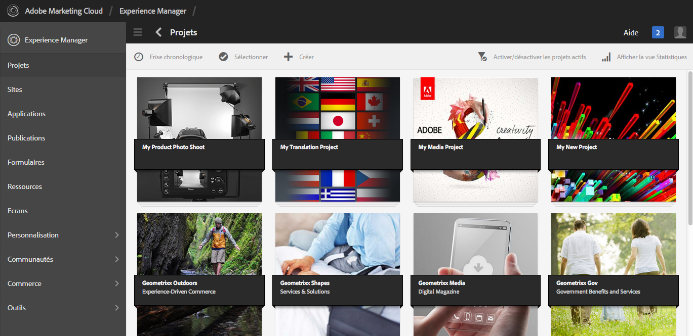

Dans la console Projets, vous pouvez créer un projet, lui associer des ressources et supprimer un projet ou des liens vers des ressources. Vous pouvez ouvrir une mosaïque pour afficher son contenu et lui ajouter des éléments. Cette rubrique décrit les procédures correspondantes.

>[!NOTE]
>
>La version 6.2 a introduit la possibilité d’organiser les projets dans des dossiers. Dans la page Projets, vous avez la possibilité de créer un projet ou un dossier.
>
>Si un dossier est créé, l’utilisateur est ensuite redirigé vers ce dossier d’où il peut créer un autre dossier ou un projet. Cela permet d’organiser des projets dans des dossiers en les classant par catégorie, par exemple, campagnes produit, lieu, langues de traduction, etc.
>
>Les projets et les dossiers s’affichent en mode Liste. Vous pouvez également y effectuer une recherche.

>[!CAUTION]
>
>For users in projects to see other users/groups while using Projects functionality like creating projects, creating tasks/workflows, seeing and managing the team, those users need to have read access on **/home/users** and **/home/groups**. Pour ce faire, le plus facile consiste à octroyer au groupe **projects-users** un accès en lecture à **/home/users** et à **/home/groups**.

## Création d’un projet {#creating-a-project}

Sans configuration supplémentaire, AEM propose les modèles suivants pour créer un projet :

* Projet simple
* Projet de média
* Projet de séance photo du produit
* Projet de traduction

Les étapes de création d’un projet sont identiques d’un projet à l’autre. La différence entre les types de projets porte sur les [rôles utilisateur](/help/sites-authoring/projects.md) et les [workflows](/help/sites-authoring/projects-with-workflows.md) disponibles.  Pour créer un projet :

1. Dans **Projets**, appuyez/cliquez sur **Créer** pour ouvrir l’assistant **Créer un projet** :
1. Sélectionner un modèle. Sans configuration supplémentaire, vous pouvez choisir parmi les modèles suivants : projet simple, projet de média, [projet de traduction](/help/sites-administering/tc-manage.md) et [projet de séance photo du produit](/help/sites-authoring/managing-product-information.md) puis cliquer sur **Suivant**.

   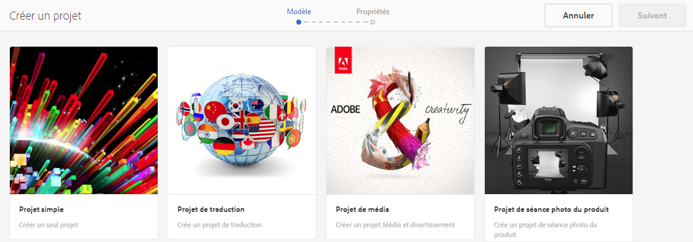

1. Définissez le **titre** et la **description**, puis ajoutez une **miniature** s’il y a lieu. Vous pouvez également ajouter ou supprimer des utilisateurs et définir le groupe auquel ils appartiennent. Ensuite, cliquez sur **Avancé** pour ajouter le nom utilisé dans l’URL.

   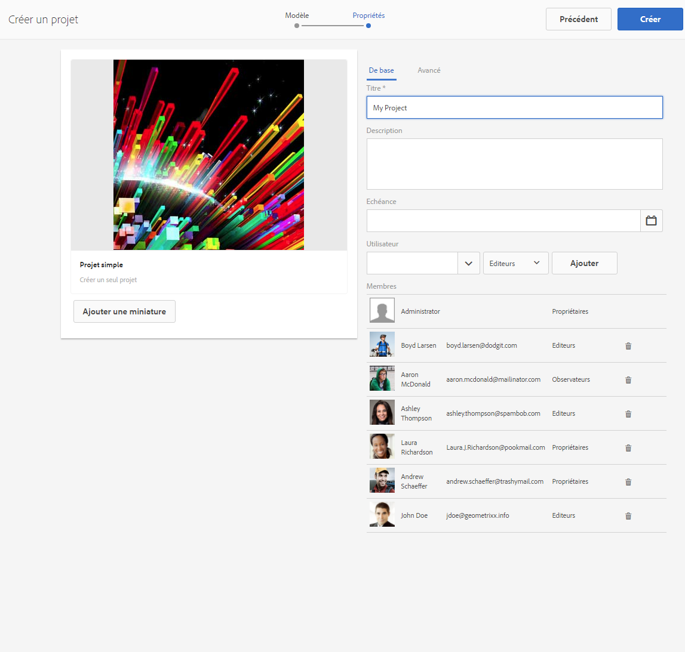

1. Cliquez/appuyez sur **Créer**. Le message de confirmation vous demande si vous voulez ouvrir votre projet ou revenir à la console.

### Association de ressources à un projet   {#associating-resources-with-your-project}

Dans la mesure où les projets permettent de regrouper les ressources dans une seule entité, il convient d’associer des ressources à votre projet. Ces ressources sont connues sous le nom de **mosaïques**. Les types de ressources que vous pouvez ajouter sont décrits dans la section [Mosaïques de projet](/help/sites-authoring/projects.md#project-tiles).

Pour associer des ressources à votre projet :

1. Ouvrez votre projet à partir de la console **Projets**.
1. Cliquez/appuyez sur **Ajouter une mosaïque** et sélectionnez celle que vous souhaitez lier à votre projet. Vous pouvez sélectionner plusieurs types de mosaïque.

   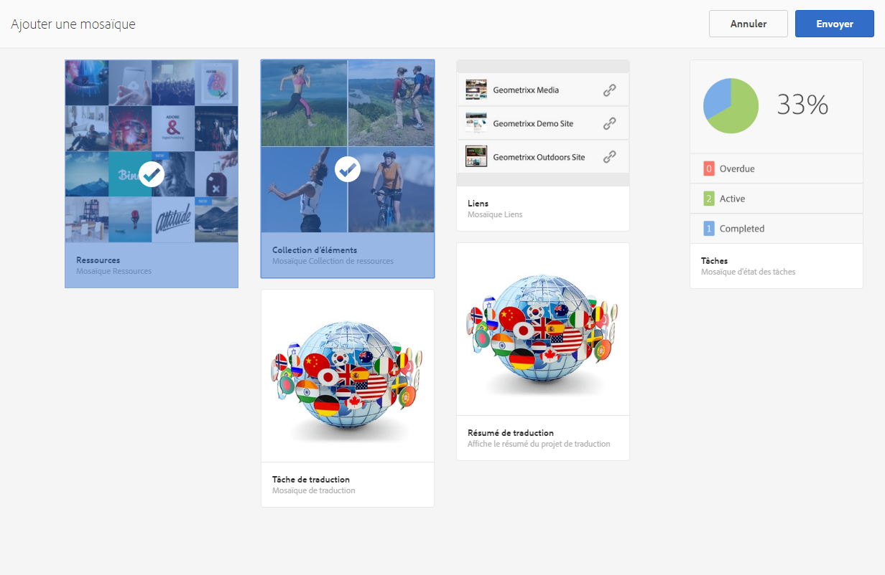

   >[!NOTE]
   >
   >Les mosaïques de projet qui peuvent être associées à un projet sont décrites en détail dans la rubrique [Mosaïques de projet](/help/sites-authoring/projects.md#project-tiles).

1. Cliquez/appuyez sur **Créer**. La ressource est désormais associée à votre projet et vous pouvez y accéder à partir du projet.

### Suppression d’un projet ou d’un lien vers une ressource {#deleting-a-project-or-resource-link}

La méthode permettant de supprimer un projet à partir de la console est la même que celle employée pour supprimer une ressource liée de votre projet :

1. Accédez à l’emplacement concerné :

   * Pour supprimer un projet, accédez au niveau supérieur de la console **Projets**.
   * Pour supprimer un lien vers une ressource dans un projet, ouvrez le projet dans la console **Projets**.

1. Activez le mode de sélection en cliquant sur **Sélectionner** et sélectionnez le projet ou le lien vers une ressource.
1. Cliquez/appuyez sur **Supprimer**.

1. Vous devez confirmer la suppression dans une boîte de dialogue. En cas de confirmation, le projet ou le lien est supprimé. Cliquez/appuyez sur **Désélectionner** pour quitter le mode de sélection.

>[!NOTE]
>
>Lorsque vous créez le projet et ajoutez des utilisateurs aux différents rôles, les groupes associés au projet sont automatiquement créés pour gérer les autorisations associées. Par exemple, un projet appelé Myproject aurait trois groupes **Myproject Owners**, **Myproject Editors**, **Myproject Observators**. Toutefois, si le projet est supprimé, ces groupes ne sont pas automatiquement supprimés. Un administrateur doit supprimer manuellement les groupes dans **Outils** > **Sécurité** > **Groupes**.

### Ajout d’éléments à une mosaïque {#adding-items-to-a-tile}

Dans certaines mosaïques, vous pouvez ajouter plusieurs éléments. Par exemple, plusieurs workflows ou expériences peuvent être exécutés simultanément.

Pour ajouter des éléments à une mosaïque :

1. Dans la console **Projets**, accédez au projet, puis cliquez sur l’icône d’ajout (+) dans la mosaïque à laquelle vous souhaitez ajouter un élément.

   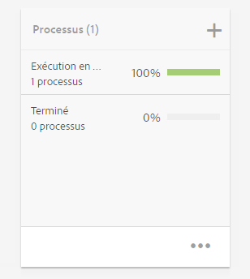

1. Ajoutez un élément à la mosaïque comme vous le feriez pour créer une mosaïque. Les mosaïques de projets sont décrites [ici](/help/sites-authoring/projects.md#project-tiles). Dans cet exemple, un autre worfklow a été ajouté.

   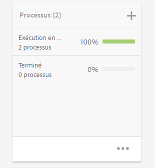

### Ouverture d’une mosaïque {#opening-a-tile}

Vous pouvez voir les éléments qui ont été ajoutés à une mosaïque ou modifier/supprimer des éléments de la mosaïque.

Pour ouvrir une mosaïque afin d’afficher ou de modifier des éléments :

1. Dans la console Projets, cliquez/appuyez sur les points de suspension (...)

   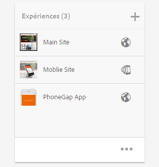

1. AEM répertorie les éléments contenus dans cette mosaïque. Vous pouvez activer le mode de sélection pour modifier ou supprimer des éléments.

   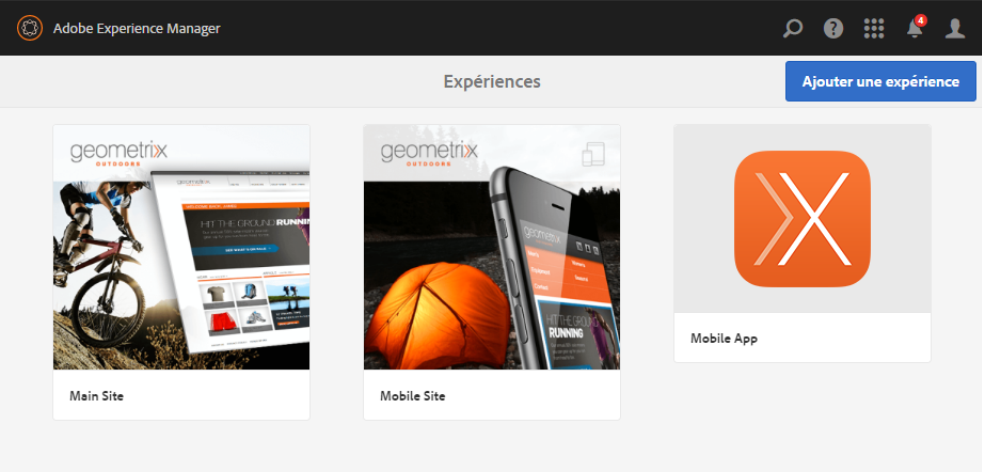

## Affichage des statistiques d’un projet {#viewing-project-statistics}

Pour afficher les statistiques de projet, dans la console **Projets**, cliquez sur **Afficher la vue Statistiques**. Le niveau d’avancement de chaque projet s’affiche. Cliquez une nouvelle fois sur **Afficher la vue Statistiques** pour accéder à la console **Projets**.

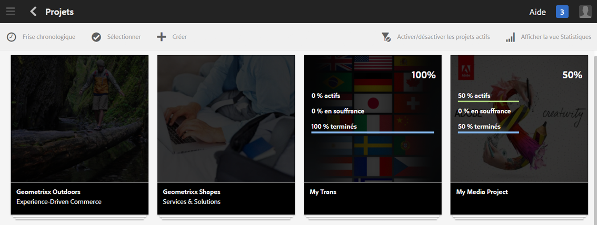

### Affichage d’une chronologie de projet {#viewing-a-project-timeline}

La chronologie du projet fournit des informations sur le moment auquel les ressources du projet ont été utilisées pour la dernière fois. Pour afficher la chronologie du projet, cliquez/appuyez sur **Chronologie**, puis activez le mode de sélection et sélectionnez le projet. Les ressources sont affichées dans le volet de gauche. Cliquez/appuyez sur **Chronologie** pour revenir à la console **Projets**.

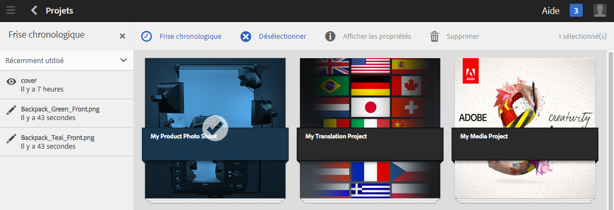

### Affichage de projets actifs/inactifs {#viewing-active-inactive-projects}

Pour basculer entre vos projets actifs et inactifs, dans la console **Projets**, cliquez sur **Activer/désactiver les projets actifs**. Si l’icône est accompagnée d’une coche, cela signifie qu’elle affiche les projets actifs.

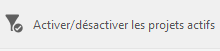

Si l’icône est accompagnée d’une croix (x), elle affiche les projets inactifs.

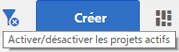

## Activation/désactivation de projets {#making-projects-inactive-or-active}

Vous pouvez désactiver un projet si vous l’avez terminé, mais que vous souhaitez conserver ses informations.

Pour activer/désactiver un projet :

1. Dans la console **Projets**, ouvrez votre projet, puis recherchez la mosaïque **Informations sur le projet**.

   >[!NOTE]
   Vous pourriez être amené à ajouter cette mosaïque, si ce n’est pas déjà fait dans votre projet. Voir [Ajout de mosaïques](#adding-items-to-a-tile).

1. Appuyez/cliquez sur **Modifier**.
1. Basculez la valeur du sélecteur entre **Actif** et **Inactif**.

   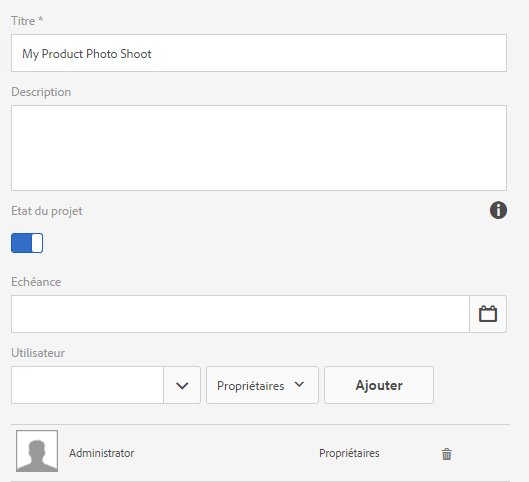

1. Cliquez/appuyez sur **Terminé** pour enregistrer vos modifications.

