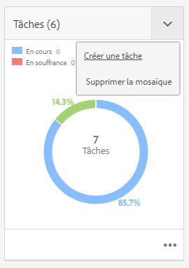

# Gestion de projets {#managing-projects}

Dans la console **Projets**, vous pouvez accéder à vos projets et les gérer.

Dans cette console, vous pouvez créer un projet, lui associer des ressources et supprimer un projet ou des liens vers des ressources.

## Conditions d’accès {#access-requirements}

Les projets sont une fonction d’AEM standard et ne nécessitent aucune configuration supplémentaire.

Cependant, pour que les utilisateurs participant à des projets puissent voir d’autres utilisateurs/groupes lorsqu’ils se servent des fonctionnalités de la console Projets, telles que créer des projets, créer des tâches/workflows ou afficher et gérer l’équipe, ils doivent disposer d’un accès en lecture à `/home/users` et à `/home/groups`.

Pour ce faire, le plus facile consiste à octroyer au groupe **projects-users** un accès en lecture à `/home/users` et à `/home/groups`.

## Création d’un projet {#creating-a-project}

Pour créer un projet, procédez comme suit.

1. Dans la console **Projets**, appuyez/cliquez sur **Créer** pour ouvrir l’assistant **Créer un projet**.
1. Sélectionnez le modèle, puis cliquez sur **Suivant**. Vous pouvez en savoir plus sur les modèles de projet standard [ici.](/help/sites-authoring/projects.md#project-templates)

   

1. Définissez la variable **Titre** et **Description** et ajoutez une **Miniature** image si nécessaire. Vous pouvez également ajouter ou supprimer des utilisateurs et définir le groupe auquel ils appartiennent.

   

1. Cliquez/appuyez sur **Créer**. Le message de confirmation vous demande si vous voulez ouvrir votre projet ou revenir à la console.

La procédure de création d’un projet est la même pour tous les modèles de projet. La différence entre les types de projets porte sur les [rôles utilisateur](/help/sites-authoring/projects.md) et les [workflows](/help/sites-authoring/projects-with-workflows.md) disponibles.

### Association de ressources à un projet {#associating-resources-with-your-project}

Les projets vous permettent de regrouper des ressources dans une seule entité pour les gérer dans leur ensemble. Par conséquent, vous devez associer des ressources à votre projet. Ces ressources sont regroupées dans le projet sous la forme **Mosaïques**. Les types de ressources que vous pouvez ajouter sont décrits à la section [Mosaïques de projet](/help/sites-authoring/projects.md#project-tiles).

Pour associer des ressources à votre projet :

1. Ouvrez votre projet à partir de la console **Projets**.
1. Appuyez/cliquez sur **Ajouter une mosaïque** et sélectionnez la mosaïque à lier à votre projet. Vous pouvez sélectionner plusieurs types de mosaïque.

   

1. Cliquez/appuyez sur **Créer**. La ressource est désormais associée à votre projet et vous pouvez y accéder à partir du projet.

### Ajout d’éléments à une mosaïque {#adding-items-to-a-tile}

Dans certaines mosaïques, vous pouvez ajouter plusieurs éléments. Par exemple, plusieurs workflows ou expériences peuvent s’exécuter à la fois.

Pour ajouter des éléments à une mosaïque, procédez comme suit :

1. Dans **Projets**, accédez au projet, puis cliquez sur l’icône en forme de chevron descendant en haut à droite de la mosaïque à laquelle vous souhaitez ajouter un élément et sélectionnez l’option appropriée.

   * L’option dépend du type de mosaïque. Par exemple, elle peut être **Créer une tâche** pour le **Tâche** ou **Démarrer le processus** pour le **Workflows** mosaïque.

   

1. Ajoutez l’élément à la mosaïque comme vous le feriez lors de la création d’une mosaïque. Les mosaïques de projets sont décrites [ici.](/help/sites-authoring/projects.md#project-tiles)

## Affichage des informations du projet {#viewing-project-info}

L’objectif principal des projets est de regrouper les informations associées dans un seul endroit afin de les rendre plus accessibles et exploitables. Vous pouvez accéder à ces informations de plusieurs façons.

### Ouverture d’une mosaïque {#opening-a-tile}

Vous pouvez afficher les éléments inclus dans une mosaïque actuelle ou modifier ou supprimer des éléments dans la mosaïque.

Pour ouvrir une mosaïque afin d’afficher ou de modifier des éléments :

1. Appuyez ou cliquez sur l’icône représentant des points de suspension en bas à droite de la mosaïque.

   

1. AEM ouvre la console pour les types d’éléments associés à la mosaïque et aux filtres en fonction du projet sélectionné.

   

### Affichage d’une chronologie de projet {#viewing-a-project-timeline}

La chronologie du projet fournit des informations sur le moment auquel les ressources du projet ont été utilisées pour la dernière fois. Pour afficher la chronologie du projet, procédez comme suit.

1. Dans la console **Projets**, cliquez ou appuyez sur **Chronologie** dans le sélecteur de rail en haut à gauche de la console.
   
2. Dans la console, sélectionnez le projet pour lequel vous souhaitez afficher la chronologie.
   

Les ressources s’affichent dans le rail. Utilisez le sélecteur de rail pour revenir à la vue normale lorsque vous avez terminé.

### Affichage des projets inactifs {#viewing-active-inactive-projects}

Pour basculer entre vos projets actifs et [inactifs](#making-projects-inactive-or-active), dans la console **Projets**, cliquez sur **Activer/désactiver les projets actifs** dans la barre d’outils.

Par défaut, la console affiche les projets principaux. Cliquez sur le bouton **Activation/désactivation de projets actifs** une fois pour passer à l’affichage des projets inactifs. Cliquez à nouveau dessus pour revenir aux projets principaux.

## Organisation des projets {#organizing-projects}

Plusieurs options permettent d’organiser vos projets de manière à faciliter la gestion de la console **Projets**.

### Dossiers de projets {#project-folders}

Vous pouvez créer des dossiers dans la console **Projets** pour regrouper et organiser des projets similaires.

1. Dans la console **Projets**, appuyez ou cliquez sur **Créer**, puis sur **Créer un dossier**.

   

1. Attribuez un titre à votre dossier et cliquez sur **Créer**.

1. Le dossier est ajouté à la console.

Vous pouvez désormais créer des projets dans ce dossier. Vous pouvez créer plusieurs dossiers et les imbriquer.

### Désactivation de projets {#making-projects-inactive-or-active}

Vous pouvez marquer un projet comme inactif s’il est terminé, mais vous souhaitez tout de même conserver les informations le concernant. [Les projets inactifs s’affichent désormais](#viewing-active-inactive-projects) par défaut dans la console **Projets**.

Pour rendre un projet inactif, procédez comme suit.

1. Ouvrez la fenêtre des **Propriétés du projet** du projet.
   * Vous pouvez le faire à partir de la console en sélectionnant le projet, ou à partir du projet dans la mosaïque **Informations sur le projet**.
1. Dans la fenêtre **Propriétés du projet**, déplacez le curseur **Statut du projet** d’**Actif** sur **Inactif**.

   

1. Appuyez ou cliquez sur **Enregistrer et fermer** pour enregistrer les modifications.

### Suppression de projets {#deleting-a-project}

Pour supprimer un projet, procédez comme suit.

1. Accédez au niveau supérieur de la **Projets** console.
1. Sélectionnez votre projet dans la console.
1. Appuyez ou cliquez sur **Supprimer** dans la barre d’outils.
1. AEM peut supprimer ou modifier les données associées au projet lors de la suppression du projet. Sélectionnez les options dont vous avez besoin dans la boîte de dialogue **Supprimer le projet**.
   * Supprimer les groupes de projets et les rôles
   * Supprimer le dossier de ressources du projet
   * Arrêter les workflows de projet

   
1. Appuyez ou cliquez sur **Supprimer** pour supprimer le projet avec les options sélectionnées.

Pour en savoir plus sur les groupes créés automatiquement par les projets, consultez la section [Création automatique de groupe](/help/sites-authoring/projects.md#auto-group-creation) pour plus d’informations.
