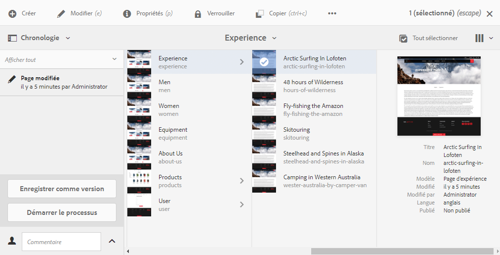
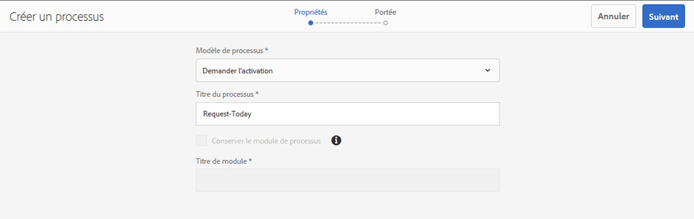
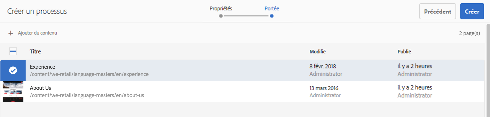
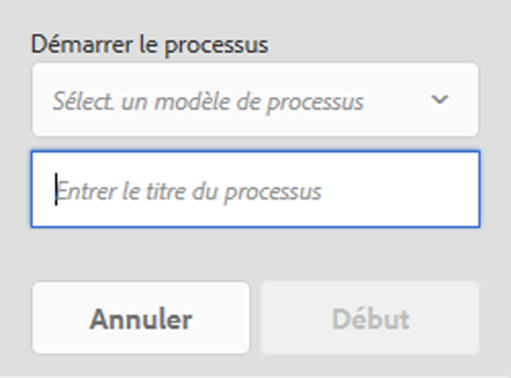

# Application de workflows aux pages  {#applying-workflows-to-pages}

Lors de la création de pages, vous avez la possibilité d’utiliser des workflows pour exécuter des actions sur vos pages. Il est possible d’appliquer plusieurs workflows.

Lorsque vous appliquez le workflow, vous spécifiez les informations suivantes :

* Workflow à appliquer.
Vous pouvez appliquer n’importe quel workflow (auquel vous avez accès, selon les affectations réalisées par votre administrateur AEM).
* Éventuellement, un titre permettant d’identifier l’instance de workflow dans la boîte de réception d’un utilisateur.
* La charge utile du workflow. Cela peut concerner une ou plusieurs pages.

Vous pouvez démarrer les workflows :

* [via la console Sites](#starting-a-workflow-from-the-sites-console).
* [lors de la modification d’une page, via Informations sur la page](#starting-a-workflow-from-the-page-editor).

>[!NOTE]
>
>Voir également :
>
>* [Application de workflows à des ressources de gestion des ressources numériques](/help/assets/assets-workflow.md).
>* [Utilisation des workflows de projet](/help/sites-authoring/projects-with-workflows.md).

>

>[!NOTE]
>
>Les administrateurs AEM peuvent [démarrer des workflow à l’aide de plusieurs autres méthodes](/help/sites-administering/workflows-starting.md).

## Démarrage d’un workflow à partir de la console Sites {#starting-a-workflow-from-the-sites-console}

Vous pouvez démarrer un workflow des deux manières suivantes :

* [Utiliser l’option Créer de la barre d’outils Sites](#starting-a-workflow-from-the-sites-toolbar).
* [Utiliser le rail Chronologie de la console Sites](#starting-a-workflow-from-the-timeline).

Dans les deux cas, vous aurez besoin d’effectuer les opérations suivantes :

* [Spécifier les détails du workflow dans l’assistant Créer un workflow](#specifying-workflow-details-in-the-create-workflow-wizard).

### Démarrage d’un workflow à partir de la barre d’outils Sites   {#starting-a-workflow-from-the-sites-toolbar}

Vous pouvez démarrer un workflow à partir de la barre d’outils de la console **Sites** :

1. Recherchez et sélectionnez la page voulue.

1. À partir de l’option **Créer** de la barre d’outils, vous pouvez maintenant sélectionner **Workflow**.

   

1. L’assistant **Créer un workflow** vous aidera à [spécifier les détails du workflow](#specifying-workflow-details-in-the-create-workflow-wizard).

### Démarrage d’un workflow à partir de la chronologie    {#starting-a-workflow-from-the-timeline}

Dans la **Chronologie**, vous pouvez démarrer un workflow à appliquer à la ressource sélectionnée.

1. [Sélectionnez la ressource](/help/sites-authoring/basic-handling.md#viewingandselectingyourresources) et ouvrez la [Chronologie](/help/sites-authoring/basic-handling.md#timeline) (ou ouvrez la chronologie, puis sélectionnez la ressource).
1. La pointe de la flèche située en regard du champ de commentaire peut être utilisée pour afficher **Démarrer le workflow** :

   

1. L’assistant **Créer un workflow** vous aidera à [spécifier les détails du workflow](#specifying-workflow-details-in-the-create-workflow-wizard).

### Spécification des détails du workflow dans l’assistant Créer un workflow    {#specifying-workflow-details-in-the-create-workflow-wizard}

L’assistant **Créer un workflow** vous permet de sélectionner le workflow et d’en spécifier les détails.

Après avoir ouvert l’assistant **Créer un workflow** de l’une des façons suivantes :

* [Utiliser l’option Créer de la barre d’outils Sites](#starting-a-workflow-from-the-sites-toolbar).
* [Utiliser le rail Chronologie de la console Sites](#starting-a-workflow-from-the-timeline).

Vous pouvez spécifier les détails du workflow :

1. Dans l’étape **Propriétés**, les options de base du workflow sont définies :

   * **Modèle de workflow**
   * **Titre du workflow**

      * Vous pouvez spécifier un titre pour cette instance pour vous permettre de l’identifier ultérieurement.

   En fonction du modèle de workflow, les options suivantes sont également disponibles. Elles permettent de conserver le module créé comme charge utile une fois le workflow terminé.

   * **Conserver le module de workflow**
   * **Titre de module**

      * Vous pouvez spécifier un titre pour le module, pour faciliter son identification.
   >[!NOTE]
   >
   >L’option **Conserver le module de workflow** est disponible lorsque le workflow a été configuré pour la prise en charge multi-ressource et que plusieurs ressources ont été sélectionnées.

   Une fois que vous avez terminé, cliquez sur **Suivant** pour continuer.

   

1. À l’étape **Domaine**, vous pouvez sélectionner :

   * **Ajouter du contenu** pour ouvrir [l’explorateur de chemins d’accès](/help/sites-authoring/author-environment-tools.md#path-browser) et sélectionner des ressources supplémentaires. Lorsque vous êtes dans l’explorateur, cliquez/appuyez sur **l’option de sélection** pour ajouter du contenu à l’instance de workflow.

   * Une ressource existante pour afficher d’autres actions :

      * **Inclure les enfants** pour indiquer que les enfants de la ressource seront inclus dans le workflow.
 Une boîte de dialogue s’ouvre pour vous permettre d’affiner la sélection selon les critères suivants :

         * Inclure seulement les enfants immédiats.
         * Inclure seulement les pages modifiées.
         * Inclure seulement les pages déjà publiées.

         Tous les enfants spécifiés seront ajoutés à la liste de ressources auquel le workflow s’appliquera.

      * **Supprimer la sélection** pour supprimer la ressource du workflow.

   

   >[!NOTE]
   >
   >Si vous ajoutez des ressources, vous pouvez utiliser l’option **Retour** pour ajuster le paramètre **Conserver le module de workflow** à l’étape **Propriétés**.

1. Utilisez l’option **Créer** pour fermer l’assistant et créer l’instance du workflow. Une notification s’affiche dans la console Sites.

## Démarrage d’un workflow à partir de l’éditeur de page    {#starting-a-workflow-from-the-page-editor}

Lors de la modification d’une page, vous pouvez sélectionner **Informations sur la page** dans la barre d’outils. Le menu déroulant contient l’option **Démarrer dans le workflow**. Cette option ouvre une boîte de dialogue dans laquelle vous pouvez spécifier le workflow requis, ainsi qu’un titre si nécessaire :

