# Participation aux workflows  {#participating-in-workflows}

Les workflows incluent généralement les étapes qu’une personne doit suivre pour réaliser une activité sur une page ou sur une ressource. Le workflow sélectionne un utilisateur ou un groupe pour qu’il mette en œuvre l’activité en question et attribue un élément de travail à cette personne ou à ce groupe. L’utilisateur reçoit la notification et peut alors réaliser l’action appropriée :

* [Affichage des notifications](#notifications-of-available-workflow-actions)
* [Finalisation d’une étape de participant](#completing-a-participant-step)
* [Délégation d’une étape de participant](#delegating-a-participant-step)
* [Revenir d’une étape de participant en arrière](#performing-step-back-on-a-participant-step)
* [Ouverture d’un élément de workflow pour afficher les détails (et réaliser des actions)](#opening-a-workflow-item-to-view-details-and-take-actions)
* [Affichage de la charge utile de workflow (plusieurs ressources)](#viewing-the-workflow-payload-multiple-resources)

## Notifications d’actions de workflow disponibles   {#notifications-of-available-workflow-actions}

Lorsqu’une tâche vous est attribuée (par exemple, **Approuver le contenu**), diverses alertes et/ou notifications s’affichent :

* Votre indicateur de [notification](/help/sites-authoring/inbox.md) (barre d’outils) sera incrémenté :

   

* L’élément est répertorié dans votre [boîte de réception](/help/sites-authoring/inbox.md) de notifications :

   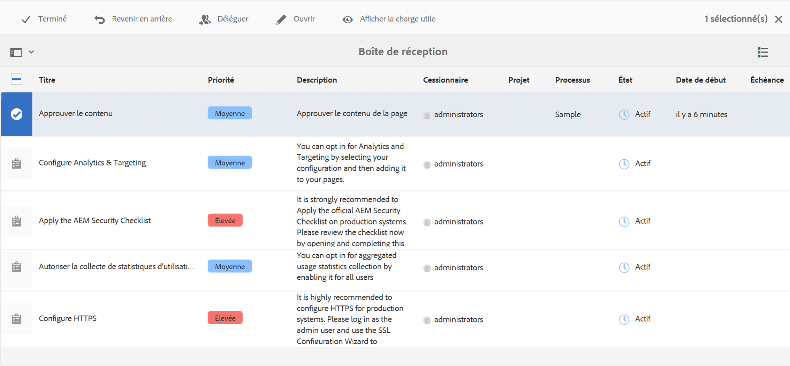

* Lorsque vous utilisez l’éditeur de page, la barre d’état affiche :

   * Le nom du ou des workflows appliqués à la page ; par exemple, Demander l’activation.
   * Les actions auxquelles l’utilisateur actuel a accès pour l’étape actuelle du workflow ; par exemple, Compléter, Déléguer et Afficher les détails.
   * Le nombre de workflows auxquels la page est soumise. Vous pouvez :

      * utiliser les flèches gauche/droite pour parcourir les informations d’état des différents workflows.
      * cliquer/appuyer sur le nombre pour ouvrir la liste déroulante de tous les workflows applicables, puis sélectionner le workflow que vous souhaitez afficher dans la barre d’état.

   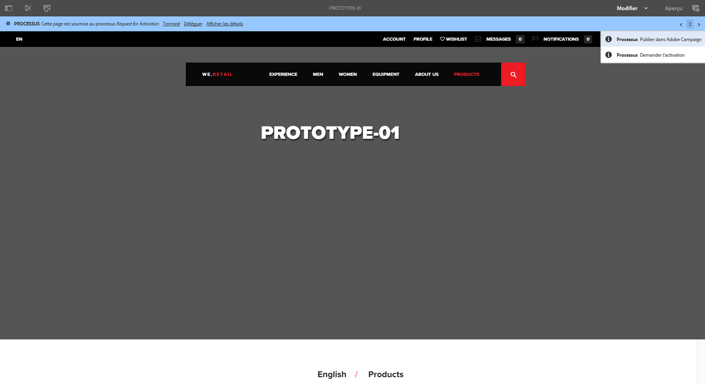

   >[!NOTE]
   >
   >La barre d’état est uniquement visible pour les utilisateurs disposant de droits de workflow ; par exemple, les membres du groupe `workflow-users`.
   >
   >
   >Les actions s’affichent lorsque l’utilisateur actuel est directement impliqué dans l’étape actuelle du workflow.

* Lorsque la **chronologie** est ouverte pour la ressource, l’étape du workflow s’affiche. Lorsque vous cliquez/appuyez sur la bannière d’avertissement, les actions disponibles sont également affichées :

   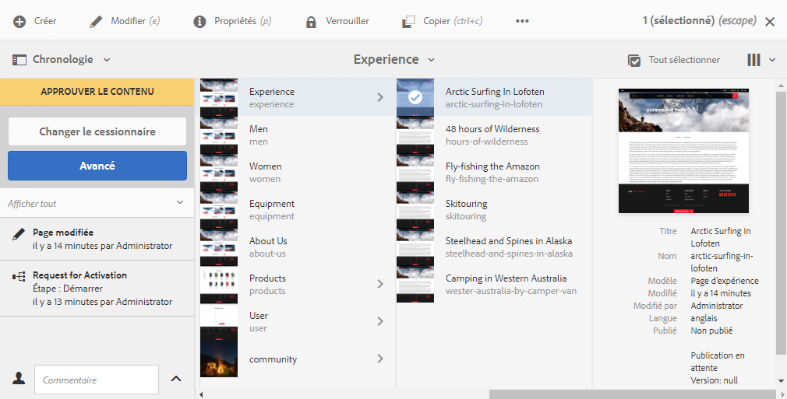

### Réalisation d’une étape de participant {#completing-a-participant-step}

Vous pouvez terminer un élément pour permettre au workflow de passer à l’étape suivante.

Pour cette action, vous pouvez indiquer :

* **Étape suivante** : la prochaine étape à suivre ; vous pouvez la sélectionner dans la liste fournie.
* **Commentaire** : si nécessaire

Vous pouvez terminer une étape de participant à partir des éléments suivants :

* [la boîte de réception](#completing-a-participant-step-inbox)
* [l’éditeur de page](#completing-a-participant-step-page-editor)
* [Chronologie](#completing-a-participant-step-timeline)
* l’[ouverture d’un élément de workflow pour en afficher les détails](#opening-a-workflow-item-to-view-details-and-take-actions).

#### Réalisation d’une étape de participant - Boîte de réception {#completing-a-participant-step-inbox}

Utilisez la procédure suivante pour terminer l’élément de travail :

1. Ouvrez la **[boîte de réception AEM](/help/sites-authoring/inbox.md)**.
1. Sélectionnez l’élément de workflow sur lequel vous souhaitez agir (appuyez/cliquez sur la miniature).
1. Sélectionnez **Terminer** dans la barre d’outils.
1. La boîte de dialogue **Terminer l’élément de travail** s’ouvre. Choisissez **Étape suivante** dans la liste déroulante et ajoutez un **commentaire** s’il y a lieu.
1. Cliquez sur **OK** pour terminer l’étape (ou **Annuler** pour annuler l’action).

#### Réalisation d’une étape de participant - Éditeur de page {#completing-a-participant-step-page-editor}

Utilisez la procédure suivante pour terminer l’élément de travail :

1. Ouvrez la [page à modifier](/help/sites-authoring/managing-pages.md#opening-a-page-for-editing).
1. Sélectionnez **Terminer** dans la barre d’état en haut.
1. La boîte de dialogue **Terminer l’élément de travail** s’ouvre. Choisissez **Étape suivante** dans la liste déroulante et ajoutez un **commentaire** s’il y a lieu.
1. Cliquez sur **OK** pour terminer l’étape (ou **Annuler** pour annuler l’action).

#### Réalisation d’une étape de participant - Chronologie {#completing-a-participant-step-timeline}

Vous pouvez également utiliser la chronologie pour terminer et avancer d’une étape :

1. Sélectionnez la page requise et ouvrez la **chronologie** (ou ouvrez la **chronologie** et sélectionnez la page) :

   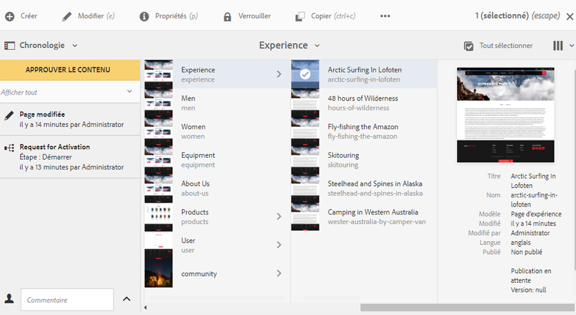

1. Cliquez/appuyez sur la bannière d’alerte pour afficher les actions disponibles. Sélectionnez l’option **Avancer** :

   

1. Selon le workflow, vous pouvez choisir l’étape suivante :

   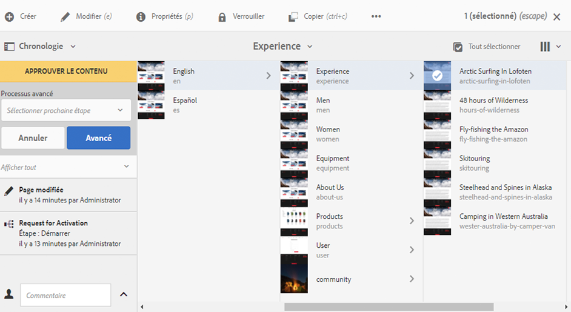

1. Sélectionnez l’option **Avancer** pour confirmer l’action.

### Délégation d’une étape de participant   {#delegating-a-participant-step}

Si une étape vous a été affectée, mais que pour une raison quelconque, vous ne pouvez pas vous en charger, vous pouvez la déléguer à un autre utilisateur ou groupe.

Les utilisateurs à qui vous pouvez déléguer une étape dépendent de la personne à qui l’élément de travail a été attribué :

* Si l’élément de travail a été attribué à un groupe, les membres du groupe sont disponibles.
* Si l’élément de travail a été attribué à un groupe puis délégué à un utilisateur, les membres du groupe et le groupe sont disponibles.
* Si l’élément de travail a été attribué à un utilisateur unique, l’élément de travail ne peut pas être délégué.

Pour cette action, vous pouvez indiquer :

* **Utilisateur** : l’utilisateur auquel déléguer ; vous pouvez le sélectionner dans la liste fournie.
* **Commentaire** : si nécessaire

Vous pouvez déléguer une étape de participant à partir de :

* [la boîte de réception](#delegating-a-participant-step-inbox)
* [l’éditeur de page](#delegating-a-participant-step-page-editor)
* [Chronologie](#delegating-a-participant-step-timeline)
* l’[ouverture d’un élément de workflow pour en afficher les détails](#opening-a-workflow-item-to-view-details-and-take-actions).

#### Délégation d’une étape de participant - Boîte de réception {#delegating-a-participant-step-inbox}

Utilisez la procédure suivante pour déléguer un élément de travail :

1. Ouvrez la **[boîte de réception AEM](/help/sites-authoring/inbox.md)**.
1. Sélectionnez l’élément de workflow sur lequel vous souhaitez agir (appuyez/cliquez sur la miniature).
1. Sélectionnez **Déléguer** dans la barre d’outils.
1. Une boîte de dialogue s’ouvre. Définissez l’**utilisateur** dans le sélecteur déroulant (il peut également s’agir d’un groupe) et ajoutez un **commentaire** si nécessaire.
1. Cliquez sur **OK** pour terminer l’étape (ou **Annuler** pour annuler l’action).

#### Délégation d’une étape de participant - Éditeur de page {#delegating-a-participant-step-page-editor}

Utilisez la procédure suivante pour déléguer un élément de travail :

1. Ouvrez la [page à modifier](/help/sites-authoring/managing-pages.md#opening-a-page-for-editing).
1. Sélectionnez **Déléguer** dans la barre d’état en haut.
1. Une boîte de dialogue s’ouvre. Définissez l’**utilisateur** dans le sélecteur déroulant (il peut également s’agir d’un groupe) et ajoutez un **commentaire** si nécessaire.
1. Cliquez sur **OK** pour terminer l’étape (ou **Annuler** pour annuler l’action).

#### Délégation d’une étape de participant - Chronologie {#delegating-a-participant-step-timeline}

Vous pouvez également utiliser la chronologie pour déléguer et/ou attribuer une étape :

1. Sélectionnez la page requise et ouvrez la **chronologie** (ou ouvrez la **chronologie** et sélectionnez la page).
1. Cliquez/appuyez sur la bannière d’alerte pour afficher les actions disponibles. Sélectionnez **Changer le cessionnaire** :

   

1. Spécifiez un nouveau cessionnaire :

   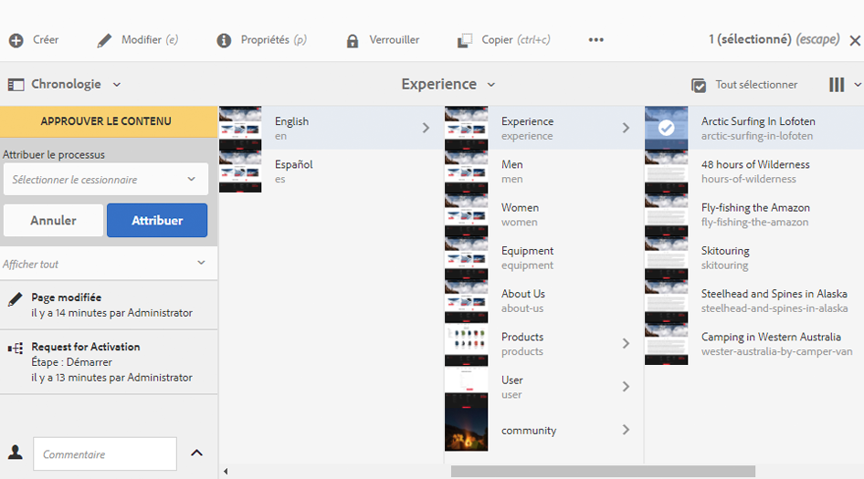

1. Sélectionnez **Attribuer** pour confirmer l’action.

### Revenir d’une étape de participant en arrière {#performing-step-back-on-a-participant-step}

Si vous vous rendez compte qu’une étape ou qu’une série d’étapes doit être répétée, vous pouvez revenir en arrière. Cela vous permet de sélectionner une étape qui s’est produite plus tôt dans le workflow pour la traiter à nouveau. Le workflow retourne à l’étape spécifiée et poursuit à partir de là.

Pour cette action, vous pouvez indiquer :

* **Étape précédente** : l’étape vers laquelle revenir ; vous pouvez la sélectionner dans la liste fournie.
* **Commentaire** : si nécessaire

Vous pouvez revenir d’une étape de participant en arrière à partir de :

* [la boîte de réception](#performing-step-back-on-a-participant-step-inbox)
* [l’éditeur de page](#performing-step-back-on-a-participant-step-page-editor)
* [Chronologie](#performing-step-back-on-a-participant-step-timeline)
* l’[ouverture d’un élément de workflow pour en afficher les détails](#opening-a-workflow-item-to-view-details-and-take-actions).

#### Revenir d’une étape de participant en arrière - Boîte de réception {#performing-step-back-on-a-participant-step-inbox}

Utilisez la procédure suivante pour revenir en arrière :

1. Ouvrez la **[boîte de réception AEM](/help/sites-authoring/inbox.md)**.
1. Sélectionnez l’élément de workflow sur lequel vous souhaitez agir (appuyez/cliquez sur la miniature).
1. Sélectionnez **Revenir en arrière** pour ouvrir la boîte de dialogue.

1. Définissez l’**étape précédente** et ajoutez un **commentaire** si nécessaire.
1. Cliquez sur **OK** pour terminer l’étape (ou **Annuler** pour annuler l’action).

#### Revenir d’une étape de participant en arrière - Éditeur de page {#performing-step-back-on-a-participant-step-page-editor}

Utilisez la procédure suivante pour revenir en arrière :

1. Ouvrez la [page à modifier](/help/sites-authoring/managing-pages.md#opening-a-page-for-editing).
1. Sélectionnez **Revenir en arrière** dans la barre d’état en haut.
1. Définissez l’**étape précédente** et ajoutez un **commentaire** si nécessaire.
1. Cliquez sur **OK** pour terminer l’étape (ou **Annuler** pour annuler l’action).

#### Revenir d’une étape de participant en arrière - Chronologie {#performing-step-back-on-a-participant-step-timeline}

Vous pouvez également utiliser la chronologie pour revenir à une étape précédente et la restaurer :

1. Sélectionnez la page requise et ouvrez la **chronologie** (ou ouvrez la **chronologie** et sélectionnez la page).
1. Cliquez/appuyez sur la bannière d’alerte pour afficher les actions disponibles. Sélectionnez **Restaurer** :

   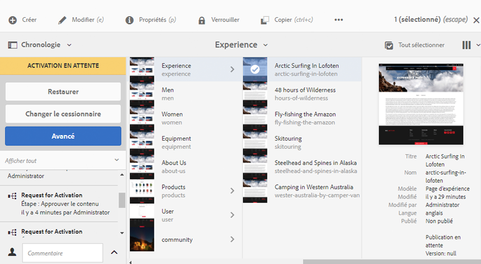

1. Spécifiez l’étape à laquelle le workflow doit revenir :

   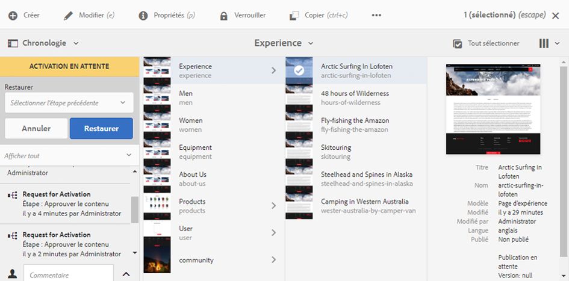

1. Sélectionnez **Restaurer** pour confirmer l’action.

### Ouverture d’un élément de workflow pour afficher les détails (et réaliser des actions) {#opening-a-workflow-item-to-view-details-and-take-actions}

Affichez les détails de l’élément de travail du workflow et réalisez les actions appropriées.

Les détails de workflow s’affichent dans des onglets, et les actions appropriées sont disponibles dans la barre d’outils :

* Onglet **ÉLÉMENT DE TRAVAIL** :

   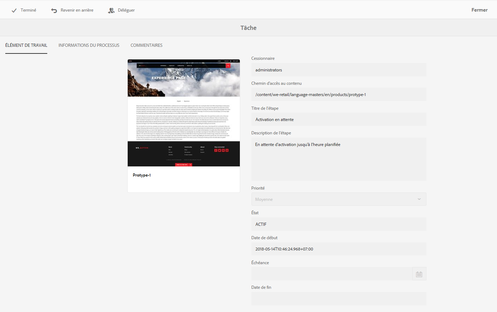

* Onglet **INFORMATIONS DU WORFKLOW** :

   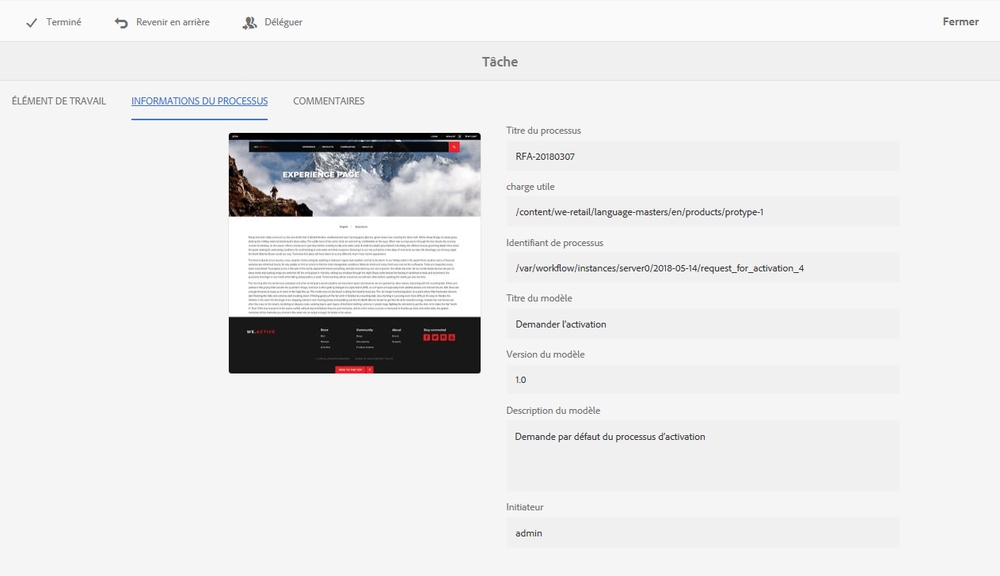

   Si des [étapes de workflow](/help/sites-developing/workflows.md#workflow-stages) ont été configurées pour le modèle, vous pouvez afficher la progression en fonction de ces éléments :

   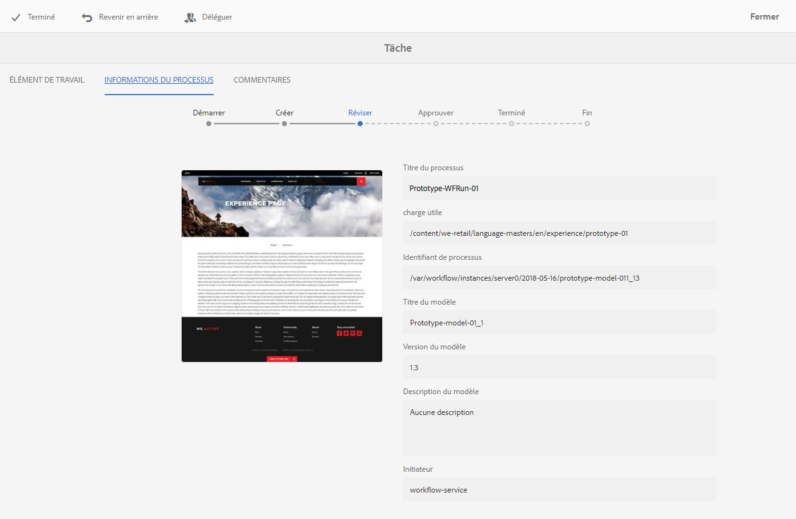

* Onglet **COMMENTAIRES** :

   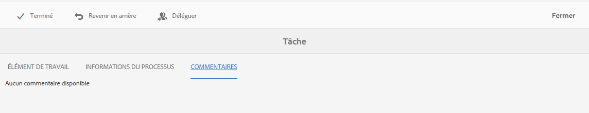

Vous pouvez ouvrir les détails de l’élément de travail à partir de :

* [la boîte de réception](#performing-step-back-on-a-participant-step-inbox)
* [l’éditeur de page](#performing-step-back-on-a-participant-step-page-editor)

#### Ouverture des détails de workflow - Boîte de réception {#opening-workflow-details-inbox}

Pour ouvrir un élément de workflow et en afficher les détails :

1. Ouvrez la **[boîte de réception AEM](/help/sites-authoring/inbox.md)**.
1. Sélectionnez l’élément de workflow sur lequel vous souhaitez agir (appuyez/cliquez sur la miniature).
1. Sélectionnez **Ouvrir** pour ouvrir les onglets d’informations.

1. Si nécessaire, choisissez l’action appropriée, saisissez les informations et confirmez avec **OK** (ou **Annuler**).
1. Utilisez **Enregistrer** ou **Annuler** pour quitter.

#### Ouverture des détails de workflow - Éditeur de page {#opening-workflow-details-page-editor}

Pour ouvrir un élément de workflow et en afficher les détails :

1. Ouvrez la [page à modifier](/help/sites-authoring/managing-pages.md#opening-a-page-for-editing).
1. Sélectionnez **Afficher les détails** dans la barre d’état pour ouvrir les onglets d’informations.

1. Si nécessaire, choisissez l’action appropriée, saisissez les informations et confirmez avec **OK** (ou **Annuler**).
1. Utilisez **Enregistrer** ou **Annuler** pour quitter.

### Affichage de la charge utile de workflow (plusieurs ressources) {#viewing-the-workflow-payload-multiple-resources}

Vous pouvez afficher les détails de la charge utile associée à l’instance de workflow. Au départ, les ressources du module sont affichées, puis vous pouvez faire un zoom avant pour afficher les pages individuelles.

Pour afficher la charge utile et les ressources de l’instance de workflow :

1. Ouvrez la **[boîte de réception AEM](/help/sites-authoring/inbox.md)**.
1. Sélectionnez l’élément de workflow sur lequel vous souhaitez agir (appuyez/cliquez sur la miniature).
1. Sélectionnez **Afficher la charge utile** dans la barre d’outils pour ouvrir la boîte de dialogue.

   Un module de workflow étant simplement un ensemble de pointeurs vers les chemins d’accès au sein du référentiel, vous pouvez y ajouter, supprimer ou modifier les entrées pour définir ce qu’il référence. Utilisez le composant **Définition de la ressource** pour ajouter de nouvelles entrées.

   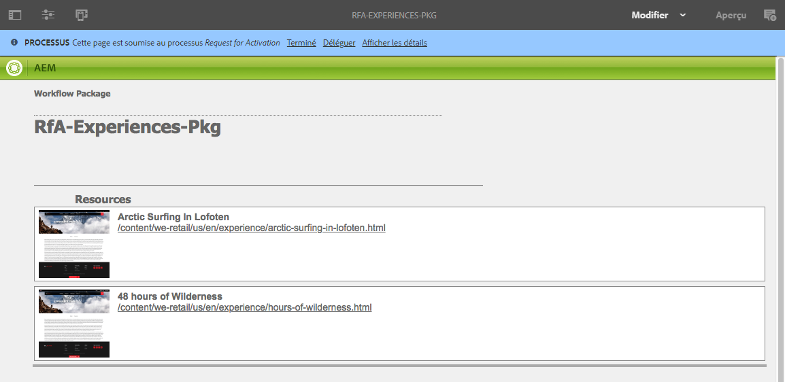

1. Les liens peuvent être utilisés pour ouvrir les pages individuelles.
