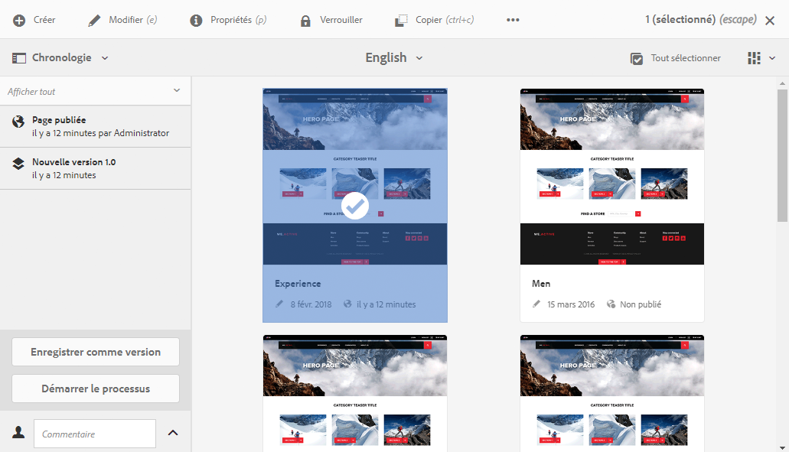
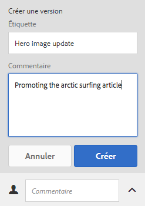
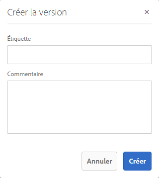
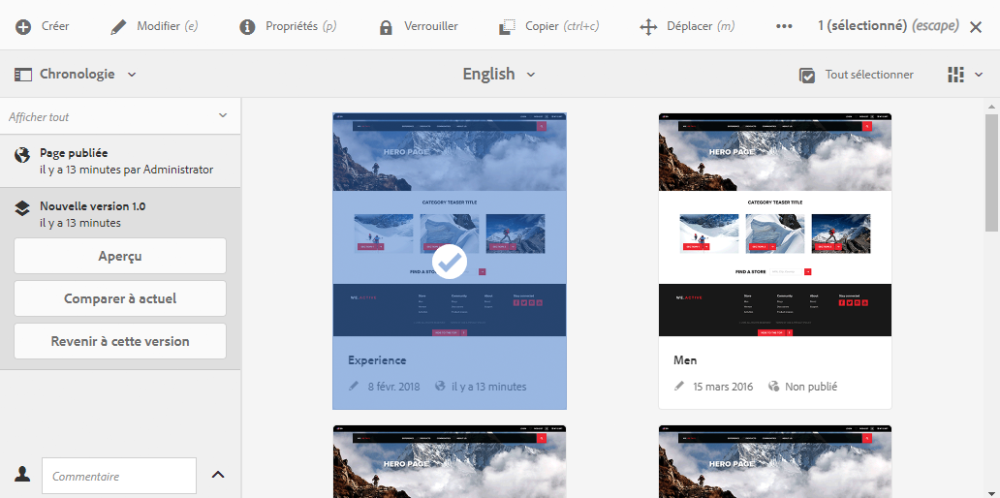
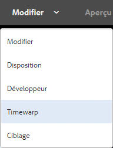
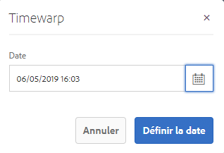
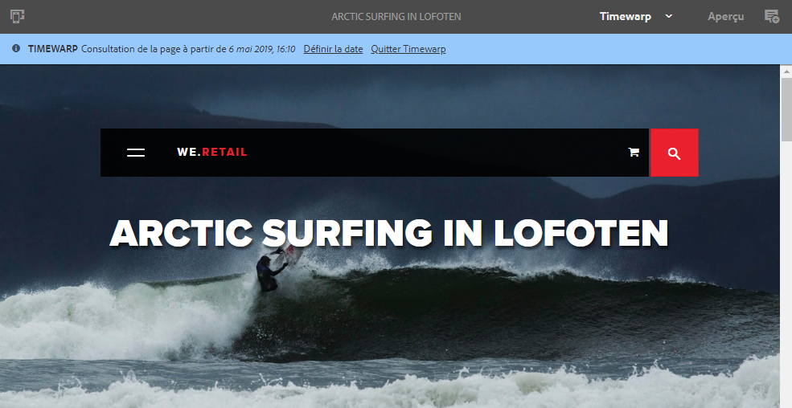

# Utilisation des versions de page{#working-with-page-versions}

Le contrôle de version permet de créer un « instantané » d’une page à un moment donné. Avec le contrôle de version, vous pouvez effectuer les opérations suivantes :

* Créez une version d’une page.
* Restaurer une page sur une version précédente ; par exemple :
   * pour annuler une modification que vous avez apportée à la page.
* Comparer la version actuelle d’une page à une version précédente:
   * pour mettre en évidence les différences entre le texte et les images.

## Création d’une version {#creating-a-new-version}

Vous pouvez créer une version de votre ressource depuis :

* le [rail chronologie](#creating-a-new-version-timeline) ;
* l’option [Créer](#creating-a-new-version-create-with-a-selected-resource) (lorsqu’une ressource est sélectionnée).

### Création d’une version – Chronologie {#creating-a-new-version-timeline}

1. Accédez à la page pour laquelle créer une version.
1. Sélectionnez la page en [mode de sélection](/help/sites-authoring/basic-handling.md#viewing-and-selecting-resources).
1. Ouvrez la colonne **Chronologie**.
1. Cliquez ou appuyez sur la flèche près du champ de commentaire pour afficher les options :

   

1. Sélectionnez **Enregistrer comme version**.
1. Saisissez un **Libellé** et **Commentaire** si nécessaire.

   

1. Confirmez la nouvelle version avec l’option **Créer**.

   Les informations dans la frise chronologique sont mises à jour pour indiquer la nouvelle version.

### Création d’une version – Création avec une ressource sélectionnée {#creating-a-new-version-create-with-a-selected-resource}

1. Accédez à la page pour laquelle créer une version.
1. Sélectionnez la page en [mode de sélection](/help/sites-authoring/basic-handling.md#viewing-and-selecting-resources).
1. Sélectionnez la variable **Créer** dans la barre d’outils pour ouvrir la boîte de dialogue.
1. Dans la boîte de dialogue, vous pouvez saisir une **Libellé** et un **Commentaire**, si nécessaire :

   

1. Confirmez la nouvelle version avec l’option **Créer**.

   La frise chronologique s’ouvre avec les informations mises à jour afin d’indiquer la nouvelle version.

## Rétablissement de versions {#reinstating-versions}

Une fois que vous avez créé une version de votre page, différentes méthodes permettent de rétablir une version antérieure :

* l’option **Revenir à cette version** depuis le rail [Chronologie](/help/sites-authoring/basic-handling.md#timeline)

  Rétablissez une version antérieure d’une page sélectionnée.

* les options **Restaurer** de la [barre d’outils d’actions](/help/sites-authoring/basic-handling.md#actions-toolbar) en haut de la page

   * **Restaurer la version**

     Rétablissez des versions de pages spécifiées dans le dossier actuellement sélectionné ; cela peut également inclure la restauration de pages qui ont été supprimées précédemment.

   * **Restaurer l’arborescence**

     Rétablissez une version d’une arborescence complète à une date et une heure spécifiées ; cela peut inclure des pages qui ont été supprimées précédemment.

>[!NOTE]
>
>Lors du rétablissement d’une page, la version créée fait partie d’une nouvelle branche.
>
>Illustration :
>
>1. Créez des versions d’une page.
>1. Les libellés et les noms de noeud de version initiaux sont 1.0, 1.1, 1.2, etc.
>1. Rétablissez la première version ; dans ce cas, 1.0.
>1. Créez à nouveau de nouvelles versions.
>1. Les libellés et les noms de noeud générés seront désormais 1.0.0, 1.0.1, 1.0.2, etc.

### Rétablissement d’une version {#revert-to-a-version}

Pour **rétablir** la version précédente d’une page sélectionnée :

1. Naviguez pour afficher la page pour laquelle restaurer une ancienne version.
1. Sélectionnez la page en [mode de sélection](/help/sites-authoring/basic-handling.md#viewing-and-selecting-resources).
1. Ouvrez la colonne **Chronologie**, puis sélectionnez **Afficher tout** ou **Versions**. Les versions de la page sélectionnée sont répertoriées.
1. Sélectionnez la version à restaurer. Les options possibles s’affichent :

   

1. Sélectionnez **Revenir à cette version**. La version sélectionnée est restaurée et les informations de la chronologie mises à jour.

### Restaurer la version {#restore-version}

Cette méthode permet de rétablir des versions de pages spécifiées dans le dossier actuel ; cela peut également inclure la restauration de pages qui ont été supprimées précédemment :

1. Recherchez et [sélectionnez](/help/sites-authoring/basic-handling.md#viewing-and-selecting-resources) le dossier souhaité.

1. Sélectionnez **Restaurer**, puis **Restaurer la version** dans la [barre d’outils d’actions](/help/sites-authoring/basic-handling.md#actions-toolbar) en haut de la page.

   >[!NOTE]
   >
   >Si :
   >
   >* vous avez sélectionné une seule page qui n’a jamais eu de pages enfants,
   >* ou aucune des pages du dossier ne comporte de version,
   >
   >L’affichage est alors vide, car aucune version n’est applicable.

1. Les versions disponibles sont répertoriées :

   

1. Pour une page spécifique, utilisez le sélecteur déroulant sous **RESTAURER VERS LA VERSION** pour sélectionner la version requise pour cette page.

   

1. Dans l’affichage principal, sélectionnez la page à restaurer :

   

1. Sélectionnez **Restaurer** pour la version sélectionnée de la page sélectionnée à restaurer en tant que version actuelle.

>[!NOTE]
>
>L’ordre dans lequel vous sélectionnez une page requise et la version associée est interchangeable.

### Restaurer l’arborescence {#restore-tree}

Cette méthode permet de restaurer une version d’une arborescence à une date et une heure spécifiées ; cela peut inclure des pages qui ont été supprimées précédemment :

1. Recherchez et [sélectionnez](/help/sites-authoring/basic-handling.md#viewing-and-selecting-resources) le dossier souhaité.

1. Sélectionnez **Restaurer**, puis **Restaurer l’arborescence** dans la [barre d’outils d’actions](/help/sites-authoring/basic-handling.md#actions-toolbar) en haut de la page. La dernière version de l’arborescence apparaît :

   

1. Utilisez le sélecteur de date et d’heure dans **Dernières versions en date** pour sélectionner une autre version de l’arborescence : celle qui doit être restaurée.

1. Définissez l’indicateur **Pages non versionnées préservées** selon les besoins :

   * Si cette option est active (sélectionnée), toutes les pages non versionnées sont conservées et ne sont pas affectées par la restauration.

   * Si elle est inactive (non sélectionnée), toutes les pages non versionnées sont supprimées, car elles n’existaient pas dans l’arborescence versionnée.

1. Sélectionnez **Restaurer** pour la version sélectionnée de l’arborescence à restaurer comme version *actuelle*.

## Aperçu d’une version {#previewing-a-version}

Vous pouvez prévisualiser une version spécifique :

1. Accédez à la page que vous souhaitez comparer.
1. Sélectionnez la page en [mode de sélection](/help/sites-authoring/basic-handling.md#viewing-and-selecting-resources).
1. Ouvrez la colonne **Chronologie**, puis sélectionnez **Afficher tout** ou **Versions**.
1. Les versions de page sont répertoriées. Sélectionnez la version que vous souhaitez prévisualiser :

   

1. Sélectionnez **Aperçu**. La page s’affiche dans un nouvel onglet.

   >[!CAUTION]
   >
   >Si une page a été déplacée, vous ne pouvez plus afficher l’aperçu des versions antérieures au déplacement.
   >
   >* Si vous rencontrez des problèmes avec un aperçu, vérifiez la variable [Frise chronologique](/help/sites-authoring/basic-handling.md#timeline) de la page afin de voir si la page a été déplacée.

## Comparaison d’une ancienne version avec la page actuelle {#comparing-a-version-with-current-page}

Pour comparer une version précédente à la page actuelle :

1. Accédez à la page que vous souhaitez comparer.
1. Sélectionnez la page en [mode de sélection](/help/sites-authoring/basic-handling.md#viewing-and-selecting-resources).
1. Ouvrez la colonne **Chronologie**, puis sélectionnez **Afficher tout** ou **Versions**.
1. Les versions de page sont répertoriées. Sélectionnez la version que vous souhaitez comparer :

   

1. Sélectionner **Comparer avec la version actuelle**. La variable [comparaison des pages](/help/sites-authoring/page-diff.md) s’ouvre pour afficher les différences.

## Distorsion du temps Timewarp {#timewarp}

La fonction de distorsion du temps Timewarp permet de simuler l’état *publié* d’une page à des moments spécifiques dans le passé.

>[!TIP]
>
>[Timewarp peut également être utilisé avec les lancements pour prévisualiser les futurs](/help/sites-authoring/launches.md) lors de l’exécution d’AEM version 6.5.10.0 ou supérieure.

La création de contenu est un processus continu et collaboratif. L’objectif de Timewarp est de permettre aux auteurs de suivre le site web publié au fil du temps, afin de les aider à comprendre comment le contenu a changé. Cette fonctionnalité utilise les versions de page pour déterminer l’état de l’environnement de publication:

* Le système recherche la version de page qui était active à l’heure sélectionnée.
   * Cette version de page a été créée/activée. *before* point dans le temps sélectionné dans Timewarp.
* Lorsque vous accédez à une page qui a été supprimée, elle est également rendue, à condition que les anciennes versions de la page soient toujours disponibles dans le référentiel.
* Si aucune version publiée n’est trouvée, la fonction Timewarp revient à l’état actuel de la page dans l’environnement de création (afin d’éviter une erreur/page 404, ce qui empêcherait la navigation).

### Utilisation de Timewarp {#using-timewarp}

Timewarp est un [mode](/help/sites-authoring/author-environment-tools.md#page-modes) de l’éditeur de page. Pour le démarrer, il vous suffit de l’activer comme vous le feriez pour tout autre mode.

1. Démarrez l’éditeur de la page sur laquelle vous souhaitez démarrer Timewarp, puis sélectionnez **Timewarp** dans la sélection de mode.

   

1. Dans la boîte de dialogue, définissez une date et une heure cibles, puis cliquez ou appuyez sur **Définir la date**. Si vous ne sélectionnez pas d’heure, l’heure actuelle est utilisée par défaut.

   

1. La page s’affiche en fonction de la date définie. Le mode Timewarp est indiqué à partir de la barre d’état bleue située en haut de la fenêtre. Utilisez les liens de la barre d’état pour sélectionner une nouvelle date cible ou quitter le mode Timewarp.

   

### Limites du mode Timewarp {#timewarp-limitations}

Timewarp s’efforce de reproduire au mieux une page à un moment donné. Cependant, en raison de la complexité de la création continue de contenu dans AEM, cela n’est pas toujours possible. Ces restrictions doivent être prises en compte lors de l’utilisation de Timewarp.

* **Timewarp fonctionne sur la base de pages publiées** : toutes les fonctionnalités de Timewarp ne sont disponibles que si vous avez publié la page précédemment. Dans le cas contraire, Timewarp affiche la page active dans l’environnement de création.
* **Timewarp utilise des versions de page** : si vous accédez à une page qui a été supprimée du référentiel, elle s’affiche correctement si d’anciennes versions sont toujours disponibles dans le référentiel.
* **Les versions supprimées affectent Timewarp** : si des versions sont supprimées du référentiel, Timewarp n’est pas en mesure d’afficher la vue correcte.

* **Timewarp est en lecture seule** : vous ne pouvez pas modifier l’ancienne version de la page. Elle est disponible uniquement à des fins d’affichage. Si vous souhaitez restaurer l’ancienne version, vous devez effectuer cette opération manuellement à l’aide de [Restaurer](#reverting-to-a-page-version).

* **La fonction Timewarp est uniquement basée sur le contenu de la page.** - Si les éléments pour le rendu du site web ont été modifiés, la vue diffère de ce qu’elle était initialement, car ces éléments ne sont pas versionnés dans le référentiel. Ces éléments incluent du code, des feuilles de style CSS, des ressources/des images, entre autres.

>[!CAUTION]
>
>Timewarp est un outil conçu pour aider les auteurs à comprendre et à créer du contenu. Il ne s’agit pas d’un journal d’audit et il n’est pas destiné à des fins juridiques.
