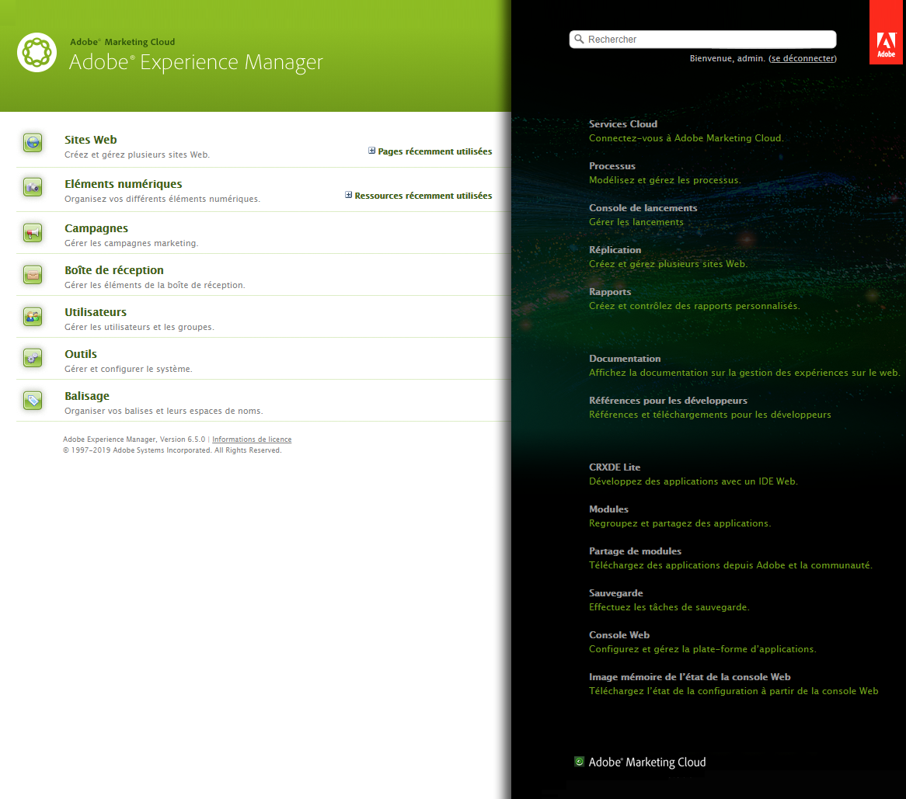
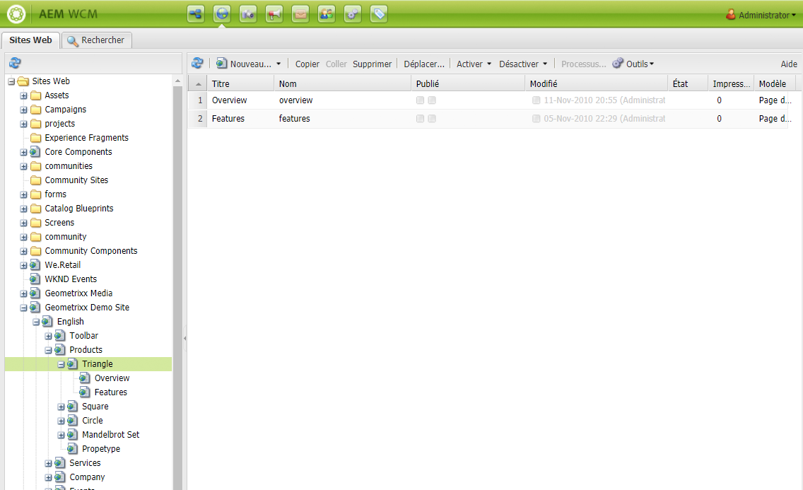
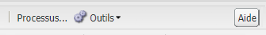
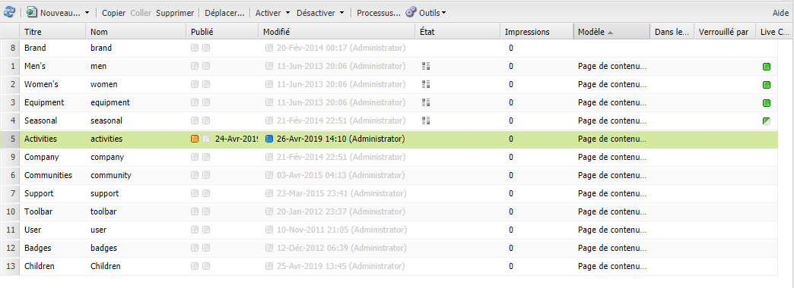
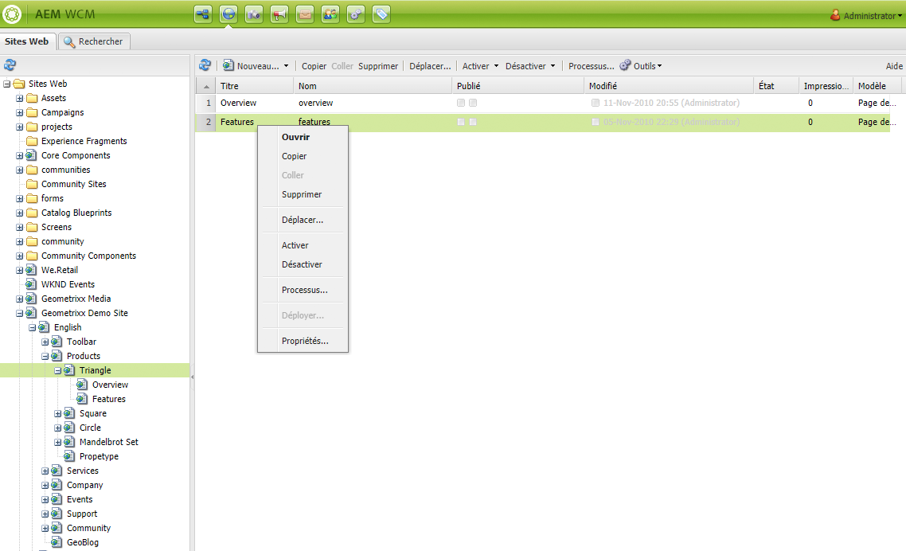

# Manipulation de base{#basic-handling}

>[!NOTE]
>
>* Cette page donne un aperçu des opérations de gestion de base dans l’environnement de création d’AEM. Il utilise la console **Sites** comme base.
   >
   >
* Certaines fonctionnalités ne sont pas disponibles sur toutes les consoles et/ou des fonctionnalités supplémentaires sont disponibles sur certaines consoles. Vous trouverez des informations spécifiques plus détaillées sur les consoles individuelles et leurs fonctions sur d’autres pages.
>* Des raccourcis clavier sont disponibles dans toute l’application AEM, notamment lors de l’[utilisation des consoles](/help/sites-classic-ui-authoring/author-env-keyboard-shortcuts.md) et de la [modification de pages](/help/sites-classic-ui-authoring/classic-page-author-keyboard-shortcuts.md).

>

## Écran de bienvenue {#the-welcome-screen}

L’interface utilisateur classique propose diverses consoles et permet d’appliquer des mécanismes courants pour parcourir et initier les opérations, notamment cliquer, double-cliquer et accéder aux [menus contextuels](#context-menus).

Lors de la connexion, l’écran d’accueil s’affiche. Il contient une liste de liens vers les consoles et les services :

## Consoles {#consoles}

Les principales consoles sont les suivantes :

<table>
 <tbody>
  <tr>
   <td><strong>Console</strong></td>
   <td><strong>Objectif</strong></td>
  </tr>
  <tr>
   <td><strong>Bienvenue</strong></td>
   <td>Fournit un aperçu et un accès direct (au moyen de liens) vers les principales fonctions d’AEM.</td>
  </tr>
  <tr>
   <td><strong>Ressources numériques</strong>  </td>
   <td>Ces consoles permettent d’importer et de <a href="/help/sites-classic-ui-authoring/classicui-assets.md">gérer des ressources numériques</a> telles que des images, des vidéos, des documents et des fichiers audio. Utilisez ces ressources dans n’importe quel site web exécuté sur la même instance d’AEM. </td>
  </tr>
  <tr>
   <td><strong>Lancements</strong></td>
   <td>Cela vous permet de gérer vos <a href="/help/sites-classic-ui-authoring/classic-launches.md">lancements</a>; vous pouvez ainsi développer le contenu pour une prochaine publication d’une ou de plusieurs pages Web activées.  <i>Remarque : Dans l’interface utilisateur tactile, la plupart des mêmes fonctionnalités sont disponibles dans la console Sites, ainsi que dans le rail Références.</i> <i>Si nécessaire, vous pouvez accéder à cette console à partir de la console Outils ; pour ce faire, sélectionnez Opérations, puis Lancements.</i></td>
  </tr>
  <tr>
   <td><strong>Boîte de réception </strong></td>
   <td>Dans de nombreux cas, différentes personnes sont impliquées dans la sous-tâche d’un processus et chacune d’elles doit exécuter l’étape lui est attribuée avant de remettre le projet à la personne suivante. La boîte de réception permet d’afficher les notifications associées à ces tâches. Reportez-vous à la section <a href="/help/sites-administering/workflows.md">Utilisation des processus</a>.   </td>
  </tr>
  <tr>
   <td><strong>Balisage</strong></td>
   <td>Les consoles Balisage permettent de gérer des balises. Les balises sont des noms ou expressions courts servant à classer et à annoter des segments de contenu, afin qu’il soit plus facile de les rechercher et de les classer. Pour en savoir plus, voir <a href="/help/sites-classic-ui-authoring/classic-feature-tags.md">Utilisation et gestion des balises</a>.</td>
  </tr>
  <tr>
   <td><strong>Outils</strong></td>
   <td>Les <a href="/help/sites-administering/tools-consoles.md">consoles Outils</a> vous donnent accès à un certain nombre d’outils et de consoles spécialisés pour la gestion des sites web, des ressources numériques et d’autres aspects du référentiel de contenu.</td>
  </tr>
  <tr>
   <td><strong>Utilisateurs</strong></td>
   <td>Ces consoles vous permettent de gérer les droits d’accès des utilisateurs et des groupes. Pour plus d’informations, reportez-vous à la section <a href="/help/sites-administering/security.md">Administration des utilisateurs et sécurité</a>.   </td>
  </tr>
  <tr>
   <td><strong>Sites web</strong></td>
   <td>Les consoles Sites/Sites web permettent <a href="/help/sites-classic-ui-authoring/classic-page-author.md">de créer, d’afficher et de gérer des sites web</a> exécutés sur votre instance AEM. Grâce à ces consoles, vous pouvez créer, copier, déplacer et supprimer des pages de site web, lancer des processus et activer (publier) des pages. Vous pouvez également ouvrir une page pour la modifier.   </td>
  </tr>
  <tr>
   <td><strong>Workflows</strong></td>
   <td>Un processus est une série d’étapes définies décrivant la procédure à suivre pour accomplir certaines tâches. Dans la plupart des cas, plusieurs personnes sont impliquées dans une tâche et chacune d’elles doit exécuter les étapes qui lui sont attribuées avant de remettre le projet à la personne suivante. La console Worfklow vous permet d’élaborer des modèles de workflows et de gérer l’exécution des instances de worfklow. Reportez-vous à la section <a href="/help/sites-administering/workflows.md">Utilisation des processus</a>.  </td>
  </tr>
 </tbody>
</table>

La console **Sites Web** comporte deux volets grâce auxquels vous pouvez parcourir et gérer vos pages :

* Volet de gauche

   Vous voyez ainsi l&#39;arborescence de vos sites Web et les pages qu&#39;ils contiennent.

   Il présente également des informations sur d&#39;autres aspects ou AEM, y compris les projets, les plans directeurs et les actifs.

* Volet de droite

   Cette option affiche les pages (à l’emplacement sélectionné dans le volet de gauche) et peut être utilisée pour des actions.

D’ici, vous pouvez [gérer vos pages](/help/sites-authoring/managing-pages.md) en utilisant la barre d’outils, un menu contextuel ou en ouvrant une page pour accomplir d’autres actions.

>[!NOTE]
>
>Dans toutes les consoles, la gestion de base est la même. Cette section porte principalement sur la console **Sites web**, puisqu’il s’agit de la console principalement utilisée lors de la création.

## Accès à l’aide {#accessing-help}

Sur diverses consoles (Sites web, par exemple), un bouton **Aide** permet d’ouvrir le Partage de modules ou le site de documentation.

Lors de la modification d’une page, le [sidekick comporte aussi un bouton d’accès à l’aide](/help/sites-classic-ui-authoring/classic-page-author-env-tools.md#accessing-help).

## Navigation à l’aide de la console Sites web {#navigating-with-the-websites-console}

La console **Sites web** répertorie vos pages de contenu dans une structure arborescente (volet de gauche). Pour garantir une navigation aisée, les sections de l’arborescence peuvent être développées (+) ou réduites (-) suivant les besoins :

* Cliquez une seule fois sur le nom de la page (dans le volet de gauche) pour effectuer les opérations suivantes :

   * Répertorier les pages enfants dans le volet de droite.
   * Développer la structure dans le volet de gauche.

      Pour des raisons de performances, cette opération dépend du nombre de nœuds enfants. Avec une installation standard, cette méthode d’extension fonctionne avec un nombre de nœuds enfants inférieur ou égal à `30`.

* Un double-clic sur le nom de la page (volet de gauche) développe également l’arborescence. Cependant, étant donné que la page est ouverte en même temps, cet effet est moins visible.

>[!NOTE]
>
>Cette valeur par défaut (`30`) peut être modifiée pour chaque console dans les configurations du widget siteadmin spécifiques à votre application :
>
>Sur le nœud siteadmin :
>
>Définissez la valeur de la propriété :
>`treeAutoExpandMax`
>dans :
>`/apps/wcm/core/content/siteadmin`
>
>Ou à l’échelle du thème :
>Définissez la valeur :
>`TREE_AUTOEXPAND_MAX`
>dans :
>`/apps/cq/ui/widgets/themes/default/widgets/wcm/SiteAdmin.js`
>
>Pour plus d’informations, voir [SiteAdmin dans l’API CQ Widget](https://helpx.adobe.com/experience-manager/6-5/sites/developing/using/reference-materials/widgets-api/index.html?class=CQ.wcm.SiteAdmin).

## Informations sur la page dans la console Sites web  {#page-information-on-the-websites-console}

Le volet de droite de la console **Sites web** répertorie les informations sur les pages :

Les informations suivantes sont disponibles ; un sous-ensemble de ces champs s’affiche par défaut :

<table>
 <tbody>
  <tr>
   <td><strong>Colonne</strong></td>
   <td><strong>Description</strong></td>
  </tr>
  <tr>
   <td>Miniature </td>
   <td>Présente une miniature de la page.</td>
  </tr>
  <tr>
   <td>Titre</td>
   <td>Titre qui apparaît sur la page.</td>
  </tr>
  <tr>
   <td>Nom</td>
   <td>Nom sous lequel AEM fait référence à la page.</td>
  </tr>
  <tr>
   <td>Publié</td>
   <td>Indique si la page a été publiée et, le cas échéant, affiche la date et l’heure de la publication.</td>
  </tr>
  <tr>
   <td>Modifié</td>
   <td>Indique si la page a été modifiée et, le cas échéant, affiche la date et l’heure de la modification. Pour qu’il soit possible d’enregistrer une modification, vous devez activer la page.</td>
  </tr>
  <tr>
   <td>Publication Scene7</td>
   <td>Indique si la page a été publiée sur Scene7.  </td>
  </tr>
  <tr>
   <td>État</td>
   <td>Indique l’état actuel de la page, par exemple si la page fait partie d’un processus ou d’une live copy ou si elle est actuellement verrouillée.</td>
  </tr>
  <tr>
   <td>Impressions</td>
   <td>Affiche l’activité d’une page sous la forme d’un nombre d’accès.</td>
  </tr>
  <tr>
   <td>Template</td>
   <td>Indique le modèle sur lequel est basée une page.</td>
  </tr>
  <tr>
   <td>Dans le processus</td>
   <td>Indique quand la page fait partie d’un processus.</td>
  </tr>
  <tr>
   <td>Verrouillé par</td>
   <td>Indique si une page a été verrouillée et quel compte d’utilisateur l’a verrouillée.</td>
  </tr>
  <tr>
   <td>Live Copy </td>
   <td>Indique si la page fait partie d’une live copy.</td>
  </tr>
 </tbody>
</table>

>[!NOTE]
>
>Pour sélectionner les colonnes visibles, pointez avec votre souris sur leurs titres. Dans le menu déroulant qui s’affiche, utilisez l’option **Colonnes**.

Les couleurs en regard des pages des colonnes **Publié** et **Modifié** indiquent l’état de publication :

| **Colonnes** | **Couleur** | **Description** |
|---|---|---|
| Publié | Vert | Publication réussie. Le contenu est publié. |
| Publié | Jaune | Publication en attente. La confirmation de publication n’a pas encore été reçue par le système. |
| Publié | Rouge | La publication a échoué. Aucune connexion avec l’instance de publication. Cela peut également signifier que le contenu a été désactivé. |
| Publié | *vide* | Cette page n’a jamais été publiée. |
| Modifié | Bleu | La page a été modifiée depuis la dernière publication. |
| Modifié | *vide* | Cette page n’a jamais été modifiée ou n’a pas été modifiée depuis la dernière publication. |

## Context Menus {#context-menus}

L’IU classique applique des mécanismes courants pour la navigation et le déclenchement des opérations, notamment clic et double-clic. Selon la situation actuelle, divers menus contextuels (qui s’ouvrent généralement en cliquant avec le bouton droit de la souris) sont également disponibles :

