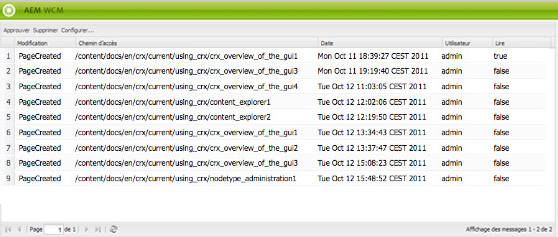

# Votre boîte de réception  {#your-inbox}

Vous pouvez recevoir des notifications de diverses sections d’AEM, comme des notifications au sujet des tâches correspondant à des opérations que vous devez exécuter sur le contenu de la page.

Ces notifications arrivent dans deux boîtes de réception, en fonction de leur type :

* Une boîte de réception dans laquelle parviennent les notifications liées à des abonnements, décrite à la section suivante.
* A specialized inbox for workflow items is described in the [Participating in Workflows](/help/sites-classic-ui-authoring/classic-workflows-participating.md) document.

## Viewing Your Notifications {#viewing-your-notifications}

Pour afficher vos notifications, procédez comme suit :

1. Ouvrez la boîte de réception de notifications : dans la console **Sites web**, cliquez sur le bouton de l’utilisateur dans le coin supérieur droit, puis sélectionnez **Boîte de réception de notifications**.

   

   >[!NOTE]
   >
   >Vous pouvez également accéder directement à la console dans votre navigateur ; par exemple.
   >
   >
   >` https://<host>:<port>/libs/wcm/core/content/inbox.html`

1. Vos notifications sont répertoriées. Vous pouvez agir comme suit :

   * [S’abonner aux notifications](#subscribing-to-notifications)
   * [Traitement des notifications](#processing-your-notifications)

   

## S’abonner aux notifications {#subscribing-to-notifications}

Pour souscrire à des notifications :

1. Ouvrez la boîte de réception de notifications : dans la console **Sites web**, cliquez sur le bouton de l’utilisateur dans le coin supérieur droit, puis sélectionnez **Boîte de réception de notifications**.

   

   >[!NOTE]
   >
   >Vous pouvez également accéder directement à la console dans votre navigateur ; par exemple.
   >
   >
   >`https://<host>:<port>/libs/wcm/core/content/inbox.html`

1. Cliquez sur **Configurer…** dans le coin supérieur gauche pour ouvrir la boîte de dialogue de configuration.

   

1. Sélectionnez le canal de notification :

   * **Boîte de réception** : les notifications seront affichées dans votre boîte de réception AEM.
   * **Courrier électronique** : les notifications seront envoyées à l’adresse électronique définie dans votre profil utilisateur.

   >[!NOTE]
   >
   >L’envoi de notifications par courrier électronique nécessite la configuration de certains paramètres. Il est également possible de personnaliser le modèle de courrier électronique ou d’ajouter un tel modèle pour une nouvelle langue. Pour configurer des notifications par courrier électronique dans AEM, reportez-vous à la section [Configuration des notifications électroniques](/help/sites-administering/notification.md#configuringemailnotification).

1. Sélectionnez les actions de page pour lesquelles vous souhaitez recevoir une notification :

   * Activé : lorsqu’une page a été activée.
   * Désactivé : lorsqu’une page a été désactivée.
   * Supprimé (syndication) : lorsqu’une page a fait l’objet d’une réplication de suppression ; en d’autres termes, lorsqu’une action de suppression effectuée sur une page est répliquée.
Lorsqu’une page est supprimée ou déplacée, une action de suppression est automatiquement répliquée : la page est supprimée sur l’instance source où a été effectuée l’action de suppression et sur l’instance cible définie par les agents de réplication.

   * Modifié : lorsqu’une page a été modifiée.
   * Créé : lorsqu’une page a été créée.
   * Supprimé : lorsqu’une page a été supprimée au moyen de l’action de suppression de page.
   * Déployé : lorsqu’une page a été déployée.

1. Définissez les chemins d’accès des pages pour lesquelles vous recevrez une notification :

   * Cliquez sur **Ajouter** pour ajouter une nouvelle ligne au tableau.
   * Click the **Path** table cell and enter the path, e.g. `/content/docs`.

   * Si vous souhaitez être averti pour toutes les pages appartenant à la sous-arborescence, définissez **Exact ?** sur **Non**.
Si vous souhaitez n’être averti que pour les actions sur la page définie par le chemin d’accès, définissez **Exact ?** sur **Oui**.

   * Pour autoriser la règle, définissez **Règle** sur **Autoriser**. Si cette option est définie sur **Refuser**, la règle est refusée, mais elle n’est pas supprimée. Elle pourra être autorisée ultérieurement.

   Pour supprimer une définition, sélectionnez la ligne en cliquant sur une cellule du tableau, puis cliquez sur **Supprimer**.

1. Cliquez sur **OK** pour enregistrer la configuration.

## Traitement des notifications {#processing-your-notifications}

Si vous avez choisi cette option, les notifications seront reçues et stockées dans votre boîte de réception AEM. Vous pouvez [afficher vos notifications](#viewing-your-notifications), puis sélectionner celles qui s’appliquent :

* Pour les approuver, cliquez sur **Approuver** : la valeur de la colonne **Lire** est alors définie sur **vrai**.

* supprimée en cliquant sur **Supprimer**.

