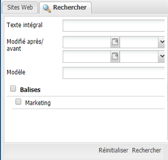
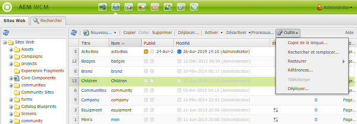
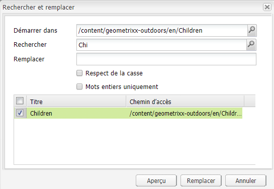

# Recherche{#searching}

L’environnement de création d’AEM comporte divers mécanismes de recherche de contenu, selon le type de ressource que vous utilisez.

>[!NOTE]
>
>En dehors de l’environnement de création, il existe d’autres mécanismes de recherche, tels que [Query Builder](/help/sites-developing/querybuilder-api.md) et [CRXDE Lite](/help/sites-developing/developing-with-crxde-lite.md).

## Principes de base de la recherche {#search-basics}

Pour accéder au panneau de recherche, cliquez sur l’onglet **Rechercher** dans la partie supérieure du volet de gauche de la console appropriée.

Le panneau de recherche vous permet de rechercher sur toutes les pages de votre site Web. Il contient des champs et des widgets pour les éléments suivants :

* **Texte intégral** : recherche du texte indiqué
* **Modifié après/avant** : la recherche porte uniquement sur les pages qui ont été modifiées entre les dates spécifiées.
* **Modèle** : la recherche porte uniquement sur les pages basées sur le modèle spécifié.
* **Balises** : la recherche porte uniquement sur les pages qui comprennent les balises spécifiées.

>[!NOTE]
>
>Lorsque votre instance est configurée pour la [recherche Lucene](/help/sites-deploying/queries-and-indexing.md), vous pouvez utiliser l’expression suivante en **texte intégral** :
>
>* [Caractères génériques](https://lucene.apache.org/core/5_3_1/queryparser/org/apache/lucene/queryparser/classic/package-summary.html#Wildcard_Searches) 
>* [Opérateurs booléens](https://lucene.apache.org/core/5_3_1/queryparser/org/apache/lucene/queryparser/classic/package-summary.html#Boolean_operators)  

   >
   >
* [Expressions régulières](https://lucene.apache.org/core/5_3_1/queryparser/org/apache/lucene/queryparser/classic/package-summary.html#Regexp_Searches)
>* [Regroupement de champs](https://lucene.apache.org/core/5_3_1/queryparser/org/apache/lucene/queryparser/classic/package-summary.html#Field_Grouping) 
>* [Amplification](https://lucene.apache.org/core/5_3_1/queryparser/org/apache/lucene/queryparser/classic/package-summary.html#Boosting_a_Term) 

>

Pour exécuter la recherche, cliquez sur **Rechercher** au bas du volet. Cliquez sur **Réinitialiser** pour effacer les critères de recherche.

## Filtrer {#filter}

Vous pouvez définir (et effacer) un filtre pour préciser les résultats en divers emplacements :

## Rechercher et remplacer {#find-and-replace}

Dans la console **Sites web**, l’option de menu **Rechercher et remplacer** permet de rechercher et de remplacer plusieurs instances d’une chaîne dans une partie d’un site web.

1. Sélectionnez la page racine, ou le dossier, où doit s’exécuter l’option de recherche et de remplacement.
1. Sélectionnez **Outils**, puis **Rechercher et remplacer** :

   

1. La boîte de dialogue **Rechercher et remplacer** permet ce qui suit :

   * confirmer le chemin d’accès racine où doit commencer l’opération de recherche ;
   * définir le terme à rechercher ;
   * définir le terme de remplacement ;
   * indiquer si la recherche doit être sensible à la casse ;
   * indiquer si la recherche doit uniquement porter sur des mots entiers (dans le cas contraire, elle porte également sur des sous-chaînes).

   Clicking **Preview** lists where the term has been found. You can select/clear specific instances to be replaced:

   

1. Cliquez sur **Remplacer** pour procéder au remplacement de toutes les instances. Vous serez alors invité à confirmer l’opération.

L’étendue par défaut du servlet de recherche et de remplacement couvre les propriétés suivantes :

* `jcr:title`
* `jcr:description`
* `jcr:text`
* `text`

The scope can be changed using the Apache Felix Web Management Console (for example, at `https://localhost:4502/system/console/configMgr`). Select `CQ WCM Find Replace Servlet (com.day.cq.wcm.core.impl.servlets.FindReplaceServlet)` and configure the scope as required.

>[!NOTE]
>
>Dans une installation AEM standard, la fonction « Rechercher et remplacer » utilise Lucene comme fonctionnalité de recherche.
>
>Lucene indexe les propriétés de chaîne d’une longueur pouvant atteindre 16k. La recherche ne porte pas sur les chaînes dont la longueur est supérieure à cette valeur.
