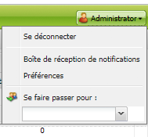
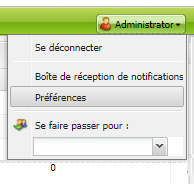
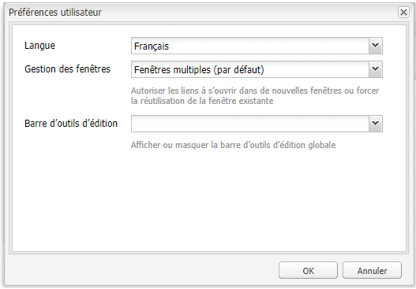

# Configuration de l’environnement du compte{#configuring-your-account-environment}

AEM vous dote des outils nécessaires pour configurer votre compte ainsi que certains aspects de l’environnement de création.

Les [paramètres du compte](#account-settings) et les [préférences utilisateur](#user-preferences) permettent de définir les options et préférences suivantes :

* **Barre d’outils d’édition** Indiquez si vous souhaitez que la barre d’outils d’édition globale soit visible. Cette barre d’outils, qui s’affiche en haut de la fenêtre du navigateur, vous permet de 
**Boutons Copier**, **Couper**, **Coller**, **Supprimer** pour une utilisation avec les composants de paragraphe de cette page :

   * Afficher lorsque cela s’avère nécessaire (paramètre par défaut)
   * Toujours afficher
   * Garder masqué

* **Se faire passer pour**
La fonction [Se faire passer pour](/help/sites-administering/security.md#impersonating-another-user) permet à un utilisateur de travailler au nom d’un autre.

* **Langue** Langue à utiliser dans l’interface utilisateur de l’environnement de création. Sélectionnez la langue requise dans la liste.

* **Gestion des fenêtres**
Sélectionnez :

   * Fenêtres multiples (par défaut)
Les pages s’ouvrent dans une nouvelle fenêtre.
   * Une seule fenêtre
Les pages s’ouvrent dans la fenêtre active.

## Paramètres du compte {#account-settings}

L’icône utilisateur vous donne accès à diverses options :

* Se déconnecter
* [Se faire passer pour](/help/sites-administering/security.md#impersonating-another-user)
* [Préférences utilisateur](#user-preferences)
* [Boîte de réception de notifications](/help/sites-classic-ui-authoring/author-env-inbox.md)

### Préférences utilisateur {#user-preferences}

Chaque utilisateur peut définir certaines propriétés à son intention. Cette option est disponible à partir de la boîte de dialogue **Préférences** dans le coin supérieur droit des consoles.

Cette boîte de dialogue présente les options suivantes :

