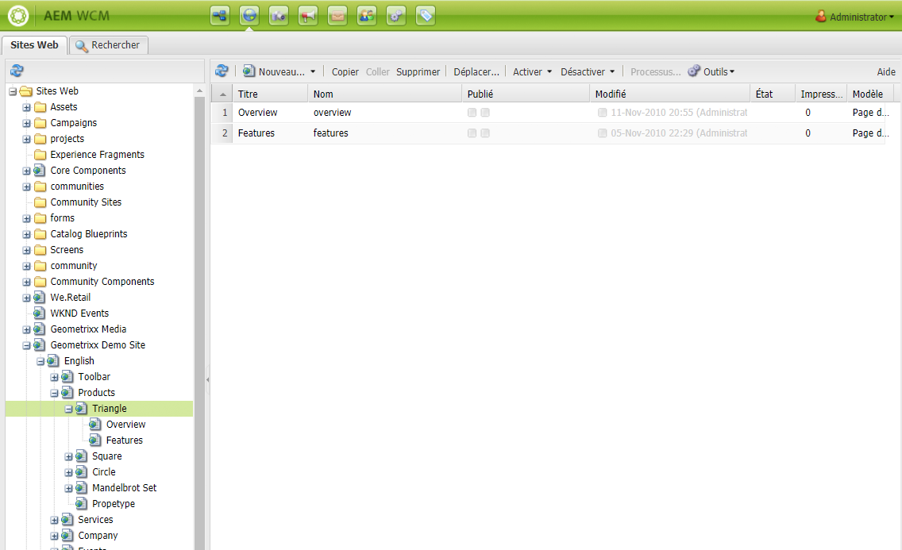
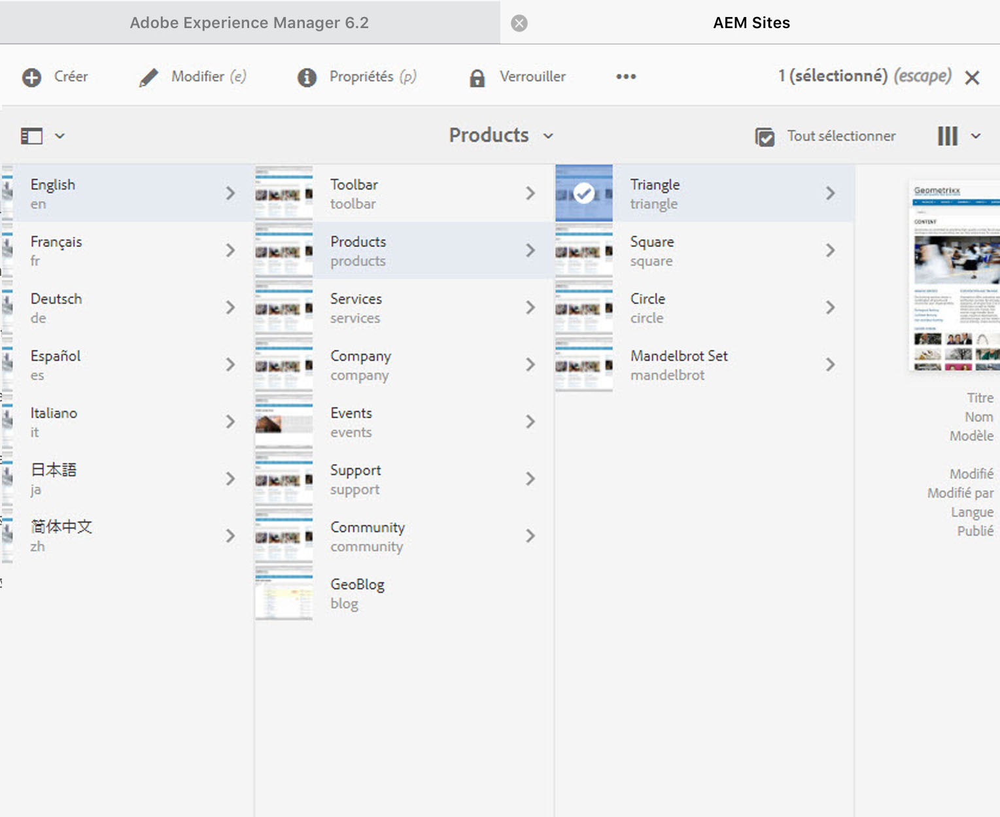

# Utilisation de l’environnement de création{#working-with-the-author-environment}

>[!NOTE]
>
>La documentation suivante porte sur l’IU classique. For information about authoring in the modern, touch-enabled UI, see the [standard Authoring documentation](/help/assets/assets.md).

L’environnement de création vous permet d’effectuer les opérations suivantes :

* [Création](/help/sites-authoring/author.md) (y compris création [de](/help/sites-authoring/qg-page-authoring.md) pages et [gestion des ressources](/help/assets/assets.md))

* [Administration](/help/sites-administering/administer-best-practices.md) des tâches nécessaires pour générer et gérer le contenu sur votre site web

Deux interfaces utilisateur graphiques sont à votre disposition, accessibles dans n’importe quel navigateur moderne :

1. IU classique

   * Cette interface utilisateur est disponible dans AEM depuis de nombreuses années.
   * Elle est principalement verte.
   * Elle a été conçue pour les appareils de bureau.
   * Elle n’est plus gérée.
   * La documentation suivante porte sur cette IU classique. Pour plus d’informations sur la création dans l’interface moderne destinée aux écrans tactiles, consultez la [documentation de création standard](/help/sites-authoring/author.md).

   

1. Interface utilisateur optimisée pour les écrans tactiles

   * Plus récente, il s’agit de l’interface utilisateur standard d’AEM.
   * Particulièrement épurée, elle est principalement grise.
   * Elle est conçue à la fois pour les appareils à écran tactile et les ordinateurs de bureau (elle est optimisée pour les écrans tactiles). L’apparence est identique sur tous les appareils, bien que[ l’affichage et la sélection des ressources](/help/sites-authoring/basic-handling.md) diffère légèrement (appuyer ou cliquer).  
   * See the [standard Authoring documentation](/help/sites-authoring/author.md) for further details on how to author using the touch-based UI. La documentation suivante porte sur l’IU classique.

   * Bureau :

   

   * Tablettes (ou bureau de moins de 1024 pixels de large) :

   

