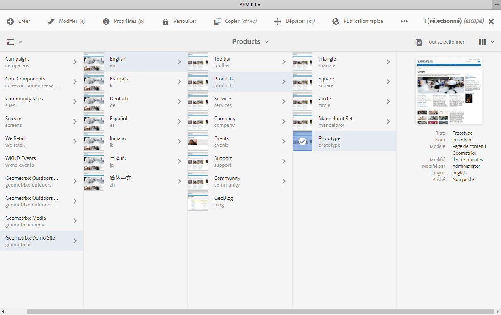

# Utiliser l’environnement de création{#working-with-the-author-environment}

>[!NOTE]
>
>La documentation suivante porte sur l’IU classique. Pour plus d’informations sur la création dans l’interface moderne destinée aux écrans tactiles, consultez la [documentation de création standard](/help/assets/assets.md).

L’environnement de création vous permet d’effectuer les tâches suivantes :

* [Création](/help/sites-authoring/author.md) (y compris la [création de pages](/help/sites-authoring/qg-page-authoring.md) et la [gestion de ressources](/help/assets/assets.md))

* [Administration](/help/sites-administering/administer-best-practices.md) des tâches nécessaires pour générer et gérer le contenu sur votre site Web

Deux interfaces utilisateur graphiques sont à votre disposition, accessibles dans n’importe quel navigateur moderne :

1. Interface utilisateur classique

   * Cette interface utilisateur est disponible dans AEM depuis de nombreuses années.
   * Le vert est sa couleur prédominante.
   * Elle est destinée aux ordinateurs de bureau.
   * Elle est devenue obsolète.
   * La documentation suivante est consacrée à l’IU classique. Pour plus d’informations sur la création dans l’interface utilisateur moderne optimisée pour les écrans tactiles, consultez la [documentation sur la création standard](/help/sites-authoring/author.md).

   

1. Interface utilisateur optimisée pour les écrans tactiles

   * Il s’agit de l’interface utilisateur AEM moderne et standard.
   * Elle laisse la part belle au gris, dans une interface épurée et plate.
   * Elle est destinée aux appareils tactiles et aux ordinateurs de bureau (optimisée pour les écrans tactiles). L’apparence est identique sur tous les appareils, bien que[ l’affichage et la sélection des ressources](/help/sites-authoring/basic-handling.md) diffère légèrement (appuyer ou cliquer).
   * Pour plus d’informations sur la création à l’aide de l’IU pour écrans tactiles, consultez la [documentation de création standard](/help/sites-authoring/author.md). La documentation suivante porte sur l’IU classique.

   * Bureau :

   

   * Tablettes (ou bureau de moins de 1024 pixels de large) :

   
