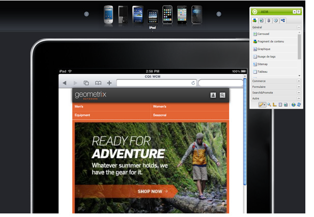

# Création d’une page pour les appareils mobiles{#authoring-a-page-for-mobile-devices}

Lorsque vous créez une page mobile, celle-ci est affichée d’une manière qui émule l’appareil mobile. Lors de la création de la page, vous pouvez basculer entre plusieurs émulateurs pour voir ce que la personne utilisatrice finale voit lorsqu’elle accède à la page.

Les périphériques sont regroupés dans les catégories fonctionnalité, intelligent et tactile selon les capacités des périphériques à effectuer le rendu d’une page. Lorsque la personne utilisatrice finale accède à une page mobile, AEM détecte le périphérique et envoie la représentation qui correspond à son groupe de périphériques.

>[!NOTE]
>
>Pour créer un site mobile en fonction d’un site standard existant, créez une Live Copy du site standard. (Reportez-vous à [Création d’une live copy pour différents canaux](/help/sites-administering/msm-livecopy.md).)
>
>Les développeurs AEM peuvent créer de nouveaux groupes d’appareils. (Consultez [Création de filtres de groupe d’appareils.](/help/sites-developing/groupfilters.md))

Utilisez la procédure suivante pour créer une page mobile :

1. Dans votre navigateur, accédez à la console **Siteadmin**.
1. Ouvrez la page **Produits** située sous **Sites Web** >> **Site de démonstration mobile Geometrixx** >> **English**.

1. Basculez vers un autre émulateur. Pour ce faire, plusieurs méthodes sont à votre disposition :

   * Cliquez sur l’icône d’appareil en haut de la page.
   * Cliquez sur le bouton **Modifier** dans le **sidekick** et sélectionnez l’appareil dans le menu déroulant.

1. Faites glisser le composant **Texte et image** de l’onglet Mobile du sidekick et déposez-le sur la page.
1. Modifiez le composant et ajoutez du texte. Pour enregistrer les modifications, cliquez sur **OK**.

La page revêt l’aspect suivant :

>[!NOTE]
>
>Les émulateurs sont désactivés lorsqu’une page de l’instance de création est demandée à partir d’un appareil mobile. La création peut être effectuée à l’aide d’une interface utilisateur activée pour les écrans tactiles.
