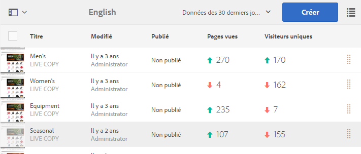

# Affichage des données d’analyse de page{#seeing-page-analytics-data}

Utilisez les données d’analyse de page pour mesurer l’efficacité de leur contenu de page.

Les donnée d’analyse de page s’affichent dans la console Sites. Lorsque les sites sont affichés sous forme de liste, les colonnes suivantes sont disponibles par défaut :

* Pages vues
* Visiteurs uniques
* Temps sur la page

>[!NOTE]
>
>L’affichage des données d’analyse du site directement dans la console est disponible uniquement dans l’interface utilisateur optimisée pour les écrans tactiles. See [Seeing Page Analytics Data](/help/sites-authoring/page-analytics-using.md) in the standard authoring documentation for details.
