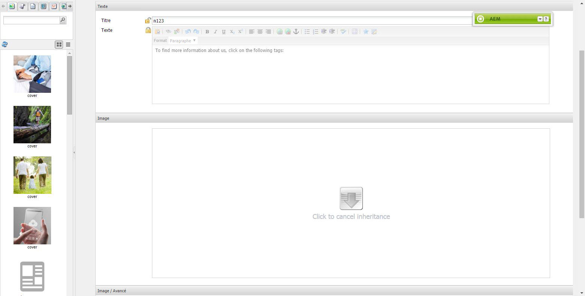

# Génération de modèles automatique{#scaffolding}

Dans certains cas, il arrive que vous deviez créer un jeu volumineux dont les pages partagent la même structure, mais présentent un contenu différent. Si vous utilisez l’interface AEM standard, vous devez créer chaque page, y faire glisser les composants appropriés, puis compléter chacune d’elles séparément.

En mode Génération de modèles automatique, vous pouvez créer un formulaire (que l’on désigne sous le nom de modèle automatique) dont les champs représentent la structure souhaitée pour vos pages, puis l’utiliser afin de créer aisément des pages sur la base de cette structure.

>[!NOTE]
>
>La génération de modèles automatique (IU classique) respecte [l’héritage MSM](#scaffolding-with-msm-inheritance). 

## Fonctionnement de la génération de modèles automatique {#how-scaffolding-works}

Les modèles automatiques sont stockés dans la console **Outils** de l’administrateur du site.

* Ouvrez la console **Outils** et cliquez sur **Génération de modèles automatique de page par défaut**.
* Cliquez ensuite sur **geometrixx**.
* Sous **geometrixx**, une *page de modèles automatiques* intitulée **Actualités** est disponible. Double-cliquez sur cette page pour l’ouvrir.

L’échafaudage se compose d’un formulaire avec un champ pour chaque élément de contenu qui constituera la page à créer et de quatre paramètres importants qui sont accessibles par le biais des **Propriétés de la page** de la page de l’échafaudage.

Les propriétés de la page de génération de modèles automatique sont les suivantes :

* **Texte du titre** : il s’agit du nom de la page de génération de modèles automatique proprement dite. Dans cet exemple, elle se nomme « Actualités ».
* **Description** : cette description s’affiche sous le titre de la page de génération de modèles automatique.
* **Modèle cible** : modèle que ce modèle automatique utilisera lors de la création d’une page. Dans cet exemple, il s’agit d’un modèle *Page de contenu Geometrixx*.
* **Tracé de destination** : il s’agit du chemin de la page parente sous lequel ce modèle automatique créera des pages. Dans cet exemple, le chemin d’accès est */content/geometrixx/fr/news*.

Le contenu du modèle automatique est le formulaire. Lorsqu’un utilisateur souhaite crée une page à l’aide du modèle automatique, il remplit le formulaire et clique sur *Créer*, au bas du formulaire. Dans l&#39;exemple **News** ci-dessus, le formulaire contient les champs suivants :

* **Titre** : il s’agit du nom de la page à créer. Ce champ est présent sur chaque modèle automatique.
* **Texte** : ce champ correspond à un composant Texte sur la page qui en résulte.
* **Image** : Ce champ correspond à un composant d’image sur la page résultante.
* **Image / Avancé** : **Titre** : titre de l’image.
* **Image / Avancé** : **Texte de remplacement** : texte de remplacement pour l’image.
* **Image/Avancé** :  **Description** : Description de l’image.
* **Image / Avancé** : **Taille** : taille de l’image.
* **Tags / Mots-clés** : métadonnées à affecter à cette page. Ce champ est présent sur chaque modèle automatique.

### Création d’un modèle automatique {#creating-a-scaffold}

Pour créer un nouvel échafaudage, accédez à la console **Outils**, puis **Mise à l’échafaudage de page par défaut** et créez une nouvelle page. Un modèle de page unique sera disponible, le *modèle d&#39;échafaudage.*

Accédez à **Propriétés de la page** de la nouvelle page et définissez *Titre Texte*, *Description*, *Modèle de Cible* et *Chemin de Cible*, comme décrit ci-dessus.

Vous devez ensuite définir la structure de la page qui sera créée par ce scaffold. Pour ce faire, passez en **[mode de conception](/help/sites-authoring/page-authoring.md#sidekick)** sur la page de l’échafaudage. Un lien s’affiche alors pour vous permettre de modifier le scaffold dans l’**éditeur de boîte de dialogue**.

Utilisez l’éditeur de boîte de dialogue pour définir les propriétés qui seront générées chaque fois qu’une page sera créée à l’aide de ce modèle automatique.

La définition de la boîte de dialogue d’un modèle automatique fonctionne de la même manière que celle d’un composant (voir [Composants](/help/sites-developing/components.md)). On remarque cependant quelques différences de taille :

* Les définitions des boîtes de dialogue de composant sont rendues comme des boîtes de dialogue normales (comme illustré dans le volet du milieu de l’éditeur, par exemple). Les définitions des boîtes de dialogue de modèle automatique, en revanche, bien qu’elles apparaissent comme des boîtes de dialogue normales dans l’éditeur, sont rendues sur la page de modèle automatique sous la forme d’un formulaire de modèle automatique (comme illustré dans le modèle automatique **Actualités** ci-dessus).
* Les boîtes de dialogue de composant proposent uniquement des champs pour les valeurs requises dans le cadre de la définition du contenu d’un seul composant spécifique. Une boîte de dialogue de modèle automatique doit fournir des champs pour chaque propriété, dans tous les paragraphes de la page à créer.
* Dans le cas des boîtes de dialogue de composant, le composant utilisé pour le rendu du contenu spécifié est implicite. Par conséquent, la propriété `sling:resourceType` du paragraphe est complétée automatiquement lors de la création du paragraphe. Avec un modèle automatique, toutes les informations qui définissent à la fois le contenu et le composant affecté pour un paragraphe donné doivent être fournies par la boîte de dialogue proprement dite. Dans les boîtes de dialogue de modèle automatique, ces informations doivent être fournies en utilisant des champs *Masqué* afin de les rendre disponibles lors de la création de la page.

Pour bien comprendre ce procédé, observez la boîte de dialogue **Actualités** dans l’éditeur de boîte de dialogue. Basculez vers le mode de conception sur la page de modèle automatique et cliquez sur le lien de l’éditeur de boîte de dialogue.

Cliquez maintenant sur le champ de la boîte de dialogue **Boîte de dialogue > Panneau d’onglets > Texte > Texte**, comme suit :

La liste de propriétés de ce champ s’affiche sur le côté droit de l’éditeur de dialogue, comme suit :

Notez la propriété name de ce champ. Elle porte la valeur suivante :

`./jcr:content/par/text/text`

Il s’agit du nom de la propriété sur laquelle le contenu de ce champ sera écrit lorsque le modèle automatique sera utilisé pour créer une page. La propriété est indiquée comme chemin relatif à partir du nœud représentant la page à créer. Elle précise la propriété text, sous le nœud text, lequel se situe sous le nœud par, qui est lui-même un enfant du nœud jcr:content situé sous le nœud de page.

Cela définit l’emplacement du stockage de contenu pour le texte qui sera saisi dans ce champ. Cependant, il convient également de spécifier deux caractéristiques supplémentaires pour ce contenu :

* Le fait que la chaîne en cours de stockage doive être interprétée comme *rich text* et
* le composant à utiliser pour rendre ce contenu sur la page qui en résulte.

Notez que, dans une boîte de dialogue de composant normale, vous ne devez pas spécifier ces informations, car elles sont implicites ; en ce sens, que la boîte de dialogue est déjà liée à un composant spécifique.

Pour spécifier ces deux informations, vous devez utiliser des champs masqués. Cliquez sur le premier champ masqué **Boîte de dialogue > Panneau de tabulation > Texte > Masqué**, comme suit :

Les propriétés de ce champ masqué sont les suivantes :

La propriété name de ce champ masqué est

`./jcr:content/par/text/textIsRich`

Il s’agit d’une propriété booléenne utilisée pour interpréter la chaîne de texte stockée à `./jcr:content/par/text/text`.

Puisque nous savons que le texte doit être interprété comme texte enrichi, nous définissons la propriété `value` de ce champ sur `true`.

>[!CAUTION]
>
>L’éditeur de dialogue permet à l’utilisateur de modifier les valeurs des propriétés *existantes* dans la définition de la boîte de dialogue. Pour ajouter une nouvelle propriété, l’utilisateur doit utiliser [CRXDE Lite](/help/sites-developing/developing-with-crxde-lite.md). Par exemple, lorsqu’un nouveau champ masqué est ajouté à une définition de boîte de dialogue à l’aide de l’éditeur, il est dépourvu de la propriété *value* (c’est-à-dire, une propriété dont le nom est « value »). Si le champ masqué en question nécessite la définition d’une propriété *value* par défaut, cette dernière doit être ajoutée manuellement à l’aide de l’un des outils CRX. La valeur ne peut pas être ajoutée avec l’éditeur de boîte de dialogue proprement dit. Cependant, une fois la propriété présente, sa valeur peut être modifiée à l’aide de l’éditeur.

Vous pouvez afficher le second champ masqué en cliquant sur celui-ci comme ceci :

Les propriétés de ce champ masqué sont les suivantes :

La propriété name de ce champ masqué est

`./jcr:content/par/text/sling:resourceType`

et la valeur fixe spécifiée pour cette propriété est

`foundation/components/textimage`

Cela indique que le composant à utiliser pour effectuer le rendu du contenu texte de ce paragraphe est le composant *Texte et Image*. En utilisant la valeur booléenne `isRichText` spécifiée dans l’autre champ masqué, le composant peut rendre la chaîne de texte réelle stockée à `./jcr:content/par/text/text` de la manière souhaitée.

### Génération de modèles automatique avec héritage MSM {#scaffolding-with-msm-inheritance}

Dans l’IU classique, la génération de modèles automatique est entièrement intégrée à l’héritage MSM (le cas échéant). 

Lorsque vous ouvrez une page en mode **Génération de modèles automatique** (à l’aide de l’icône située dans la partie inférieure du sidekick), tous les composants soumis à l’héritage sont indiqués par :

* un cadenas (pour la plupart des composants, par exemple Texte et Titre) 
* un masque avec le texte **Cliquez pour annuler l’héritage** (pour les composants Image)

Ces deux indications montrent que le composant ne peut pas être publié, tant que l’héritage n’a pas été annulé. 

>[!NOTE]
>
>C’est comparable aux [composants hérités lors de l’édition du contenu de la page](/help/sites-authoring/editing-content.md#inheritedcomponentsclassicui).

Cliquez sur le cadenas ou sur l’icône représentant une image pour annuler l’héritage :

* Le symbole se transforme en cadenas ouvert. 
* Une fois déverrouillé, vous pouvez modifier le contenu.

Après le déverrouillage, vous pouvez restaurer l’héritage en cliquant sur le symbole de cadenas ouvert. Vous perdrez les modifications que vous avez apportées.

>[!NOTE]
>
>Si l’héritage est annulé au niveau de la page (à partir de l’onglet Livecopy des Propriétés de la page), tous les composants seront modifiables en mode **Scaffolding** (ils seront affichés à l’état déverrouillé).
