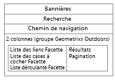

# Ajout de fonctionnalités Search&amp;Promote à une page{#adding-search-promote-features-to-your-page}

Pour intégrer des fonctionnalités Search&amp;Promote à votre site web, utilisez les composants Search&amp;Promote afin d’ajouter les fonctions suivantes dans vos pages :

* Recherche par mot-clé
* Page des résultats de la recherche
* Amélioration de la recherche
* Bannières

Notez que vous pouvez utiliser les fonctionnalités Search&amp;Promote uniquement si votre administrateur AEM les a activées. Reportez-vous à la section [Intégration à Adobe Search&amp;Promote](/help/sites-administering/search-and-promote.md).

Les facettes sont configurées sur le serveur Search&amp;Promote, de même que les informations que chaque composant fournit. Le tableau suivant présente une brève description de chaque composant. Les sections qui suivent contiennent des informations détaillées sur leur utilisation.

<table>
 <tbody>
  <tr>
   <th>Composant Search&amp;Promote</th>
   <th>Description</th>
  </tr>
  <tr>
   <td>Bannières</td>
   <td>Affiche des bannières publicitaires. Les bannières sont sélectionnées en fonction des données collectées par Search&amp;Promote.   </td>
  </tr>
  <tr>
   <td>Chemin de navigation</td>
   <td>Affiche le mot-clé de recherche et la séquence des filtres que l’utilisateur a appliqués aux résultats de la recherche.</td>
  </tr>
  <tr>
   <td>Liste des cases à cocher - Facettes</td>
   <td>Liste de cases à cocher permettant de sélectionner des facettes pour le filtrage des résultats de la recherche.</td>
  </tr>
  <tr>
   <td>Liste déroulante Facette</td>
   <td>Liste déroulante de facettes pour le filtrage des résultats de la recherche.</td>
  </tr>
  <tr>
   <td>Liste des liens Facette</td>
   <td>Liste de liens de facettes pour le filtrage des résultats de la recherche.</td>
  </tr>
  <tr>
   <td>Pagination</td>
   <td>Contrôles permettant de parcourir les pages de résultats de la recherche.</td>
  </tr>
  <tr>
   <td>Résultats</td>
   <td>Affiche les résultats d’une recherche par mot-clé.</td>
  </tr>
  <tr>
   <td>Rechercher</td>
   <td>Insère un champ de recherche dans la page.</td>
  </tr>
 </tbody>
</table>

## Création de la page de résultats de la recherche {#creating-the-search-results-page}

Utilisez la console Sites web WCM pour créer une page qui servira à afficher les résultats de recherche. Les résultats d’une recherche de n’importe quel composant de recherche peuvent apparaître dans cette page si elle utilise le même service Search&amp;Promote. 

Les composants qui permettent aux utilisateurs de consulter les résultats de la recherche sont Résultats et Pagination. Le composant **Résultats** ne dispose d’aucune propriété configurable en mode d’édition ou en mode de conception. Le composant Résultats répertorie uniquement les résultats de la recherche, qui proposent des liens vers d’autres pages, ainsi que le nombre de résultats pour le mot-clé de la recherche. 

Le composant **Pagination** permet aux utilisateurs de naviguer au sein de plusieurs pages de résultats de recherche. L’utilisateur peut voir le nombre de pages, accéder à la page précédente ou suivante, sélectionner une page à ouvrir ou regrouper tous les résultats dans une seule page. 

Vous pouvez configurer les propriétés de composant suivantes en mode d’édition pour contrôler le comportement d’exécution :

* Masquer la page de résultats unique : Sélectionnez cette option pour masquer les commandes de navigation de la page lorsque la recherche renvoie une seule page de résultats.
* Masquer le premier/dernier : sélectionnez cette option pour empêcher les utilisateurs d’accéder à la première ou à la dernière page de résultats. 
* Masquer le précédent/suivant : détermine si les utilisateurs peuvent parcourir les pages de résultats par rapport à la page active. 
* Masquer/Afficher tout : détermine si l’utilisateur peut regrouper tous les résultats de la recherche dans une seule page. En général, le fait de fournir des données paginées optimise l’utilisation des ressources serveur. Sélectionnez cette option pour empêcher le transfert d’importants jeux de données dans un seul message de réponse.

### Activation du filtrage des résultats par le biais de facettes {#enabling-the-filtering-of-results-by-facets}

Vous pouvez autoriser les utilisateurs à filtrer les résultats d’une recherche au moyen de facettes. The **Checkbox List Facet**, **Dropdown Facet**, and **Link List Facet** components enable users to select one or more facets for filtering. Lorsque vous utilisez ces composants, vous devez également inclure le composant **Chemin de navigation**. Les chemins de navigation indiquent les filtres actuels qui sont utilisés.

The **Checkbox List Facet**, **Dropdown Facet**, and **Link List Facet** components each have the following properties that you configure in **Edit** mode:

* **Nom de la facette** : nom de la facette utilisée pour les filtres.

Le composant **Liste des cases à cocher - Facettes** présente une liste de facettes accompagnée d’une case à cocher. Utilisez **Liste des cases à cocher - Facettes** pour permettre aux utilisateurs d’afficher un sous-ensemble de résultats intégrant les éléments de plusieurs facettes. Par exemple, la **facette Marque est appropriée, car plusieurs marques fournissent le même type de produit.**

Une case à cocher apparaît pour chaque facette associée à un résultat de recherche. Lorsqu’un utilisateur coche une case, la page est actualisée avec un jeu de résultats mis à jour. Toutes les cases à cocher restent sur la page pour que les internautes puissent ajouter (ou supprimer) des facettes au filtre, à tout moment :

Le composant **Liste déroulante Facette** permet aux utilisateurs de choisir un élément de facette dans une liste déroulante. Ce composant est utile si vous souhaitez que les utilisateurs se concentrent sur un seul élément de facette à la fois. Par exemple, la facette Rayon est appropriée pour permettre aux utilisateurs de restreindre la recherche de produits par sexe. Patrick recherche un *pantalon denim* puis filtre par rayon Homme. 

La liste déroulante présente les facettes associées à tous les résultats de la recherche. Une fois qu’un élément est sélectionné dans la liste déroulante, la page est actualisée avec un jeu de résultats mis à jour. Les éléments de la liste déroulante ne changent pas, ainsi les utilisateurs peuvent basculer d’une facette à l’autre, à tout moment. 

Le composant **Liste des liens Facette** permet aux utilisateurs d’affiner progressivement leur recherche sur les éléments qui sont catégorisés sous plusieurs membres de facette ou facettes.

Les membres de facette s’affichent sous la forme d’une liste de liens. Le texte de chaque lien correspond au nom d’un membre de facette associé aux résultats de la recherche en cours. Lorsqu’un utilisateur clique sur un lien de facette, la page est actualisée et un sous-ensemble de résultats de recherche s’affiche. La liste des liens est mise à jour en conséquence pour des résultats encore plus pertinents.

Les liens de la liste changent également lors de l’application d’un filtre à partir d’un autre type de composant Search&amp;Promote. L’utilisation de plusieurs types de composants de filtrage peut optimiser le filtrage.

Le composant **Chemin de navigation** permet aux utilisateurs de voir les filtres actuellement actifs pour les résultats de la recherche et l’ordre dans lequel ils ont été appliqués. Ils peuvent cliquer sur les éléments du chemin de navigation pour revenir à cette combinaison de filtres.

En mode d’édition, vous pouvez configurer les propriétés suivantes pour les chemins de navigation afin de personnaliser l’aspect du composant :

* Délimiteur : définissez le caractère ou la chaîne de caractères qui servira de séparateur entre chaque chemin de navigation. Le champ de délimiteur accepte n’importe quelle chaîne de caractères en entrée. Le paramètre par défaut est : « > » (sans guillemets)
* Délimiteur de piste : définissez le caractère ou la chaîne de caractères à afficher à la fin des chemins de navigation. Le champ de délimiteur de piste accepte n’importe quelle chaîne de caractères en entrée. La valeur par défaut est *vide* (c’est-à-dire que rien n’est affiché à la fin du chemin de navigation)

### Ajout de zones de recherche {#adding-search-boxes}

Le composant de recherche permet aux utilisateurs d’effectuer des recherches par mot-clé. Insérez des composants de recherche dans chaque page où un accès à la recherche est nécessaire. 

Configurez les propriétés suivantes en mode d’édition pour contrôler le comportement d’exécution :

* Chemin d’accès à la page des résultats : chemin d’accès à la page qui affiche les résultats de la recherche. 
* Activer la saisie automatique : sélectionnez cette option pour faire apparaître les mots-clés de recherche suggérés lorsque l’utilisateur commence à saisir des caractères dans la zone de recherche. 

### Ajout de bannières {#adding-banners}

Le composant Bannières affiche les bannières publicitaires en fonction des recherches de Search &amp; Promote du client. La logique du serveur Search&amp;Replace détermine la bannière publicitaire qu’il faut diffuser. Par exemple, une recherche sur un pantalon denim peut déclencher l’affichage d’une bannière associée à des articles de mode. Le filtrage par rayon Homme peut affiner davantage le choix de la bannière.

Le composant Bannières contient une propriété configurable appelée Zone de bannière. En mode d’édition, choisissez l’une des valeurs de propriété pour indiquer la façon dont la bannière doit s’afficher. Le service Search&amp;Promote détermine la liste des valeurs parmi lesquelles choisir.

### Exemple de page de recherche Search&amp;Promote {#example-search-promote-search-page}

Ce schéma présente les composants ajoutés à une page pour créer des résultats Search&amp;Promote entièrement fonctionnels dans la page ci-dessous.

 
