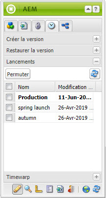
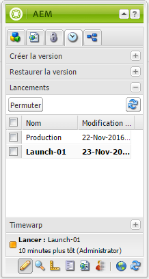

# Modification de lancements{#editing-launches}

## Modification de pages de lancement {#editing-launch-pages}

Après avoir créé un lancement pour une page (ou un jeu de pages), vous pouvez modifier le contenu dans la copie de lancement correspondante.

1. Ouvrez la page à modifier.
1. Dans le sidekick, sélectionnez l’onglet **Création de versions**, puis développez le groupe **Lancements**. Le titre du lancement en cours d’édition est indiqué en caractères gras.

   

1. Sélectionnez le lancement à traiter, puis cliquez sur **Permuter**.
1. Commencez vos modifications.

   >[!NOTE]
   >
   >Vous pouvez utiliser l’onglet **Page** du sidekick pour effectuer des actions telles que **Créer une page enfant**, entre autres. 

## Modification d’une configuration de lancement   {#editing-a-launch-configuration}

Après avoir créé un lancement, vous pouvez en modifier le nom et la date. Vous pouvez également indiquer une image à associer au lancement.

1. Ouvrez la page d’administration des lancements ([http://localhost:4502/libs/launches/content/admin.html](http://localhost:4502/libs/launches/content/admin.html)).

1. Sélectionnez le lancement requis et cliquez sur **Modifier** pour ouvrir la boîte de dialogue :

   * Dans l’onglet **Général**, vous pouvez modifier les éléments suivants :

      * **Titre**
      * **Date de mise en service** : ceci équivaut à la date de lancement 
      * **Prêt pour la production**

      Reportez-vous à [Lancements - Ordre des événements](/help/sites-authoring/launches.md#launches-the-order-of-events) pour obtenir des informations sur l’objectif et l’interaction de ces champs.

   * Dans l’onglet **Image**, vous pouvez télécharger un fichier d’image.

1. Cliquez sur **Save**.

## Identification de l’état de lancement d’une page   {#discovering-the-launch-status-of-a-page}

Lorsque vous modifiez le lancement d’une page, les informations sur le lancement s’affichent au bas de l’onglet **Création de versions** du sidekick :

* Nom du lancement
* Temps écoulé depuis la dernière modification
* Utilisateur ayant effectué la dernière modification
* L’état de l’indicateur **Prêt pour la production** (orange=non défini ; vert=défini).

