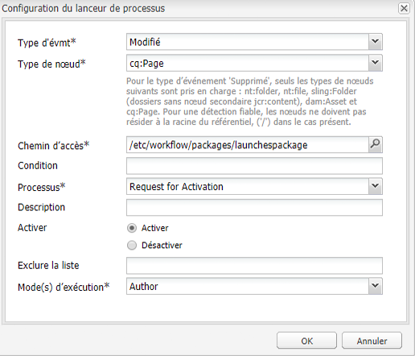

# Conversion de lancements{#promoting-launches}

Vous devez convertir les pages de lancement pour redéplacer le contenu vers la source (production) avant de le publier. Lorsqu’une page de lancement est convertie, la page correspondante des pages sources est remplacée par la page convertie. Les options suivantes sont disponibles lors de la conversion d’une page de lancement :

* Faut-il convertir l’intégralité du lancement ou uniquement la page en cours ?
* Faut-il convertir les pages enfants de la page en cours ?
* Faut-il convertir l’intégralité du lancement ou uniquement des pages qui ont été modifiées ?

## Conversion de pages de lancement {#promoting-launch-pages}

Pour convertir des pages, procédez comme suit lors de la modification de la page de lancement que vous souhaitez convertir :

1. Ouvrez l’onglet **Page** dans le Sidekick, puis cliquez sur **Convertir le lancement**.
1. Indiquez les pages à convertir :

   * (Par défaut) Pour promouvoir uniquement la page active, sélectionnez **Promouvoir les modifications de page dans la version de production**.
   * Pour promouvoir également les pages enfants de la page active, sélectionnez **Inclure les sous-pages**.
   * Pour convertir toutes les pages du lancement, sélectionnez **Convertir le lancement complet en version de production**.

1. Pour ajouter les pages de production à un module de workflow, sélectionnez **Ajouter au module de workflow**, puis sélectionnez le module.
1. Cliquez sur **Convertir**.

## Traitement de pages converties à l’aide du workflow AEM {#processing-promoted-pages-using-aem-workflow}

Utilisez des modèles de workflow pour effectuer un traitement en bloc des pages Lancements converties :

1. Créez un module de workflow.
1. Lorsque les auteurs convertissent des pages de lancement, ils les stockent dans le module de workflow.
1. Commencez un modèle de workflow en utilisant le module comme charge utile.

Pour lancer automatiquement un workflow lors de la conversion de pages, [configurez un lanceur de workflow](/help/sites-administering/workflows-starting.md#workflows-launchers) pour le nœud du module.

Vous pouvez, par exemple, générer automatiquement des demandes d’activation de page lorsque les auteurs convertissent des pages Lancements. Configurez un lanceur de workflow pour démarrer le workflow « Demander l’activation » lors de la modification du nœud de module.

