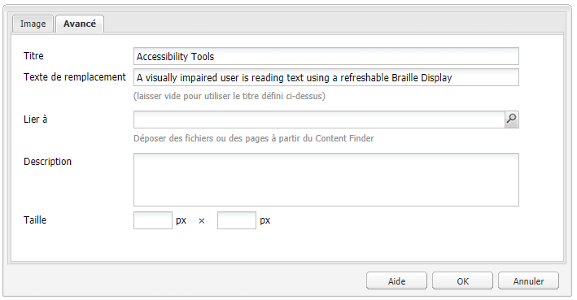
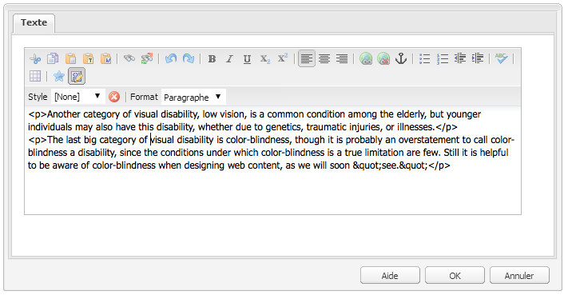
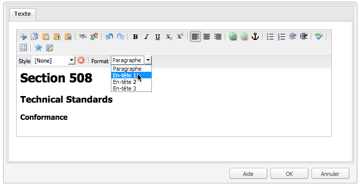
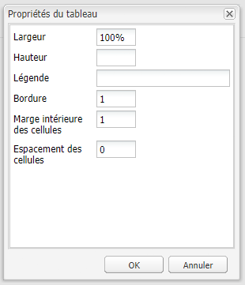
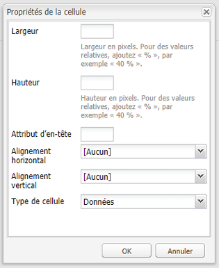
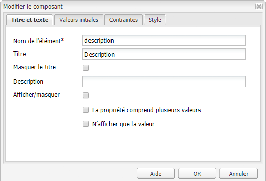
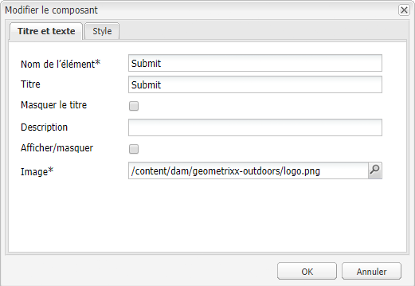
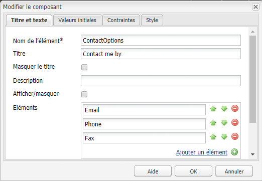
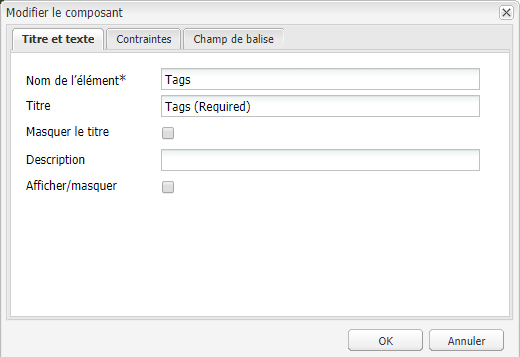

# Création d’un contenu accessible (conformité WCAG 2.0){#creating-accessible-content-wcag-conformance}

>[!CAUTION]
>
>L’interface utilisateur classique ayant été abandonnée dans AEM 6.4, le contenu de cette page n’a pas été mis à jour pour WCAG 2.1.
>
>Consultez les pages suivantes pour plus d’informations sur AEM et WCAG 2.1 :
>
>* [AEM et les consignes pour l’accessibilité web](/help/managing/web-accessibility.md)
>* [Guide rapide relatif à WCAG 2.1](/help/managing/qg-wcag.md)
>* [Création d’un contenu accessible (conformité WCAG 2.1)](/help/sites-authoring/creating-accessible-content.md)


WCAG 2.0 regroupe un ensemble de consignes et de critères de réussite, qui ne sont pas associés à une technologie particulière, visant à rendre les contenus web plus accessibles aux personnes en situation de handicap.

>[!NOTE]
>
>Voir également :
>
>* Notre [guide rapide à propos de WCAG 2.0](/help/managing/qg-wcag.md) pour en savoir plus
>* [Configuration de l’éditeur de texte enrichi pour produire du contenu accessible](/help/sites-administering/rte-accessible-content.md)
>


Les contenus sont classés selon trois niveaux de conformité : niveau A (le plus bas), niveau AA et niveau AAA (le plus élevé). Brièvement, les niveaux se définissent comme suit :

* **Niveau A :** votre site atteint un niveau minimum d’accessibilité. Pour atteindre ce niveau, tous les critères de réussite de niveau A sont satisfaits.
* **Niveau AA :** il s’agit d’un idéal d’accessibilité à atteindre : votre site est accessible par la plupart des personnes dans la plupart des situations à l’aide de la plupart des technologies. Pour atteindre ce niveau, tous les critères de réussite des niveaux A et AA doivent être satisfaits.
* **Niveau AAA :** votre site atteint un très haut niveau d’accessibilité. Pour atteindre ce niveau, tous les critères de réussite des niveaux A, AA et AAA sont satisfaits.

Lors de la création de votre site, vous devez déterminer à quel niveau général il doit se conformer.

La section suivante présente les [règles WCAG 2.0](https://www.w3.org/TR/WCAG20/#guidelines) ainsi que les critères de réussite associés aux [niveaux de conformité](https://www.w3.org/TR/UNDERSTANDING-WCAG20/conformance.html) A et AA.

>[!NOTE]
>
>Il n’est pas possible, pour certains types de contenu, de satisfaire à tous les critères de réussite du niveau de conformité AAA ; celui-ci n’est donc pas recommandé à titre de politique générale.

>[!NOTE]
>
>Dans ce document, nous utilisons :
>
>* les noms courts des [règles WCAG 2.0](https://www.w3.org/TR/WCAG20/#guidelines) ;
>* la numérotation utilisée dans les [règles WCAG 2.0](https://www.w3.org/TR/WCAG20/#guidelines) afin de simplifier les références croisées avec le site web WCAG.
>


## Principe 1 : perceptible  {#principle-perceivable}

[Principe 1 : perceptible – Les informations et les composants de l’interface utilisateur doivent être présentés aux utilisateurs sous des formes qu’ils peuvent percevoir.](https://www.w3.org/TR/WCAG20/#perceivable)

### Équivalents textuels (1.1)  {#text-alternatives}

[Règle 1.1 – Les équivalents textuels : proposer des équivalents textuels à tout contenu non textuel qui pourra alors être présenté sous d’autres formes selon les besoins de l’utilisateur : grands caractères, braille, synthèse vocale, symboles ou langage simplifié.](https://www.w3.org/TR/WCAG20/#text-equiv)

### Contenu non textuel (1.1.1)  {#non-text-content}

* Critère de réussite 1.1.1
* Niveau A
* Contenu non textuel : tout contenu non textuel présenté à l’utilisateur possède un texte secondaire qui remplit une fonction équivalente sauf dans les situations énumérées ci-dessous.

#### Objectif – Contenu non textuel (1.1.1) {#purpose-non-text-content}

Le contenu d’une page web peut être proposé dans différents formats non textuels (photos, vidéos, animations, tableaux et graphiques). Les personnes aveugles ou malvoyantes ne sont pas en mesure de voir le contenu non textuel, mais elles peuvent accéder au contenu textuel en le faisant lire par un lecteur d’écran ou sous forme tactile dans un appareil d’affichage en braille. Ainsi, en proposant des équivalents textuels pour le contenu graphique, les personnes qui ne voient pas le contenu graphique peuvent accéder à une version équivalente des informations véhiculées par le contenu.

Autre avantage utile : les équivalents textuels permettent aux moteurs de recherche d’indexer le contenu non textuel.

#### Comment procéder – Contenu non textuel (1.1.1)  {#how-to-meet-non-text-content}

Pour les images statiques, la règle de base consiste à fournir un équivalent textuel, appelé texte secondaire. Vous pouvez pour ce faire utiliser le champ **Texte secondaire** :

>[!NOTE]
>
>Certains composants prêts à l’emploi, tels que **Carrousel** et **Diaporama**, ne permettent pas d’ajouter des descriptions d’images sous forme de texte de remplacement. Lors de l’implémentation de ces versions pour votre instance AEM, votre équipe de développement devra configurer ces composants pour prendre en charge l’attribut `alt`[ afin que les auteurs puissent l’ajouter au contenu (voir Ajout de la prise en charge d’éléments et d’attributs HTML supplémentaires](/help/sites-administering/rte-accessible-content.md#adding-support-for-additional-html-elements-and-attributes)).

Le champ **Texte de remplacement** est disponible dans l’onglet des propriétés d’image **Avancées** de la boîte de dialogue du composant **Image** :



Par défaut, AEM ajoute un **texte de remplacement** à vos images. For the classic UI there are two different scenarios for how the default attribute is created (though the default value may not be sufficient as an alternative and will most likely need to be edited in the **Advanced** image properties tab):

* Fichier:

   Une image est téléchargée à partir du disque dur de l’utilisateur. Si vous ajoutez un composant d’image à une page, puis choisissez une image sur votre disque dur, ou une autre source, la valeur par défaut pour Texte **** Alt est `file`. Cette modification doit être apportée dans l’onglet Propriétés **avancées** des images. Là encore, cette valeur n’est pas affichée dans le champ Texte **** Alt, mais lorsque la valeur est modifiée, la nouvelle valeur s’affiche dans le champ.

* Asset:

   Une image est ajoutée à partir du référentiel de ressources numériques. If you drag an image from the digital asset repository to a web page, then the **Title** and **Alt Text** values for that image will be taken from the metadata for that image.

>[!NOTE]
>
>In both of the above scenarios, the default **Alt Text** value is not visible in the **Advanced Image Properties** tab. To change the default value, simply enter a new value in the **Alt Text** field.

>[!NOTE]
>
>Si votre image est purement décorative (voir [Création de variantes](#creating-good-text-alternatives)de texte appropriées), vous pouvez saisir un espace dans le champ Texte **** Alt à l’aide de la barre d’espace. Cela créera un attribut vide `alt` qui invitera un lecteur d’écran à ignorer l’image.

#### Création d’un texte secondaire adapté {#creating-good-text-alternatives}

Il existe diverses formes de contenu non textuel. Par conséquent, la valeur du texte secondaire dépend du rôle du graphique dans la page web. Voici quelques-unes des règles de base à respecter :

* Les textes secondaires doivent être succincts, tout en communiquant clairement l’information essentielle du contenu non textuel.
* Il est préférable d’éviter les descriptions trop longues (plus de 100 caractères). Si un texte secondaire doit être plus détaillé :

   * donnez une brève description dans le texte secondaire ;
   * proposez une description plus longue dans le texte ailleurs sur la même page ou dans une page web distincte. Renvoyez vers cette description individuelle en transformant l’image en lien ou en plaçant un lien textuel près de l’image.

* Le texte secondaire ne doit pas répliquer le contenu fourni sous forme de texte à proximité sur la même page. N’oubliez pas que nombre d’images sont des illustrations de points déjà traités dans le texte d’une page ; il existe peut-être déjà un texte secondaire.
* Si le contenu non textuel est un lien vers une autre page ou un autre document et qu’il n’existe pas de texte faisant partie dudit lien, le texte secondaire de l’image doit indiquer la destination du lien, et non décrire l’image.
* Si le contenu non textuel est contenu dans un bouton et qu’il n’existe pas de texte faisant partie dudit bouton, le texte secondaire de l’image doit indiquer la fonction du bouton, et non décrire l’image.
* Il est tout à fait acceptable de spécifier un texte secondaire vide (nul) pour une image, à condition toutefois que l’image n’ait pas besoin de texte secondaire (s’il s’agit par exemple d’une image purement décorative) ou si le texte secondaire figure déjà dans le texte de la page.

L’ébauche du document [W3C: HTML5 Techniques for providing useful text alternatives](https://dev.w3.org/html5/alt-techniques/) (techniques pour spécifier des équivalents textuels utiles ; en anglais) répertorie des détails et des exemples de textes secondaires appropriés pour différents types d’images.

Voici quelques-uns des types spécifiques de contenu non textuel auquel un texte secondaire doit être associé :

* Illustration :

   Ce sont des images de personnes, d&#39;objets ou de lieux. Think about the role of the photo in the page; an appropriate text equivalent is likely to be *Photo of[object ]*, but may be dependent on the surrounding text.

* Icônes :

   Il s&#39;agit de petits pictogrammes (graphiques) qui transmettent des informations spécifiques. Elles doivent être utilisées de manière cohérente sur une page et un site. Toutes les instances de l&#39;icône sur une page ou sur un site doivent avoir la même option de texte court et succinct, à moins que cela n&#39;entraîne une duplication inutile du texte adjacent.

* Graphiques et graphiques :

   Il s’agit généralement de données numériques. Ainsi, une option permettant de fournir une alternative textuelle pourrait consister à inclure un bref résumé des principales tendances affichées dans le graphique ou le graphique. Si nécessaire, fournissez également une description plus détaillée dans le texte à l’aide du champ **Description** de l’onglet Propriétés d’image **avancées** . De plus, vous pouvez fournir les données source sous forme de tableau ailleurs dans la page ou le site.

   

   Pour spécifier un équivalent textuel pour cet exemple de graphique, ajoutez un texte `alt` concis à l’image, puis un équivalent textuel complet juste après l’image.

   ```xml
   <p></p>
   <p> Figure 1. Distribution of Articles by Journal Category.
   Pie chart: Language=68%, Education=14% and Science=18%.</p>
   ```

   >[!NOTE]
   >
   >Le fragment de code ci-dessus n&#39;est utilisé que pour illustrer la commande. Il est recommandé d’utiliser le composant **Image** (plutôt que la `img src` référence utilisée ci-dessus).

   Dans AEM, ce résultat peut être obtenu à l’aide d’une combinaison des champs **Texte de remplacement** et **Description** de la boîte de dialogue de configuration de l’image, comme dans [Compatibilité - Contenu non textuel (1.1.1)](#how-to-meet-non-text-content).

* Cartes, diagrammes, organigrammes :

   Pour les graphiques fournissant des données spatiales (par exemple. pour prendre en charge la description des relations entre des objets ou un processus), assurez-vous que le message clé est fourni au format texte. Dans le cas des cartes, il est probable que l’utilisation d’un équivalent en texte intégral ne soit pas pratique, mais si la carte est fournie pour aider les gens à trouver leur chemin vers un emplacement donné, le texte de remplacement de l’image de carte peut indiquer brièvement la *carte X*, puis fournir des indications vers cet emplacement dans le texte à un autre endroit, dans la page ou dans le champ **Description** de l’onglet **Avancé** du composant **Image**.

* CAPTCHA :

   Un CAPTCHA est un test *entièrement automatisé de Turing public pour dire Computers and Humans Apart*. Il s&#39;agit d&#39;un contrôle de sécurité utilisé sur les pages Web pour distinguer les humains des logiciels malveillants, mais qui peut causer des obstacles à l&#39;accessibilité. Il s’agit d’images qui demandent aux utilisateurs de décrire ce qu’ils voient afin de réussir un test de sécurité. Il n&#39;est évidemment pas possible de fournir un texte alternatif à l&#39;image, il vous faudra donc envisager d&#39;autres solutions non graphiques.

   Le W3C propose un certain nombre de suggestions, telles que : chacune de ces approches présente ses propres mérites et inconvénients.

   * Énigmes logiques
   * Utilisation d’une sortie audio plutôt que d’images
   * Comptes d’utilisateur limités et filtres de courrier indésirable

* Images d’arrière-plan :

   Elles sont réalisées à l’aide de feuilles de style en cascade (CSS) plutôt qu’en HTML. Cela signifie qu’il n’est pas possible de spécifier une autre valeur de texte. Par conséquent, les images d’arrière-plan ne doivent pas fournir d’informations textuelles importantes. Si tel est le cas, ces informations doivent également être fournies dans le texte de la page.

   Cependant, il est important qu’un autre arrière-plan s’affiche lorsque l’image ne peut pas être affichée.

   >[!NOTE]
   >
   >Le niveau de contraste entre l’arrière-plan et le texte au premier plan doit être suffisant. Cela est décrit de manière plus détaillée à la section [Contraste (minimum) (1.4.3)](#contrast-minimum).

#### En savoir plus – Contenu non textuel (1.1.1)  {#more-information-non-text-content}

* [Compréhension du critère de réussite 1.1.1](https://www.w3.org/TR/UNDERSTANDING-WCAG20/text-equiv-all.html)
* [Comment remplir le critère de réussite 1.1.1](https://www.w3.org/WAI/WCAG20/quickref/#text-equiv)
* [W3C: HTML5 Techniques for providing useful text alternatives (techniques pour spécifier des équivalents textuels utiles ; ébauche, en anglais)](https://dev.w3.org/html5/alt-techniques/)
* [Explication des CAPTCHA et alternatives par le W3C](https://www.w3.org/TR/turingtest/)

### Média temporel (1.2)  {#time-based-media}

[Règle 1.2 – Média temporel : proposer des versions de remplacement aux médias temporels.](https://www.w3.org/TR/WCAG20/#text-equiv)

Cette section traite du contenu web *temporel*, notamment le contenu que l’utilisateur peut lire (contenu vidéo, audio et animé, par exemple) et qui peut être pré-enregistré ou en direct.

### Contenu seulement audio ou vidéo (pré-enregistré) (1.2.1)  {#audio-only-and-video-only-pre-recorded}

* Critère de réussite 1.2.1
* Niveau A
* Contenu seulement audio ou vidéo (pré-enregistré) : pour des médias pré-enregistrés seulement audio et pré-enregistrés seulement vidéo, sauf si l’audio ou la vidéo est un média de remplacement pour un texte et qu’ils sont clairement identifiés comme tels, ce qui suit s’applique :

   * Contenu pré-enregistré seulement audio : fournir une version de remplacement pour un média temporel, présentant une information équivalente au contenu seulement audio.
   * Contenu pré-enregistré seulement vidéo : fournir, soit une version de remplacement pour un média temporel, soit une piste audio (présentant une information équivalente) pour un contenu pré-enregistré seulement vidéo.

#### Objectif – Contenu seulement audio ou vidéo (pré-enregistré) (1.2.1)  {#purpose-audio-only-and-video-only-pre-recorded}

Les personnes suivantes peuvent éprouver des problèmes à accéder au contenu vidéo et audio :

* Les personnes malvoyantes lorsqu’il n’y a aucune piste audio ou si la piste audio ne suffit pas à les informer de ce qui se passe dans la vidéo ou l’animation.
* Les personnes malentendantes ou sourdes, qui ne peuvent pas écouter la piste audio.
* Les personnes qui peuvent écouter la piste audio, mais qui ne la comprennent pas (si par exemple elle est dans une langue qu’elles ne comprennent pas).

Les personnes qui utilisent des navigateurs ou des périphériques qui ne prennent pas en charge la lecture du contenu dans des formats multimédias spécifiques (Adobe Flash par exemple) peuvent aussi ne pas avoir accès au contenu vidéo ou audio.

En proposant ces informations dans un autre format (texte par exemple, ou audio pour un contenu vidéo sans audio), elles seront accessibles par les personnes qui ne sont pas en mesure d’accéder au contenu original.

#### Comment procéder – Contenu seulement audio ou vidéo (pré-enregistré) (1.2.1)  {#how-to-meet-audio-only-and-video-only-pre-recorded}

* Si le contenu est un contenu audio pré-enregistré sans vidéo (podcast par exemple) :

   * Fournissez un lien juste avant ou après le contenu vers une transcription texte du contenu audio.

      La transcription doit être une page HTML avec un texte équivalant à tout contenu non parlé important et oral, plus une indication de qui parle, une description du paramètre, des expressions vocales et une description de tout autre contenu audio significatif.

* Si le contenu est une animation ou une vidéo pré-enregistrée sans audio :

   * Fournissez un lien immédiatement avant ou après le contenu vers une description textuelle équivalente des informations communiquées par la vidéo.
   * Ou fournissez une audio-description équivalente dans un format audio fréquemment utilisé (MP3 par exemple).

>[!NOTE]
>
>Si le contenu audio ou vidéo est fourni comme alternative au contenu qui existe déjà dans un autre format sur une page web, il n’est pas nécessaire d’adhérer aux exigences ci-dessus. Si, par exemple, une vidéo illustre une liste d’instructions textuelles, il n’est pas nécessaire d’ajouter un équivalent puisque les instructions textuelles agissent comme équivalent de la vidéo.

L’ajout de contenu multimédia (Flash notamment) dans vos pages web AEM revient à ajouter une image. Toutefois, puisque le contenu multimédia représente bien davantage qu’une image fixe, il existe différents paramètres et options pour contrôler la lecture du multimédia.

>[!NOTE]
>
>Si vous utilisez un contenu multimédia informatif, vous devez également créer des liens vers les équivalents. Par exemple, pour inclure une transcription textuelle, créez une page HTML où afficher la transcription, puis ajoutez un lien en regard ou en dessous du contenu audio.

#### En savoir plus – Contenu seulement audio ou vidéo (pré-enregistré) (1.2.1) {#more-information-audio-only-and-video-only-pre-recorded}

* [Compréhension du critère de réussite 1.2.1](https://www.w3.org/TR/UNDERSTANDING-WCAG20/media-equiv-av-only-alt.html)
* [Comment remplir le critère de réussite 1.2.1](https://www.w3.org/WAI/WCAG20/quickref/#media-equiv)

### Sous-titres (pré-enregistrés) (1.2.2)  {#captions-pre-recorded}

* Critère de réussite 1.2.2
* Niveau A
* Sous-titres (pré-enregistrés) : fournir des sous-titres pour tout contenu audio pré-enregistré dans un média synchronisé, excepté lorsque le média est un média de remplacement pour un texte et qu’il est clairement identifié comme tel.

#### Objectif – Sous-titres (pré-enregistrés) (1.2.2)  {#purpose-captions-pre-recorded}

Les personnes sourdes ou malentendantes n’auront pas accès au contenu audio, ou y auront accès avec de grandes difficultés. Les sous-titres sont des équivalents textuels au contenu audio parlé et non parlé ; ils s’affichent à l’écran au moment approprié durant la vidéo. Ils permettent aux personnes qui ne peuvent pas écouter le contenu audio de comprendre ce qui se passe.

>[!NOTE]
>
>Les sous-titres ne sont pas obligatoires s’il existe déjà des équivalents textuels ou non textuels adaptés (qui fournissent directement des informations équivalentes) sur la même page que la vidéo ou l’animation.

#### Comment procéder – Sous-titres (pré-enregistrés) (1.2.2)  {#how-to-meet-captions-pre-recorded}

Les sous-titres peuvent être :

* intégrés : toujours visibles pendant la lecture de la vidéo ;)
* non intégrés : activés ou désactivés par l’utilisateur.

Ajoutez des sous-titres non intégrés chaque fois que cela est possible, car les utilisateurs peuvent ainsi décider s’ils souhaitent les afficher.

Pour les sous-titres non intégrés, vous devez créer et fournir un fichier de sous-titrage synchronisé dans un format approprié ([SMIL](https://www.w3.org/AudioVideo/) par exemple) avec le fichier vidéo (la procédure à suivre pour ce faire ne fait pas l’objet de ce guide, mais vous trouverez des liens vers des didacticiels sous [En savoir plus – Sous-titres (pré-enregistrés) (1.2.2)](#more-information-captions-pre-recorded)). Pensez à inclure une note avisant les utilisateurs que des sous-titres sont disponibles pour la vidéo.

Si vous devez utiliser des sous-titres intégrés, incorporez le texte à la piste vidéo. Pour ce faire, utilisez des applications de montage vidéo qui permettent de superposer du texte sur la vidéo.

#### En savoir plus – Sous-titres (pré-enregistrés) (1.2.2)  {#more-information-captions-pre-recorded}

* [Compréhension du critère de réussite 1.2.2](https://www.w3.org/TR/UNDERSTANDING-WCAG20/media-equiv-captions.html) :
* [Comment remplir le critère de réussite 1.2.2](https://www.w3.org/WAI/WCAG20/quickref/#media-equiv)
* [W3C: Synchronized Multimedia (Multimédia synchronisé ; en anglais)](https://www.w3.org/AudioVideo/)
* [Captions, Transcripts, and Audio Descriptions (Sous-titres, transcriptions et descriptions audio), par WebAIM (en anglais)](https://webaim.org/techniques/captions/)

### Audio-description ou version de remplacement pour un média temporel (pré-enregistré) (1.2.3)  {#audio-description-or-media-alternative-pre-recorded}

* Critère de réussite 1.2.3
* Niveau A
* Audio-description ou version de remplacement pour un média temporel (pré-enregistré) : fournir une version de remplacement pour un média temporel ou une audio-description du contenu vidéo pré-enregistré pour un média synchronisé, excepté quand le média est un média de remplacement pour un texte et qu’il est clairement identifié comme tel.

#### Objectif – Audio-description ou version de remplacement pour un média temporel (pré-enregistré) (1.2.3)  {#purpose-audio-description-or-media-alternative-pre-recorded}

Les personnes aveugles ou malvoyantes ne pourront pas accéder au contenu si les informations dans une vidéo ou une animation sont fournies sous forme visuelle seulement ou si la piste audio ne fournit pas suffisamment d’informations pour comprendre ce qui se passe visuellement.

#### Comment procéder – Audio-description ou version de remplacement pour un média temporel (pré-enregistré) (1.2.3)  {#how-to-meet-audio-description-or-media-alternative-pre-recorded}

Deux approches peuvent être adoptées pour remplir ce critère de réussite. Les deux sont acceptables :

1. Inclure une audio-description supplémentaire pour le contenu vidéo. Vous pouvez y parvenir de trois façons :

   * Durant les pauses dans le dialogue existant, fournissez des informations sur les modifications dans la scène qui ne sont pas présentées dans la piste audio existante.
   * Fournissez une nouvelle piste audio supplémentaire et facultative contenant la piste audio originale, mais aussi des informations audio supplémentaires sur les modifications dans la scène.

      * Les utilisateurs peuvent ainsi permuter entre la piste audio existante (qui ne contient *pas* de description audio) et la nouvelle piste audio (qui *comprend* une description audio).
      * De cette façon, les utilisateurs qui n’ont pas besoin de la description supplémentaire ne sont pas interrompus.
   * Créez une deuxième version du contenu vidéo afin d’y inclure des audio-descriptions plus détaillées. Ceci réduit les difficultés associées à la spécification d’audio-descriptions détaillées dans les intervalles au sein du dialogue existant, en interrompant temporairement l’audio et la vidéo à des points appropriés. Vous pouvez ainsi ajouter une audio-description beaucoup plus longue avant que l’action ne recommence. Comme dans l’exemple précédent, il est préférable de proposer une piste audio supplémentaire facultative afin d’éviter toute interruption pour les utilisateurs qui n’ont pas besoin du contenu supplémentaire.


1. Fournissez une transcription textuelle qui est un équivalent textuel adapté des éléments audio et visuels de la vidéo ou de l’animation. Il peut s’agir, si cela est approprié, d’une indication précisant qui parle, d’une description du décor ou d’expressions vocales. Selon sa durée, vous pouvez placer la transcription sur la même page que la vidéo ou animation, ou sur une autre page ; dans le deuxième cas, fournissez un lien vers la transcription près de la vidéo ou de l’animation.

Les détails exacts de la création de vidéos avec description audio ne sont pas compris dans ce guide. La création de descriptions vidéo et audio peut prendre du temps, mais d’autres produits Adobe peuvent vous aider à accomplir ces tâches. Si vous créez du contenu dans Adobe Flash Professional, vous devez également créer un script pour inviter l’utilisateur à télécharger le plug-in approprié et fournir un texte secondaire via l’élément `<noscript>`.

#### En savoir plus – Audio-description ou version de remplacement pour un média temporel (pré-enregistré) (1.2.3) {#more-information-audio-description-or-media-alternative-pre-recorded}

* [Compréhension du critère de réussite 1.2.3](https://www.w3.org/TR/UNDERSTANDING-WCAG20/media-equiv-audio-desc.html) :
* [Comment remplir le critère de réussite 1.2.3](https://www.w3.org/WAI/WCAG20/quickref/#qr-media-equiv-audio-desc)
* [Adobe Encore CS5](https://www.adobe.com/fr/products/premiere/encore/)

### Sous-titres (en direct) (1.2.4)    {#captions-live}

* Critère de réussite 1.2.4
* Niveau AA
* Sous-titres (en direct) : fournir des sous-titres pour tout contenu audio en direct, sous forme de média synchronisé.

#### Objectif – Sous-titres (en direct) (1.2.4)  {#purpose-captions-live}

Ce critère de réussite est identique aux [Sous-titres (pré-enregistrés)](#captions-pre-recorded), du fait qu’il résout les obstacles à l’accessibilité pour les personnes sourdes ou malentendantes ; toutefois, ce critère de réussite traite des présentations en direct du type webcasts.

#### Comment procéder – Sous-titres (en direct) (1.2.4) {#how-to-meet-captions-live}

Suivez les instructions de la section [Sous-titres (pré-enregistrés)](#captions-pre-recorded) ci-dessus. Toutefois, en raison de la nature du média (direct), les sous-titres doivent être créés aussi rapidement que possible, en fonction de ce qui se passe dans la vidéo. Par conséquent, envisagez d’utiliser des outils de sous-titrage en temps réel ou de transcription voix-texte.

Ce document ne vise pas à fournir des instructions détaillées à ce sujet, mais vous trouverez des renseignements utiles en suivant les liens ci-après :

* [WebAIM : Real Time Captioning (sous-titrage en temps réel ; en anglais)](https://www.webaim.org/techniques/captions/realtime.php)
* [AccessIT (University of Washington) : Est-il possible de générer des sous-titres automatiquement à l’aide de la reconnaissance vocale ?](https://www.washington.edu/accessit/articles?1209)

#### En savoir plus – Sous-titres (en direct) (1.2.4)  {#more-information-captions-live}

* [Compréhension du critère de réussite 1.2.4](https://www.w3.org/TR/UNDERSTANDING-WCAG20/media-equiv-real-time-captions.html)
* [Comment remplir le critère de réussite 1.2.4](https://www.w3.org/WAI/WCAG20/quickref/#qr-media-equiv-real-time-captions)

### Audio-description (pré-enregistrée) (1.2.5)    {#audio-description-pre-recorded}

* Critère de réussite 1.2.5
* Niveau AA
* Audio-description (pré-enregistrée) : fournir une audio-description pour tout contenu vidéo pré-enregistré, sous forme de média synchronisé.

#### Objectif – Audio-description (pré-enregistrée) (1.2.5)  {#purpose-audio-description-pre-recorded}

Ce critère de réussite est identique au critère [Audio-description ou version de remplacement pour un média temporel (pré-enregistré)](#audio-description-or-media-alternative-pre-recorded), excepté que les auteurs doivent fournir une audio-description beaucoup plus détaillée, conforme au niveau AA.

#### Comment procéder – Audio-description (pré-enregistrée) (1.2.5)  {#how-to-meet-audio-description-pre-recorded}

Suivez les instructions de la section [Audio-description ou version de remplacement pour un média temporel (pré-enregistré)](#audio-description-or-media-alternative-pre-recorded).

#### En savoir plus – Audio-description (pré-enregistrée) (1.2.5)  {#more-information-audio-description-pre-recorded}

* [Compréhension du critère de réussite 1.2.5](https://www.w3.org/TR/UNDERSTANDING-WCAG20/media-equiv-audio-desc-only.html)
* [Comment remplir le critère de réussite 1.2.5](https://www.w3.org/WAI/WCAG20/quickref/#qr-media-equiv-audio-desc-only)

### Adaptable (1.3)  {#adaptable}

[Règle 1.3 – Adaptable : créer un contenu qui puisse être présenté de différentes manières sans perte d’information ni de structure (par exemple avec une mise en page simplifiée).](https://www.w3.org/TR/WCAG20/#content-structure-separation)

Cette règle couvre les exigences nécessaires pour aider les personnes qui :

* peuvent ne pas être en mesure d’accéder aux informations présentées par un auteur dans une mise en page web colorée, à plusieurs colonnes et bidimensionnelle standard ;

* utilisent peut-être un contenu audio uniquement ou un affichage visuel de remplacement, par exemple un contraste élevé ou une grande taille de texte.

### Informations et relations (1.3.1)    {#info-and-relationships}

* Critère de réussite 1.3.1
* Niveau A
* Informations et relations : l’information, la structure et les relations véhiculées par la présentation peuvent être déterminées par un programme informatique ou sont disponibles sous forme de texte.

#### Objectif – Informations et relations (1.3.1)  {#purpose-info-and-relationships}

Nombre des technologies d’assistance auxquelles ont recours les personnes en situation de handicap ont recours à des informations structurelles pour afficher ou restituer efficacement le contenu. Ces informations structurelles peuvent se présenter sous forme de titres de page, de titres de lignes et de colonnes de tableau et de types de liste. Par exemple, un utilisateur peut recourir à un lecteur d’écran pour parcourir une page d’un titre à un autre. Si, toutefois, le contenu d’une page semble avoir une structure de style visuel uniquement, plutôt qu’un code HTML sous-jacent, aucune information structurelle n’est disponible pour les technologies d’assistance, ce qui limite leur capacité à faciliter la navigation.

Ce critère de réussite vise à garantir que de telles informations structurelles sont fournies dans le code HTML, de sorte que les navigateurs et les technologies d’assistance puissent accéder à l’information et l’exploiter.

#### Comment procéder – Informations et relations (1.3.1)  {#how-to-meet-info-and-relationships}

AEM facilite la construction de pages web à l’aide des éléments HTML appropriés. Ouvrez le contenu de la page dans l’éditeur de texte enrichi (un composant Texte) et, à l’aide du menu **Format**, spécifiez l’élément structurel approprié (paragraphe, titre, etc.).

L’image suivante présente du texte stylisé comme texte de paragraphe ; l’affichage du code source utilisé indique que les balises &lt;p> et &lt;/p> d’ouverture et de fermeture sont correctes.



Veillez à ce que vos pages web aient la structure appropriée comme suit :

* **Utilisation de titres :**

   As long as you have the accessibility features of the RTE enabled (see [AEM and Accessibility](/help/sites-administering/rte-accessible-content.md)), AEM offers 3 levels of page heading. You can use these to identify sections and subsections of content. Heading 1 is the highest level of heading, Heading 3 the lowest. The system administrator can configure the system to allow the use of more heading levels.

   L’image suivante illustre un exemple des différents types de titres.

   

* **Texte mis en évidence** :

   Mettez le texte en évidence à l’aide des éléments &lt;strong> ou &lt;em>. N’utilisez pas de titres au sein des paragraphes.

   * Surlignez le texte à mettre en évidence.
   * Click on the **B** icon (for &lt;strong>) or the **I** icon (for &lt;em>) shown within the **Properties** panel (make sure that HTML is selected).
   >[!NOTE]
   >
   >Dans une installation AEM standard, l’éditeur de texte enrichi est configuré pour utiliser :
   >
   >* &lt;b> au lieu de &lt;strong>
   * &lt;i> au lieu de &lt;em>
   Même s’ils sont en réalité identiques, &lt;strong> et &lt;em> sont préférables car ils constituent un code html sémantiquement correct. Votre équipe de développement peut configurer l’éditeur de texte enrichi pour utiliser &lt;strong> et &lt;em> (au lieu de &lt;b> et &lt;i>) lors de l’élaboration de votre instance de projet.

* **Listes** : vous pouvez spécifier trois différents types de listes en HTML :

   * The `<ul>` element is used for *unordered* lists (bulleted) lists. Les éléments de liste individuels sont identifiés à l’aide de l’élément `<li>`. 

      in the RTE, use the **Bulleted List** icon.

   * L’élément `<ol>` est utilisé pour les listes *numérotées*. Les éléments de liste individuels sont identifiés à l’aide de l’élément `<li>`. 

      Dans l’éditeur de texte enrichi, cliquez sur l’icône **Liste numérotée**.
   Pour modifier le contenu existant d’un type de liste particulier, surlignez le texte concerné puis sélectionnez le type de liste approprié. Comme dans l’exemple précédent illustrant comment est entré le texte du paragraphe, les éléments de liste appropriés sont automatiquement ajoutés au fichier HTML, mais vous pouvez l’afficher en mode d’édition de la source.

   >[!NOTE]
   `<dl>` n’est pas pris en charge par l’éditeur de texte enrichi.

* **Tableaux** :

   Les tableaux de données doivent être identifiés à l’aide des éléments de tableau HTML :

   * un élément `<table>` ;
   * un élément `<tr>` pour chaque ligne du tableau ;
   * un élément `<th>` pour chaque en-tête de ligne et de colonne ;
   * un élément `<td>` pour chaque cellule de données.
   >[!NOTE]
   Les tableaux doivent être créés avec le composant **Tableau**. Bien qu’il soit possible de les créer dans le composant Texte, cela n’est pas recommandé.

   En outre, les tableaux accessibles utilisent les éléments et attributs suivants :

   * L’élément `<caption>` sert à fournir une légende visible pour le tableau. Les légendes apparaissent par défaut centrées au-dessus du tableau, mais peuvent être positionnées de manière appropriée à l’aide de CSS. La légende est associée au tableau par programmation, ce qui en fait une méthode utile pour fournir une introduction au contenu.
   * L’élément `<h3 class="summary">` aide les utilisateurs non voyants à comprendre plus facilement les informations présentées dans un tableau, en fournissant une synthèse de ce qu’un utilisateur voyant peut voir. Cela s’avère particulièrement utile lorsque des mises en page de tableau complexes ou non conventionnelles sont utilisées (cet attribut n’est pas affiché dans le navigateur, il est uniquement lu pour les technologies d’assistance).
   * L’attribut `scope` de l’élément `<th>` sert à indiquer si une cellule représente un en-tête pour une ligne ou une colonne particulière. Une approche similaire consiste à utiliser les attributs header et id dans des tableaux complexes, où les cellules de données peuvent être associées à un ou plusieurs en-têtes.
   >[!NOTE]
   Par défaut, ces éléments et attributs ne sont pas directement disponibles, mais l’administrateur du système peut ajouter la prise en charge de ces valeurs dans la boîte de dialogue **Propriétés du tableau**[ (voir Ajout de la prise en charge des éléments et attributs HTML supplémentaires](/help/sites-administering/rte-accessible-content.md#adding-support-for-additional-html-elements-and-attributes)).

   Lorsque vous ajoutez un **Tableau**, configurez ses propriétés dans la boîte de dialogue **Propriétés du tableau**.

   * Une **Légende** appropriée.
   * Idéalement, supprimez toutes les valeurs par défaut pour **Largeur**, **Hauteur**, **Bordure**, **Marge intérieure des cellules** et **Espacement des cellules**. En effet, ces propriétés peuvent être définies dans une feuille de style globale.
   

   You can then use the **Cell properties** to choose whether the cell is a data or header cell and, if a header cell, whether it relates to a row or column or both:

   

* **Tableaux de données complexes :** 

   In some cases, where there are complex tables with two or more levels of headers, then the basic Table Properties may not be enough to provide all the structural information necessary. For these kinds of complex tables, direct relationships need to be created between the headers and their related cells using the **header** and **id** attributes. For example, in the table below headers and ids are matched to make a programmatic association for assistive technology users.

   >[!NOTE]
   L’attribut id n’est pas disponible dans une installation prête à l’emploi. Il peut être activé en configurant les règles HTML et le sérialiseur dans l’éditeur de texte enrichi.

   >[!NOTE]
   Les tableaux doivent être créés avec le composant **Tableau**. Bien qu’il soit possible de les créer dans le composant Texte, cela n’est pas recommandé.

   ```xml
   <table>
      <tr>
        <th rowspan="2" id="h">Homework</th>
        <th colspan="3" id="e">Exams</th>
        <th colspan="3" id="p">Projects</th>
      </tr>
      <tr>
        <th id="e1" headers="e">1</th>
        <th id="e2" headers="e">2</th>
        <th id="ef" headers="e">Final</th>
        <th id="p1" headers="p">1</th>
        <th id="p2" headers="p">2</th>
        <th id="pf" headers="p">Final</th>
      </tr>
      <tr>
       <td headers="h">15%</td>
       <td headers="e e1">15%</td>
       <td headers="e e2">15%</td>
       <td headers="e ef">20%</td>
       <td headers="p p1">10%</td>
       <td headers="p p2">10%</td>
       <td headers="p pf">15%</td>
      </tr>
     </table>
   ```

   Pour y parvenir dans AEM, vous devez ajouter la balise directement en mode d’édition de la source.

   >[!NOTE]
   Cette fonctionnalité n’est pas immédiatement disponible dans une installation standard. Vous devez configurer les règles HTML et le sérialiseur dans l’éditeur de texte enrichi.

#### En savoir plus – Informations et relations (1.3.1) {#more-information-info-and-relationships}

* [Compréhension du critère de réussite 1.3.1](https://www.w3.org/TR/UNDERSTANDING-WCAG20/content-structure-separation-programmatic.html)
* [Comment remplir le critère de réussite 1.3.1](https://www.w3.org/WAI/WCAG20/quickref/#qr-content-structure-separation-programmatic)

### Caractéristiques sensorielles (1.3.3)    {#sensory-characteristics}

* Critère de réussite 1.3.3
* Niveau A
* Caractéristiques sensorielles : les instructions données pour la compréhension et l’utilisation du contenu ne doivent pas reposer uniquement sur les caractéristiques sensorielles des éléments comme la forme, la taille, l’emplacement visuel, l’orientation ou le son.

#### Objectif – Caractéristiques sensorielles (1.3.3)  {#purpose-sensory-characteristics}

Les concepteurs concentrent généralement leurs efforts sur le côté visuel (couleur, forme, style du texte ou position absolue ou relative d’un élément du contenu) de la présentation des informations. Même s’il peut s’agir de techniques de conception très efficaces pour véhiculer l’information, les personnes aveugles ou malvoyantes peuvent ne pas être en mesure d’accéder à l’information nécessitant une identification visuelle des attributs (position, couleur ou forme, par exemple).

De même, les informations qui impliquent de distinguer différents sons (contenu verbalisé par un homme ou une femme, par exemple) présentent un obstacle à l’accessibilité pour les personnes malentendantes si elles ne sont pas reproduites dans un équivalent textuel du contenu audio.

>[!NOTE]
Pour connaître les conditions requises en rapport avec les alternatives aux couleurs, voir [Utilisation de la couleur](#use-of-color).

#### Comment procéder – Caractéristiques sensorielles (1.3.3)  {#how-to-meet-sensory-characteristics}

Veillez à ce que les informations qui reposent sur des caractéristiques visuelles du contenu de la page soient également présentées dans un autre format.

* Ne vous fiez pas à la seule position visuelle pour transmettre une information. Si, par exemple, vous souhaitez renvoyer les utilisateurs à un menu sur le côté droit de la page pour accéder à d’autres informations, ne renvoyez pas au *menu à droite* ; nommez plutôt le menu (par exemple au moyen d’un titre) et faites référence à ce nom dans le texte.
* Ne vous fiez pas au style de texte (gras ou italique par exemple) comme seul moyen de transmettre l’information.

>[!NOTE]
L’utilisation de termes descriptifs est acceptable s’ils ont une signification dans un contexte non visuel. Par exemple, les termes *ci-dessus* et *ci-dessous* sont généralement acceptables, puisqu’ils impliquent respectivement le contenu juste avant ou après un élément de contenu particulier ; ils resteront donc significatifs si le contenu est lu à haute voix.

#### En savoir plus – Caractéristiques sensorielles (1.3.3) {#more-information-sensory-characteristics}

* [Compréhension du critère de réussite 1.3.3](https://www.w3.org/TR/UNDERSTANDING-WCAG20/content-structure-separation-understanding.html)
* [Comment remplir le critère de réussite 1.3.3](https://www.w3.org/WAI/WCAG20/quickref/#qr-content-structure-separation-understanding)

### Distinguable (1.4)  {#distinguishable}

[Règle 1.4 – Distinguable : faciliter la perception visuelle et auditive du contenu par l’utilisateur, notamment en séparant le premier plan de l’arrière-plan.](https://www.w3.org/TR/WCAG20/#visual-audio-contrast)

### Utilisation de la couleur (1.4.1)    {#use-of-color}

* Critère de réussite 1.4.1
* Niveau A
* Utilisation de la couleur : la couleur n’est pas utilisée comme la seule façon de véhiculer de l’information, d’indiquer une action, de solliciter une réponse ou de distinguer un élément visuel.

>[!NOTE]
Ce critère de réussite traite spécifiquement de la perception des couleurs. Les autres formes de perception sont traitées à la règle [Adaptable (1.3)](#adaptable), comme l’accès à la couleur par programme informatique et les autres formes de codage de la présentation visuelle.

#### Objectif – Utilisation de la couleur (1.4.1)  {#purpose-use-of-color}

La couleur est un moyen évidemment efficace d’améliorer l’aspect esthétique des pages web ; elle est également utile pour véhiculer l’information. Toutefois, en raison de différentes déficiences visuelles (de la cécité au daltonisme), certaines personnes ne sont pas capables de distinguer certaines couleurs. Par conséquent, le codage en couleurs ne constitue pas un moyen fiable de véhiculer l’information.

Par exemple, une personne qui ne distingue pas le vert du rouge ne sera pas en mesure de distinguer différentes nuances de ces couleurs. Si elle voit ces couleurs comme une troisième couleur (marron par exemple), elle ne sera pas non plus en mesure de distinguer le rouge du vert et du marron.

En outre, les personnes qui utilisent des navigateurs qui ne reconnaissent que le texte, des périphériques d’affichage monochromes ou un imprimé en noir et blanc de la page ne verront pas les couleurs.

#### Comment procéder – Utilisation de la couleur (1.4.1)  {#how-to-meet-use-of-color}

Si la couleur sert à véhiculer l’information, veillez à ce que cette information soit accessible sans recourir à la couleur.

Par exemple, veillez à ce que l’information véhiculée par la couleur le soit aussi explicitement dans le texte. L’illustration ci-dessous présente de quelle façon le texte et la couleur identifient les sièges vacants à un spectacle :

<table>
 <tbody>
  <tr>
   <td><p><strong>Performances</strong></p> </td>
   <td><p><strong>Disponibilité</strong></p> </td>
  </tr>
  <tr>
   <td><p>Mardi 16<sup></sup> mars</p> </td>
   <td><p>SIÈGES VACANTS</p> </td>
  </tr>
  <tr>
   <td><p>Mercredi 17 mars</p> </td>
   <td><p>SIÈGES VACANTS</p> </td>
  </tr>
  <tr>
   <td><p>Jeudi 18<sup></sup> mars</p> </td>
   <td><p>COMPLET</p> </td>
  </tr>
 </tbody>
</table>

Si la couleur sert de repère pour fournir l’information, ajoutez un repère visuel supplémentaire, notamment en changeant le style (gras ou italique, par exemple) ou la police. Les personnes malvoyantes ou ayant une déficience visuelle seront ainsi en mesure d’identifier l’information. Toutefois, cette méthode seule ne suffit pas, car elle n’est d’aucune utilité pour les personnes qui ne voient pas du tout la page.

#### En savoir plus – Utilisation de la couleur (1.4.1) {#more-information-use-of-color}

* [Compréhension du critère de réussite 1.4.1](https://www.w3.org/TR/2008/NOTE-WCAG20-TECHS-20081211/working-examples/G183/link-contrast.html)
* [Comment remplir le critère de réussite 1.4.1](https://www.w3.org/TR/2008/NOTE-WCAG20-TECHS-20081211/working-examples/G183/link-contrast.html)
* [Conseils pour obtenir un rapport de contraste de 3:1, avec une liste de couleurs adaptées au web](https://www.w3.org/TR/2008/NOTE-WCAG20-TECHS-20081211/working-examples/G183/link-contrast.html)

### Contraste (minimum) (1.4.3)  {#contrast-minimum}

* Critère de réussite 1.4.3
* Niveau AA
* Contraste (minimum) : la présentation visuelle du texte et du texte sous forme d’image a un rapport de contraste d’au moins 4,5:1, sauf dans les cas suivants :

   * Texte agrandi : le texte agrandi et le texte agrandi sous forme d’image ont un rapport de contraste d’au moins 3:1.
   * Texte décoratif : aucune exigence de contraste pour le texte ou le texte sous forme d’image qui fait partie d’un composant d’interface utilisateur inactif, qui est purement décoratif, qui est invisible pour tous ou qui est une partie d’une image contenant un autre contenu significatif.
   * Logotypes : aucune exigence de contraste pour le texte faisant partie d’un logo ou d’un nom de marque.

#### Objectif – Contraste (minimum) (1.4.3)  {#purpose-contrast-minimum}

Les personnes avec certaines déficiences visuelles peuvent ne pas être en mesure de distinguer certaines paires de couleurs à faible contraste. Elles peuvent être confrontées à des obstacles à l’accessibilité si :

* Le texte est faiblement contrasté avec sa couleur d’arrière-plan.
* Le codage en couleurs du texte (par exemple entre le texte du lien et le texte en dehors du lien) joue un rôle pour distinguer l’information.

>[!NOTE]
Le texte simplement décoratif est exclu de ce critère de réussite.

#### Comment procéder – Contraste (minimum) (1.4.3)  {#how-to-meet-contrast-minimum}

Veillez à ce que le texte soit suffisamment contrasté par rapport à son arrière-plan. Les rapports de contraste dépendent de la taille et du style du texte en question :

* Pour le texte de moins de 18 points (ou 14 points en gras), le rapport de contraste entre le texte/les images de texte et l’arrière-plan doit être d’au moins 4.5:1.
* Pour le texte de 18 points (ou 14 points en gras) au moins, le rapport de contraste doit être d’au moins 3:1.
* Si un arrière-plan a un motif, l’arrière-plan autour du texte doit être ombré, de sorte que le rapport de 4,5:1 ou 3:1 soit préservé.

Pour vérifier les rapports de contraste, utilisez un outil de contraste des couleurs, tel que l’[analyseur de contraste des couleurs du groupe Paciello](https://www.paciellogroup.com/resources/contrast-analyser.html) ou l’[outil de vérification du contraste des couleurs de webAIM](https://www.webaim.org/resources/contrastchecker/), afin de vérifier les paires de couleurs et de signaler les éventuels problèmes de contraste.

Par ailleurs, si l’aspect de votre page n’est pas un souci majeur, vous avez la possibilité de ne spécifier aucune couleur de texte de premier plan ou d’arrière-plan. Dans ce cas, il n’est pas nécessaire de vérifier le contraste, puisque le navigateur de l’utilisateur déterminera les couleurs du texte et de l’arrière-plan.

S’il n’est pas possible d’obtenir les niveaux de contraste recommandés, vous devez fournir un lien vers une version équivalente alternative de la page (qui ne présente aucun problème de contraste des couleurs) ou permettre à l’utilisateur de régler le contraste du jeu de couleurs de la page selon ses besoins.

#### En savoir plus – Contraste (minimum) (1.4.3)  {#more-information-contrast-minimum}

* [Compréhension du critère de réussite 1.4.3](https://www.w3.org/TR/UNDERSTANDING-WCAG20/visual-audio-contrast-contrast.html)
* [Comment remplir le critère de réussite 1.4.3](https://www.w3.org/WAI/WCAG20/quickref/#qr-visual-audio-contrast-contrast)

### Texte sous forme d’image (1.4.5)  {#images-of-text}

* Critère de réussite 1.4.5
* Niveau AA
* Texte sous forme d’image : si les technologies utilisées peuvent réaliser la présentation visuelle, du texte est utilisé pour véhiculer l’information plutôt que du texte sous forme d’image sauf dans les cas suivants :

   * Personnalisable : le texte sous forme d’image peut être personnalisé visuellement selon les exigences de l’utilisateur.
   * Essentielle : une présentation spécifique du texte est essentielle à l’information véhiculée.

>[!NOTE]
Les logotypes (le texte qui fait partie d’un logo ou d’un nom de marque) sont considérés comme essentiels.

#### Objectif – Texte sous forme d’image (1.4.5)  {#purpose-images-of-text}

Le texte sous forme d’image est souvent utilisé lorsqu’un style particulier de texte est nécessaire, tel un logotype ou si le texte a été généré à partir d’une autre source (par exemple la copie numérisée d’un document papier). Toutefois, par rapport au texte présenté en code HTML ou stylisé à l’aide d’une feuille de style CSS, il n’est pas possible de modifier la taille ou l’aspect du texte sous forme d’image, ce qui peut être nécessaire pour les personnes malvoyantes ou ayant des difficultés de lecture.

#### Comment procéder – Texte sous forme d’image (1.4.5)  {#how-to-meet-images-of-text}

Si vous devez utiliser du texte sous forme d’image, utilisez une feuille de style CSS pour remplacer le texte sous forme d’image par un équivalent textuel HTML, de sorte que le texte puisse être personnalisé. Pour en savoir plus à ce sujet, voir [C30: Using CSS to replace text with images of text and providing user interface controls to switch](https://www.w3.org/TR/2008/NOTE-WCAG20-TECHS-20081211/C30) (Utilisation d’une feuille de style CSS pour remplacer du texte par du texte sous forme d’image et fournir des commandes d’interface utilisateur à permuter ; en anglais).

#### En savoir plus – Texte sous forme d’image (1.4.5) {#more-information-images-of-text}

* [Compréhension du critère de réussite 1.4.5](https://www.w3.org/TR/UNDERSTANDING-WCAG20/visual-audio-contrast-text-presentation.html)
* [Comment remplir le critère de réussite 1.4.5](https://www.w3.org/WAI/WCAG20/quickref/#qr-visual-audio-contrast-text-presentation)

## Principe 2 : utilisable  {#principle-operable}

[Principe 2 : utilisable – Les composants de l’interface utilisateur et de navigation doivent être utilisables.](https://www.w3.org/TR/WCAG20/#operable)

### Mettre en pause, arrêter, masquer (2.2.2)    {#pause-stop-hide}

* Critère de réussite 2.2.2
* Niveau A
* Mettre en pause, arrêter, masquer : pour toute information en mouvement, clignotante, défilante ou mise à jour automatiquement, tous les points suivants sont vrais :

   * déplacement, clignotement, défilement : pour toute information en mouvement, clignotante ou défilante qui (a) démarre automatiquement, (b) dure plus de cinq secondes et (c) est présentée conjointement avec un autre contenu, il y a un mécanisme à la disposition de l’utilisateur pour la mettre en pause, l’arrêter ou la masquer, à moins que le mouvement, le clignotement ou le défilement s’avère un élément essentiel au bon déroulement de l’activité ; et
   * mise à jour automatique : pour toute information mise à jour automatiquement qui (a) démarre automatiquement et (b) est présentée conjointement avec un autre contenu, il y a un mécanisme à la disposition de l’utilisateur pour la mettre en pause, l’arrêter ou pour en contrôler la fréquence des mises à jour à moins que la mise à jour automatique s’avère essentielle au bon déroulement de l’activité.

Remarques :

1. Pour les exigences relatives au contenu scintillant ou flashant, se référer à la règle [Ne pas concevoir de contenu susceptible de provoquer des crises (2.3)](#seizures).
1. Puisque tout contenu ne satisfaisant pas ce critère de réussite peut interférer avec la capacité de l’utilisateur à exploiter la page entière, tout le contenu présent dans la page web (qu’il soit utilisé pour satisfaire d’autres critères de réussite ou non) doit satisfaire ce critère de réussite. Voir [Exigence de conformité 5 : Non-interférence](https://www.w3.org/TR/WCAG20/#cc5).
1. Il n’est pas exigé que le contenu mis à jour périodiquement par logiciel ou diffusé en flux à l’agent utilisateur conserve ou présente l’information générée ou reçue entre la mise en pause et la reprise de la présentation, puisque cela peut ne pas être techniquement possible et s’avérer trompeur dans beaucoup de situations.
1. Une animation survenant dans une phase de pré-chargement ou dans une situation similaire peut être considérée comme essentielle si aucune interaction n’est permise à tous les utilisateurs durant cette phase et si l’absence d’indication de progression est susceptible de perturber les utilisateurs ou de leur faire croire que le contenu est figé ou défectueux.

#### Objectif – Mettre en pause, arrêter, masquer (2.2.2)  {#purpose-pause-stop-hide}

Certains utilisateurs peuvent être distraits par le contenu en mouvement et avoir du mal à se concentrer sur d’autres parties de la page. En outre, un tel contenu peut s’avérer difficile à lire par les personnes qui ont du mal à suivre le texte en mouvement.

#### Comment procéder – Mettre en pause, arrêter, masquer (2.2.2)  {#how-to-meet-pause-stop-hide}

Selon la nature du contenu, appliquez une ou plusieurs des suggestions ci-après lorsque vous créez des pages web qui contiennent du mouvement, flashant ou clignotant :

* Fournissez un moyen de mettre en pause le contenu défilant afin que l’utilisateur dispose de suffisamment de temps pour le lire. Par exemple, des téléscripteurs de nouvelles ou du texte automatiquement mis à jour.
* Veillez à ce que le contenu qui clignote s’arrête de clignoter après cinq secondes.
* Utilisez des technologies appropriées pour afficher le contenu clignotant pouvant être désactivé par le navigateur. Par exemple, des fichiers GIF (Graphics Interchange Format) ou APNG (Animated Portable Network Graphics).
* Fournissez un contrôle de formulaire sur la page web permettant à l’utilisateur de désactiver tout le contenu clignotant sur la page.
* Si aucune des solutions ci-dessus n’est possible, fournissez un lien vers une page avec tout le contenu mais sans aucun clignotement.

#### En savoir plus – Mettre en pause, arrêter, masquer (2.2.2)  {#more-information-pause-stop-hide}

* [Compréhension du critère de réussite 2.2.2](https://www.w3.org/TR/UNDERSTANDING-WCAG20/time-limits-pause.html)
* [Comment remplir le critère de réussite 2.2.2](https://www.w3.org/WAI/WCAG20/quickref/#qr-time-limits-pause)

### Crises (2.3)      {#seizures}

[Règle 2.3 – Crises : ne pas concevoir de contenu susceptible de provoquer des crises.](https://www.w3.org/TR/WCAG20/#seizure)

### Pas plus de trois flashs ou sous le seuil critique (2.3.1)  {#three-flashes-or-below-threshold}

* Critère de réussite 2.3.1
* Niveau A
* Pas plus de trois flashs ou sous le seuil critique : une page web doit être exempte de tout élément qui flashe plus de trois fois dans n’importe quel intervalle d’une seconde ou ce flash doit se situer sous le seuil de flash générique et le seuil de flash rouge.

>[!NOTE]
Puisque tout contenu ne satisfaisant pas ce critère de réussite peut interférer avec la capacité de l’utilisateur à exploiter la page entière, tout le contenu présent dans la page web (qu’il soit utilisé pour satisfaire d’autres critères de réussite ou non) doit satisfaire ce critère de réussite. Voir [Exigence de conformité 5 : Non-interférence](https://www.w3.org/TR/WCAG20/#cc5).

#### Objectif – Pas plus de trois flashs ou sous le seuil critique (2.3.1) {#purpose-three-flashes-or-below-threshold}

Il arrive que le contenu qui flashe provoque des crises de photosensibilité. En appliquant ce critère de réussite, les utilisateurs concernés peuvent accéder au contenu et en prendre connaissance sans inquiétude quant au contenu qui flashe.

#### Comment procéder – Pas plus de trois flashs ou sous le seuil critique (2.3.1)  {#how-to-meet-three-flashes-or-below-threshold}

Veillez à ce que les techniques ci-après soient appliquées :

* Veillez à ce que les composants ne flashent pas plus de trois fois dans n’importe quel intervalle d’une seconde.
* S’il n’est pas possible de remplir la condition ci-dessus, présentez le contenu qui clignote dans un *petit espace sécurisé* en pixels à l’écran. Cet espace est calculé selon une formule complexe, abordée dans la section [G176: Keeping the flashing area small enough](https://www.w3.org/TR/2008/NOTE-WCAG20-TECHS-20081211/G176) (faire en sorte que la zone qui clignote soit suffisamment petite ; en anglais). Cette technique doit être appliquée uniquement si le contenu qui clignote est *absolument* nécessaire.

#### En savoir plus – Pas plus de trois flashs ou sous le seuil critique (2.3.1) {#more-information-three-flashes-or-below-threshold}

* [Compréhension du critère de réussite 2.3.1](https://www.w3.org/TR/UNDERSTANDING-WCAG20/seizure-does-not-violate.html)
* [Comment remplir le critère de réussite 2.3.1](https://www.w3.org/WAI/WCAG20/quickref/#seizure)

### Titre de page (2.4.2)    {#page-titled}

* Critère de réussite 2.4.2
* Niveau A
* Titre de page : les pages web présentent un titre qui décrit leur sujet ou leur but.

#### Objectif – Titre de page (2.4.2)  {#purpose-page-titled}

Ce critère de réussite aide quiconque, en situation de handicap ou non, à identifier rapidement le contenu d’une page web sans avoir à lire la page entière. Cela s’avère particulièrement utile lorsque plusieurs pages web sont ouvertes dans des onglets de navigateur, puisque le titre de la page s’affiche dans l’onglet et est donc facile à trouver.

#### Comment procéder – Titre de page (2.4.2)  {#how-to-meet-page-titled}

Si une page HTML est créée dans AEM, vous pouvez en spécifier le titre. Veillez à ce qu’il décrive adéquatement le contenu de la page, de sorte que les visiteurs puissent rapidement identifier si le contenu est réellement adapté à leurs besoins.

You can also edit the page title when editing a page, which is accessible by **Sidekick** - **Page** tab - **Page Properties...**

#### En savoir plus – Titre de page (2.4.2) {#more-information-page-titled}

* [Compréhension du critère de réussite 2.4.2](https://www.w3.org/TR/UNDERSTANDING-WCAG20/navigation-mechanisms-title.html)
* [Comment remplir le critère de réussite 2.4.2](https://www.w3.org/WAI/WCAG20/quickref/#qr-navigation-mechanisms-title)

### Fonction du lien (selon le contexte) (2.4.4)    {#link-purpose-in-context}

* Critère de réussite 2.4.4
* Niveau A
* Fonction du lien (selon le contexte) : la fonction de chaque lien est déterminée par le texte du lien seul ou par le texte du lien associé à un contexte du lien déterminé par un programme informatique, sauf si la fonction du lien est ambiguë pour tout utilisateur.

#### Objectif – Fonction du lien (selon le contexte) (2.4.4)  {#purpose-link-purpose-in-context}

Pour tous les utilisateurs, en situation de handicap ou non, il est essentiel d’indiquer clairement la destination d’un lien par l’intermédiaire d’un texte de lien approprié. Les utilisateurs peuvent ainsi décider s’ils souhaitent suivre ce lien. Pour les utilisateurs voyants, un texte de lien significatif est extrêmement utile s’il existe plusieurs liens sur une page (en particulier si la page contient énormément de texte), car il indique clairement la fonctionnalité de la page cible. D’un autre côté, les utilisateurs de technologies d’assistance peuvent générer une liste de tous les liens sur une seule page, et ainsi comprendre plus facilement le texte du lien hors contexte.

#### Comment procéder – Fonction du lien (selon le contexte) (2.4.4)  {#how-to-meet-link-purpose-in-context}

Avant tout, veillez à ce que l’objectif d’un lien soit clairement décrit dans le texte du lien.

* Mauvais exemple :

   * Texte : Pour plus de détails sur nos cours du soir de l’automne 2010, cliquez ici.
   * Motif : le lien est ambigu et n’indique pas clairement sa destination.

* Bon exemple :

   * Texte : Cours du soir de l’automne 2010 – Détails.
   * Motif : il est possible d’améliorer le texte du lien en adaptant légèrement le texte et sa position.

Les liens doivent être formulés de manière cohérente sur toutes les pages, en particulier pour les barres de navigation. Si, par exemple, un lien vers une page spécifique est nommé **Publications** sur une page, il doit être nommé de la même façon sur toutes les autres pages.

Au moment de la rédaction toutefois, certains problèmes peuvent se présenter quant à l’utilisation des titres :

* Habituellement, seuls les utilisateurs d’une souris ont accès au texte contenu dans l’attribut de titre, sous forme d’info-bulle contextuelle ; ce texte n’est pas accessible par clavier.
* Les lecteurs d’écran peuvent lire à haute voix les attributs de titre, mais cette fonctionnalité peut ne pas être activée par défaut ; les utilisateurs peuvent donc ne pas savoir qu’il existe un attribut de titre.
* Il est difficile de modifier l’aspect du texte d’un titre, ce qui signifie qu’il peut être difficile ou impossible de le lire pour certains utilisateurs.

Par conséquent, même si vous pouvez utiliser l’attribut de titre pour fournir plus de contexte sur un lien, vous devez connaître ses limites et ne pas l’utiliser comme alternative à un texte de lien approprié.

Si le lien est composé d’une image, veillez à ce que le texte secondaire de l’image décrive la destination du lien. Si, par exemple, une image de bibliothèque est définie comme lien vers les publications d’une personne, le texte secondaire doit indiquer **Publications de Jean Dupont** et non **Bibliothèque**.

Par ailleurs, si l’ancre du lien contient du texte qui décrit l’objet du lien en sus de l’image (et par conséquent que le texte apparaît le long de l’image), utilisez un attribut alt vide pour l’image :

```xml
<a href="publications.html">

John Smith’s publications
</a>
```

>[!NOTE]
L’extrait de code ci-dessus est une illustration ; il est recommandé d’utiliser le composant **Image**.

Il est conseillé de spécifier un texte du lien qui identifie l’objet du lien sans avoir besoin de contexte supplémentaire ; toutefois, cela n’est pas toujours possible. Des liens sans contexte peuvent être utilisés dans les cas suivants (vous trouverez des exemples HTML dans la section [Comment remplir le critère de réussite 2.4.4](https://www.w3.org/WAI/WCAG20/quickref/#qr-navigation-mechanisms-refs)) :

* Si le texte du lien fait partie d’une liste de liens étroitement liés et si l’élément de liste encadrant le lien fournit suffisamment de contexte.
* Si l’objet d’un lien peut être clairement identifié dans le texte du paragraphe *précédent* (et non suivant).
* si le lien est contenu dans un tableau de données et par conséquent que l’objet du lien peut être clairement identifié dans les titres associés.
* si une liste de liens est contenue dans un jeu de titres et que le titre lui-même fournit suffisamment de contexte.
* si une liste de liens est contenue dans un lien imbriqué et que la liste parente elle-même au-dessus du lien imbriqué fournit suffisamment de contexte.

Dans certains cas, s’il existe plusieurs liens sur une page (chacun d’eux fournit la destination d’un lien avec des détails complexes mais nécessaires), il peut être nécessaire de fournir une version alternative de la page web qui affiche exactement le même contenu, mais où le texte du lien n’est pas aussi détaillé.

Toutefois, il est possible d’utiliser des scripts de sorte qu’un texte minimal soit fourni avec le lien lui-même, mais, à l’activation d’une commande appropriée placée vers le haut de la page, que le texte du lien soit *développé* afin d’afficher davantage de détails. Une approche similaire consiste à utiliser une feuille de style CSS afin de *masquer* le lien complet pour les utilisateurs voyants, tout en l’affichant dans son intégralité pour les utilisateurs d’un lecteur d’écran. Cela ne fait pas partie du sujet de ce document ; toutefois, vous en apprendrez davantage dans la section [En savoir plus – Fonction du lien (selon le contexte) (2.4.4)](#more-information-link-purpose-in-context).

#### En savoir plus – Fonction du lien (selon le contexte) (2.4.4) {#more-information-link-purpose-in-context}

* [Compréhension du critère de réussite 2.4.4](https://www.w3.org/TR/UNDERSTANDING-WCAG20/navigation-mechanisms-refs.html)
* [Comment remplir le critère de réussite 2.4.4](https://www.w3.org/WAI/WCAG20/quickref/#qr-navigation-mechanisms-refs)
* [C7: Utilisation d’une feuille de style CSS pour masquer une portion du texte du lien](https://www.w3.org/TR/2008/NOTE-WCAG20-TECHS-20081211/C7)

## Principe 3 : compréhensible  {#principle-understandable}

[Principe 3 : compréhensible – Les informations et l’utilisation de l’interface utilisateur doivent être compréhensibles.](https://www.w3.org/TR/WCAG20/#understandable)

### Rendre le contenu textuel lisible et compréhensible (3.1)  {#make-text-content-readable-and-understandable}

[Règle 3.1 – Lisible : rendre le contenu textuel lisible et compréhensible](https://www.w3.org/TR/WCAG20/#meaning)

### Langue de la page (3.1.1)  {#language-of-page}

* Critère de réussite 3.1.1
* Niveau A
* Langue de la page : la langue par défaut de chaque page web peut être déterminée par un programme informatique.

#### Objectif – Langue de la page (3.1.1)  {#purpose-language-of-page}

Ce critère de réussite garantit que ce texte et tout autre contenu linguistique est correctement restitué. Pour les utilisateurs de lecteur d’écran, il garantit que le contenu est correctement prononcé, tandis que les navigateurs visuels sont plus susceptibles d’afficher correctement certains jeux de caractères.

#### Comment procéder – Langue de la page (3.1.1)  {#how-to-meet-language-of-page}

Pour que ce critère de réussite soit satisfait, la langue par défaut d’une page web peut être identifiée à l’aide de l’attribut `lang` dans l’élément `<html>` en haut de la page. Par exemple :

* Si une page est écrite en anglais (Royaume-Uni), l’élément `<html>` doit être :

   `<html lang = “en-gb”>`

* En revanche, pour une page à restituer en anglais (États-Unis), l’attribut doit être défini comme suit :

   `<html lang = “en-us”>`

Dans AEM, la langue par défaut de la page est définie lors de sa création, mais peut également être modifiée lors de son édition, en sélectionnant : **Sidekick** - onglet **Page** - **Propriétés de la page…** - onglet **Avancé**.

#### En savoir plus – Langue de la page (3.1.1) {#more-information-language-of-page}

* [Compréhension du critère de réussite 3.1.1](https://www.w3.org/TR/UNDERSTANDING-WCAG20/meaning-doc-lang-id.html)
* [Comment remplir le critère de réussite 3.1.1](https://www.w3.org/WAI/WCAG20/quickref/#qr-meaning-doc-lang-id)
* Les codes reposent sur la norme ISO 639-1. Vous trouverez une liste de codes plus complète pour chaque langue sur le site [W3Schools.com](https://www.w3schools.com/tags/ref_language_codes.asp).

### Langue d’un passage (3.1.2)    {#language-of-parts}

* Critère de réussite 3.1.2
* Niveau AA
* Langue d’un passage : la langue de chaque passage ou expression du contenu peut être déterminée par un programme informatique sauf pour un nom propre, pour un terme technique, pour un mot dont la langue est indéterminée ou pour un mot ou une expression faisant partie du langage courant de la langue utilisée dans le contexte immédiat.

#### Objectif – Langue d’un passage (3.1.2)  {#purpose-language-of-parts}

Ce critère de réussite vise le même objectif que le critère de réussite [Langue de la page](#language-of-page), mais il s’applique aux pages web avec du contenu en plusieurs langues sur une seule page (par exemple, en raison de citations ou de mots empruntés peu courants).

Si une page applique ce critère de réussite, alors :

* Le logiciel de transition en braille peut insérer des caractères accentués.
* Les lecteurs d’écran peuvent prononcer correctement les mots qui sont dans une autre langue que la langue par défaut.
* Les outils de traduction du type Google Translate peuvent correctement traduire les mots d’une langue à une autre.

#### Comment procéder – Langue d’un passage (3.1.2)  {#how-to-meet-language-of-parts}

L’attribut `lang` peut être utilisé pour identifier les modifications dans la langue du contenu. Par exemple, une citation en allemand (code ISO 639-1 &quot;de&quot;) peut s’afficher comme suit :

```xml
<blockquote cite = "John F. Kennedy" lang = "de">
     <p>Ich bin ein Berliner</p>
 </blockquote>
```

>[!NOTE]
Les attributs blockquote ne sont pas pris en charge dans une instance prête à l’emploi. Il est toutefois possible de développer un composant personnalisé pour prendre cette fonction en charge.

De même, le navigateur peut restituer correctement un mot ou une expression emprunté peu courant si l’élément `span` est utilisé comme suit :

```xml
<p>The only French phrase I know is <span lang = “fr”>je ne sais quoi</span>.</p>
```

>[!NOTE]
Il n’est pas nécessaire d’adhérer à ce critère de réussite pour les noms ou villes dans différentes langues ou lors de l’utilisation de mots ou d’expressions empruntés qui sont devenus courants dans la langue par défaut (tel que *diktat* en français).

Pour ajouter l’élément span, avec un langage approprié, vous pouvez modifier manuellement votre balisage HTML en mode d’édition source de l’éditeur de texte enrichi afin qu’il se lise comme ci-dessus. Vous pouvez également inclure l’attribut `lang`[ dans l’éditeur de texte enrichi par un administrateur système (voir Ajout de la prise en charge d’éléments et d’attributs HTML supplémentaires](/help/sites-administering/rte-accessible-content.md#adding-support-for-additional-html-elements-and-attributes)).

#### En savoir plus – Langue d’un passage (3.1.2) {#more-information-language-of-parts}

* [Compréhension du critère de réussite 3.1.2](https://www.w3.org/TR/UNDERSTANDING-WCAG20/meaning-other-lang-id.html)
* [Comment remplir le critère de réussite 3.1.2](https://www.w3.org/WAI/WCAG20/quickref/#qr-meaning-other-lang-id)

### Aider l’utilisateur à éviter et à corriger les erreurs de saisie (3.3)  {#help-users-avoid-and-correct-mistakes}

[Règle 3.3 – Assistance à la saisie : aider l’utilisateur à éviter et à corriger les erreurs de saisie.](https://www.w3.org/TR/WCAG20/#minimize-error)

### Étiquettes ou instructions (3.3.2)  {#labels-or-instructions}

* Critère de réussite 3.3.2
* Niveau A
* Étiquettes ou instructions : des étiquettes sont présentées ou des instructions sont fournies quand un contenu requiert une saisie utilisateur.

#### Objectif – Étiquettes ou instructions (3.3.2)  {#purpose-labels-or-instructions}

La fourniture d’instructions pour aider les utilisateurs à remplir des formulaires est l’un des éléments essentiels pour rendre une interface conviviale. Ceci s’avère particulièrement utile pour les personnes ayant des déficiences visuelles ou cognitives qui risquent autrement d’avoir du mal à comprendre la mise en page d’un formulaire et le tri des données à fournir dans un champ particulier du formulaire.

Dans AEM, une étiquette est ajoutée par défaut lorsque vous ajoutez un composant de formulaire, tel que **Champ de texte**, à la page. Ce titre par défaut dépend du type de composant. Vous pouvez ajouter votre propre titre pour ce champ dans l’onglet **Titre et texte** de la boîte de dialogue d’édition. Veillez à ce que les étiquettes aident les utilisateurs à comprendre les données associées à chaque composant de formulaire.



Utilisez ce champ **Titre** pour les éléments de champ, car il fournit une étiquette accessible par les technologies d’assistance. Le simple fait d’écrire une étiquette dans le texte en regard du champ ne suffit pas.

Pour certains composants, il est également possible de masquer visuellement les étiquettes en cochant la case **Masquer le titre**. Les étiquettes masquées de cette façon restent accessibles aux technologies d’assistance, mais ne s’affichent pas à l’écran. Si cette approche est adaptée à certaines situations, il est généralement préférable d’inclure une étiquette visuelle chaque fois que cela est possible, car certains utilisateurs qui ne regardent qu’une très petite portion de l’écran (un champ à la fois) ont besoin des étiquettes pour identifier correctement le champ.

#### Boutons Image {#image-buttons}

Lorsque des boutons d’image sont utilisés (par exemple, le composant **Bouton Image**), le champ **Titre** de l’onglet **Titre et texte** de la boîte de dialogue Modifier fournit en fait le texte secondaire de l’image, plutôt que le libellé. Ainsi, dans l’exemple ci-dessous, l’image avec le texte `Submit` comporte le texte secondaire `Submit`, ajouté à l’aide du champ **Titre** dans la boîte de dialogue de modification.



#### Groupes de champs de formulaire {#groups-of-form-fields}

Lorsqu’il existe un groupe de commandes associées, comme **Groupe de cases d’option**, il peut être nécessaire de donner un titre au groupe, ainsi qu’aux commandes individuelles. Lors de l’ajout d’un jeu de cases d’option dans AEM, le champ **Titre** fournit le titre de ce groupe et des titres individuels sont spécifiés alors que les cases d’option (**Éléments**) sont créées.



Cependant, il n’existe aucune association par programmation entre le titre du groupe et les boutons radio eux-mêmes. Les éditeurs de modèles doivent placer le titre dans les balises `fieldset` et `legend` nécessaires afin de créer cette association. Pour ce faire, il suffit de modifier le code source de la page. Un administrateur système peut également ajouter la prise en charge de ces éléments afin qu’ils apparaissent dans la boîte de dialogue **Propriétés du champ**[ (voir Ajout de la prise en charge d’éléments et d’attributs HTML supplémentaires](/help/sites-administering/rte-accessible-content.md#adding-support-for-additional-html-elements-and-attributes)).

#### Considérations supplémentaires pour les formulaires {#additional-considerations-for-forms}

Si les données doivent être saisies dans un format spécifique, précisez-le dans le texte du libellé. Par exemple, si une date doit être saisie au format `DD-MM-YYYY`, indiquez-le spécifiquement dans le libellé. Cela signifie que lorsque les utilisateurs de lecteurs d’écran rencontrent le champ, le libellé est automatiquement annoncé, ainsi que les informations supplémentaires sur le format.

Si la saisie d’un champ de formulaire est obligatoire, indiquez-le en utilisant le mot « obligatoire » dans le libellé. AEM ajoute un astérisque lorsqu’un champ est obligatoire, mais il serait idéal d’inclure le mot `required` dans le libellé lui-même (dans le champ **Titre** de la boîte de dialogue de modification).



Le positionnement des libellés est également important, car ils permettent de localiser les champs appropriés. Cela est tout particulièrement important lorsque l’utilisateur est confronté à un formulaire complexe. Suivez les conventions ci-dessous :

* Cases à cocher ou boutons radio :

   Les étiquettes sont placées immédiatement à droite du champ.

* Tous les autres composants de formulaire (par exemple, les zones de texte, les zones de liste modifiable) :

   Les étiquettes sont placées immédiatement au-dessus ou immédiatement à gauche du champ.

Dans les formulaires simples avec des fonctionnalités très limitées, un bouton `Submit` approprié peut servir de libellé pour le champ adjacent (par exemple `Search`). Cela s’avère utile dans les cas où il peut être difficile de trouver de l’espace pour le texte du libellé.

#### En savoir plus – Étiquettes ou instructions (3.3.2) {#more-information-labels-or-instructions}

* [Compréhension du critère de réussite 3.3.2](https://www.w3.org/TR/UNDERSTANDING-WCAG20/minimize-error-cues.html)
* [Comment remplir le critère de réussite 3.3.2](https://www.w3.org/WAI/WCAG20/quickref/#qr-minimize-error-cues)

