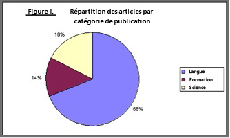

# Création d’un contenu accessible (conformité au WCAG 2.0){#creating-accessible-content-wcag-conformance}

>[!CAUTION]
>
>Comme l’UI classique a été abandonnée dans AEM 6.4, le contenu de cette page n’a pas été mis à jour pour WCAG 2.1.
>
>Consultez les pages suivantes pour plus d’informations sur AEM et le WCAG 2.1 :
>
>* [AEM et les consignes pour l’accessibilité web](/help/managing/web-accessibility.md)
>* [Guide rapide relatif au WCAG 2.1](/help/managing/qg-wcag.md)
>* [Création de contenu accessible (conformité au WCAG 2.1)](/help/sites-authoring/creating-accessible-content.md)

Le WCAG 2.0 regroupe un ensemble de consignes et de critères de réussite qui ne sont pas associés à une technologie particulière et visant à rendre les contenus web plus accessibles aux personnes en situation de handicap.

>[!NOTE]
>
>Voir également :
>
>* [Guide rapide relatif à WCAG 2.0](/help/managing/qg-wcag.md)
>* [Configuration de l’éditeur de texte enrichi pour produire du contenu accessible](/help/sites-administering/rte-accessible-content.md)
>

Ces règles sont classées selon trois niveaux de conformité : niveau A (le plus bas), niveau AA et niveau AAA (le plus élevé). Pour résumer, les niveaux sont définis comme suit :

* **Niveau A :** votre site atteint un niveau minimum d’accessibilité. Pour atteindre ce niveau, tous les critères de réussite de niveau A sont satisfaits.
* **Niveau AA :** le niveau d’accessibilité idéal à atteindre, dans lequel votre site atteint un niveau d’accessibilité amélioré, de sorte qu’il est accessible à la plupart des personnes dans la plupart des situations utilisant la plupart des technologies. Pour atteindre ce niveau, tous les critères de réussite de niveau A et de niveau AA sont satisfaits.
* **Niveau AAA :** votre site atteint un très haut niveau d’accessibilité. Pour atteindre ce niveau, tous les critères de réussite des niveaux A, AA et AAA sont satisfaits.

Lors de la création de votre site, vous devez déterminer à quel niveau général il doit se conformer.

La section suivante présente les [règles du WCAG 2.0](https://www.w3.org/TR/WCAG20/#guidelines) ainsi que les critères de réussite associés aux [niveaux de conformité](https://www.w3.org/TR/UNDERSTANDING-WCAG20/conformance.html) A et AA.

>[!NOTE]
>
>Comme il n’est pas possible de satisfaire tous les critères de réussite de niveau AAA pour certains types de contenu, il n’est pas recommandé d’exiger ce niveau de conformité en tant que politique générale.

>[!NOTE]
>
>Ce document utilise ce qui suit :
>
>* les noms courts des [règles WCAG 2.0](https://www.w3.org/TR/WCAG20/#guidelines) ;
>* la numérotation utilisée dans les [règles WCAG 2.0](https://www.w3.org/TR/WCAG20/#guidelines) afin de simplifier les références croisées avec le site web WCAG.
>

## Principe 1 : perceptible  {#principle-perceivable}

[Principe 1 : perceptible – Les informations et les composants de l’interface utilisateur doivent être présentés aux utilisateurs sous des formes qu’ils peuvent percevoir.](https://www.w3.org/TR/WCAG20/#perceivable)

### Équivalents textuels (1.1) {#text-alternatives}

[Règle 1.1 – Les équivalents textuels : ils proposent des équivalents textuels à tout contenu non textuel qui pourra alors être présenté sous d’autres formes selon les besoins de l’utilisateur ou de l’utilisatrice : grands caractères, braille, synthèse vocale, symboles ou langage simplifié.](https://www.w3.org/TR/WCAG20/#text-equiv)

### Contenu non textuel (1.1.1) {#non-text-content}

* Critère de réussite 1.1.1
* Niveau A
* Contenu non textuel : tout contenu non textuel présenté à l’utilisateur possède un texte secondaire qui remplit une fonction équivalente sauf dans les situations énumérées ci-dessous.

#### Objectif – Contenu non textuel (1.1.1) {#purpose-non-text-content}

Le contenu d’une page web peut être proposé dans différents formats non textuels (photos, vidéos, animations, tableaux et graphiques). Les personnes aveugles ou malvoyantes ne sont pas en mesure de voir le contenu non textuel, mais elles peuvent accéder au contenu textuel en le faisant lire par un lecteur d’écran ou sous forme tactile grâce à un appareil d’affichage en braille. Ainsi, en proposant des alternatives textuelles au contenu au format graphique, les personnes qui ne peuvent pas voir ce contenu graphique peuvent accéder à une version équivalente de l’information fournie par le contenu.

Par ailleurs, les alternatives textuelles ont l’avantage de permettre l’indexation du contenu non textuel par la technologie des moteurs de recherche.

#### Comment procéder – Contenu non textuel (1.1.1) {#how-to-meet-non-text-content}

Pour les images statiques, la règle de base consiste à fournir un équivalent textuel. Cette méthode est effectuée dans le champ **Texte de remplacement** :

>[!NOTE]
>
>Certains composants prêts à l’emploi, tels que **Carrousel** et **Diaporama**, ne permettent pas d’ajouter des descriptions d’images sous forme de texte de remplacement. Lors de l’implémentation de versions de ces composants pour votre instance d’AEM, votre équipe de développement doit configurer ces composants pour prendre en charge l’attribut `alt`. Cela permet de s’assurer que les auteurs et les autrices peuvent l’ajouter au contenu (consultez [Ajout de la prise en charge d’éléments et d’attributs HTML supplémentaires](/help/sites-administering/rte-accessible-content.md#add-support-for-more-html-elements-and-attributes)).

Le champ **Texte de remplacement** est disponible dans l’onglet des **Propriétés d’image avancées** de la boîte de dialogue du composant **Image** :


Par défaut, AEM ajoute un **texte de remplacement** à vos images. Dans l’interface utilisateur classique, il existe deux scénarios de création de l’attribut par défaut, bien que la valeur par défaut puisse ne pas être suffisante comme équivalent et devra être modifiée dans l’onglet des propriétés d’image **avancées** :

* Fichier :

  Une image est téléchargée à partir du disque dur de l’utilisateur ou de l’utilisatrice. Si vous ajoutez un composant d’image à une page, puis choisissez une image sur votre disque dur ou une autre source, la valeur par défaut pour le **Texte de remplacement** est `file`. Cette valeur doit être modifiée dans l’onglet des propriétés d’image **avancées**. Cette valeur n’est pas affichée dans le champ **Texte de remplacement** mais lorsque la valeur est modifiée, la nouvelle valeur s’affiche dans le champ.

* Asset :

  une image est ajoutée à partir du référentiel de ressources numériques. Si vous faites glisser une image du référentiel des ressources numériques vers une page web, les valeurs **Titre** et **Texte de remplacement** pour cette image sont récupérées dans ses métadonnées.

>[!NOTE]
>
>Dans les deux scénarios ci-dessus, la valeur par défaut **Texte de remplacement** n’est pas visible dans l’onglet **Propriétés d’image avancées**. Pour modifier la valeur par défaut, il vous suffit de saisir une nouvelle valeur dans le champ **Texte de remplacement**.

>[!NOTE]
>
>Si votre image est purement décorative (consultez [Création d’un texte secondaire adapté](#creating-good-text-alternatives)), vous pouvez saisir un espace dans le champ **Texte de remplacement** à l’aide de la barre d’espace. Cela crée un attribut `alt` vide qui invite un lecteur d’écran à ignorer l’image.

#### Créer des texte de remplacement adaptés {#creating-good-text-alternatives}

Il existe diverses formes de contenus non textuels. Par conséquent, la valeur de l’équivalent textuel dépend du rôle du graphique dans la page web. Voici quelques règles générales :

* Les textes secondaires doivent être succincts, tout en communiquant clairement l’information essentielle du contenu non textuel.
* Les descriptions longues (plus de 100 caractères) doivent être évitées. Si un texte secondaire nécessite plus de détails :

   * fournissez une brève description dans le texte secondaire ;
   * proposez une description plus longue, ailleurs sur la même page ou dans une page web distincte. Créez un lien vers cette description distincte en faisant de l’image un lien ou en plaçant un lien textuel en regard de l’image.

* Le texte secondaire ne doit pas répliquer le contenu fourni sous forme de texte à proximité sur la même page. N’oubliez pas que de nombreuses images sont des illustrations de points déjà couverts dans le texte d’une page. Il existe donc peut-être déjà un texte de remplacement détaillé.
* Si le contenu non textuel est un lien vers une autre page ou un autre document et qu’il n’existe pas de texte faisant partie dudit lien, le texte secondaire de l’image doit indiquer la destination du lien. Il ne doit pas décrire l’image.
* Si le contenu non textuel est contenu dans un bouton et qu’il n’existe pas de texte faisant partie dudit bouton, le texte de remplacement de l’image doit indiquer la fonction du bouton, et non décrire l’image.
* Il est acceptable de spécifier un texte de remplacement vide (nul) pour une image, mais uniquement si l’image n’a pas de texte de remplacement. Par exemple, s’il s’agit d’un graphique purement décoratif. Ou si le texte équivalent existe déjà dans le texte de la page.

L’ébauche du document [W3C: HTML5 Techniques for providing useful text alternatives](https://html.spec.whatwg.org/multipage/images.html#alt) (techniques pour spécifier des équivalents textuels utiles ; en anglais) répertorie des détails et des exemples de textes secondaires appropriés pour différents types d’images.

Voici quelques-uns des types spécifiques de contenu non textuel auquel un texte secondaire doit être associé :

* Photos d’illustration :

  Il s’agit de photos de personnes, d’objets ou de lieux. Pensez au rôle de la photo sur la page ; un texte approprié sera probablement *Photo de l’[objet]*, mais cela peut dépendre du texte environnant.

* Icônes :

  Petits pictogrammes (graphiques) véhiculant des informations spécifiques. Ils doivent être utilisés de manière cohérente sur une page et un site. Toutes les instances de l’icône sur une page ou un site doivent avoir le même équivalent textuel court et succinct, sauf si cela entraîne une duplication inutile du texte adjacent.

* Tableaux et graphiques :

  ces éléments présentent généralement des données numériques. Il est également possible de fournir un texte alternatif en fournissant un bref résumé des principales tendances affichées dans le diagramme ou le graphique. Si nécessaire, fournissez également une description plus détaillée dans le texte à l’aide du champ **Description** dans l’onglet des propriétés d’image **Avancées**. En outre, vous pouvez fournir les données sources sous forme tabulaire ailleurs dans la page ou le site.

  

  Pour spécifier un équivalent textuel pour cet exemple de graphique, ajoutez un texte `alt` concis à l’image, puis un équivalent textuel complet juste après l’image.

  ```xml
  <p></p>
  <p> Figure 1. Distribution of Articles by Journal Category.
  Pie chart: Language=68%, Education=14% and Science=18%.</p>
  ```

  >[!NOTE]
  >
  >Le fragment de code ci-dessus n’est utilisé qu’à titre d’exemple pour la commande. Utilisez le composant **Image** plutôt que la référence `img src` utilisée ci-dessus.

  Dans AEM, ce résultat peut être obtenu à l’aide d’une combinaison des champs **Texte de remplacement** et **Description** dans la boîte de dialogue de configuration de l’image. Voir [Comment procéder - Contenu non textuel (1.1.1)](#how-to-meet-non-text-content).

* Cartes, diagrammes, organigrammes :

  pour les diagrammes fournissant des données spatiales (par exemple, pour prendre en charge la description des relations entre des objets ou un processus), assurez-vous que le message clé est fourni au format texte. Dans le cas des cartes, il est probable que l’utilisation d’un équivalent en texte intégral ne soit pas adaptée. Toutefois, si la carte est fournie pour aider les gens à trouver leur chemin vers un emplacement donné, alors le texte de remplacement de l’image de la carte peut indiquer brièvement *Carte de X*, puis donner des indications vers cet emplacement en texte à un autre endroit, dans la page ou dans le champ **Description** de l’onglet **Avancé** du composant **Image**.

* CAPTCHAs :

  un CAPTCHA signifie *Completely Automated Public Turing test to tell Computers and Humans Apart* (Test de Turing public complètement automatisé pour faire la différence entre les ordinateurs et les humains). Il s’agit d’un contrôle de sécurité utilisé sur les pages web pour distinguer les humains des logiciels malveillants, mais qui peut causer des problèmes en matière d’accessibilité. Le CAPTCHA, sous forme d’images, nécessite que les utilisateurs et utilisatrices décrivent ce qu’ils voient pour réussir le test de sécurité. Il n’est évidemment pas possible de fournir un texte de remplacement pour l’image. Vous devrez donc envisager d’autres solutions non graphiques.

  Le W3C propose plusieurs suggestions, telles que les suivantes : Chacune de ces approches a ses avantages et ses inconvénients.

   * Tests de logique
   * Utilisation de la sortie son au lieu des images
   * Comptes d’utilisateur limités et filtres de courrier indésirable

* Images d’arrière-plan :

  Pour ce faire, utilisez des feuilles de style en cascade (CSS) plutôt qu’en HTML. Cela signifie qu’il n’est pas possible de spécifier de texte de remplacement. Par conséquent, les images d’arrière-plan ne doivent pas fournir d’informations textuelles importantes. Si c’est toutefois le cas, ces dernières doivent également être fournies dans le texte de la page.

  Cependant, il est important qu’un arrière-plan alternatif s’affiche lorsque l’image ne peut pas être affichée.

  >[!NOTE]
  >
  >Il doit y avoir un niveau de contraste approprié entre l’arrière-plan et le texte de premier plan. Ce contraste est abordé plus en détail dans la section [Contraste (minimum) (1.4.3)](#contrast-minimum).

#### En savoir plus – Contenu non textuel (1.1.1) {#more-information-non-text-content}

* [Compréhension du critère de réussite 1.1.1](https://www.w3.org/TR/UNDERSTANDING-WCAG20/text-equiv-all.html)
* [Comment remplir le critère de réussite 1.1.1](https://www.w3.org/WAI/WCAG21/quickref/?versions=2.0#text-alternatives)
* [W3C : techniques HTML5 permettant de spécifier des équivalents textuels utiles (en anglais)](https://html.spec.whatwg.org/multipage/images.html#alt)
* [Explication des CAPTCHA et alternatives par le W3C](https://www.w3.org/TR/turingtest/)

### Média temporel (1.2) {#time-based-media}

[Règle 1.2 – Média temporel : propose des versions de remplacement aux médias temporels.](https://www.w3.org/TR/WCAG20/#text-equiv)

Ces informations traitent du contenu web *temporel*. Cela concerne le contenu que l’utilisateur ou l’utilisatrice peut lire (contenu vidéo, audio et animé, par exemple) et qui peut être pré-enregistré ou en direct.

### Contenu seulement audio ou vidéo (pré-enregistré) (1.2.1) {#audio-only-and-video-only-pre-recorded}

* Critère de réussite 1.2.1
* Niveau A
* Contenu audio ou vidéo uniquement (pré-enregistré) : pour les médias pré-enregistrés audio uniquement et les médias pré-enregistrés vidéo uniquement, les faits suivants sont vrais, sauf lorsque l’audio ou la vidéo est un média secondaire pour le texte et qu’il est clairement marqué comme tel :

   * Contenu pré-enregistré audio uniquement : une alternative pour les médias temporels, qui présente des informations équivalentes pour le contenu pré-enregistré audio uniquement.
   * Contenu pré-enregistré vidéo uniquement : une alternative pour les médias temporels ou une piste audio, qui présente des informations équivalentes pour le contenu pré-enregistré vidéo uniquement.

#### Objectif – Contenu uniquement audio ou vidéo (pré-enregistré) (1.2.1) {#purpose-audio-only-and-video-only-pre-recorded}

Les personnes suivantes peuvent rencontrer des problèmes d’accessibilité à la vidéo et à l’audio :

* les personnes malvoyantes lorsqu’il n’y a pas de bande sonore, ou que la bande sonore n’est pas suffisante pour les informer de ce qui se passe dans la vidéo ou l’animation ;
* les personnes malentendantes ou sourdes, qui ne peuvent pas entendre la bande sonore ;
* les personnes qui peuvent entendre la bande sonore, mais ne comprennent pas ce qui est dit (par exemple, parce qu’elle est dans une langue qu’elles ne comprennent pas).

Les utilisateurs et utilisatrices de navigateurs ou d’appareils qui ne prennent pas en charge la lecture de contenu dans des formats multimédias spécifiques, tels qu’Adobe Flash, peuvent également ne pas avoir accès aux contenus vidéo ou audio.

Fournir ces informations dans un format différent, tel que du texte (ou de l’audio pour une vidéo sans audio), peut les rendre accessibles aux personnes qui ne peuvent pas accéder au contenu d’origine.

#### Comment procéder – Contenu seulement audio ou vidéo (pré-enregistré) (1.2.1)  {#how-to-meet-audio-only-and-video-only-pre-recorded}

* Si le contenu est un contenu audio pré-enregistré sans vidéo (podcast par exemple) :

   * fournissez un lien juste avant ou après le contenu vers une transcription textuelle du contenu audio ;

     La transcription doit être une page de HTML avec un équivalent textuel de tout le contenu non parlé important et parlé. Elle doit également indiquer qui parle, une description du décor, des expressions vocales et une description de tout autre son significatif.

* Si le contenu est une animation ou une vidéo préenregistrée sans son :

   * Fournissez un lien juste avant ou après le contenu vers une description textuelle équivalente des informations fournies par la vidéo
   * ou une audio-description équivalente dans un format audio couramment utilisé, tel que MP3.

>[!NOTE]
>
>Si le contenu audio ou vidéo est fourni comme alternative au contenu existant dans un autre format sur une page web, il n’est pas nécessaire de respecter les exigences ci-dessus. Par exemple, si une vidéo illustre une liste d’instructions textuelles, cette vidéo ne nécessite pas d’alternative, car les instructions textuelles agissent déjà comme une alternative à la vidéo.

L’insertion de contenu multimédia, en particulier du contenu Flash, dans les pages web d’AEM, est identique à l’insertion d’une image. Cependant, le contenu multimédia étant plus complexe qu’une image fixe, de nombreux paramètres et options sont nécessaires pour contrôler sa lecture.

>[!NOTE]
>
>Si vous utilisez un contenu multimédia informatif, vous devez également créer des liens vers les équivalents. Par exemple, pour inclure une transcription textuelle, créez une page HTML où afficher la transcription, puis ajoutez un lien en regard ou en dessous du contenu audio.

#### En savoir plus – Contenu seulement audio ou vidéo (pré-enregistré) (1.2.1) {#more-information-audio-only-and-video-only-pre-recorded}

* [Compréhension du critère de réussite 1.2.1](https://www.w3.org/TR/UNDERSTANDING-WCAG20/media-equiv-av-only-alt.html)
* [Comment remplir le critère de réussite 1.2.1](https://www.w3.org/WAI/WCAG21/quickref/?versions=2.0#time-based-media)

### Sous-titres (pré-enregistrés) (1.2.2)  {#captions-pre-recorded}

* Critère de réussite 1.2.2
* Niveau A
* Sous-titres (pré-enregistrés) : fournir des sous-titres pour tout contenu audio pré-enregistré dans un média synchronisé, excepté lorsque le média est un média de remplacement pour un texte et qu’il est clairement identifié comme tel.

#### Objectif – Sous-titres (pré-enregistrés) (1.2.2)  {#purpose-captions-pre-recorded}

Les personnes sourdes ou malentendantes ne peuvent pas accéder au contenu audio ou ont de grandes difficultés à y accéder. Les sous-titres sont des équivalents textuels pour un son parlé ou non, qui s’affichent à l’écran au moment approprié pendant la vidéo. Ils permettent aux personnes qui ne peuvent pas entendre le son de comprendre ce qui se passe.

>[!NOTE]
>
>Les sous-titres ne sont pas requis lorsque du texte ou des équivalents non textuels appropriés (qui fournissent directement des informations équivalentes) sont disponibles sur la même page que la vidéo ou l’animation.

#### Comment procéder – Sous-titres (pré-enregistrés) (1.2.2)  {#how-to-meet-captions-pre-recorded}

Les sous-titres peuvent être :

* intégrés : toujours visibles pendant la lecture de la vidéo ;
* non intégrés : activés ou désactivés par l’utilisateur.

Dans la mesure du possible, utilisez le sous-titrage. Il permet aux utilisateurs et utilisatrices d’afficher ou non les sous-titres.

Pour les sous-titres, créez et fournissez un fichier de sous-titres synchronisés dans un format approprié, tel que [SMIL](https://www.w3.org/AudioVideo/), ainsi que le fichier vidéo.

Voir les tutoriels dans [En savoir plus - Sous-titres (pré-enregistrés) (1.2.2)](#more-information-captions-pre-recorded). Veillez à ajouter une note pour informer les utilisateurs et utilisatrices que des sous-titres sont disponibles pour la vidéo.

Si vous devez utiliser des sous-titres ouverts, incorporez le texte dans le suivi vidéo. Cette méthode est réalisée à l’aide d’applications d’édition vidéo qui permettent de superposer des titres sur la vidéo.

#### En savoir plus – Sous-titres (pré-enregistrés) (1.2.2) {#more-information-captions-pre-recorded}

* [Compréhension du critère de réussite 1.2.2](https://www.w3.org/TR/UNDERSTANDING-WCAG20/media-equiv-captions.html) :
* [Comment remplir le critère de réussite 1.2.2](https://www.w3.org/WAI/WCAG21/quickref/?versions=2.0#time-based-media)
* [W3C: Synchronized Multimedia (Multimédia synchronisé ; en anglais)](https://www.w3.org/AudioVideo/)
* [Captions, Transcripts, and Audio Descriptions (Sous-titres, transcriptions et descriptions audio), par WebAIM (en anglais)](https://webaim.org/techniques/captions/)

### Audio-description ou version de remplacement pour un média temporel (pré-enregistré) (1.2.3)  {#audio-description-or-media-alternative-pre-recorded}

* Critère de réussite 1.2.3
* Niveau A
* Audio-description ou version de remplacement pour un média temporel (pré-enregistré) : une alternative pour un média temporel ou une audio-description du contenu vidéo pré-enregistré est fournie pour un média synchronisé, sauf lorsque le média est un média secondaire pour un texte et qu’il est clairement étiqueté comme tel.

#### Objectif – Audio-description ou version de remplacement pour un média temporel (pré-enregistré) (1.2.3)  {#purpose-audio-description-or-media-alternative-pre-recorded}

Les personnes aveugles ou malvoyantes rencontrent des obstacles à l’accessibilité si les informations contenues dans une vidéo ou une animation ne sont fournies que sous une forme visuelle. Cette situation se produit également si la bande sonore ne fournit pas suffisamment d’informations pour permettre de comprendre ce qui se passe visuellement.

#### Comment procéder – Audio-description ou version de remplacement pour un média temporel (pré-enregistré) (1.2.3) {#how-to-meet-audio-description-or-media-alternative-pre-recorded}

Deux méthodes peuvent être adoptées pour satisfaire ce critère de réussite. Les deux sont acceptables :

1. Incluez une audio-description supplémentaire pour le contenu vidéo. Vous pouvez effectuer cette approche de trois façons :

   * Pendant les pauses dans la boîte de dialogue existante, fournissez des informations sur les modifications de la scène qui ne sont pas présentées dans la piste audio existante.
   * Fournissez une nouvelle piste audio supplémentaire et facultative contenant la piste audio originale, mais aussi des informations audio supplémentaires sur les modifications dans la scène.

      * Les utilisateurs et utilisatrices peuvent passer de la piste audio existante (qui *ne contient pas* de description audio) à la nouvelle piste audio (qui *contient* une description audio).
      * Cette méthode permet d’éviter toute perturbation pour les utilisateurs et utilisatrices qui n’ont pas besoin d’une description supplémentaire.

   * Créez une deuxième version du contenu vidéo pour pouvoir ajouter des audio-descriptions plus longues. Cela permet de réduire les difficultés liées à l’insertion de descriptions audio détaillées dans les espaces entre les dialogues existants, en mettant temporairement le contenu audio et vidéo en pause aux moments appropriés. Une audio-description beaucoup plus longue peut ainsi être fournie avant que l’action ne reprenne. Comme dans l’exemple précédent, il est préférable de la fournir en tant que piste audio supplémentaire en option, afin d’éviter de perturber les utilisateurs et utilisatrices qui n’ont pas besoin de la description supplémentaire.

1. Fournissez une transcription textuelle formant un équivalent textuel adapté des éléments audio et visuels de la vidéo ou de l’animation. Il peut s’agir, selon les besoins, d’une indication précisant qui parle, d’une description du décor ou d’expressions vocales. Selon sa durée, vous pouvez placer la transcription sur la même page que la vidéo ou l’animation, ou sur une autre. Dans le deuxième cas, fournissez un lien vers la transcription à proximité de la vidéo ou de l’animation.

Les détails exacts de la création de vidéos avec description audio ne sont pas compris dans ce guide. La création de descriptions vidéo et audio peut prendre du temps, mais d’autres produits Adobe peuvent vous aider à accomplir ces tâches. Si vous créez du contenu dans Adobe Flash Professional, vous devez également créer un script pour inviter l’utilisateur à télécharger le plug-in approprié et fournir un texte secondaire via l’élément `<noscript>`.

#### En savoir plus – Audio-description ou version de remplacement pour un média temporel (pré-enregistré) (1.2.3) {#more-information-audio-description-or-media-alternative-pre-recorded}

* [Compréhension du critère de réussite 1.2.3](https://www.w3.org/TR/UNDERSTANDING-WCAG20/media-equiv-audio-desc.html) :
* [Comment remplir le critère de réussite 1.2.3](https://www.w3.org/WAI/WCAG21/quickref/?versions=2.0#qr-media-equiv-audio-desc)
* [Adobe Encore CS5](https://helpx.adobe.com/premiere-pro/using/whats-new.html)

### Sous-titres (en direct) (1.2.4)    {#captions-live}

* Critère de réussite 1.2.4
* Niveau AA
* Sous-titres (en direct) : fournir des sous-titres pour tout contenu audio en direct, sous forme de média synchronisé.

#### Objectif – Sous-titres (en direct) (1.2.4) {#purpose-captions-live}

Ce critère de réussite est identique aux [Sous-titres (pré-enregistrés)](#captions-pre-recorded), du fait qu’il résout les obstacles à l’accessibilité pour les personnes sourdes ou malentendantes ; toutefois, ce critère de réussite traite des présentations en direct du type webcasts.

#### Comment procéder – Sous-titres (en direct) (1.2.4) {#how-to-meet-captions-live}

Suivez les instructions de la section [Sous-titres (pré-enregistrés)](#captions-pre-recorded) ci-dessus. Toutefois, en raison de la nature du média (en direct), les sous-titres doivent être créés aussi rapidement que possible, en fonction de ce qui se passe dans la vidéo. Par conséquent, vous devez envisager d’utiliser des outils de sous-titrage en temps réel ou de transcription audio en texte.

Ce document ne vise pas à fournir des instructions détaillées à ce sujet, mais vous trouverez des renseignements utiles en suivant les liens ci-après :

* [WebAIM : Real Time Captioning (sous-titrage en temps réel ; en anglais)](https://webaim.org/techniques/captions/realtime)
* [AccessIT (University of Washington) : Est-il possible de générer des sous-titres automatiquement à l’aide de la reconnaissance vocale ?](https://www.washington.edu/doit/programs/accessit?1209)

#### En savoir plus – Sous-titres (en direct) (1.2.4)  {#more-information-captions-live}

* [Compréhension du critère de réussite 1.2.4](https://www.w3.org/TR/UNDERSTANDING-WCAG20/media-equiv-real-time-captions.html)
* [Comment remplir le critère de réussite 1.2.4](https://www.w3.org/WAI/WCAG21/quickref/?versions=2.0#qr-media-equiv-real-time-captions)

### Audio-description (pré-enregistrée) (1.2.5)    {#audio-description-pre-recorded}

* Critère de réussite 1.2.5
* Niveau AA
* Audio-description (pré-enregistrée) : une description audio est fournie pour tout le contenu vidéo pré-enregistré dans les médias synchronisés.

#### Objectif – Audio-description (pré-enregistrée) (1.2.5)  {#purpose-audio-description-pre-recorded}

Ce critère de réussite est identique au critère [Audio-description ou version de remplacement pour un média temporel (pré-enregistré)](#audio-description-or-media-alternative-pre-recorded), excepté que les auteurs doivent fournir une audio-description beaucoup plus détaillée, conforme au niveau AA.

#### Comment procéder – Audio-description (pré-enregistrée) (1.2.5)  {#how-to-meet-audio-description-pre-recorded}

Suivez les instructions de la section [Audio-description ou version de remplacement pour un média temporel (pré-enregistré)](#audio-description-or-media-alternative-pre-recorded).

#### En savoir plus – Audio-description (pré-enregistrée) (1.2.5)  {#more-information-audio-description-pre-recorded}

* [Compréhension du critère de réussite 1.2.5](https://www.w3.org/TR/UNDERSTANDING-WCAG20/media-equiv-audio-desc-only.html)
* [Comment remplir le critère de réussite 1.2.5](https://www.w3.org/WAI/WCAG21/quickref/?versions=2.0#qr-media-equiv-audio-desc-only)

### Adaptable (1.3) {#adaptable}

[Règle 1.3 - Adaptable : créer un contenu qui puisse être présenté de différentes manières sans perte d’information ni de structure (par exemple avec une mise en page simplifiée).](https://www.w3.org/TR/WCAG20/#content-structure-separation)

Cette règle couvre les exigences nécessaires pour proposer un contenu adapté aux personnes qui :

* peuvent ne pas être en mesure d’accéder aux informations présentées par un auteur ou un autrice dans une mise en page web colorée, à plusieurs colonnes et bidimensionnelle *standard* ;

* utilisent peut-être un contenu audio uniquement ou un affichage visuel de remplacement, par exemple un contraste élevé ou une grande taille de texte.

### Informations et relations (1.3.1)    {#info-and-relationships}

* Critère de réussite 1.3.1
* Niveau A
* Informations et relations : les informations, la structure et les relations de la présentation peuvent être déterminées par programmation ou sont disponibles dans le texte.

#### Objectif – Informations et relations (1.3.1) {#purpose-info-and-relationships}

Nombre des technologies d’assistance auxquelles ont recours les personnes en situation de handicap s’appuient sur des informations structurelles pour afficher ou créer efficacement du contenu. Ces informations structurelles peuvent se présenter sous forme de titres de page, de lignes de tableau, de titres de colonne et de types de liste. Par exemple, un utilisateur peut recourir à un lecteur d’écran pour parcourir une page d’un titre à un autre. Cependant, si le contenu d’une page semble s’appuyer exclusivement sur une structure de style visuel plutôt que sur le code HTML sous-jacent, aucune information structurelle n’est disponible pour les technologies d’assistance, ce qui limite leur capacité à faciliter la navigation.

Ce critère de réussite permet de s’assurer que ces informations structurelles sont fournies par le biais du langage HTML, de sorte que les navigateurs et les technologies d’assistance puissent y accéder et en tirer parti.

#### Comment procéder – Informations et relations (1.3.1)  {#how-to-meet-info-and-relationships}

AEM facilite la construction de pages web à l’aide d’éléments HTML appropriés. Ouvrez le contenu de votre page dans l’éditeur de texte enrichi (un composant texte) et utilisez le menu **Format** pour indiquer l’élément structurel approprié (paragraphe, en-tête, etc.).

L’image suivante présente du texte stylisé en tant que texte de paragraphe. L’affichage du code source utilisé indique que les balises d’ouverture et de fermeture &lt;p> et &lt;/p> sont correctes.


Veillez à ce que vos pages web aient la structure appropriée comme suit :

* **Utilisation de titres :**

  Quand les fonctionnalités d’accessibilité de l’éditeur de texte enrichi sont activées, (voir [AEM et accessibilité](/help/sites-administering/rte-accessible-content.md)), AEM offre trois niveaux d’en-tête de page. Vous pouvez les utiliser pour identifier les sections et sous-sections de contenu. En-tête 1 est le plus haut niveau d’en-tête, En-tête 3 le plus bas. L’administrateur système peut configurer le système pour autoriser l’utilisation d’un plus grand nombre de niveaux d’en-tête.

  L’image suivante illustre un exemple des différents types de titres.

  

* **Texte mis en évidence** :

  Mettez le texte en évidence à l’aide des éléments &lt;strong> ou &lt;em>. N’utilisez pas de titres au sein des paragraphes.

   * Surlignez le texte à mettre en évidence.
   * Cliquez sur l’icône **B** (pour &lt;strong>) ou **I** (pour &lt;em>) du panneau **Propriétés** (HTML doit être sélectionné).

  >[!NOTE]
  >
  >Dans une installation AEM standard, l’éditeur de texte enrichi est configuré pour utiliser :
  >
  >* &lt;b> pour &lt;strong> ;
  >* &lt;i> pour &lt;em>.
  >
  >Ces balises sont identiques dans la pratique, mais &lt;strong> et &lt;em> sont préférables, car il s’agit de code HTML correct sémantiquement. Votre équipe de développement peut configurer l’éditeur de texte enrichi pour qu’il utilise &lt;strong> et &lt;em> (au lieu de &lt;b> et &lt;i>) lors du développement de votre instance de projet.

* **Utiliser les listes** : vous pouvez spécifier trois différents types de listes en HTML :

   * L’élément `<ul>` est utilisé pour les listes *non triées* (à puces). Les éléments de liste individuels sont identifiés à l’aide de l’élément `<li>`.

     Dans l’éditeur de texte enrichi, cliquez sur l’icône **Liste à puces**.

   * L’élément `<ol>` est utilisé pour les listes *numérotées*. Les éléments de liste individuels sont identifiés à l’aide de l’élément `<li>`.

     Dans l’éditeur de texte enrichi, cliquez sur l’icône **Liste numérotée**.

  Pour modifier le contenu existant d’un type de liste particulier, surlignez le texte concerné puis sélectionnez le type de liste approprié. Comme dans l’exemple précédent illustrant comment est entré le texte du paragraphe, les éléments de liste appropriés sont automatiquement ajoutés au fichier HTML, mais vous pouvez l’afficher en mode d’édition de la source.

  >[!NOTE]
  >
  >L’élément `<dl>` n’est pas pris en charge par l’éditeur de texte enrichi.

* **Utiliser des tableaux** :

  Les tableaux de données doivent être identifiés à l’aide des éléments de tableau HTML :

   * un élément `<table>` ;
   * un élément `<tr>` pour chaque ligne du tableau ;
   * un élément `<th>` pour chaque en-tête de ligne et de colonne ;
   * un élément `<td>` pour chaque cellule de données.

  >[!NOTE]
  >
  >Les tableaux doivent être créés avec le composant **Tableau**. Bien qu’il soit possible de les créer dans le composant Texte, cela n’est pas recommandé.

  En outre, les tableaux accessibles utilisent les éléments et attributs suivants :

   * L’élément `<caption>` sert à fournir un sous-titre visible pour le tableau. Les légendes apparaissent par défaut centrées au-dessus du tableau, mais peuvent être positionnées de manière appropriée à l’aide de CSS. La légende est associée au tableau par programmation, ce qui en fait une méthode utile pour fournir une introduction au contenu.
   * L’élément `<h3 class="summary">` aide les utilisateurs non voyants à comprendre plus facilement les informations présentées dans un tableau, en fournissant une synthèse de ce qu’un utilisateur voyant peut voir. Cela s’avère particulièrement utile lorsque des mises en page de tableau complexes ou non conventionnelles sont utilisées (cet attribut n’est pas affiché dans le navigateur, il est uniquement lu pour les technologies d’assistance).
   * L’attribut `scope` de l’élément `<th>` sert à indiquer si une cellule représente un en-tête pour une ligne ou une colonne particulière. Une approche similaire consiste à utiliser les attributs header et id dans des tableaux complexes, où les cellules de données peuvent être associées à un ou plusieurs en-têtes.

  >[!NOTE]
  >
  >Par défaut, ces éléments et attributs ne sont pas directement disponibles, mais l’administration du système peut ajouter la prise en charge de ces valeurs dans la boîte de dialogue **Propriétés du tableau** (voir [Ajout de la prise en charge des éléments et attributs HTML supplémentaires](/help/sites-administering/rte-accessible-content.md#add-support-for-more-html-elements-and-attributes)).

  En ajoutant un **Tableau**, vous pouvez configurer les **Propriétés du tableau** à l’aide de la boîte de dialogue.

   * une **légende** appropriée.
   * Idéalement, supprimez toutes les valeurs par défaut pour **Largeur**, **Hauteur**, **Bordure**, **Marge intérieure des cellules** et **Espacement des cellules**. En effet, ces propriétés peuvent être définies dans une feuille de style globale.

  

  Utilisez les **Propriétés de la cellule** pour déterminer si la cellule est une cellule de données ou d’en-tête et, dans le deuxième cas, si elle renvoie à une ligne, à une colonne ou aux deux :

  

* **Tableaux de données complexes :** 

  Dans certains cas, lorsqu’il existe des tableaux complexes comportant deux niveaux ou plus d’en-têtes, les propriétés de base du tableau peuvent ne pas suffire à fournir toutes les informations structurelles nécessaires. Pour ce type de tableaux complexes, il est nécessaire de créer des relations directes entre les en-têtes et leurs cellules associées à l’aide des attributs d’**en-tête** et d’**identifiant**. Par exemple, dans le tableau ci-dessous, les attributs header et id correspondent pour créer une association de programmation pour les utilisateurs de technologies d’assistance.

  >[!NOTE]
  >
  >L’attribut id n’est pas disponible dans une installation prête à l’emploi. Il peut être activé en configurant les règles HTML et le sérialiseur dans l’éditeur de texte enrichi.

  >[!NOTE]
  >
  >Les tableaux doivent être créés avec le composant **Tableau**. Bien qu’il soit possible de les créer dans le composant Texte, cela n’est pas recommandé.

  ```xml
  <table>
     <tr>
       <th rowspan="2" id="h">Homework</th>
       <th colspan="3" id="e">Exams</th>
       <th colspan="3" id="p">Projects</th>
     </tr>
     <tr>
       <th id="e1" headers="e">1</th>
       <th id="e2" headers="e">2</th>
       <th id="ef" headers="e">Final</th>
       <th id="p1" headers="p">1</th>
       <th id="p2" headers="p">2</th>
       <th id="pf" headers="p">Final</th>
     </tr>
     <tr>
      <td headers="h">15%</td>
      <td headers="e e1">15%</td>
      <td headers="e e2">15%</td>
      <td headers="e ef">20%</td>
      <td headers="p p1">10%</td>
      <td headers="p p2">10%</td>
      <td headers="p pf">15%</td>
     </tr>
    </table>
  ```

  Pour ce faire dans AEM, vous devez ajouter le balisage directement à l’aide du mode d’édition de la source.

  >[!NOTE]
  >
  >Cette fonctionnalité n’est pas disponible immédiatement dans une installation standard. Elle nécessite la configuration de l’éditeur de texte enrichi, des règles HTML et du sérialiseur.

#### En savoir plus – Informations et relations (1.3.1) {#more-information-info-and-relationships}

* [Compréhension du critère de réussite 1.3.1](https://www.w3.org/TR/UNDERSTANDING-WCAG20/content-structure-separation-programmatic.html)
* [Comment remplir le critère de réussite 1.3.1](https://www.w3.org/WAI/WCAG21/quickref/?versions=2.0#qr-content-structure-separation-programmatic)

### Caractéristiques sensorielles (1.3.3)    {#sensory-characteristics}

* Critère de réussite 1.3.3
* Niveau A
* Caractéristiques sensorielles : les instructions données pour la compréhension et l’utilisation du contenu ne doivent pas reposer uniquement sur les caractéristiques sensorielles des éléments comme la forme, la taille, l’emplacement visuel, l’orientation ou le son.

#### Objectif – Caractéristiques sensorielles (1.3.3) {#purpose-sensory-characteristics}

Les concepteurs et conceptrices concentrent généralement leurs efforts sur le côté visuel (couleur, forme, style du texte, ou position absolue ou relative d’un élément du contenu) de la présentation des informations. Même s’il peut s’agir de techniques de conception très efficaces pour véhiculer l’information, les personnes aveugles ou malvoyantes peuvent ne pas être en mesure d’accéder à l’information nécessitant une identification visuelle des attributs (position, couleur ou forme, par exemple).

De la même manière, les informations qui impliquent de distinguer différents sons (contenu verbalisé par un homme ou une femme, par exemple) présentent un obstacle à l’accessibilité pour les personnes malentendantes si elles ne sont pas reproduites dans un équivalent textuel du contenu audio.

>[!NOTE]
>
>Pour connaître les conditions requises en rapport avec les alternatives aux couleurs, voir [Utilisation de la couleur](#use-of-color).

#### Comment procéder – Caractéristiques sensorielles (1.3.3) {#how-to-meet-sensory-characteristics}

Assurez-vous que toutes les informations qui reposent sur les caractéristiques visuelles du contenu de la page sont également présentées dans un autre format.

* Ne vous fiez pas à la position visuelle pour donner des informations. Par exemple, si vous souhaitez renvoyer les utilisateurs et les utilisatrices vers un menu sur le côté droit de la page pour accéder à des informations supplémentaires, ne faites pas référence au *menu de droite* ; au lieu de cela, nommez le menu (par exemple au moyen d’un en-tête) et faites référence à ce nom dans le texte.
* Ne vous limitez pas au style de texte (texte en gras ou en italique, par exemple) comme seul moyen de transmettre l’information.

>[!NOTE]
>
>L’utilisation de termes descriptifs est acceptable s’ils ont une signification dans un contexte non visuel. Par exemple, les termes *ci-dessus* et *ci-dessous* sont généralement acceptables, puisqu’ils impliquent respectivement le contenu juste avant ou après un élément de contenu particulier. Le contenu aura toujours un sens lorsqu’il sera énoncé à haute voix.

#### En savoir plus – Caractéristiques sensorielles (1.3.3) {#more-information-sensory-characteristics}

* [Compréhension du critère de réussite 1.3.3](https://www.w3.org/TR/UNDERSTANDING-WCAG20/content-structure-separation-understanding.html)
* [Comment remplir le critère de réussite 1.3.3](https://www.w3.org/WAI/WCAG21/quickref/?versions=2.0#qr-content-structure-separation-understanding)

### Perceptible (1.4) {#distinguishable}

[Règle 1.4 – Perceptible : faciliter la perception visuelle et auditive du contenu par l’utilisateur, notamment en séparant le premier plan de l’arrière-plan.](https://www.w3.org/TR/WCAG20/#visual-audio-contrast)

### Utilisation de la couleur (1.4.1)  {#use-of-color}

* Critère de réussite 1.4.1
* Niveau A
* Utilisation de la couleur : la couleur n’est pas utilisée comme seul moyen visuel de transmettre des informations, d’indiquer une action, de demander une réponse ou de distinguer un élément visuel.

>[!NOTE]
>
>Ce critère de réussite traite spécifiquement de la perception des couleurs. Les autres formes de perception sont traitées dans la règle [Adaptable (1.3)](#adaptable), incluant l’accès à la couleur via un programme informatique et les autres formes de codage de la présentation visuelle.

#### Objectif - Utilisation de la couleur (1.4.1) {#purpose-use-of-color}

La couleur est un moyen efficace d’améliorer l’aspect esthétique des pages web et est également utile pour véhiculer l’information. Cependant, il existe une plage de déficiences visuelles, de la cécité au daltonisme, ce qui signifie que certaines personnes sont incapables de distinguer certaines couleurs. Ce problème rend le codage par couleur un moyen peu fiable de fournir des informations.

Par exemple, une personne ayant un daltonisme rouge-vert ne peut pas distinguer les nuances de vert et les nuances de rouge. Elle peut voir les deux couleurs comme une troisième couleur (marron, par exemple). Dans ce cas, elle ne peut pas distinguer le rouge, le vert et le marron.

En outre, les personnes qui utilisent des navigateurs de texte seul, des appareils d’affichage monochromes ou qui visualisent une impression en noir et blanc de la page ne peuvent pas percevoir les couleurs.

#### Comment procéder – Utilisation de la couleur (1.4.1) {#how-to-meet-use-of-color}

Si la couleur sert à véhiculer l’information, veillez à ce que cette information soit accessible sans recourir à la couleur.

Par exemple, assurez-vous que les informations fournies par couleur sont également fournies explicitement dans le texte. L’illustration ci-dessous montre comment la couleur et le texte indiquent tous deux la disponibilité de sièges pour une performance :

<table>
 <tbody>
  <tr>
   <td><p><strong>Performances</strong></p> </td>
   <td><p><strong>Disponibilité</strong></p> </td>
  </tr>
  <tr>
   <td><p>Mardi 16 mars</p> </td>
   <td><p>SIÈGES DISPONIBLES</p> </td>
  </tr>
  <tr>
   <td><p>Mercredi 17 mars</p> </td>
   <td><p>SIÈGES DISPONIBLES</p> </td>
  </tr>
  <tr>
   <td><p>Jeudi 18 mars</p> </td>
   <td><p>COMPLET</p> </td>
  </tr>
 </tbody>
</table>

Si vous utilisez la couleur comme vecteur d’information, vous devez fournir un indice visuel supplémentaire, par exemple, en modifiant le style (gras ou italique, par exemple) ou la police. Les utilisateurs et utilisatrices daltoniens ou souffrant d’une déficience visuelle peuvent alors distinguer les informations à l’écran. Cependant, ce système ne peut pas être entièrement fiable, car il n’aidera pas les personnes qui ne peuvent pas voir du tout la page.

#### En savoir plus – Utilisation de la couleur (1.4.1) {#more-information-use-of-color}

* [Compréhension du critère de réussite 1.4.1](https://www.w3.org/TR/2008/NOTE-WCAG20-TECHS-20081211/working-examples/G183/link-contrast.html)
* [Comment remplir le critère de réussite 1.4.1](https://www.w3.org/TR/2008/NOTE-WCAG20-TECHS-20081211/working-examples/G183/link-contrast.html)
* [Conseils pour obtenir un rapport de contraste de 3:1, avec une liste de couleurs adaptées au Web](https://www.w3.org/TR/2008/NOTE-WCAG20-TECHS-20081211/working-examples/G183/link-contrast.html)

### Contraste (minimum) (1.4.3) {#contrast-minimum}

* Critère de réussite 1.4.3
* Niveau AA
* Contraste (minimum) : la présentation visuelle du texte et des images du texte présente un rapport de contraste d’au moins 4,5:1, sauf dans les cas suivants :

   * Texte grand format : le texte à grande échelle et les images de texte à grande échelle ont un rapport de contraste d’au moins 3:1.
   * Texte décoratif : aucune exigence de contraste pour le texte ou le texte sous forme d’image intégré à un composant d’interface utilisateur inactif. Il s’agit d’un élément purement décoratif, invisible de tous ou intégré à une partie d’une image contenant un autre contenu significatif.
   * Logotypes : aucune exigence de contraste pour le texte faisant partie d’un logo ou d’un nom de marque.

#### Objectif – Contraste (minimum) (1.4.3) {#purpose-contrast-minimum}

Les personnes avec certaines déficiences visuelles peuvent ne pas être en mesure de distinguer certaines paires de couleurs à faible contraste. Elles peuvent être confrontées à des obstacles à l’accessibilité si :

* Le texte est faiblement contrasté avec sa couleur d’arrière-plan.
* Le codage de la couleur du texte (tel que le texte du lien et le texte hors lien) est important pour distinguer les informations.

>[!NOTE]
>
>Le texte utilisé uniquement à des fins décoratives est exclu de ce critère de succès.

#### Comment procéder – Contraste (minimum) (1.4.3) {#how-to-meet-contrast-minimum}

Veillez à ce que le texte soit suffisamment contrasté par rapport à son arrière-plan. Les rapports de contraste dépendent de la taille et du style du texte en question :

* Pour le texte de moins de 18 points (ou 14 points en gras), le rapport de contraste entre le texte/les images de texte et l’arrière-plan doit être d’au moins 4.5:1.
* Pour un texte d’au moins 18 points (ou 14 points en gras), le rapport de contraste doit être d’au moins 3:1.
* Si un arrière-plan a un motif, l’arrière-plan autour du texte doit être ombré, de sorte que le rapport de 4.5:1 ou 3:1 soit préservé.

Pour vérifier les rapports de contraste, utilisez un outil de contraste des couleurs, tel que l’[analyseur de contraste des couleurs du groupe Paciello](https://www.paciellogroup.com/resources/contrast-analyser.html) ou le [vérificateur de contraste des couleurs WebAIM](https://webaim.org/resources/contrastchecker/). Ces outils vous permettent de vérifier des paires de couleurs et de signaler tout problème de contraste.

Si vous accordez moins d’importance à l’apparence de votre page, vous pouvez choisir de ne pas spécifier de couleurs de texte d’arrière-plan et de premier plan. Aucune vérification du contraste n’est requise, car le navigateur de l’utilisateur ou de l’utilisatrice détermine les couleurs du texte et de l’arrière-plan.

S’il est impossible de respecter les niveaux de contraste recommandés, fournissez un lien vers une version équivalente alternative de la page (qui ne présente aucun problème de contraste des couleurs). Vous pouvez également laisser l’utilisateur ou l’utilisatrice régler le contraste du modèle de couleurs de la page selon ses besoins.

#### En savoir plus – Contraste (minimum) (1.4.3) {#more-information-contrast-minimum}

* [Compréhension du critère de réussite 1.4.3](https://www.w3.org/TR/UNDERSTANDING-WCAG20/visual-audio-contrast-contrast.html)
* [Comment remplir le critère de réussite 1.4.3](https://www.w3.org/WAI/WCAG21/quickref/?versions=2.0#qr-visual-audio-contrast-contrast)

### Texte sous forme d’image (1.4.5)  {#images-of-text}

* Critère de réussite 1.4.5
* Niveau AA
* Texte sous forme d’image : si les technologies utilisées peuvent réaliser la présentation visuelle, du texte est utilisé pour véhiculer l’information plutôt que du texte sous forme d’image sauf dans les cas suivants :

   * Personnalisable : l’image du texte peut être personnalisée visuellement en fonction des besoins de l’utilisateur ou de l’utilisatrice.
   * Essentiel : une présentation particulière du texte est essentielle à la transmission de l’information.

>[!NOTE]
>
>Les logotypes (texte faisant partie d’un logo ou d’un nom de marque) sont considérés comme essentiels.

#### Objectif – Texte sous forme d’image (1.4.5) {#purpose-images-of-text}

Les images de texte sont souvent utilisées lorsqu’un style de texte particulier est privilégié, par exemple, un logotype ou si le texte a été généré à partir d’une autre source (la numérisation d’un document papier, par exemple). Cependant, par rapport au texte présenté au format HTML dans le style CSS, les images de texte n’offrent pas la possibilité de modifier leur taille ou leur apparence, des fonctionnalités parfois nécessaires pour les personnes avec des déficiences visuelles ou présentant des difficultés de lecture.

#### Comment procéder – Texte sous forme d’image (1.4.5) {#how-to-meet-images-of-text}

Si des images de texte doivent être utilisées, utilisez le CSS pour remplacer les images de texte par du texte équivalent en HTML afin que le texte soit disponible de manière personnalisable. Pour un exemple, consultez [C30: Using CSS to replace text with images of text and providing user interface controls to switch](https://www.w3.org/TR/2008/NOTE-WCAG20-TECHS-20081211/C30) (C30 : utiliser le CSS pour remplacer le texte par des images de texte et fournir des commandes dans l’UI pour basculer).

#### En savoir plus – Texte sous forme d’image (1.4.5) {#more-information-images-of-text}

* [Compréhension du critère de réussite 1.4.5](https://www.w3.org/TR/UNDERSTANDING-WCAG20/visual-audio-contrast-text-presentation.html)
* [Comment remplir le critère de réussite 1.4.5](https://www.w3.org/WAI/WCAG21/quickref/?versions=2.0#qr-visual-audio-contrast-text-presentation)

## Principe 2 : utilisable {#principle-operable}

[Principe 2 : utilisable – Les composants de l’interface utilisateur et de navigation doivent être utilisables.](https://www.w3.org/TR/WCAG20/#operable)

### Mettre en pause, arrêter, masquer (2.2.2)    {#pause-stop-hide}

* Critère de réussite 2.2.2
* Niveau A
* Mettre en pause, arrêter, masquer : pour toute information en mouvement, clignotante, défilante ou mise à jour automatiquement, tous les points suivants sont vrais :

   * Déplacement, clignotement, défilement : pour toute information en mouvement, clignotante ou défilante qui
      * (a) démarre automatiquement,
      * (b) dure plus de cinq secondes, et
      * (c) est présentée en parallèle à d’autres contenus,
il existe un mécanisme permettant à l’utilisateur ou à l’utilisatrice de la suspendre, de l’arrêter ou de la masquer, sauf si le mouvement, le clignotement ou le défilement fait partie intégrante de l’activité.
   * Mise à jour automatique : pour toute information mise à jour automatiquement qui
      * (a) démarre automatiquement, et
      * (b) est présentée en parallèle à d’autres contenus,
il existe un mécanisme permettant à l’utilisateur ou à l’utilisatrice de la suspendre, de l’arrêter ou de la masquer, ou de contrôler la fréquence de la mise à jour, sauf si la mise à jour automatique fait partie intégrante de l’activité.

Remarques :

1. Pour les exigences relatives au contenu scintillant ou clignotant, se référer à la règle [Ne pas concevoir de contenu susceptible de provoquer des crises (2.3)](#seizures).
1. Comme tout contenu qui ne remplit pas ce critère de réussite peut interférer avec la capacité de l’utilisateur ou de l’utilisatrice à exploiter la page entière, tout le contenu présent dans la page web (qu’il soit utilisé pour remplir d’autres critères de réussite ou non) doit remplir ce critère de réussite. Consultez [Exigence de conformité 5 : non interférence](https://www.w3.org/TR/WCAG20/#cc5).
1. Le contenu mis à jour régulièrement par un logiciel ou diffusé en continu à l’utilisateur ou l’utilisatrice n’est pas tenu de conserver ou présenter des informations générées ou reçues entre la mise en pause et la reprise de la présentation. En effet, cela peut être techniquement impossible et peut induire en erreur dans de nombreuses situations.
1. Une animation dans le cadre d’une phase de préchargement ou d’une situation similaire peut être considérée comme essentielle si l’interaction ne peut pas se produire au cours de cette phase pour tous les utilisateurs et utilisatrices, et si le fait de ne pas indiquer la progression risque de dérouter les utilisateurs et les utilisatrices ou de leur faire croire que le contenu a été figé ou interrompu.

#### Objectif – Mettre en pause, arrêter, masquer (2.2.2) {#purpose-pause-stop-hide}

Certains utilisateurs et utilisatrices peuvent trouver les contenus mobiles gênants, ce qui les empêche de se concentrer sur d’autres parties de la page. De plus, un tel contenu peut se révéler difficile à lire pour les personnes qui ont des difficultés à suivre un texte mobile.

#### Comment procéder – Mettre en pause, arrêter, masquer (2.2.2) {#how-to-meet-pause-stop-hide}

Selon la nature du contenu, vous pouvez appliquer une ou plusieurs des suggestions suivantes lorsque vous créez des pages web qui contiennent du mouvement, des flashs ou des clignotements :

* Proposez un moyen de mettre en pause le contenu qui défile pour que les utilisateurs et utilisatrices aient suffisamment de temps pour le lire. Par exemple, des bandeaux d’information en continu ou du texte mis à jour automatiquement.
* Veillez à ce que le contenu qui clignote s’arrête de clignoter après cinq secondes.
* Utilisez des technologies appropriées pour afficher le contenu clignotant pouvant être désactivé par le navigateur. Par exemple, des fichiers GIF (Graphics Interchange Format) ou APNG (Animated Portable Network Graphics).
* Fournissez une commande de formulaire sur la page web pour permettre aux utilisateurs et utilisatrices de désactiver tout contenu clignotant sur la page.
* Si aucun des actions ci-dessus n’est réalisable, fournissez un lien vers une page contenant l’intégralité du contenu, mais sans clignotement.

#### En savoir plus – Mettre en pause, arrêter, masquer (2.2.2)  {#more-information-pause-stop-hide}

* [Compréhension du critère de réussite 2.2.2](https://www.w3.org/TR/UNDERSTANDING-WCAG20/time-limits-pause.html)
* [Comment remplir le critère de réussite 2.2.2](https://www.w3.org/WAI/WCAG21/quickref/?versions=2.0#qr-time-limits-pause)

### Crises (2.3)      {#seizures}

[Règle 2.3 – Crises : ne pas concevoir de contenu susceptible de provoquer des crises.](https://www.w3.org/TR/WCAG20/#seizure)

### Pas plus de trois flashs ou sous le seuil critique (2.3.1)  {#three-flashes-or-below-threshold}

* Critère de réussite 2.3.1
* Niveau A
* Pas plus de trois flashs ou sous le seuil critique : une page web doit être exempte de tout élément qui flashe plus de trois fois dans un intervalle d’une seconde ou ce flash doit se situer sous le seuil de flash générique et le seuil de flash rouge.

>[!NOTE]
>
>Comme tout contenu qui ne remplit pas ce critère de succès peut interférer avec la capacité de l’utilisateur ou de l’utilisatrice à exploiter la page entière, tout le contenu présent dans la page web (qu’il soit utilisé pour remplir d’autres critères de réussite ou non) doit remplir ce critère de succès. Consultez [Exigence de conformité 5 : non interférence](https://www.w3.org/TR/WCAG20/#cc5).

#### Objectif – Pas plus de trois flashs ou sous le seuil critique (2.3.1) {#purpose-three-flashes-or-below-threshold}

Il arrive que le contenu qui flashe provoque des crises de photosensibilité. En appliquant ce critère de réussite, les utilisateurs concernés peuvent accéder au contenu et en prendre connaissance sans inquiétude quant au contenu qui flashe.

#### Comment procéder – Pas plus de trois flashs ou sous le seuil critique (2.3.1) {#how-to-meet-three-flashes-or-below-threshold}

Assurez-vous d’appliquer les techniques suivantes :

* assurez-vous que les composants ne flashent pas plus de trois fois au cours d’une période d’une seconde ;
* Si la condition ci-dessus ne peut pas être satisfaite, affichez le contenu clignotant dans une *petite zone sécurisée* en pixels sur l’écran. Cette zone est calculée à l’aide d’une formule complexe, couverte par la section [G176: Keeping the flashing area small enough](https://www.w3.org/TR/2008/NOTE-WCAG20-TECHS-20081211/G176) (G176 : maintenir la zone de clignotement suffisamment petite) ; cette technique ne doit donc être suivie que si du contenu clignotant est nécessaire.

#### En savoir plus – Pas plus de trois flashs ou sous le seuil critique (2.3.1) {#more-information-three-flashes-or-below-threshold}

* [Compréhension du critère de réussite 2.3.1](https://www.w3.org/TR/UNDERSTANDING-WCAG20/seizure-does-not-violate.html)
* [Comment remplir le critère de réussite 2.3.1](https://www.w3.org/WAI/WCAG21/quickref/?versions=2.0#seizure)

### Titre de page (2.4.2)    {#page-titled}

* Critère de réussite 2.4.2
* Niveau A
* Titre de page : les pages web comportent des titres qui décrivent la rubrique ou l’objectif.

#### Objectif – Titre de page (2.4.2) {#purpose-page-titled}

Ce critère de succès permet à chacun, indépendamment d’une déficience particulière, d’identifier rapidement le contenu d’une page web sans lire la page dans son intégralité. Cette conception est utile lorsque plusieurs pages web sont ouvertes dans des onglets de navigateur, car le titre de la page s’affiche dans l’onglet et peut donc être localisé rapidement.

#### Comment procéder – Titre de page (2.4.2) {#how-to-meet-page-titled}

Lorsqu’une nouvelle page HTML est créée dans AEM, vous pouvez spécifier son titre. Assurez-vous que le titre décrit le contenu de la page de manière adéquate, afin que les visiteurs et les visiteuses puissent rapidement déterminer si le contenu correspond réellement à leurs besoins.

Vous pouvez également changer le titre d’une page que vous modifiez en sélectionnant : **Sidekick** - Onglet **Page** - **Propriétés de la page…**

#### En savoir plus – Titre de page (2.4.2) {#more-information-page-titled}

* [Compréhension du critère de réussite 2.4.2](https://www.w3.org/TR/UNDERSTANDING-WCAG20/navigation-mechanisms-title.html)
* [Comment remplir le critère de réussite 2.4.2](https://www.w3.org/WAI/WCAG21/quickref/?versions=2.0#qr-navigation-mechanisms-title)

### Fonction du lien (selon le contexte) (2.4.4)    {#link-purpose-in-context}

* Critère de réussite 2.4.4
* Niveau A
* Fonction du lien (selon le contexte) : la fonction de chaque lien peut être déterminée à partir du texte du lien seul ou du texte du lien associé à son contexte de lien déterminé par programmation. L’exception est lorsque la fonction du lien est ambiguë pour les utilisateurs et utilisatrices en général.

#### Objectif – Fonction du lien (selon le contexte) (2.4.4) {#purpose-link-purpose-in-context}

Pour tous les utilisateurs et utilisatrices, qu’ils aient une déficience ou non, il est essentiel d’indiquer clairement la direction d’un lien avec le texte du lien approprié. Cette conception permet aux utilisateurs et aux utilisatrices de décider s’ils souhaitent réellement suivre un lien. Pour les utilisateurs et utilisatrices voyants, un texte de lien significatif est utile lorsqu’il existe plusieurs liens sur une page (en particulier si la page contient beaucoup de texte), car il fournit une indication plus claire de la fonctionnalité de la page cible. D’un autre côté, les utilisateurs et utilisatrices de technologies d’assistance, qui peuvent générer une liste de tous les liens sur une seule page, peuvent comprendre plus facilement le texte du lien hors contexte.

#### Comment procéder – Fonction du lien (selon le contexte) (2.4.4) {#how-to-meet-link-purpose-in-context}

Avant tout, veillez à ce que l’objectif d’un lien soit clairement décrit dans le texte du lien.

* Mauvais exemple :

   * Texte : pour en savoir plus sur les classes du soir en automne 2010, cliquez ici.
   * Motif : le lien est ambigu et n’indique pas clairement sa destination.

* Bon exemple :

   * Texte : Cours du soir de l’automne 2010 – Détails.
   * Motif : il est possible d’améliorer le texte du lien en adaptant légèrement le texte et sa position.

Les liens doivent être formulés de manière cohérente sur toutes les pages, en particulier pour les barres de navigation. Par exemple, si un lien vers une page spécifique est nommé **Publications** sur une page, utilisez ce texte sur d’autres pages pour garantir la cohérence.

Cependant, au moment de la rédaction de cet article, l’utilisation des titres pose certains problèmes :

* seuls les utilisateurs et utilisatrices d’une souris ont accès au texte contenu dans l’attribut de titre grâce à une info-bulle contextuelle ; ce texte n’est pas accessible à l’aide du clavier.
* Les lecteurs d’écran peuvent lire les attributs de titre, mais cette fonctionnalité peut ne pas être activée par défaut. Par conséquent, les utilisateurs et utilisatrices peuvent ne pas connaître l’existence d’un attribut de titre.
* Il est compliqué de changer l’aspect du texte du titre, ce qui signifie qu’il peut être difficile, voire impossible à lire pour certaines personnes.

Ainsi, bien que l’attribut de titre puisse fournir un contexte supplémentaire à un lien, gardez à l’esprit ses limites et ne l’utilisez pas comme alternative au texte du lien approprié.

Lorsque le lien est composé d’une image, assurez-vous que le texte de remplacement de l’image décrit la destination du lien. Par exemple, si une image représentant une bibliothèque est définie comme lien vers les publications d’une personne, le texte alternatif doit stipuler : **Publications de John Smith** et non **Bibliothèque**.

Si l’ancre de lien contient du texte qui décrit la destination du lien en plus de l’élément image (et donc que le texte apparaît à côté de l’image), utilisez un attribut de remplacement vide pour l’image :

```xml
<a href="publications.html">

John Smith's publications
</a>
```

>[!NOTE]
>
>L’extrait de code ci-dessus est une illustration. Il est recommandé d’utiliser le composant **Image**.

Bien qu’il soit conseillé de fournir un texte de lien qui identifie l’objectif du lien sans avoir besoin de contexte supplémentaire, il est admis que ce n’est pas toujours possible. Il est possible d’utiliser des liens dépourvus de contexte dans les cas suivants. Un certain nombre d’exemples HTML figurent dans la section [Comment remplir le critère de réussite 2.4.4](https://www.w3.org/WAI/WCAG21/quickref/?versions=2.0#qr-navigation-mechanisms-refs).

* Si le texte du lien fait partie d’une liste de liens étroitement liés et si l’élément de liste encadrant le lien fournit suffisamment de contexte.
* Si l’objet d’un lien peut être clairement identifié dans le texte du paragraphe *précédent* (et non suivant).
* Lorsque le lien est contenu dans un tableau de données, l’objectif peut donc être clairement identifié à partir des en-têtes associés.
* Lorsqu’une liste de liens est contenue dans un ensemble d’en-têtes et que l’en-tête lui-même fournit un contexte approprié.
* Lorsqu’une liste de liens est contenue dans un lien imbriqué et que l’élément de liste parent situé au-dessus du lien imbriqué fournit un contexte approprié.

Parfois, lorsqu’il existe plusieurs liens sur une page (chacun d’eux fournissant la direction d’un lien avec des détails complexes mais nécessaires), il peut être approprié de fournir une version alternative de la page web qui affiche exactement le même contenu, mais avec un texte de lien moins détaillé.

Vous pouvez également utiliser des scripts, de sorte qu’une quantité minimale de texte soit fournie dans le lien lui-même. Lors de l’activation d’une commande appropriée positionnée en haut de la page, le texte du lien est *étendu* pour afficher plus de détails. Une approche similaire consiste à utiliser CSS pour *masquer* le lien complet aux utilisateurs et utilisatrices voyants, mais il est toujours affiché en plein écran pour les utilisateurs et utilisatrices de lecteurs d’écran. Bien que cette information ne relève pas du présent document, vous trouverez plus de détails sur la façon d’y parvenir dans la section [Comprendre – Fonction du lien (selon le contexte) (2.4.4)](#more-information-link-purpose-in-context).

#### En savoir plus – Fonction du lien (selon le contexte) (2.4.4) {#more-information-link-purpose-in-context}

* [Compréhension du critère de réussite 2.4.4](https://www.w3.org/TR/UNDERSTANDING-WCAG20/navigation-mechanisms-refs.html)
* [Comment remplir le critère de réussite 2.4.4](https://www.w3.org/WAI/WCAG21/quickref/?versions=2.0#qr-navigation-mechanisms-refs)
* [C7 : Utilisation d’une feuille de style CSS pour masquer une portion du texte du lien](https://www.w3.org/TR/2008/NOTE-WCAG20-TECHS-20081211/C7)

## Principe 3 : compréhensible  {#principle-understandable}

[Principe 3 : compréhensible – Les informations et l’utilisation de l’interface utilisateur doivent être compréhensibles.](https://www.w3.org/TR/WCAG20/#understandable)

### Rendre le contenu textuel lisible et compréhensible (3.1) {#make-text-content-readable-and-understandable}

[Règle 3.1 – Lisible : rendre le contenu textuel lisible et compréhensible](https://www.w3.org/TR/WCAG20/#meaning)

### Langue de la page (3.1.1) {#language-of-page}

* Critère de réussite 3.1.1
* Niveau A
* Langue de la page : la langue humaine par défaut de chaque page web peut être définie par programmation.

#### Objectif – Langue de la page (3.1.1) {#purpose-language-of-page}

Ce critère de réussite garantit que ce texte et tout autre contenu linguistique est correctement restitué. Pour les utilisateurs de lecteur d’écran, il garantit que le contenu est correctement prononcé, tandis que les navigateurs visuels sont plus susceptibles d’afficher correctement certains jeux de caractères.

#### Comment procéder – Langue de la page (3.1.1) {#how-to-meet-language-of-page}

Pour que ce critère de réussite soit satisfait, la langue par défaut d’une page web peut être identifiée à l’aide de l’attribut `lang` dans l’élément `<html>` en haut de la page. Par exemple :

* Si une page est écrite en anglais (Royaume-Uni), l’élément `<html>` doit être :

  `<html lang = "en-gb">`

* En revanche, une page à restituer en anglais (États-Unis), doit suivre la norme suivante :

  `<html lang = "en-us">`

Dans AEM, la langue par défaut de la page est définie lors de sa création, mais peut également être modifiée lors de son édition, en sélectionnant : **Sidekick** - onglet **Page** - **Propriétés de la page…** - onglet **Avancé**.

#### En savoir plus – Langue de la page (3.1.1) {#more-information-language-of-page}

* [Compréhension du critère de réussite 3.1.1](https://www.w3.org/TR/UNDERSTANDING-WCAG20/meaning-doc-lang-id.html)
* [Comment remplir le critère de réussite 3.1.1](https://www.w3.org/WAI/WCAG21/quickref/?versions=2.0#qr-meaning-doc-lang-id)
* Les codes sont basés sur la norme ISO 639-1. Une liste plus exhaustive des codes pour chaque langue est disponible sur le [Site W3 Schools](https://www.w3schools.com/tags/ref_language_codes.asp).

### Langue des parties (3.1.2)  {#language-of-parts}

* Critère de réussite 3.1.2
* Niveau AA
* Langue d’un passage : la langue de chaque passage ou expression du contenu peut être déterminée par un programme informatique sauf pour un nom propre, pour un terme technique, pour un mot dont la langue est indéterminée ou pour un mot ou une expression faisant partie du langage courant de la langue utilisée dans le contexte immédiat.

#### Objectif – Langue d’un passage (3.1.2) {#purpose-language-of-parts}

L’objectif de ce critère de succès est similaire au critère de succès [Langue de la page](#language-of-page), sauf qu’il s’applique aux pages web comportant du contenu dans plusieurs langues sur une seule page (par exemple, en cas de citations ou de mots empruntés peu courants).

Les pages qui appliquent ce critère de succès ont les avantages suivants :

* Un logiciel de transition en braille pour insérer des caractères accentués.
* Les lecteurs d’écran peuvent prononcer correctement les mots qui ne sont pas dans la langue par défaut.
* Les outils de traduction du type Google Translate peuvent correctement traduire les mots d’une langue à une autre.

#### Comment procéder – Langue d’un passage (3.1.2) {#how-to-meet-language-of-parts}

L’attribut `lang` peut être utilisé pour identifier les changements de langue du contenu. Par exemple, une citation en allemand (code ISO 639-1 « de ») peut s’afficher comme suit :

```xml
<blockquote cite = "John F. Kennedy" lang = "de">
     <p>Ich bin ein Berliner</p>
 </blockquote>
```

>[!NOTE]
>
>Les attributs blockquote ne sont pas pris en charge dans une instance prête à l’emploi. Il est toutefois possible de développer un composant personnalisé pour prendre cette fonction en charge.

De même, le navigateur peut restituer correctement un mot ou une expression emprunté peu courant si l’élément `span` est utilisé comme suit :

```xml
<p>The only French phrase I know is <span lang = "fr">je ne sais quoi</span>.</p>
```

>[!NOTE]
>
>Il n’est pas nécessaire d’adhérer à ce critère de réussite pour les noms ou villes dans différentes langues ou lors de l’utilisation de mots ou d’expressions empruntés qui sont devenus courants dans la langue par défaut (tel que *diktat* en français).

Pour ajouter l’élément span, avec un langage approprié, vous pouvez modifier manuellement votre balisage HTML en mode d’édition source de l’éditeur de texte enrichi afin qu’il se lise comme ci-dessus. Vous pouvez également inclure l’attribut `lang` dans l’éditeur de texte enrichi par un administrateur système (voir [Ajout de la prise en charge d’éléments et d’attributs HTML supplémentaires](/help/sites-administering/rte-accessible-content.md#add-support-for-more-html-elements-and-attributes)).

#### En savoir plus – Langue d’un passage (3.1.2) {#more-information-language-of-parts}

* [Compréhension du critère de réussite 3.1.2](https://www.w3.org/TR/UNDERSTANDING-WCAG20/meaning-other-lang-id.html)
* [Comment remplir le critère de réussite 3.1.2](https://www.w3.org/WAI/WCAG21/quickref/?versions=2.0#qr-meaning-other-lang-id)

### Aider l’utilisateur à éviter et à corriger les erreurs de saisie (3.3)  {#help-users-avoid-and-correct-mistakes}

[Règle 3.3 – Assistance à la saisie : aider l’utilisateur à éviter et à corriger les erreurs de saisie.](https://www.w3.org/TR/WCAG20/#minimize-error)

### Étiquettes ou instructions (3.3.2)  {#labels-or-instructions}

* Critère de réussite 3.3.2
* Niveau A
* Libellés ou instructions : des libellés ou des instructions sont fournis lorsque le contenu nécessite une saisie de l’utilisateur ou de l’utilisatrice.

#### Objectif – Étiquettes ou instructions (3.3.2) {#purpose-labels-or-instructions}

Fournir des instructions pour aider les personnes à remplir des formulaires est une partie essentielle des bonnes pratiques en matière d’utilisation de l’interface. Il s’avère utile pour les personnes ayant des déficiences visuelles ou cognitives qui auraient autrement des difficultés à comprendre la mise en page d’un formulaire et le type de données à fournir dans un champ de formulaire particulier.

Dans AEM, un libellé par défaut est ajouté lorsque vous ajoutez à la page un composant de formulaire, tel qu’un **champ de texte**. Ce titre par défaut dépend du type de composant. Vous pouvez ajouter votre propre titre dans l’onglet **Titre et Texte** de la boîte de dialogue de modification de ce champ. Il est important de s’assurer que les libellés aident les utilisateurs et les utilisatrices à comprendre les données associées à chaque composant de formulaire.


Utilisez ce champ **Titre** pour les éléments de champ, car il fournit un libellé accessible par les technologies d’assistance. Le simple fait d’écrire un libellé dans le texte en regard du champ ne suffit pas.

Pour certains composants de formulaire, il est également possible de masquer visuellement les libellés à l’aide de la case à cocher **Masquer le titre**. Les libellés masqués de cette manière sont toujours disponibles pour les dispositifs d’assistance, mais ne s’affichent pas à l’écran. Bien qu’il s’agisse d’une bonne approche dans certains cas, il est préférable d’inclure, dans la mesure du possible, un libellé visuel. Certaines personnes ne regardent qu’une petite partie de l’écran (un champ à la fois) et ont besoin des libellés pour identifier correctement le champ.

#### Boutons d’image {#image-buttons}

Lorsque des boutons d’image sont utilisés (par exemple, le composant **Bouton Image**), le champ **Titre** de l’onglet **Titre et texte** de la boîte de dialogue Modifier fournit en fait le texte secondaire de l’image, plutôt que le libellé. Ainsi, dans l’exemple ci-dessous, l’image avec le texte `Submit` comporte le texte secondaire `Submit`, ajouté à l’aide du champ **Titre** dans la boîte de dialogue de modification.


#### Groupes de champs de formulaire {#groups-of-form-fields}

Lorsqu’il existe un groupe de commandes apparentées, tel que **Groupe de boutons radio**, un titre peut être nécessaire pour le groupe de commandes et pour chaque commande. Lors de l’ajout d’un ensemble de boutons radio dans AEM, le champ **Titre** fournit le titre de ce groupe, tandis que les titres individuels sont spécifiés lors de la création des boutons radio (**Éléments**).


Cependant, il n’existe aucune association par programmation entre le titre du groupe et les boutons radio eux-mêmes. Les personnes modifiant les modèles doivent encapsuler le titre dans les balises `fieldset` et `legend` nécessaires pour créer cette association, ce qui ne peut être fait qu’en modifiant le code source de la page. Un administrateur ou une administratrice du système peut également ajouter la prise en charge de ces éléments afin qu’ils apparaissent dans la boîte de dialogue **Propriétés du champ** (voir [Ajout de la prise en charge d’éléments et d’attributs HTML supplémentaires](/help/sites-administering/rte-accessible-content.md#add-support-for-more-html-elements-and-attributes)).

#### Considérations supplémentaires pour les formulaires {#additional-considerations-for-forms}

Si les données doivent être saisies dans un format spécifique, précisez-le dans le texte du libellé. Par exemple, si une date doit être saisie au format `DD-MM-YYYY`, indiquez-le spécifiquement dans le libellé. Cela signifie que lorsque les utilisateurs de lecteurs d’écran rencontrent le champ, le libellé est automatiquement annoncé, ainsi que les informations supplémentaires sur le format.

Si la saisie d’un champ de formulaire est obligatoire, indiquez-le en utilisant le mot « obligatoire » dans le libellé. AEM ajoute un astérisque lorsqu’un champ est obligatoire, mais il serait idéal d’inclure le mot `required` dans le libellé lui-même (dans le champ **Titre** de la boîte de dialogue de modification).


Le positionnement des libellés est également important, car ils permettent de localiser les champs appropriés. Cela est tout particulièrement important lorsque l’utilisateur est confronté à un formulaire complexe. Suivez les conventions ci-dessous :

* Cases à cocher ou boutons radio :

  Les libellés sont positionnés immédiatement à droite du champ.

* Tous les autres composants de formulaire (par exemple, zones de texte, zones de liste) :

  les libellés sont positionnés immédiatement au-dessus ou à gauche du champ.

Dans les formulaires simples avec des fonctionnalités limitées, un bouton `Submit` approprié peut servir de libellé pour le champ adjacent (par exemple, `Search`). Cela s’avère utile dans les cas où il peut être difficile de trouver de l’espace pour le texte du libellé.

#### En savoir plus – Étiquettes ou instructions (3.3.2) {#more-information-labels-or-instructions}

* [Compréhension du critère de réussite 3.3.2](https://www.w3.org/TR/UNDERSTANDING-WCAG20/minimize-error-cues.html)
* [Comment remplir le critère de réussite 3.3.2](https://www.w3.org/WAI/WCAG21/quickref/?versions=2.0#qr-minimize-error-cues)
