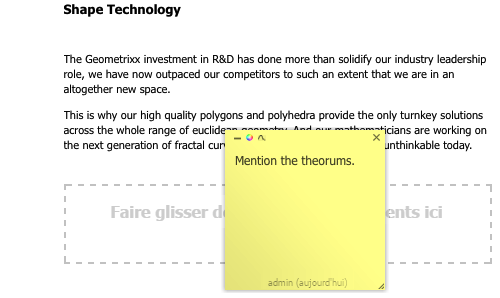

# Annotations lors de la modification d’une page{#annotations-when-editing-a-page}

L’ajout de contenu aux pages de votre site web est souvent l’objet de discussions avant d’être réellement publié. Pour faciliter cette opération, de nombreux composants directement liés au contenu (par opposition, à la mise en page, par exemple) vous permettent d’ajouter une annotation.

Une annotation place une note autocollante colorée sur la page. L’annotation vous permet (ainsi qu’aux autres utilisateurs) de laisser des commentaires ou des questions à l’intention d’autres auteurs ou réviseurs.

>[!NOTE]
>
>La définition d’un type de composant individuel détermine s’il est possible d’ajouter une annotation sur des instances de ce composant.

>[!NOTE]
>
>Les annotations créées dans l’IU classique s’affichent dans l’IU optimisée pour les écrans tactiles. Toutefois, les schémas sont spécifiques à l’interface utilisateur et ne s’affichent que dans l’interface utilisateur dans laquelle ils ont été créés.

>[!CAUTION]
>
>La suppression d’une ressource (par exemple, d’un paragraphe) supprime toutes les annotations et tous les schémas associés à cette ressource, quelle que soit leur position sur la page dans son ensemble.

>[!NOTE]
>
>Selon vos besoins, vous pouvez également développer un workflow pour envoyer des notifications lorsque celles-ci sont ajoutées, mises à jour ou supprimées.

## Annotations {#annotations}

Selon la conception du paragraphe, l’annotation est disponible soit sous la forme d’une option dans le menu contextuel (généralement le bouton droit de la souris lorsqu’il est placé sur le paragraphe requis) soit d’un bouton dans la barre d’édition du paragraphe.

Dans les deux cas, sélectionnez **Annoter**. Une annotation avec post-it colorée est appliquée au paragraphe. Vous êtes immédiatement en mode d’ édition , ce qui vous permet d’ajouter directement du texte :

Vous pouvez déplacer l’annotation vers un nouvel emplacement sur la page. Cliquez sur la zone de bordure supérieure, puis maintenez la touche enfoncée et faites glisser simultanément l’annotation sur la nouvelle position. Cela peut être n’importe où sur la page, bien qu’il soit souvent utile de le garder connecté au paragraphe d’une manière ou d’une autre.

Les annotations (y compris les schémas associés) sont également incluses dans toute action de copie, de découpe ou de suppression effectuée sur le paragraphe auquel elles sont jointes. Pour les actions de copie ou de découpe, la position de l’annotation (et des schémas associés) conserve leur position par rapport au paragraphe d’origine.

La taille de l’annotation peut également être augmentée ou réduite en faisant glisser le coin inférieur droit.

À des fins de suivi, la ligne de pied de page indique l’utilisateur qui a créé l’annotation et la date. Les auteurs suivants peuvent modifier la même annotation (le pied de page est mis à jour) ou créer une autre annotation pour le même paragraphe.

Une confirmation est requise lorsque vous choisissez de supprimer l’annotation (la suppression d’une annotation supprime également les schémas qui lui sont associés).

Les trois icônes en haut à gauche vous permettent de minimiser l’annotation (ainsi que les schémas associés), de modifier la couleur et d’ajouter des schémas.

>[!NOTE]
>
>Les annotations ne sont visibles que dans le mode d’édition de l’environnement de l’auteur.
>
>Elles ne sont pas visibles dans un environnement de publication, ni dans les modes Aperçu ou Conception dans un environnement de création.

>[!NOTE]
>
>Les annotations ne peuvent pas être ajoutées à une page verrouillée par un autre utilisateur.

## Esquisses d’annotation {#annotation-sketches}

>[!NOTE]
>
>Les esquisses ne sont pas disponibles dans Internet Explorer, donc :
>
>* l’icône n’est pas affichée.
>* les esquisses existantes, créées dans un autre navigateur, ne s’affichent pas.
>

Les esquisses sont une fonction des annotations qui vous permet de créer des graphiques en courbes simples n’importe où dans la fenêtre du navigateur (partie visible) :

* Le curseur prend la forme d’une croix lorsque vous êtes en mode d’esquisse. Vous pouvez tracer plusieurs lignes distinctes.
* La ligne d’esquisse reflète la couleur de l’annotation et peut être :

   * à main levée :

     le mode par défaut ; terminez en relâchant le bouton de la souris ;

   * droite :

     maintenez la touche `ALT` enfoncée et cliquez sur les points de début et de fin ; terminez par un double-clic.

* Après avoir quitté le mode de schéma, vous pouvez cliquer sur une ligne de schéma pour sélectionner cette dernière.
* Déplacez une esquisse en la sélectionnant, puis en la faisant glisser à l’emplacement souhaité.
* Une esquisse recouvre le contenu. Cela signifie que dans les quatre coins de l’esquisse, vous ne pouvez pas cliquer sur le paragraphe sous-jacent. Par exemple, si vous devez modifier un lien ou y accéder. Si cela pose problème (par exemple, si vous disposez d’une esquisse couvrant une grande partie de la page), réduisez l’annotation appropriée, car cela réduit également toutes les esquisses associées, vous donnant ainsi accès à la zone sous-jacente.
* Pour supprimer une esquisse individuelle, sélectionnez-la, puis appuyez sur la touche **Supprimer** clé (**fn**-**backspace** sur un Mac).

* Si vous déplacez ou copiez un paragraphe, toutes les annotations associées et leurs esquisses sont également déplacées ou copiées ; leur position par rapport au paragraphe reste la même.
* Lorsque vous supprimez une annotation, toutes les esquisses qui y sont associées seront également supprimées.
