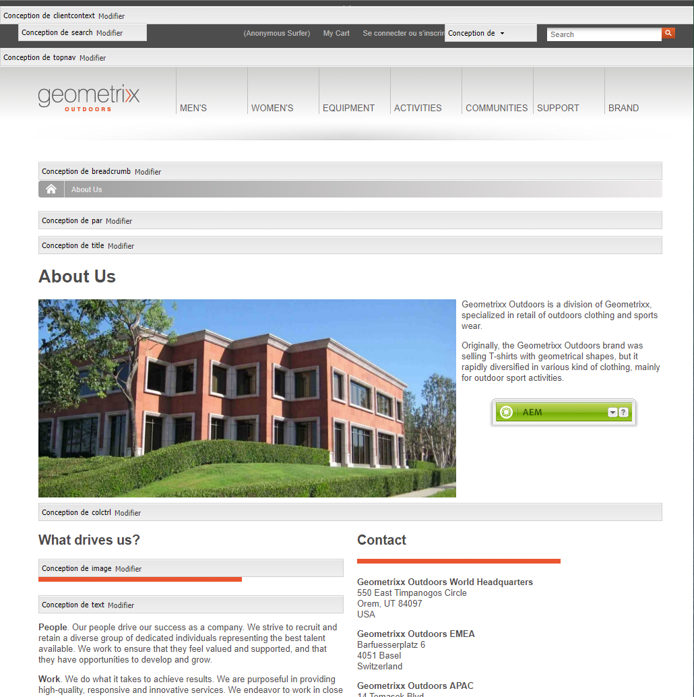
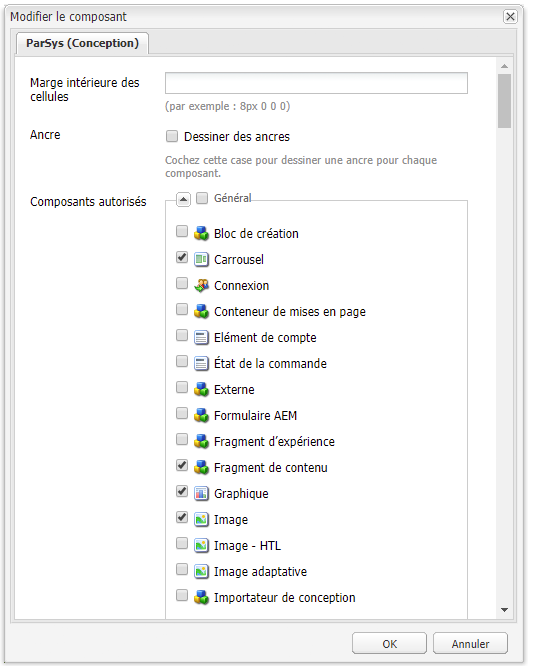
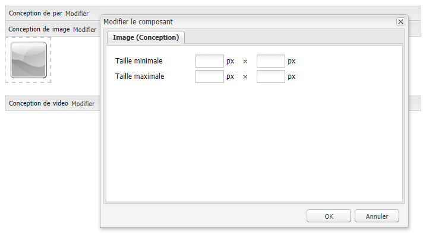

# Configuration de composants en mode de conception{#configuring-components-in-design-mode}

Lors de l’installation standard d’une instance AEM, plusieurs composants sont immédiatement disponibles dans le sidekick.

D’autres composants sont également disponibles. Vous pouvez utiliser le mode de conception pour [activer/désactiver ces composants](#enabledisablecomponentsusingdesignmode). Une fois ces composants activés et situés sur votre page, utilisez le mode de conception pour [configurer différents aspects de la conception](#configuringcomponentsusingdesignmode) en modifiant les paramètres d’attribut.

>[!NOTE]
>
>Soyez prudent lors de la modification de ces composants. Les paramètres de conception font souvent partie intégrante du site web. Ils ne doivent donc être modifiés que par une personne disposant des privilèges (et de l’expérience) appropriés, généralement un administrateur ou un développeur. Pour plus d’informations, reportez-vous à la section [Développement de composants](/help/sites-developing/components.md).

Cela implique en fait d&#39;ajouter, ou de supprimer, les composants autorisés dans le système de paragraphes pour la page. Le système de paragraphes (`parsys`) est un composant composite qui contient tous les autres composants de paragraphes. Il permet aux auteurs d’ajouter des composants de différents types à une page, car il contient tous les autres composants de paragraphes. Chaque type de paragraphe est représenté en tant que composant.

Par exemple, le contenu d’une page des produits peut contenir un système de paragraphes avec les éléments suivants :

* Une image du produit (sous la forme d’une image ou d’un paragraphe « textimage »)
* La description du produit (sous la forme d’un paragraphe de texte)
* Un tableau de données techniques (sous la forme d’un paragraphe de tableau)
* Un formulaire à remplir par les utilisateurs (sous la forme d’un paragraphe de début de formulaire, d’élément de formulaire et de fin de formulaire)

>[!NOTE]
>
>Reportez-vous aux sections [Développement de composants](/help/sites-developing/components.md#paragraphsystem) et [Consignes d’utilisation des modèles et des composants](/help/sites-developing/dev-guidelines-bestpractices.md#guidelines-for-using-templates-and-components) pour en savoir plus sur `parsys`.

## Activation/désactivation des composants {#enable-disable-components}

En mode de conception, le sidekick est réduit et vous avez la possibilité de configurer les composants accessibles dans le cadre de la création :

1. Pour passer en mode de conception, ouvrez une page pour modification et cliquez sur l’icône du sidekick :

   

1. Click **Edit** on the Paragraph system (**Design of par**).

   

1. La boîte de dialogue qui s’ouvre répertorie les groupes de composants visibles dans le sidekick, ainsi que les différents composants qu’ils contiennent :

   Sélectionnez l’option requise pour ajouter, ou supprimer, les composants disponibles dans le sidekick.

   

1. Le sidekick se réduit en mode de conception. Vous pouvez agrandir le sidekick en cliquant sur la flèche et revenir ainsi au mode Modifier :

   

## Configuration de la conception d’un composant {#configuring-the-design-of-a-component}

En mode de conception, vous pouvez également configurer des attributs pour les différents composants. Chaque composant possède ses propres paramètres. L’exemple suivant illustre le composant **Image** :

1. Pour passer en mode de conception, ouvrez une page pour modification et cliquez sur l’icône du sidekick :

   

1. Vous pouvez configurer la conception des composants.

   For example, if you click **Edit** on the Image component (**Design of image**) you can configure the component specific parameters:

   

1. Cliquez sur **OK** pour enregistrer vos modifications.

1. Le sidekick se réduit en mode de conception. Vous pouvez agrandir le sidekick en cliquant sur la flèche et revenir ainsi au mode Modifier :

   
