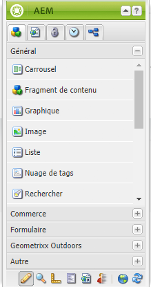
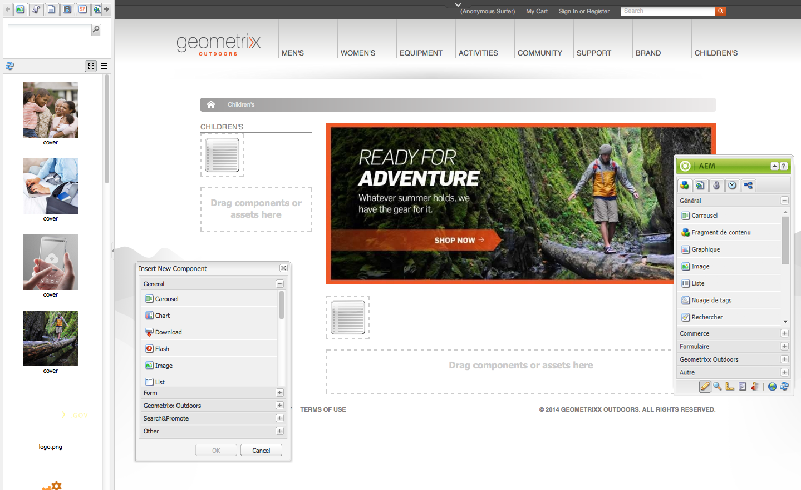
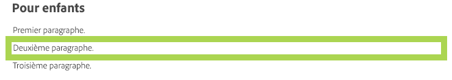
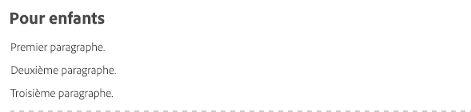
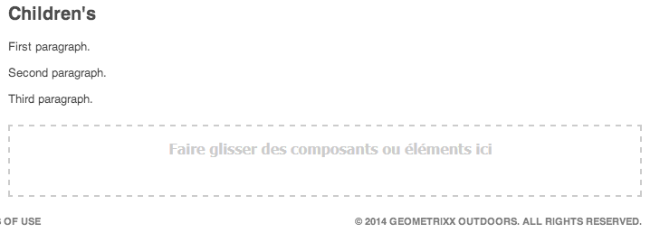
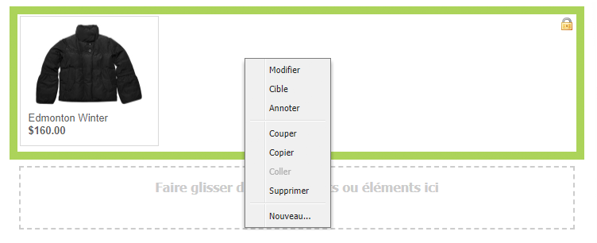
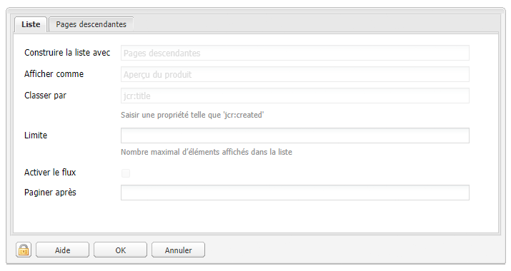
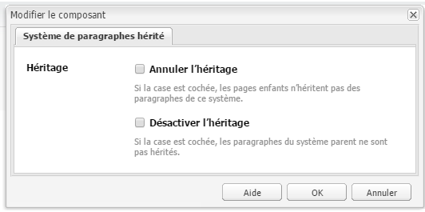
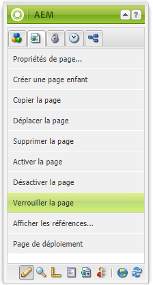
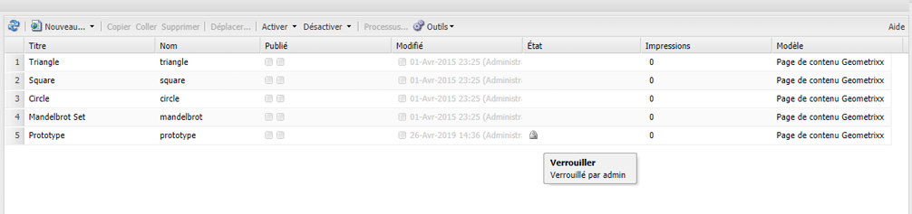

# Modification du contenu de la page{#editing-page-content}

Une fois la page créée (une nouvelle page ou dans le cadre d’un lancement ou d’une Live Copy), vous pouvez modifier le contenu pour effectuer toute mise à jour dont vous avez besoin.

Le contenu est ajouté à l’aide de [composants](/help/sites-classic-ui-authoring/classic-page-author-default-components.md) (appropriés au type de contenu) que vous pouvez déplacer sur la page. Ils peuvent ensuite être modifiés sur place, déplacés ou supprimés.

>[!NOTE]
>
>Vous devez disposer des [droits d’accès](/help/sites-administering/security.md) et des [autorisations appropriés](/help/sites-administering/security.md#permissions) sur votre compte pour modifier les pages ; par exemple, pour ajouter, modifier ou supprimer des composants, ou pour les annotations et le déverrouillage.
>
>En cas de problèmes, contactez votre administrateur système.

## Sidekick {#sidekick}

Le sidekick est un outil clé lors de la création de pages. Il est toujours visible (dans une fenêtre flottante) pendant la création d’une page.

Plusieurs onglets et icônes sont disponibles, notamment :

* Composants
* Page
* Informations
* Contrôle de version
* Workflow
* Modes
* Génération de modèles automatique
* Contexte client
* Sites web

Donne accès à diverses fonctionnalités, par exemple :

* [la sélection de composants](/help/sites-classic-ui-authoring/classic-page-author-env-tools.md#sidekick)
* [l’affichage de références](/help/sites-classic-ui-authoring/classic-page-author-env-tools.md#showing-references)
* [l’accès au journal d’audit](/help/sites-classic-ui-authoring/classic-page-author-env-tools.md#audit-log)
* [le basculement des modes](/help/sites-classic-ui-authoring/classic-page-author-env-tools.md#page-modes)
* la [création](/help/sites-classic-ui-authoring/classic-page-author-work-with-versions.md#creating-a-new-version), la [restauration](/help/sites-classic-ui-authoring/classic-page-author-work-with-versions.md#restoring-a-page-version-from-sidekick) et la [comparaison](/help/sites-classic-ui-authoring/classic-page-author-work-with-versions.md#comparing-with-a-previous-version) des versions

* la [publication](/help/sites-classic-ui-authoring/classic-page-author-publish-pages.md#publishing-a-page) et l’[annulation de la publication](/help/sites-classic-ui-authoring/classic-page-author-publish-pages.md#unpublishing-a-page) d’une page

* la [modification des propriétés de page](/help/sites-classic-ui-authoring/classic-page-author-edit-page-properties.md)

* la [génération de modèles automatique](/help/sites-authoring/scaffolding.md)

* [le contexte client](/help/sites-administering/client-context.md)

## Insertion d’un composant {#inserting-a-component}

### Insertion d’un composant {#inserting-a-component-1}

Après avoir ouvert la page, vous pouvez commencer à ajouter du contenu. Pour ce faire, ajoutez des composants (également appelés paragraphes).

Pour insérer un nouveau composant :

1. Plusieurs méthodes permettent de sélectionner le type de paragraphe à insérer :

   * Double-cliquez sur la zone nommée **Faire glisser des composants ou éléments ici...** ; la barre d’outils **Insérer un nouveau composant** s’ouvre alors. Sélectionnez un composant et cliquez sur **OK**.

   * Faites glisser un composant à partir de la barre d’outils flottante (appelée sidekick) pour insérer un nouveau paragraphe.
   * Cliquez avec le bouton droit sur un paragraphe existant et sélectionnez ensuite **Nouveau...** ; la barre d’outils Insérer un nouveau composant s’ouvre. Sélectionnez un composant et cliquez sur **OK**.

   

1. La liste des composants (types de paragraphe) disponibles est affichée dans le sidekick et dans la barre d’outils **Insérer un nouveau composant**. Ils peuvent être divisés en plusieurs sections (par exemple : Général, Colonnes, etc.), qui peuvent être développées suivant les besoins.

   Les options peuvent varier en fonction de l’environnement de production utilisé. Pour obtenir des informations complètes sur les composants, voir [Composants par défaut](/help/sites-classic-ui-authoring/classic-page-author-default-components.md).

1. Insérez le composant de votre choix sur la page. Double-cliquez ensuite sur le paragraphe. Une fenêtre s’ouvre alors pour vous permettre de configurer votre paragraphe et d’ajouter du contenu.

### Insertion d’un composant à l’aide de l’Outil de recherche de contenu  {#inserting-a-component-using-the-content-finder}

Vous pouvez également ajouter un nouveau composant sur la page en faisant glisser un élément à partir de l’[Outil de recherche de contenu](/help/sites-classic-ui-authoring/classic-page-author-env-tools.md#the-content-finder). Un nouveau composant du type approprié (et contenant l’élément) est ainsi créé automatiquement.

Ceci est valide pour les types de ressources suivants (certains dépendent du système de pages/paragraphes) :

| Type de ressource | Type de composant résultant |
|---|---|
| Image | Image |
| Document | Téléchargement |
| Produit | Produit |
| Vidéo | Modèle  |

>[!NOTE]
>
>Ce comportement peut être configuré pour votre installation. Pour plus d’informations, voir [Configuration d’un système de paragraphes de manière à faire glisser une ressource pour créer une instance de composant](/help/sites-developing/developing-components.md#configuring-a-paragraph-system-so-that-dragging-an-asset-creates-a-component-instance).

Pour créer un composant en faisant glisser l’un des types de ressources ci-dessus, suivez ces étapes :

1. Assurez-vous que votre page est en mode [**Modifier**](/help/sites-classic-ui-authoring/classic-page-author-env-tools.md#page-modes).
1. Ouvrez l’[Outil de recherche de contenu](/help/sites-classic-ui-authoring/classic-page-author-env-tools.md#the-content-finder).
1. Faites glisser la ressource jusqu’à la position requise. L’[espace réservé du composant](#componentplaceholder) indique où le composant va être positionné.

   Un composant, du type de ressource approprié, est créé à l’emplacement requis. Il contient la ressource sélectionnée.

1. [Modifiez](#editmovecopypastedelete) le composant si nécessaire.

## Modification d’un composant (contenu et propriétés)  {#editing-a-component-content-and-properties}

Pour modifier un paragraphe existant, procédez comme suit :

* **Double-cliquez** sur le paragraphe pour l’ouvrir. La fenêtre qui s’affiche est la même que celle présentée lorsque vous avez créé le paragraphe avec le contenu existant. Effectuez vos modifications, puis cliquez sur **OK**.

* **Cliquez avec le bouton droit de la souris** sur le paragraphe, puis sélectionnez **Modifier**.

* **Cliquez** deux fois sur le paragraphe (un double-clic lent) pour passer au mode d’édition statique. Vous pouvez alors modifier directement le texte sur la page, sans avoir à passer par une boîte de dialogue. Dans ce mode, une barre d’outils vous est fournie en haut de la page. Il suffit d’apporter les modifications et elles sont automatiquement enregistrées.

## Déplacement d’un composant {#moving-a-component}

Pour déplacer un paragraphe :

>[!NOTE]
>
>Vous pouvez également utiliser la technique du [couper/coller](#cut-copy-paste-a-component) pour déplacer un composant.

1. Sélectionnez le paragraphe à déplacer :

   

1. Faites glisser le paragraphe vers son nouvel emplacement. AEM affiche une coche verte pour indiquer les destinations possibles. Déposez le paragraphe à l’emplacement souhaité.
1. Votre paragraphe est déplacé:

   

## Suppression d’un composant {#deleting-a-component}

Pour supprimer un paragraphe :

1. Sélectionnez le paragraphe et **cliquez avec le bouton droit** :

   

1. Sélectionnez **Supprimer** dans le menu. AEM WCM vous invite à confirmer la suppression du paragraphe, dans la mesure où cette opération est irréversible.
1. Cliquez sur **OK**.

>[!NOTE]
>
>Si vous avez défini vos [Propriétés de l’utilisateur pour afficher la barre d’outils d’édition globale](/help/sites-classic-ui-authoring/author-env-user-props.md), vous pouvez également réaliser certaines actions sur les paragraphes à l’aide des boutons **Copier**, **Couper**, **Coller** et **Supprimer** disponibles.
>
>Divers [raccourcis clavier](/help/sites-classic-ui-authoring/classic-page-author-keyboard-shortcuts.md) sont également disponibles.

## Couper/Copier/Coller un composant {#cut-copy-paste-a-component}

Comme pour la [Suppression d’un composant](#deleting-a-component), vous pouvez copier, couper et/ou coller un composant à l’aide du menu contextuel.

>[!NOTE]
>
>Si vous avez défini vos [Propriétés de l’utilisateur pour afficher la barre d’outils d’édition globale](/help/sites-classic-ui-authoring/author-env-user-props.md), vous pouvez également réaliser certaines actions sur les paragraphes à l’aide des boutons **Copier**, **Couper**, **Coller** et **Supprimer** disponibles.
>
>Divers [raccourcis clavier](/help/sites-classic-ui-authoring/classic-page-author-keyboard-shortcuts.md) sont également disponibles.

>[!NOTE]
>
>Le découpage, la copie et le collage de contenu ne sont pris en charge que sur la même page. 

## Composants hérités {#inherited-components}

Les composants hérités peuvent être le produit de divers scénarios, notamment :

* [Gestion de plusieurs sites](/help/sites-administering/msm.md) ; également associé au mode [Génération de modèles automatique](/help/sites-classic-ui-authoring/classic-feature-scaffolding.md#scaffolding-with-msm-inheritance).

* Des [lancements](/help/sites-classic-ui-authoring/classic-launches.md) (quand basés sur une live copy)
* Des composants spécifiques ; par exemple le système de paragraphes hérité dans Geometrixx.

Vous pouvez annuler (puis réactiver) l’héritage. En fonction du composant, cette option est disponible depuis :

1. **Live Copy**

   Si un composant fait partie d’une live copy ou d’un lancement, il est signalé par une icône de cadenas. Vous pouvez cliquer sur le cadenas pour annuler l’héritage.

   * L’icône de cadenas s’affiche lorsque le composant est sélectionné, par exemple :

   

   * Le cadenas s’affiche également dans la boîte de dialogue des composants, par exemple :

   

1. **Un système de paragraphes hérité**

   La boîte de dialogue de configuration. Par exemple, comme avec le système de paragraphes hérité dans Geometrixx :

   

## Ajout d’annotations {#adding-annotations}

Les [Annotations](/help/sites-classic-ui-authoring/classic-page-author-annotations.md) permettent aux autres créateurs de fournir des commentaires sur votre contenu. Elles sont souvent utilisées à des fins de révision et de validation.

## Aperçu des pages  {#previewing-pages}

Deux icônes disponibles dans la bordure inférieure du sidekick sont importantes pour afficher un aperçu des pages :

* L’icône de crayon indique que vous êtes actuellement en mode d’édition, qui vous permet d’ajouter, de modifier, de déplacer ou de supprimer le contenu.

   

* L’icône de loupe vous permet de sélectionner le mode d’aperçu, qui affiche la page telle qu’elle sera dans l’environnement de publication (il est parfois nécessaire d’actualiser la page) :

   

   En mode d’aperçu, le sidekick est réduit. Cliquez sur l’icône de flèche bas pour revenir au mode d’édition :

   

## Rechercher et remplacer {#find-replace}

Pour les modifications à plus grande échelle d’une même expression, utilisez l’option **[Rechercher et remplacer](/help/sites-classic-ui-authoring/author-env-search.md#find-and-replace)** pour rechercher et remplacer plusieurs instances d’une chaîne dans une section du site web.

## Verrouillage d’une page {#locking-a-page}

AEM vous permet de verrouiller une page, de sorte que personne d’autre ne puisse en modifier le contenu. Ceci s’avère utile lorsque vous apportez de nombreuses modifications à une page spécifique ou lorsque vous devez figer une page pendant quelque temps.

>[!CAUTION]
>
>Soyez prudent lorsque vous verrouillez une page, car seule la personne qui l’a verrouillée peut la déverrouiller (sauf s’il s’agit d’un compte avec des droits d’administrateur).

Pour verrouiller une page :

1. Dans l’onglet **Sites web**, sélectionnez la page à verrouiller.
1. Double-cliquez sur la page afin de l’ouvrir pour la modifier.
1. Dans l’onglet **Page** du sidekick, sélectionnez **Verrouiller la page** :

   

   Un message indique aux autres utilisateurs que la page est verrouillée. De plus, dans le volet de droite de la console **Sites web**, la Gestion de contenu web AEM indique que la page est verrouillée et quel utilisateur l’a verrouillée.

   

## Déverrouillage d’une page {#unlocking-a-page}

Pour déverrouiller une page :

1. Dans l’onglet **Sites web**, sélectionnez la page à déverrouiller.
1. Double-cliquez sur la page pour l’ouvrir.
1. Dans l’onglet **Page** du sidekick, sélectionnez **Déverrouiller la page**.

## Annulation et rétablissement des modifications de page {#undoing-and-redoing-page-edits}

Utilisez les raccourcis clavier suivants lorsque le cadre de contenu de la page est actif :

* Annuler : Ctrl+Z (Windows) ou Cmd+Z (Mac)
* Rétablir : Ctrl+Y (Windows) ou Cmd+Y (Mac)

Lorsque vous annulez ou rétablissez une opération de suppression, d’ajout ou de déplacement, le ou les paragraphes concernés sont signalés par une mise en surbrillance clignotante (comportement par défaut).

>[!NOTE]
>
>Voir [Annulation et rétablissement des modifications de page : la théorie](#undoing-and-redoing-page-edits-the-theory) pour en savoir plus sur ce qu’il est possible de faire lorsque vous annulez ou rétablissez des modifications de page.

## Annulation et rétablissement des modifications de page : la théorie {#undoing-and-redoing-page-edits-the-theory}

>[!NOTE]
>
>L’administrateur système peut [configurer divers aspects des fonctions Annuler/Rétablir](/help/sites-administering/config-undo.md) en fonction des exigences de votre instance.

AEM stocke un historique des opérations effectuées, ainsi que l’ordre d’exécution. Par conséquent, plusieurs opérations sont annulées dans l’ordre dans lequel vous les avez exécutées. Vous pourrez ensuite utiliser la commande Rétablir pour appliquer à nouveau une ou plusieurs des actions. 

Si un élément de la page de contenu (un composant de texte, par exemple) est sélectionné, les commandes Annuler et Rétablir s’appliquent à celui-ci.

Les commandes Annuler et Rétablir fonctionnent de la même manière que dans les autres logiciels. Utilisez ces commandes pour rétablir l’état récent de votre page web lorsque vous prenez des décisions quant au contenu. Par exemple, si vous repositionnez un paragraphe de texte sur la page, vous pouvez utiliser la commande Annuler pour le remettre à son emplacement initial. Si vous décidez ensuite de déplacer à nouveau le paragraphe, utilisez la commande Rétablir.

>[!NOTE]
>
>Vous pouvez :
>
>* Rétablir des opérations pour autant qu’aucune modification de page n’ait été effectuée depuis la dernière utilisation de la commande Annuler.
>* Annuler jusqu’à 20 opérations de modification (paramètre par défaut).
>* Vous pouvez également utiliser les [raccourcis clavier](/help/sites-classic-ui-authoring/classic-page-author-keyboard-shortcuts.md) pour les opérations d’annulation et de rétablissement.

>

Vous pouvez utiliser les commandes d’annulation et de rétablissement pour les types de modification suivants :

* Ajout, modification, suppression et déplacement de paragraphes
* Modification statique du contenu de paragraphe
* Copie, découpe et collage d’éléments sur une page
* Copie, découpe et collage d’éléments sur plusieurs pages
* Ajout, suppression et modification de fichiers et d’images
* Ajout, suppression et modification d’annotations et d’esquisses
* Modifications d’un modèle issu de la génération de modèles automatique
* Ajout ou suppression de références
* Modification des valeurs de propriété dans des boîtes de dialogue de composant

Aucune valeur n’est censée être spécifiée pour les champs de formulaire dont le rendu est effectué par les composants de formulaire lors de la création de pages. Les commandes Annuler et Rétablir n’affectent donc pas les modifications que vous apportez aux valeurs des composants de ce type. Par exemple, vous ne pouvez pas annuler la sélection d’une valeur dans une liste déroulante.

>[!NOTE]
>
>Des autorisations spéciales sont nécessaires pour annuler et rétablir des modifications affectant des fichiers et des images. Ajoutons encore que l’historique des annulations relatif aux modifications apportées aux fichiers et aux images a une durée de vie minimale de dix heures. Au-delà de cette limite, l’annulation des modifications n’est plus garantie. Votre administrateur peut fournir des autorisations et modifier la durée par défaut de dix heures.
