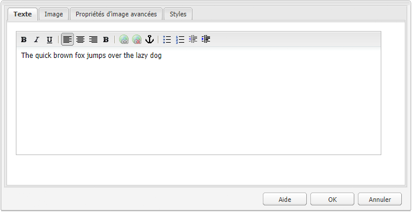
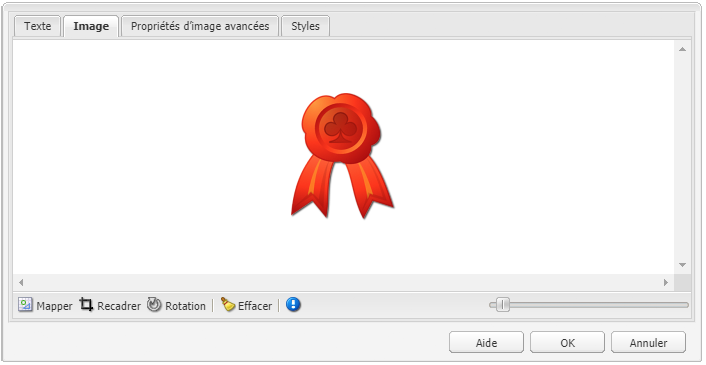
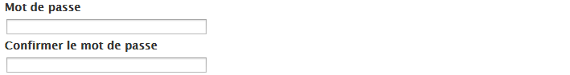

# Composants pour la création de page{#components-for-page-authoring}

Les composants suivants sont destinés à être utilisés lors de la création du contenu d’une page web standard. Les composants forment un sous-ensemble des composants prêts à l’emploi pour une installation standard d’AEM.

Certains sont immédiatement disponibles via le sidekick, d’autres le sont également à l’aide de la fonction [Mode de conception](/help/sites-classic-ui-authoring/classic-page-author-design-mode.md) pour les activer/désactiver.

>[!CAUTION]
>
>Cette section ne traite que des composants prêts à l’emploi disponibles dans une installation d’AEM standard.
>
>Selon votre instance, vous pouvez avoir développé des composants personnalisés explicitement pour vos besoins. Ces composants personnalisés peuvent même avoir le même nom que certains des composants décrits ici.

Les composants sont disponibles lors de la [modification d’une page](/help/sites-classic-ui-authoring/classic-page-author-edit-content.md) à partir de l’onglet **Composants** du sidekick et du sélecteur **Insérer un nouveau composant** (lorsque vous double-cliquez dans la zone **Faire glisser des composants ou éléments ici**).

Vous pouvez sélectionner un composant et le faire glisser vers l’emplacement souhaité sur votre page, puis sélectionner [Modifier le contenu et les propriétés](/help/sites-classic-ui-authoring/classic-page-author-edit-content.md#editing-a-component-content-and-properties).

Les composants sont triés selon différentes catégories (groupes de composants), notamment (pour la création de pages) :

* [Général](#general) : inclut des composants de base, notamment du texte, des images, des tableaux, des graphiques, et ainsi de suite.
* [Colonnes](#columns) : comprend les composants nécessaires pour organiser la mise en page du contenu.
* [Formulaire](#formgroup) : comprend tous les composants nécessaires à la création d’un formulaire.

## Général {#general}

Les composants du groupe Général sont les composants de base utilisés pour créer du contenu.

### Elément de compte {#account-item}

Vous pouvez définir un lien avec un titre et une description.


### Image adaptative {#adaptive-image}

Le composant d’image adaptative génère des images dimensionnées en fonction de la fenêtre dans laquelle s’ouvre la page web. Pour utiliser le composant, vous devez fournir une image issue du système de fichiers ou du gestionnaire des actifs numériques. Une fois la page web ouverte, le navigateur télécharge une copie de l’image qui a été redimensionnée pour convenir à la fenêtre active.

Les caractéristiques suivantes peuvent déterminer la taille de la fenêtre :

* Écran de l’appareil : les appareils mobiles affichent généralement les pages web afin qu’elles s’étendent sur tout l’écran.
* Taille de la fenêtre du navigateur web : les utilisateurs et utilisatrices d’ordinateurs portables et de bureau peuvent redimensionner les fenêtres du navigateur web.

Par exemple, le composant génère une petite image lorsque la page web s’ouvre sur un téléphone mobile et une image de taille moyenne sur une tablette. Sur un ordinateur portable, le composant génère une grande image lorsque la page s’ouvre dans un navigateur plein écran. Lorsque le navigateur web est redimensionné pour s’adapter à une partie de l’écran, le composant s’adapte en fournissant une image plus petite et en actualisant l’affichage.

#### Formats d’image pris en charge {#supported-image-formats}

Vous pouvez utiliser des fichiers d’image avec les extensions de nom de fichier suivantes pour le composant d’image adaptative :

* .jpg
* .jpeg
* .png
* .gif &#42;&#42;

>[!CAUTION]
>
>&#42;&#42; Les fichiers .gif animés ne sont pas pris en charge dans AEM pour les rendus adaptatifs.

#### Tailles et qualité des images {#images-sizes-and-quality}

Le tableau suivant répertorie la largeur de l’image générée en fonction de la largeur de la fenêtre d’affichage. La hauteur de l’image générée est calculée pour préserver le rapport L/H et éviter l’apparition de bandes blanches sur les bords de l’image. Le recadrage peut être utilisé pour éviter les espaces blancs.

Si l’image est au format JPEG, sa qualité peut aussi dépendre de la taille de la fenêtre d’affichage, Les qualités JPEG suivantes sont possibles :

* Faible (0,42)
* Moyenne (0,82)
* Élevée (1,00)

| Plage de largeurs de la fenêtre d’affichage (pixels) | Largeur de l’image (pixels) | Qualité JPEG | Type de périphérique ciblé |
|---|---|---|---|
| largeur &lt;= 319 | 320 | faible |  |
| largeur = 320 | 320 | moyenne | Téléphone portable (portrait) |
| 320 &lt; largeur &lt; 481 | 480 | moyenne | Téléphone portable (paysage) |
| 480 &lt; largeur &lt; 769 | 476 | élevée | Tablette (portrait) |
| 768 &lt; largeur &lt; 1025 | 620 | élevée | Tablette (paysage) |
| largeur &lt;= 1025 | plein écran (taille d’origine) | élevée | Poste de travail |

#### Propriétés {#properties}

La boîte de dialogue permet de modifier les propriétés pour votre instance du composant Image adaptative. Parmi ces propriétés, nombreuses sont celles qui sont communes au composant d’image sur lequel il est basé. Les propriétés sont disponibles dans deux onglets :

* **Image**

   * **Image**
Faites glisser une image à partir de l’outil de recherche de contenu ou cliquez pour ouvrir une fenêtre de recherche dans laquelle vous pouvez charger une image. Ensuite, vous pouvez la recadrer, la faire pivoter ou la supprimer. Pour effectuer un zoom avant ou arrière sur l’image, utilisez le curseur situé sous l’image (au-dessus des boutons OK et Annuler).

   * **Recadrer**
Permet d’extraire des parties d’une image. Faites glisser la bordure pour recadrer l’image.

   * **Rotation**
Cliquez plusieurs fois sur Rotation pour faire pivoter l’image dans la position souhaitée.

   * **Effacer**
Permet de supprimer l’image actuelle.

* **Avancé**

   * **Titre**
Le composant Image adaptative n’utilise pas cette propriété.

   * **Texte de remplacement**
Texte secondaire à utiliser pour l’image.

   * **Lier à**
Le composant Image adaptative n’utilise pas cette propriété.

   * **Description**
Le composant Image adaptative n’utilise pas cette propriété.

#### Extension du composant d’image adaptative {#extending-the-adaptive-image-component}

Pour plus d’informations sur la personnalisation du composant d’image adaptative, voir [Présentation du composant d’image adaptative](/help/sites-developing/responsive.md#using-adaptive-images).

### Carrousel {#carousel}

Le composant de carrousel vous permet d’afficher des images associées à des pages individuelles :

* une à la fois
* pour une courte durée
* dans un ordre que vous spécifiez
* avec un délai que vous spécifiez

Les commandes cliquables permettent également à l’utilisateur ou à l’utilisatrice de parcourir les pages affichées en temps réel, à la demande. La sélection de l’image de la page actuellement visible vous conduit à cette page. En d’autres termes, le carrousel agit comme une commande de navigation.

#### Propriétés {#properties-1}

Les propriétés sont disponibles dans deux onglets :

* **Carrousel**
Vous spécifiez ici la manière dont le carrousel fonctionne :

   * Vitesse de lecture
Le temps en millisecondes avant l’affichage de la diapositive suivante.
   * Temps de transition
Le temps en millisecondes de transition entre deux diapositives.
   * Type des commandes
Diverses options sont disponibles dans un menu déroulant ; par exemple, les boutons Précédent/Suivant ou les commutateurs haut-droit.

* **Liste**
Vous spécifiez ici la manière dont les pages sont incluses dans le carrousel :

   * **Créer la liste à l’aide de**
Il existe plusieurs façons de créer une liste de pages : Pages enfants, Liste fixe, Recherche ou Recherche avancée (toutes décrites ci-dessous).
Quelle que soit la méthode choisie, les pages que vous incluez dans votre liste doivent déjà être associées à une image. C’est cette image qui s’affiche dans le carrousel. S’il n’existe aucune image pour une page dans les Propriétés de page, vous devez associer une image à la page avant de commencer. Sinon, le carrousel affiche une page vierge. Voir [Modification des propriétés de page](/help/sites-classic-ui-authoring/classic-page-author-edit-page-properties.md).
Selon l’élément que vous choisissez, un nouveau panneau s’affiche :

      * **Options des pages enfants**

         * **Page parente**
Spécifiez un chemin d’accès manuellement ou à l’aide du sélecteur. Laissez vide pour utiliser la page actuelle comme page parente.

      * **Options de la liste fixe**

         * **Pages**
Sélectionnez une liste de pages. Utilisez `+` pour ajouter d’autres entrées et les boutons haut/bas pour ajuster l’ordre.

      * **Options de recherche**

         * **Démarrer dans**
Spécifiez un chemin de départ manuellement ou à l’aide du sélecteur.

         * **Requête de recherche**
Entrez une requête de recherche en texte brut.

      * **Options de la recherche avancée**

         * **Notation des prédicats de Query Builder**
Vous pouvez saisir une requête de recherche à l’aide de la notation de prédicat de Query Builder. Par exemple, vous pouvez saisir &quot;fulltext=Marketing&quot; pour que toutes les pages comportant &quot;Marketing&quot; dans leur contenu s’affichent dans le carrousel.
Consultez [API QueryBuilder](/help/sites-developing/querybuilder-api.md) pour découvrir une étude complète sur les expressions de requête et d’autres exemples.

   * **Classer par**
Sélectionner `jcr:title`, `jcr:created`, `cq:lastModified`, ou `cq:template` dans le menu déroulant.

   * **Limite**
Facultatif. Nombre maximal d’éléments que vous souhaitez utiliser dans le carrousel.

>[!NOTE]
>
>Vous pouvez créer un composant de carrousel personnalisé pour Adobe Experience Manager qui affiche des DAM dans la gestion des actifs numériques AEM.

### Graphique {#chart}

Le composant Graphique vous permet d’ajouter un graphique à barres, en courbes ou en secteurs. AEM crée un graphique à partir des données que vous fournissez. Vous fournissez des données en les saisissant directement dans l’onglet Données ou en copiant et collant une feuille de calcul.

* **Données**

   * **Données de graphique**
Ajoutez vos données de graphique au format CSV ; une virgule (« , ») est utilisée comme séparateur de valeurs.

* **Avancé**

   * **Type de graphique**
Effectuez un choix parmi les types suivants : Histogramme, Graphique en secteurs et Graphique en courbe.

   * **Texte secondaire**
Texte secondaire s’affichant à la place du graphique.

   * **Largeur**
La largeur du graphique en pixels.

   * **Hauteur**
Hauteur du graphique en pixels.

L’exemple suivant illustre des données de graphique suivies de l’histogramme qui en résulte :

 


### Fragment de contenu {#content-fragment}

>[!CAUTION]
>
>La fonctionnalité complète de la gestion des fragments de contenu n’est disponible que dans l’IU optimisée pour les écrans tactiles.
>
>Le composant Fragment de contenu est visible dans le sidekick de l’interface utilisateur classique, mais d’autres fonctions ne sont pas disponibles.

[Les fragments de contenu](/help/sites-classic-ui-authoring/classic-page-author-content-fragments.md) sont créés et gérés comme des fichiers indépendants de la page. Vous pouvez ensuite utiliser ces fragments et leurs variantes lors de la création de vos pages de contenu.

### Importateur de conception {#design-importer}

Permet de charger un fichier zip contenant un package de conception.

### Télécharger {#download}

Le composant Télécharger crée un lien dans la page web sélectionnée pour télécharger un fichier spécifique. Vous pouvez soit faire glisser une ressource à partir de l’outil de recherche de contenu, soit charger un fichier.

* **Télécharger**

   * **Description**
Courte description affichée avec le lien de téléchargement.

   * **Fichier**
Le fichier qui peut être téléchargé sur la page web qui en résulte. Faites glisser une ressource à partir de l’outil de recherche de contenu ou sélectionnez la zone afin de télécharger le fichier que vous souhaitez rendre téléchargeable.

L’exemple suivant montre le composant Télécharger dans Geometrixx :


### Externe {#external}

Le composant d’intégration d’application externe (**Externe**) permet d’incorporer des applications externes dans une page AEM en utilisant un iframe.

* **Externe**

   * **Application cible**

     Indiquez l’URL de l’application web à intégrer, par exemple :

     ```
     https://en.wikipedia.org/wiki/Main_Page
     ```

   * **Transmettre les paramètres**

     Cochez la case correspondant aux paramètres à transmettre à l’application, lorsque cela s’avère nécessaire.

   * **Largeur et hauteur**

     Définissez la taille de l’iframe.

L’application externe est intégrée au système de paragraphes de la page AEM, par exemple, lorsque vous utilisez une application cible de `https://en.wikipedia.org/wiki/Main_Page` :


>[!NOTE]
>
>Selon votre cas d’utilisation, d’autres options sont disponibles pour l’intégration d’applications externes, par exemple : [Intégration de portlets](/help/sites-administering/aem-as-portal.md).

### Flash {#flash}

Le composant Flash vous permet de charger une animation Flash. Vous pouvez faire glisser une ressource Flash de l’outil de recherche de contenu sur le composant, ou bien utiliser la boîte de dialogue :

* **Flash**

   * **Animation Flash**

     Fichier d’animation Flash. Faites glisser une ressource à partir de l’outil de recherche de contenu ou cliquez pour ouvrir une fenêtre de navigation.

   * **Taille**

     Dimensions en pixels de la zone d’affichage contenant l’animation.

* **Image de remplacement**

  Autre image à afficher.

* **Avancé**

   * **Menu contextuel**

     Indique si le menu contextuel doit être affiché ou masqué.

   * **Mode Fenêtre**

     Affichage de la fenêtre, par exemple, opaque, transparente ou en tant que fenêtre distincte (solide).

   * **Couleur d’arrière-plan**

     Couleur de fond sélectionnée à partir de la palette de couleurs fournie.

   * **Version minimale**

     Version minimale d’Adobe Flash Player requise pour exécuter l’animation. La valeur par défaut est 9.0.0.

   * **Attributs**

     Tous les autres attributs obligatoires.

### Image {#image}

Le composant Image affiche une image et le texte qui l’accompagne selon les paramètres définis.

Vous pouvez charger une image, puis la modifier et la manipuler (par exemple, la recadrer, la faire pivoter ou y ajouter un lien/titre/texte).

Vous pouvez faire glisser et déposer une image à partir de l’[Outil de recherche de contenu](/help/sites-classic-ui-authoring/classic-page-author-env-tools.md#the-content-finder) directement sur le composant ou sa boîte de dialogue d’édition. Vous pouvez également double-cliquer dans la zone centrale de la boîte de dialogue d’édition pour parcourir votre système de fichiers local et charger une image. Les deux onglets de la boîte de dialogue d’édition contrôlent également toutes les définitions, ainsi que la manipulation de l’image :


>[!NOTE]
>
>Internet Explorer ne permet pas de surveiller la progression du chargement.
>
>Les utilisateurs et utilisatrices d’Internet Explorer doivent charger l’image, cliquer sur **OK**, puis rouvrir l’image pour afficher le fichier chargé dans l’aperçu et être en mesure d’y apporter des modifications (un recadrage, par exemple).
>
>Reportez-vous à [Plateformes certifiées](/help/release-notes/release-notes.md#certifiedplatforms) pour en savoir plus sur les fonctions HTML5 utilisées par AEM.

Lorsqu’une image est chargée, vous pouvez configurer ce qui suit :

* **Map**

  Pour mapper une image, sélectionnez Mapper. Vous pouvez spécifier ensuite comment créer la zone cliquable (rectangle, polygone, etc.) et l’emplacement sur lequel la zone doit pointer.

* **Recadrer**

  Sélectionnez Recadrer pour couper une partie d’une image. Utilisez la souris pour effectuer le recadrage.

* **Rotation**

  Pour faire pivoter une image, sélectionnez Rotation. Répétez l’opération jusqu’à ce que l’image ait pivoté comme vous le souhaitez.

* **Effacer**

  Permet de supprimer l’image actuelle.

* **Barre de zoom**

  Pour effectuer un zoom arrière et avant sur l’image, utilisez le curseur situé en dessous de l’image (et au-dessus des boutons OK et Annuler).

* **Titre**

  Titre de l’image.

* **Texte de remplacement**

  Texte de remplacement à utiliser lors de la création de contenu accessible.

* **Lier à**

  Créez un lien vers les ressources ou d’autres pages de votre site Web.

* **Description**

  Description de l’image.

* **Taille**

  Permet de définir la hauteur et la largeur de l’image.

L’image finale (avec son **Titre** et sa **Description**) peut s’afficher comme suit :


### Conteneur de disposition {#layout-container}

>[!CAUTION]
>
>Bien que le composant Conteneur de disposition soit disponible dans l’interface utilisateur classique, sa pleine fonctionnalité n’est disponible que dans l’interface utilisateur tactile. Pour plus d’informations, voir [Mise en page réactive](/help/sites-classic-ui-authoring/classic-page-author-responsive-layout.md).

### Liste {#list}

Le composant Liste vous permet de configurer des critères de recherche pour l’affichage d’une liste :

* **Liste**

   * **Construire la liste avec**

     Vous indiquez ici où la liste doit récupérer son contenu. Il existe plusieurs méthodes :

   * Selon l’élément que vous choisissez, un nouveau panneau s’affiche :

      * **Options des pages enfants**

         * **Enfants de**(Page parente)
Spécifiez un chemin d’accès manuellement ou à l’aide du sélecteur. Laissez le champ vide pour utiliser la page actuelle comme page parente.

      * **Options de la liste fixe**

         * **Pages**

           Sélectionnez une liste de pages. Utilisez + pour ajouter d’autres entrées et les boutons haut/bas pour ajuster l’ordre.

      * **Options de recherche**

         * **Démarrer dans**

           Spécifiez un chemin de départ manuellement ou à l’aide du sélecteur.

         * **Requête de recherche**

           Vous pouvez entrer une requête de recherche en texte brut.

      * **Options de la recherche avancée**

         * **Notation des prédicats de QueryBuilder**

           Vous pouvez saisir une requête de recherche à l’aide de la notation de prédicat de QueryBuilder. Par exemple, vous pouvez saisir « fulltext=Marketing » pour que toutes les pages comportant « Marketing » dans leur contenu s’affichent dans le carrousel.

           Consultez [API QueryBuilder](/help/sites-developing/querybuilder-api.md) pour découvrir une étude complète sur les expressions de requête et d’autres exemples.

      * **Balises**

        Permettent de spécifier la **page parente**, les **balises/mots-clés** et vos critères de correspondance requis.

   * **Afficher comme**

     Permet de spécifier comment les éléments doivent être répertoriés (Liens, Teasers et Actualités).

   * **Classer par**

     Permet de spécifier si la liste doit être classée. Si c’est le cas, indique les critères à utiliser pour le tri. Vous pouvez saisir un critère ou en sélectionner un dans la liste déroulante fournie à cet effet.

   * **Limite**

     Permet de spécifier le nombre maximal d’éléments à afficher dans la liste.

   * **Activer le flux**

     Indique si un flux RSS doit être activé pour la liste.

   * **Paginer après**

     Vous pouvez indiquer ici le nombre d’éléments de la liste à afficher simultanément. Une liste comportant plus d’éléments que spécifié utilise la pagination pour s’afficher en plusieurs parties.

L’exemple suivant montre comment un composant **Liste** peut afficher une liste de pages enfants (la conception est contrôlée par les définitions CSS personnalisées d’une conception de site).


### Connexion {#login}

Ces options fournissent les champs de nom d’utilisateur et de mot de passe.


Vous pouvez configurer :

* Se connecter

   * Libellé de section

     Texte d’introduction pour les champs de saisie.

   * Libellé du nom de l’utilisateur

     Texte pour étiqueter le champ de nom d’utilisateur.

   * Libellé du mot de passe

     Texte pour étiqueter le champ du mot de passe.

   * Libellé du bouton Se connecter

     Texte du bouton de connexion.

   * Rediriger vers

     Vous pouvez spécifier la page de votre site Web qui doit s’ouvrir une fois l’utilisateur connecté.

* Déjà connecté

   * Libellé du bouton Continuer

     Texte indiquant que l’utilisateur ou l’utilisatrice est déjà connecté.

### Statut de la commande {#order-status}

* **Titre**

   * **Titre**

     Spécifiez le texte du titre à afficher.

   * **Lien**

     Spécifiez la page (produit) pour laquelle le statut de la commande doit être affiché.

   * **Type / Taille**

     Faites votre choix dans la sélection fournie.


### Référence {#reference}

Le composant **Référence** vous permet de référencer du texte à partir d’une autre page de votre site web AEM (dans l’instance active). Le contenu du paragraphe référencé s’affiche alors comme s’il se trouvait sur la page active. Le contenu est mis à jour lorsque le paragraphe source change (une actualisation de la page peut s’avérer nécessaire).

* **Référence de paragraphe**

   * **Référence**

     Spécifiez le chemin d’accès à la page et au paragraphe à référencer (y compris le contenu).

Pour spécifier le chemin d’accès vers un paragraphe, vous devez ajouter au chemin d’accès (vers la page) le suffixe suivant :

`.../jcr:content/par/<paragraph-ID>`

Par exemple :

`/content/geometrixx-outdoors/en/equipment/biking/cajamara/jcr:content/par/similar-products`

Outre le référencement d’un paragraphe spécifique, le chemin peut également être modifié pour spécifier un système de paragraphes entier. Ajoutez le suffixe suivant au chemin d’accès :

`/jcr:content/par`

Par exemple :

`/content/geometrixx-outdoors/en/equipment/biking/cajamara/jcr:content/par`

Après la configuration, le contenu s’affiche exactement comme sur la page source. Son caractère référencé n’est visible que lorsque vous ouvrez le composant en vue de le modifier :


### Rechercher {#searching}

Le composant Rechercher offre des capacités de recherche à votre page.

Vous pouvez configurer :

* Rechercher

   * **Types de nœuds**

     Si la recherche doit se limiter à un type de nœud spécifique, indiquez-le ici. Par exemple, `cq:Page`.

   * **Chemin d’accès de la recherche**

     Indiquez la page racine de la branche que vous souhaitez rechercher.

   * **Texte du bouton de recherche**

     Nom affiché sur le bouton de recherche actuel.

   * **Texte des statistiques**

     Texte affiché au-dessus des résultats de la recherche.

   * **Texte Aucun résultat**

     Si la recherche ne renvoie aucun résultat, le texte entré ici est affiché.

   * **Vérifier l’orthographe du texte**

     Si une personne saisit un terme similaire, ce texte est affiché devant le terme.
Par exemple, si vous saisissez `Geometrixxe`, le système affiche « Vouliez-vous dire ? Geometrixx ».

   * **Texte Pages similaires**

     Texte affiché à côté d’un résultat pour des pages similaires. Pour supprimer une partie d’une image, cliquez sur ce lien.

   * **Texte Recherches connexes**

     Texte affiché à côté des recherches de termes et sujets associés.

   * **Texte Tendances des recherches**

     Le titre situé au-dessus des termes de recherche entrés par un utilisateur ou une utilisatrice.

   * **Libellé Pages de résultats**

     Texte qui apparaît en bas de cette liste avec des liens vers d’autres pages de résultats.

   * **Libellé Précédent**

     Nom qui apparaît sur le lien vers les pages de recherche précédentes.

   * **Libellé Suivant**

     Nom qui apparaît sur le lien vers les pages de recherche suivantes.

L’exemple ci-dessous montre le composant Recherche après une recherche du mot *`geometrixx`* dans le répertoire racine d’une installation standard. Il présente également la pagination des résultats :


L’exemple suivant montre un terme de recherche mal orthographié et non disponible :


### Plan du site {#sitemap}

Liste automatique du plan du site qui (avec les paramètres par défaut) répertorie toutes les pages (sous forme de liens actifs) du site Web actuel. Par exemple (extrait) :


Si nécessaire, vous pouvez configurer :

* **Plan du site**

   * **Chemin racine**

     Chemin d’accès à partir duquel la liste doit commencer.

### Diaporama {#slideshow}

Ce composant vous permet de charger une série d’images à afficher sous forme de diaporama sur votre page. Vous pouvez ajouter ou supprimer des images et attribuer un titre à chacune d’elles. Sous Avancé, vous pouvez également spécifier la taille de la zone d’affichage.

Vous pouvez configurer :

* **Diapositives**

   * **Nouvelle diapositive**

     Spécifiez une sélection de diapositives à l’aide des boutons **Ajouter** (et **Supprimer**).

   * **Titre**

     Indiquez un titre, si nécessaire. Ce titre est superposé à la diapositive concernée.

* **Avancé**

   * **Taille**

     Permet de spécifier la largeur et la hauteur en pixels.

Le composant diaporama affiche ensuite chaque diapositive dans l’ordre, pendant une courte durée, avant de passer à la diapositive suivante :


### Tableau {#table}

>[!NOTE]
>
>Le composant **Table** est basé sur l’éditeur [Texte enrichi](/help/sites-classic-ui-authoring/classic-page-author-rich-text-editor.md), tout comme le composant **[Texte](#text)**.
>
>Adobe recommande d’utiliser le composant **Tableau** pour les tableaux, bien qu’ils puissent également être construits avec le composant **Texte**.

Le composant **Tableau** est préconfiguré pour vous permettre de créer, de remplir et de formater un tableau. La boîte de dialogue vous permet de configurer votre tableau et de créer entièrement le contenu, ou vous pouvez copier et coller une feuille de calcul ou un tableau à partir d’un éditeur externe, tel qu’Excel, OpenOffice ou Notepad.


La capture d’écran ci-après illustre l’utilisation du composant Tableau (la conception est déterminée par le CSS propre au site) :


### Nuage de balises {#tag-cloud}

Un nuage de balises affiche une sélection des balises appliquées au contenu de votre site web sous forme graphique :


Lorsque vous configurez le composant Nuage de balises, vous pouvez spécifier les options suivantes :

* **Balises à afficher**
Emplacement où sont collectées les balises à afficher : page, page avec tous les enfants ou toutes les balises.

* **Page**
Sélectionnez la page à référencer.

* **Aucun lien sur les balises**
Permet de spécifier si les balises affichées doivent se comporter comme des liens.

Pour plus d’informations sur l’application de balises, voir [Utilisation des balises](/help/sites-classic-ui-authoring/classic-feature-tags.md).

### Texte {#text}

>[!NOTE]
>
>Le composant **Texte** est basé sur [l’éditeur de texte enrichi](/help/sites-classic-ui-authoring/classic-page-author-rich-text-editor.md), tout comme le composant **[Tableau](#table)**.
>
>Adobe recommande d’utiliser le composant **Tableau** pour les tableaux, bien qu’ils puissent également être construits avec le composant **Texte**.

Le composant Texte permet de saisir un bloc de texte en utilisant un éditeur WYSIWYG, avec les fonctionnalités de l’[éditeur de texte enrichi](/help/sites-classic-ui-authoring/classic-page-author-rich-text-editor.md). Une série d’icônes permet de mettre en forme le texte dont les attributs de police, alignement, liens, listes et mise en retrait.


Lorsque vous ouvrez l’onglet **Styles** de la boîte de dialogue **Modifier**, vous pouvez également définir les éléments suivants :

* **Espacement**
* **Style de texte**

Le texte formaté s’affiche alors sur la page. La conception réelle dépend du CSS du site :


Pour plus d’informations sur le composant Texte et les fonctions de l’éditeur de texte enrichi, reportez-vous à la page [Éditeur de texte enrichi](/help/sites-classic-ui-authoring/classic-page-author-rich-text-editor.md).

#### Édition statique {#inplace-editing}

Outre le mode d’édition de texte enrichi basé sur la boîte de dialogue, AEM propose un mode d’[édition statique](/help/sites-authoring/editing-content.md) qui permet l’édition directe du texte tel qu’il est affiché dans la disposition de la page.

### Texte et Image {#text-image}

Le composant Texte et image permet d’ajouter un bloc de texte et une image. Vous pouvez également ajouter et modifier du texte et des images séparément. Voir les composants [Texte](#text) et [Image](#image) pour plus de détails.

 

Vous pouvez configurer :

* **Styles de composant** (**Styles**)

  Vous pouvez aligner ici l’image à droite ou à gauche. Le paramètre par défaut est aligné à **Gauche**, avec l’image à gauche.

* **Propriétés de l’image** (**Propriétés d’image avancées**)

  Permet de spécifier les éléments suivants :

   * **Ressource image**

     Téléchargez l’image requise.

   * **Titre**

     Le titre du bloc. Il est affiché lorsque le curseur de la souris le survole.

   * **Texte de remplacement**

     Texte de remplacement à afficher lorsque l’image ne peut pas être affichée. Si rien n’est indiqué, le titre est utilisé.

   * **Lier à**

     Spécifiez un chemin cible.

   * **Description**

     Description de l’image.

   * **Taille**

     Définit la hauteur et la largeur de l’image.

L’exemple suivant illustre un composant Texte et image avec l’image alignée sur la gauche :


### Titre {#title}

Le composant Titre peut :

* Afficher le nom de la page active en laissant le champ Titre vide.
* Afficher le texte que vous indiquez dans le champ Titre.

Vous pouvez configurer les éléments suivants :

* **Titre**

  Si vous voulez utiliser un nom différent du titre de la page, saisissez-le ici.

* **Lien**

  URI si le titre doit se comporter comme un lien.

* **Type / Taille**

  Sélectionnez Petit ou Grand dans la liste déroulante. L’option Petit est générée sous forme d’image. L’option Grand est générée sous forme de texte.

L’exemple suivant illustre l’affichage d’un composant **Titre** ; la conception est déterminée par le CSS spécifique au site.


### Vidéo {#video}

Le composant **Vidéo** vous permet de placer un élément vidéo prédéfini et prêt à l’emploi sur une page.

Voir également [Configurer vos profils vidéo](/help/sites-administering/config-video.md#configuringvideoprofiles) pour les utiliser avec les éléments HTML5.

Après avoir placé une instance du composant sur votre page, vous pouvez configurer les éléments suivants :

* Vidéo

   * **Ressource vidéo**

     Chargez ou déposez la ressource vidéo.

   * **Taille**

     La taille native de la vidéo (largeur × hauteur en pixels) apparaît dans les champs situés à côté de Taille (voir ci-dessus). Saisissez ici manuellement la largeur et la hauteur pour remplacer les dimensions natives de la vidéo. Sélectionner **OK** ferme la boîte de dialogue.

>[!NOTE]
>
>Les formats pris en charge sont les suivants :
>
>* `.mp4`
>* `Ogg`
>* `FLV` (Flash video)
>

## Colonnes {#columns}

Les colonnes sont un mécanisme permettant de contrôler la mise en page du contenu dans AEM. Dans une installation standard, des composants pour créer deux et/ou trois colonnes sont fournis.

L’exemple suivant illustre l’utilisation des composants Deux colonnes et Trois colonnes. Vous pouvez utiliser des espaces réservés pour les nouveaux composants :


### 2 colonnes {#columns-1}

Composant Contrôle de colonne qui utilise par défaut deux colonnes égales.

### 3 colonnes {#columns-2}

Composant Contrôle de colonne qui utilise par défaut trois colonnes égales.

### Contrôle de colonne {#column-control}

Le composant Contrôle de colonne permet aux utilisateurs et utilisatrices de sélectionner la manière dont ils ou elles souhaitent fractionner le contenu du panneau principal de la page web en plusieurs colonnes. Les utilisateurs et utilisatrices peuvent sélectionner le nombre de colonnes requis (dans une liste prédéfinie), puis créer, supprimer ou déplacer du contenu dans chacune des colonnes.

* **Contrôle de colonne**

   * **Disposition des colonnes**

     Sélectionnez le nombre de colonnes à afficher. Une fois créée, chaque colonne dispose de son propre lien pour faire glisser des composants ou des ressources lors de l’ajout de contenu.

## Formulaire {#form}

Les composants Formulaire servent à créer des formulaires permettant aux visiteurs d’envoyer leur saisie. Les formulaires et composants de formulaire peuvent être utilisés pour collecter des informations, notamment les commentaires des utilisateurs et utilisatrices (par exemple, un questionnaire de satisfaction client) et des informations sur les utilisateurs et utilisatrices (par exemple, l’enregistrement des utilisateurs et utilisatrices).

>[!NOTE]
>
>Voir [Aide d’AEM Forms](/help/forms/home.md) pour plus d’informations sur AEM Forms.

Les formulaires se composent de plusieurs composants différents :

* **Formulaire**

  Le composant Formulaire définit le début et la fin d’un nouveau formulaire dans la page. D’autres composants peuvent ensuite être placés entre ces éléments, tels que des tableaux et des téléchargements.

* **Champs et éléments de formulaire**

  Les champs et éléments de formulaire peuvent inclure des champs de texte, des boutons radio et des images. L’utilisateur exécute souvent une action dans un champ de formulaire (saisie de texte, par exemple). Pour plus d’informations, reportez-vous à la section Éléments de formulaire individuels.

* **Composants de profil**

  Les composants de profil se rapportent aux profils du visiteur ou de la visiteuse utilisés pour la fonction de Social Collaboration et d’autres domaines dans lesquels la personnalisation des visiteurs et des visiteuses est requise.

Vous trouverez ci-dessous un exemple de formulaire. Il se compose d’un composant **Formulaire** (début et fin) avec deux champs de **texte** de **formulaire** pour la saisie et un champ de **texte** **général** pour le texte d’introduction, ainsi qu’un bouton **Soumettre**.


>[!NOTE]
>
>Pour plus d’informations sur le développement et la personnalisation de vos formulaires, reportez-vous à la section [Développement d’une page Forms](/help/sites-developing/developing-forms.md). La personnalisation de ce formulaire permet d’ajouter des actions, des contraintes, le préchargement de champs et l’utilisation de scripts pour activer un service, entre autres.

### Paramètres communs à (de nombreux) composants de formulaire {#settings-common-to-many-form-components}

Bien que chacun des composants de formulaire ait un objectif différent, la plupart sont composés d’options et de paramètres similaires.

Lors de la configuration de l’un des composants de formulaire, les onglets suivants sont disponibles dans la boîte de dialogue :

* **Titre et texte**

  Cet onglet vous invite à renseigner des informations de base, telles que le titre du formulaire et tout texte d’accompagnement. Le cas échéant, il vous permet également d’apporter d’autres informations essentielles ; par exemple, s’il s’agit d’un champ à sélection multiple ou encore les différents éléments pouvant être sélectionnés.

* **Valeurs initiales**

  Permet de spécifier une valeur par défaut.

* **Contraintes**

  Vous pouvez indiquer ici si un champ est obligatoire et y placer des contraintes, telles qu’une valeur numérique.

* **Style**

  Indique la taille et le style des champs.

>[!NOTE]
>
>Les champs affichés varient considérablement en fonction du composant individuel.

Ces onglets vous fournissent les paramètres nécessaires. Les onglets dépendent du type de composant individuel, mais peuvent inclure les éléments suivants :

* **Titre et texte**

   * **Nom de l’élément**

     Nom de l’élément de formulaire. Indique l’emplacement de stockage des données dans le référentiel.
Ce champ est obligatoire et ne doit contenir que les caractères suivants :

      * caractères alphanumériques
      * `_ . / : -`

   * **Titre**

     Titre affiché avec le champ. Si rien n’est indiqué, le titre par défaut s’affiche.

   * **Description**

     Vous permet de fournir des informations supplémentaires relatives à l’utilisateur ou l’utilisatrice, si nécessaire. Sur le formulaire, cette description s’affiche sous le champ, dans une police plus petite que le titre.

   * **Afficher/Masquer**

     Détermine le moment où le champ est visible.

* **Valeurs initiales**

   * **Valeur par défaut**

     Valeur affichée dans le champ à l’ouverture du formulaire. C’est-à-dire avant que l’utilisateur ou l’utilisatrice n’ait saisi des données.

* **Contraintes**

   * **Requis**

     Cette contrainte dépend du type de composant du formulaire, mais fournit une ou plusieurs cases à cocher pour indiquer que ce champ est obligatoire ou que certaines parties de ce champ sont obligatoires.

   * **Message obligatoire**

     Message informant les utilisateurs et utilisatrices que ce champ est obligatoire. Un champ obligatoire est marqué d’un astérisque.

   * **Contrainte**

     Les contraintes disponibles à sélectionner dépendent du type de composant de formulaire.

   * **Message de contrainte**

     Message qui informe les utilisateurs de ce qui est obligatoire.

* **Style**

   * **Taille**

     En lignes et en colonnes.

   * **Largeur**

     En pixels.

   * **CSS**

### Formulaire (composant) {#form-component}

Le composant Formulaire définit le début et la fin d’un formulaire à l’ide des éléments **Début du formulaire** et **Fin du formulaire**. Les éléments de début et de fin sont toujours associés pour s’assurer que le formulaire est correctement défini.


Entre le début et la fin d’un formulaire, vous pouvez ajouter des composants qui définissent les champs de saisie réels à l’intention des utilisateurs.

#### Début du formulaire {#start-of-form}

Ce composant nécessaire définit le début d’un nouveau formulaire sur une page. Vous pouvez configurer les éléments suivants :

* **Formulaire**

   * **Page de remerciement**

     Page à référencer pour remercier les visiteurs pour leur message. Si aucune donnée n’est saisie, le formulaire s’affiche à nouveau lors de l’envoi.

   * **Démarrer le workflow**

     Détermine quel workflow est déclenché une fois le formulaire envoyé.

* **Avancé**

   * **Type d’action**

     Un formulaire requiert une action. L’action définit l’opération déclenchée avec les données soumises par l’utilisateur (semblable à action= en langage HTML). Certains ont besoin d’une **Configuration d’action**.

     Plusieurs types d’action sont inclus dans une installation AEM standard :

      * **Demande de compte**
      * **Créer le contenu**
      * **Créer un prospect**
      * **Créer un compte et le mettre à jour**
      * **Service de messagerie électronique : créer un abonné et l’ajouter à la liste**
      * **Service de messagerie électronique : envoyer un message de répondeur automatique**
      * **Service de messagerie électronique : désabonner l’utilisateur de la liste**
      * **Modifier la communauté**
      * **Modifier les ressources**
      * **Modifier les ressources contrôlées du workflow**
      * **Courrier**
      * **Détails de la commande passée**
      * **Mise à jour du profil**
      * **Réinitialiser le mot de passe**
      * **Définir le mot de passe**
      * **Stocker le contenu**

        Type d’action par défaut.

      * **Stocker le contenu avec les chargements**
      * **Envoyer la commande**
      * **Désabonner l’abonné**
      * **Mettre à jour la commande**

   * **Identifiant de formulaire**

     L’identifiant du formulaire l’identifie de façon unique. Utilisez cet identifiant si plusieurs formulaires figurent sur une seule page ; assurez-vous qu’ils présentent des identifiants différents.

   * **Chemin de chargement**

     Chemin d’accès aux propriétés de nœud, utilisé pour charger les valeurs prédéfinies dans les champs du formulaire.
Ce champ est facultatif et indique le chemin d’accès à un nœud dans le référentiel. Lorsque ce nœud comporte des propriétés qui correspondent aux noms des champs, les champs adéquats du formulaire sont préchargés avec la valeur de ces propriétés. S’il n’existe aucune correspondance, le champ contient la valeur par défaut.
Le champ **Chemin de chargement** vous permet de précharger des valeurs dans les champs obligatoires du formulaire. Consultez [Préchargement des valeurs de formulaire](/help/sites-developing/developing-forms.md#preloading-form-values).

   * **Validation du client**

     Indique si la validation du client est requise pour ce formulaire (la validation du serveur est *toujours* effectuée). La validation est effectuée avec le composant **Captcha de formulaire**.

   * **Type de ressource de validation**

     Définit le type de ressource de validation si vous souhaitez valider la totalité du formulaire (et non des champs séparés). Si vous validez le formulaire dans son intégralité, vous devez également inclure l’un des éléments suivants :

      * Un script pour la validation du client

        `/apps/<myApp>/form/<myValidation>/formclientvalidation.jsp`

      * Un script pour la validation du côté serveur

        `/apps/<myApp>/form/<myValidation>/formservervalidation.jsp`

   * **Configuration de l’action**

     Les options disponibles dans **Configuration d’action** dépendent du **Type d’action** sélectionné :

      * **Demande de compte**

         * **Page Créer un compte**
Page utilisée lors de la création d’un compte.

      * **Créer le contenu**

         * Chemin d’accès au contenu Chemin d’accès au contenu de tout contenu que le formulaire vide. Saisissez un chemin qui se termine par une barre oblique `/`. La barre oblique signifie que, pour chaque port de formulaire, un nouveau nœud est créé à l’emplacement indiqué, par exemple :
           `/forms/feedback/`

         * **Type**

           Sélectionnez le type requis.

         * **Formulaire**

           Spécifiez le formulaire.

         * **Rendu avec**

           Sélectionnez l’option désirée dans la liste.

         * **Type de ressource**

           S’il est défini, il est ajouté à chaque commentaire sous la forme `sling:resourceType`.

         * **Sélecteur d’affichage**

      * **Créer un prospect**

         * **Le prospect sera ajouté à cette liste**
Spécifiez la liste de prospects requise.

      * **Créer un compte et le mettre à jour**

         * **Groupe initial**

           Groupe auquel affecter un nouvel utilisateur ou une nouvelle utilisatrice.

         * **Accueil**

           Page à afficher après une connexion réussie.

         * **Chemin**

           Chemin (relatif) vers l’emplacement de création et de stockage du nouveau compte.

         * **Afficher des données...**

           Sélectionnez le bouton pour accéder aux informations sur les résultats du formulaire dans l’éditeur en bloc. Vous avez alors la possibilité d’exporter les informations vers un fichier `.tsv` (séparé par des tabulations) (en vue de l’utiliser, par exemple, dans une feuille de calcul Excel).

      * **Courrier**

         * **De**

           Saisissez l’adresse e-mail d’où est envoyé l’e-mail.

         * **Envoyer à**

           Saisissez une ou plusieurs adresses e-mail auxquelles le formulaire doit être envoyé.

         * **CC**

           Saisissez une ou plusieurs adresses e-mail à inclure en copie (cc).

         * **CCI**

           Saisissez une ou plusieurs adresses e-mail à inclure en copie cachée (cci).

         * **Objet**

           Saisissez l’objet de l’e-mail.

      * **Réinitialiser le mot de passe**

         * **Page Changer le mot de passe**

           Page utilisée lors de la modification du mot de passe.

      * **Stocker le contenu**

         * **Chemin d’accès au contenu**

           Chemin d’accès à tout type de contenu utilisé par le formulaire. Saisissez un chemin qui se termine par une barre oblique `/`. La barre oblique signifie que, pour chaque port de formulaire, un nouveau nœud est créé à l’emplacement indiqué, par exemple :
           `/forms/feedback/`

         * **Afficher des données...**

           Sélectionnez le bouton pour accéder aux informations sur les résultats du formulaire dans l’éditeur en bloc. Vous avez alors la possibilité d’exporter les informations vers un fichier .tsv (séparé par des tabulations) (en vue de l’utiliser, par exemple, dans une feuille de calcul Excel).

      * **Stocker le contenu avec les chargements**

        Présente les mêmes options que **Stocker le contenu**.

      * **Désabonner l’abonné**

         * **Le prospect sera supprimé de cette liste.**

           Spécifiez la liste de prospects requise.

#### Fin de formulaire {#end-of-form}

Marque la fin du formulaire. Vous pouvez configurer les éléments suivants :

* **Fin de formulaire**

   * **Afficher le bouton Envoyer**

     Indique si le bouton Envoyer doit être visible ou non.

   * **Nom du bouton Envoyer**

     Identifiant à spécifier si vous utilisez plusieurs boutons Envoyer dans un formulaire.

   * **Titre du bouton Envoyer**

     Nom qui apparaît sur le bouton, Envoyer ou Soumettre, par exemple.

   * **Afficher le bouton Réinitialiser**

     Si vous cochez cette case, le bouton Réinitialiser est visible.

   * **Titre du bouton Réinitialiser**

     Nom qui apparaît sur le bouton Réinitialiser.

   * **Description**

     Informations qui s’affichent sous le bouton.

### Nom de compte {#account-name}

Permet à l’utilisateur de saisir un nom de compte :


### Adresse {#address}

Permet d’ajouter un champ d’adresse internationale au format suivant :


Le composant est configuré pour une utilisation immédiate, mais vous pouvez modifier sa configuration, si nécessaire. Par exemple, des contraintes peuvent être ajoutées pour les éléments spécifiques de l’adresse. Le fait de laisser les champs vides implique l’utilisation des paramètres par défaut.

### Captcha {#captcha}

Le composant Captcha requiert que l’utilisateur saisisse une chaîne alphanumérique comme affichée à l’écran. La chaîne change à chaque actualisation.


Vous pouvez configurer différents paramètres pour ce composant, notamment un message à afficher lorsque la chaîne captcha n’est pas valide.

### Groupe de cases à cocher {#checkbox-group}

Une case à cocher vous permet de créer une liste composée d’une ou de plusieurs cases à cocher. Plusieurs d’entre elles peuvent être simultanément cochées.


Vous pouvez spécifier différents paramètres, notamment un titre, une description et un nom d’élément. Les boutons + et - vous permettent d’ajouter ou de supprimer des éléments, puis de les positionner à l’aide des flèches haut et bas.

>[!NOTE]
>
>L’option **Chemin de chargement des éléments** permet de précharger des valeurs dans la liste de groupes de cases à cocher.
>
>Consultez [Préchargement des champs de formulaire avec de multiples valeurs](/help/sites-developing/developing-forms.md#preloading-form-fields-with-multiple-values).

### Informations de la carte de crédit {#credit-card-details}

Vous permet de fournir les champs nécessaires pour saisir les détails de la carte de crédit. Vous pouvez le configurer pour spécifier les types de carte acceptés et les informations requises (par exemple, le code de sécurité).


### Liste déroulante {#dropdown-list}

Une liste déroulante peut être configurée pour être utilisée avec différentes valeurs pouvant être sélectionnées :


Vous pouvez spécifier un titre et les éléments à afficher dans la liste. Les boutons + et - vous permettent d’ajouter ou de supprimer des éléments de liste, puis de les positionner à l’aide des boutons Haut et Bas. Vous pouvez indiquer si les utilisateurs sont autorisés ou non à sélectionner plusieurs éléments de la liste, ainsi que tout élément qui doit être automatiquement sélectionné la première fois qu’ils ouvrent la liste (valeurs initiales).

>[!NOTE]
>
>Utilisez le **chemin de chargement des éléments** pour précharger des valeurs dans la liste déroulante.
>
>Consultez [Préchargement des champs de formulaire avec de multiples valeurs](/help/sites-developing/developing-forms.md#preloading-form-fields-with-multiple-values).

### Chargement du fichier {#file-upload}

Le composant Chargement du fichier fournit à l’utilisateur un moyen pour sélectionner un fichier et le charger.


### Champ masqué {#hidden-field}

Ce composant permet de créer un champ masqué. Ces champs masqués peuvent être utilisés à diverses fins, par exemple lorsque vous devez effectuer une action après l’envoi du formulaire ou lorsque des données masquées sont requises lors d’un post-traitement.


>[!NOTE]
>
>Vous pouvez également personnaliser votre formulaire pour afficher ou masquer des composants de formulaire spécifiques, en fonction de la valeur d’autres champs du formulaire. La modification de la visibilité d’un champ de formulaire est utile lorsque le champ n’est nécessaire que dans des conditions spécifiques.
>
>Reportez-vous à la section [Affichage et masquage des composants de formulaire](/help/sites-developing/developing-forms.md#showing-and-hiding-form-components).

### Bouton Image {#image-button}

Un bouton image vous permet de créer un bouton avec votre propre image et votre propre texte :


### Téléchargement de l’image {#image-upload}

Le composant Chargement de l’image fournit à l’utilisateur un moyen pour sélectionner un fichier image et le charger.


### Champ du lien {#link-field}

Le champ Lien permet à l’utilisateur ou à l’utilisatrice de spécifier une URL :


Il est le plus souvent utilisé pour le formulaire d’événement de calendrier, où il est utilisé pour le champ URL/lien d’un événement.

### Champ Mot de passe {#password-field}

Permet à un utilisateur ou à une utilisatrice de saisir son mot de passe :


### Réinitialisation du mot de passe {#password-reset}

Ce composant fournit deux champs à votre utilisateur ou utilisatrice pour :

* la saisie d’un mot de passe
* la saisie répétée du mot de passe pour vérifier que la saisie est correcte.

Avec les paramètres par défaut, le composant apparaît comme suit :



### Groupe de cases d’option {#radio-group}

Un groupe de cases d’option fournit une liste composée d’une ou de plusieurs cases d’option (une seule case peut être sélectionnée à un moment donné).

Vous pouvez spécifier le nom de l’élément ainsi qu’un titre et une description. Avec les boutons + et -, vous pouvez ajouter ou supprimer des éléments, les positionner avec les flèches haut et bas et spécifier une valeur par défaut, le cas échéant :


>[!NOTE]
>
>L’option **Chemin de chargement des éléments** permet de précharger des valeurs dans les cases d’option.
>
>Consultez [Préchargement des champs de formulaire avec de multiples valeurs](/help/sites-developing/developing-forms.md#preloading-form-fields-with-multiple-values).

### Bouton Envoyer {#submit-button}

Ce composant vous permet de créer un bouton Envoyer avec le texte par défaut :


Ou votre propre texte :


### Champ des balises {#tags-field}

Ce champ permet de sélectionner des balises :


Vous pouvez spécifier différents paramètres, y compris les espaces de noms qui peuvent être utilisés, à l’aide de l’onglet spécifique :

* **Champ de balise**

   * **Espaces de noms autorisés**

      * **Geometrixx Outdoors**
      * **Workflow**
      * **Forum**
      * **Images de photothèque**
      * **Geometrixx Media**
      * **Balises standard**
      * **Marketing**
      * **Propriétés de la ressource**

   * **Largeur en pixels**
   * **Taille de la fenêtre contextuelle**

### Champ de texte {#text-field}

Le champ de texte standard peut être configuré selon la taille et la largeur requises avec votre propre prospect en message :


### Boutons de soumission de workflow {#workflow-submit-button-s}

Permet de créer un bouton Soumettre à utiliser dans un workflow.


