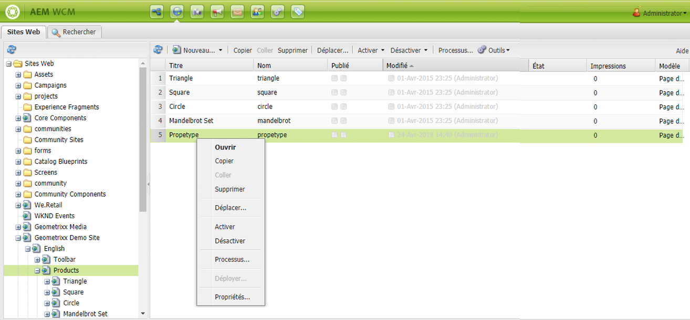
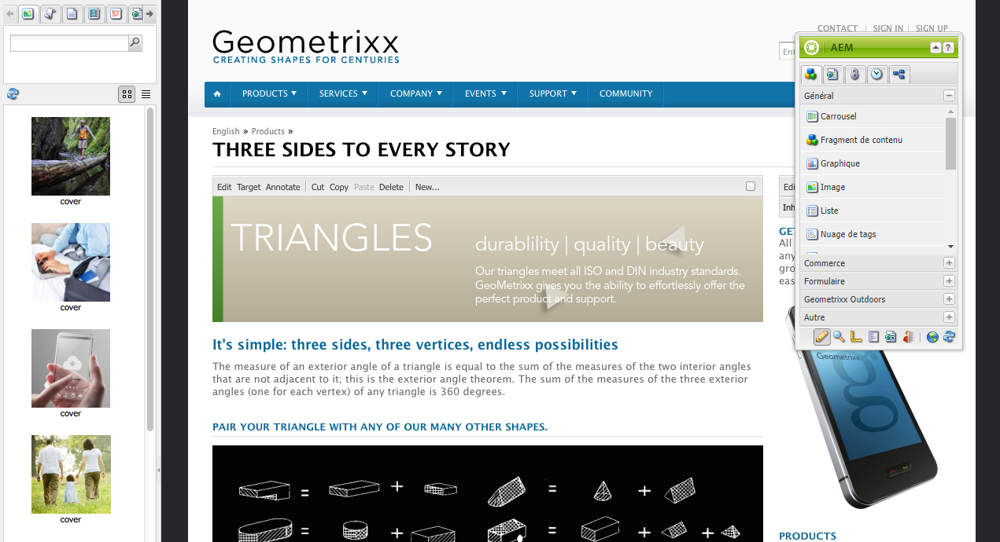
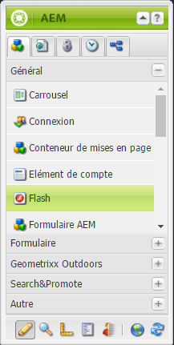
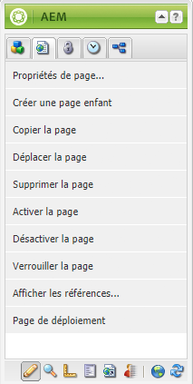
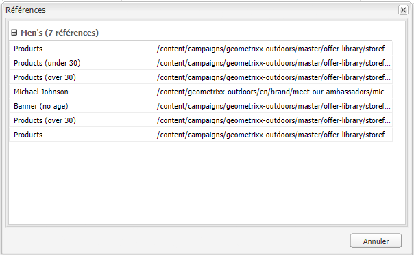
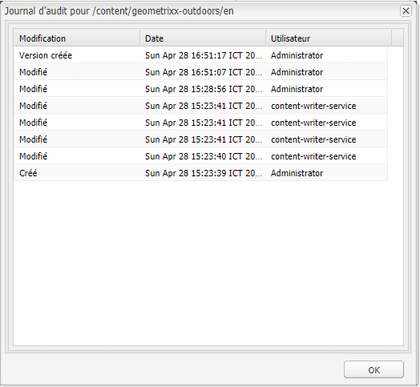
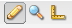

# Création – Environnement et outils {#authoring-the-environment-and-tools}

L’environnement de création d’AEM comprend divers mécanismes permettant d’organiser et de modifier votre contenu. Les outils proposés sont accessibles dans les divers éditeurs de pages et consoles.

## Administration de sites {#site-administration}

La console **Sites web** vous permet de parcourir et de gérer votre site web. Les deux volets permettent de développer la structure de votre site web et d’effectuer des actions sur l’élément souhaité :

## Modification du contenu de la page {#editing-your-page-content}

L’IU classique comporte un éditeur de page distinct, qui utilise l’outil de recherche de contenu et le sidekick :

`https://localhost:4502/cf#/content/geometrixx/en/products/triangle.html`

## Accès à l’aide {#accessing-help}

Plusieurs ressources d’**Aide** sont accessibles directement depuis AEM :

Outre les [barres d’outils de la console](/help/sites-classic-ui-authoring/author-env-basic-handling.md#accessing-help), vous pouvez également accéder à l’aide à partir du sidekick (à l’aide de l’icône ?) lorsque vous modifiez une page :

Vous pouvez également utiliser le bouton **Aide** dans la boîte de dialogue de modification de certains éléments. Vous obtiendrez alors une aide contextuelle.

## Sidekick {#sidekick}

Dans l’onglet **Composants** du sidekick, vous pouvez parcourir les composants pouvant être ajoutés à la page active. Le groupe requis peut être développé, puis un composant glissé jusqu’à l’emplacement de votre choix sur la page.

## Outil de recherche de contenu {#the-content-finder}

L’outil de recherche de contenu constitue un moyen simple et rapide de rechercher des ressources ou du contenu dans le référentiel lors de la modification d’une page.

Utilisez l’outil de recherche de contenu pour localiser une plage de ressources. Au besoin, faites glisser un élément sur un paragraphe de la page :

* [Images](#finding-images)
* [Documents](#finding-documents)
* [Films](#finding-movies)
* [Navigateur Dynamic Media](/help/sites-administering/scene7.md#scene7contentbrowser)
*  [Pages](/help/sites-classic-ui-authoring/classic-page-author-env-tools.md#finding-pages)

* [Paragraphes](#referencing-paragraphs-from-other-pages)
* [Produits](/help/sites-classic-ui-authoring/classic-page-author-env-tools.md#products)
* Ou pour [parcourir le site web par structure de référentiel](#the-content-finder)

Vous pouvez [rechercher des éléments spécifiques](#the-content-finder) avec toutes les options.

### Finding Images {#finding-images}

Cet onglet répertorie toutes les images présentes dans le référentiel.

Après avoir créé un paragraphe Image sur votre page, vous pouvez y faire glisser un élément.

### Finding Documents {#finding-documents}

Cet onglet répertorie tous les documents présents dans le référentiel.

Après avoir créé un paragraphe Téléchargement sur votre page, vous pouvez y faire glisser un élément.

### Finding Movies {#finding-movies}

Cet onglet répertorie toutes les vidéos (éléments Flash, par ex.) présentes dans le référentiel.

Après avoir créé un paragraphe approprié (par ex. Flash) sur votre page, vous pouvez y faire glisser un élément.

### Produits {#products}

Cet onglet répertorie tous les produits. Après avoir créé un paragraphe approprié (par ex. Produit) sur votre page, vous pouvez y faire glisser un élément.

### Trouver des pages {#finding-pages}

Cet onglet affiche toutes les pages. Cliquez avec le doublon sur une page pour l’ouvrir en vue de la modifier.

### Referencing Paragraphs from other Pages {#referencing-paragraphs-from-other-pages}

Cet onglet vous permet de rechercher une autre page. Tous les paragraphes de cette page sont répertoriés. Vous pouvez ensuite faire glisser un paragraphe vers la page en cours ; cela a pour effet de créer une référence vers le paragraphe d’origine.

### Utilisation de l’affichage du référentiel entier {#using-the-full-repository-view}

Cet onglet affiche toutes les ressources du référentiel.

### Recherche avec l’explorateur de contenu {#using-search-with-the-content-browser}

Vous pouvez rechercher des éléments spécifiques pour toutes les options. Toutes les balises et ressources correspondant au modèle de recherche sont répertoriées :

Vous pouvez également utiliser des caractères génériques pour la recherche. Les caractères génériques suivants sont pris en charge :

* `*`
correspond à une suite de zéro ou plusieurs caractères.

* `?`
correspond à un seul caractère.

>[!NOTE]
>
>Un « nom » de propriété pseudo doit être utilisé pour effectuer une recherche de caractères génériques.

Par exemple, si une image portant le nom est disponible :

`ad-nmvtis.jpg`

les schémas de recherche suivants la trouvent (ainsi que toute autre image correspondant au schéma) :

* `name:*nmv*`
* `name:AD*`
la correspondance de caractères n’est *pas* sensible à la casse.

* `name:ad?nm??is.*`
Vous pouvez utiliser un nombre indéfini de caractères génériques dans une requête.

>[!NOTE]
>
>Vous pouvez également utiliser la recherche [SQL2](https://helpx.adobe.com/experience-manager/6-5/sites/developing/using/reference-materials/javadoc/org/apache/jackrabbit/commons/query/sql2/package-summary.html).

## Affichage de références {#showing-references}

AEM vous permet de visualiser les pages liées à la page en cours de traitement.

Pour afficher les références de page directes :

1. Dans le sidekick, sélectionnez l’icône de l’onglet **Page**.

   

1. Sélectionnez **Afficher les références...** AEM ouvre la fenêtre Références et affiche les pages qui font référence à la page sélectionnée, y compris leurs chemins.

   

Dans certains cas, le sidekick permet d’exécuter d’autres actions, notamment :

* [Lancements](/help/sites-classic-ui-authoring/classic-launches.md)
* [Live Copies](/help/sites-administering/msm.md)

* [Blueprint](/help/sites-administering/msm-best-practices.md)

D’autres [relations entre pages sont visibles dans la console Sites web](/help/sites-classic-ui-authoring/author-env-basic-handling.md#page-information-on-the-websites-console).

## Journal d’audit  {#audit-log}

Le **journal d’audit** est accessible depuis l’onglet **Informations** du sidekick. Il répertorie les actions récentes ayant eu lieu sur la page active ; par exemple :

## Informations sur la page {#page-information}

La console de site Web [fournit également des informations sur l&#39;état actuel de la page](/help/sites-classic-ui-authoring/author-env-basic-handling.md#page-information-on-the-websites-console), telles que la publication, la modification, le verrouillage, la livecopy, etc.

## Modes de page  {#page-modes}

Lors de la modification d’une page dans l’IU classique, plusieurs modes sont accessibles à l’aide des icônes au bas du sidekick :

La rangée d’icônes située au bas du sidekick permet de changer de mode pour le traitement des pages :

* [Modifier](/help/sites-classic-ui-authoring/classic-page-author-edit-mode.md)
Il s’agit du mode par défaut qui vous permet de modifier la page, d’ajouter ou de supprimer des composants et d’apporter d’autres modifications.

* [Aperçu](/help/sites-classic-ui-authoring/classic-page-author-edit-content.md#previewing-pages)
Ce mode permet d’afficher un aperçu de la page comme si elle apparaissait sur votre site web sous sa forme définitive.

* [Conception](/help/sites-classic-ui-authoring/classic-page-author-design-mode.md#main-pars-procedure-0)
Dans ce mode, vous avez la possibilité de modifier la conception de la page en configurant les composants accessibles.

>[!NOTE]
>
>D’autres options sont également disponibles :
>
>* [Génération de modèles automatique](/help/sites-classic-ui-authoring/classic-feature-scaffolding.md)
>* [Contexte client](/help/sites-administering/client-context.md)
>* Sites web - Ouvre la console Sites web.
>* Recharger - Actualise la page.

## Raccourcis clavier {#keyboard-shortcuts}

Divers [raccourcis clavier](/help/sites-classic-ui-authoring/classic-page-author-keyboard-shortcuts.md) sont disponibles.
