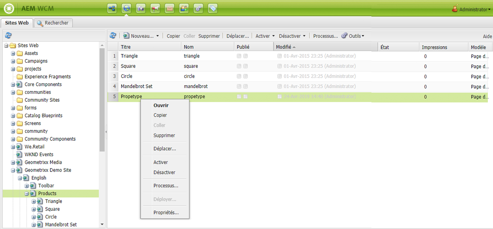

# Création et organisation des pages{#creating-and-organizing-pages}

Cette section décrit comment créer et gérer des pages avec Adobe Experience Manager (AEM) pour pouvoir ensuite [créer du contenu](/help/sites-classic-ui-authoring/classic-page-author-edit-content.md) sur ces pages.

>[!NOTE]
>
>Vous devez disposer des [droits d’accès](/help/sites-administering/security.md) et des [autorisations appropriés](/help/sites-administering/security.md#permissions) sur votre compte pour agir sur les pages, notamment pour créer, copier, déplacer, modifier et supprimer du contenu.
>
>En cas de problème, contactez votre administrateur système.

## Organisation du site web {#organizing-your-website}

En tant qu’auteur, vous devez organiser votre site web dans AEM. Cela implique de créer et de nommer vos pages de contenu de façon à ce que :

* vous puissiez les trouver facilement dans l’environnement de création ;
* les visiteurs sur votre site puissent facilement les parcourir dans l’environnement de publication.

Vous pouvez également vous aider de [dossiers](#creating-a-new-folder) pour organiser votre contenu.

La structure d’un site Web peut être comparée à celle d’un *arbre* qui soutient vos pages de contenu. Les noms de ces pages de contenu sont utilisés pour former des URL qui indiquent les titres lorsque le contenu des pages est affiché.

Vous trouverez ci-dessous un extrait du site Geometrixx ; par exemple, où est accessible la page `Triangle` :

* Environnement de création

  `http://localhost:4502/cf#/content/geometrixx/en/products/triangle.html`

* Environnement de publication

  `http://localhost:4503/content/geometrixx/en/products/triangle.html`

  Selon la configuration de votre instance, le segment `/content` peut être facultatif dans l’environnement de publication.

```xml
  /content
    /geometrixx
      /en
        /toolbar...
        /products
          /triangle
            /overview
            /features
          /square...
          /circle...
          /...
        /...
      /fr...
      /de...
      /es...
      /...
    /...
```

Cette structure est visible à partir de la console Sites web, que vous pouvez utiliser pour [parcourir l’arborescence](/help/sites-classic-ui-authoring/author-env-basic-handling.md#main-pars-text-15).



### Conventions de dénomination des pages {#page-naming-conventions}

Lors de la création d’une page, il existe deux champs clés :

* **[Titre](#title)** :

   * Il s’affiche pour l’utilisateur dans la console et dans la partie supérieure du contenu de la page lors de la modification.
   * Ce champ est obligatoire.

* **[Nom](#name)** :

   * Il est utilisé pour générer l’URI.
   * L’entrée utilisateur pour ce champ est facultative. S’il n’est pas spécifié, le nom est dérivé du titre.

Lors de la création d’une page AEM [valide le nom de la page en fonction des conventions ;](/help/sites-developing/naming-conventions.md) imposé par AEM et JCR.

La mise en œuvre et la liste des caractères autorisés diffère légèrement en fonction de l’IU (ils sont plus étendus pour l’IU activée pour les écrans tactiles), mais les caractères autorisés minimum sont les suivants :

* De « a » à « z »
* De « A » à « Z »
* De « 0 » à « 9 »
* _ (trait de soulignement)
* `-` (tiret/signe moins)

N’utilisez que ces caractères si vous voulez vous assurer qu’ils seront acceptés/utilisés (si vous avez besoin d’une liste complète des caractères autorisés, consultez [les conventions de dénomination](/help/sites-developing/naming-conventions.md)).

#### Titre {#title}

Si vous n’indiquez qu’une page **Titre** lors de la création d’une page, AEM délivre la page **Nom** de cette chaîne et [valider le nom en fonction des conventions ;](/help/sites-developing/naming-conventions.md) imposé par AEM et JCR. Dans les deux interfaces utilisateur, un champ **Titre** contenant des caractères non valides sera accepté, mais les caractères non valides seront remplacés pour le nom dérivé. Par exemple :

| Titre | Nom dérivé |
|---|---|
| Schön | schoen.html |
| SC%&amp;&amp;ast;ç+ | sc---c-.html |

#### Nom {#name}

Si vous fournissez une page **Nom** lors de la création d’une page, AEM [valide le nom en fonction des conventions ;](/help/sites-developing/naming-conventions.md) imposé par AEM et JCR.

Dans l’IU classique, vous **ne pouvez pas entrer de caractères non valides** dans le champ **Nom**.

>[!NOTE]
>Dans l’IU activée pour les écrans tactiles, vous **ne pouvez pas utiliser de caractères non valides** dans le champ **Nom**. Lorsqu’AEM détecte des caractères non valides, le champ est mis en surbrillance et un message d’explication s’affiche et indique les caractères à supprimer/remplacer.

>[!NOTE]
>
>Évitez d’utiliser un code à deux lettres, tel que défini par la norme ISO-639-1, sauf s’il s’agit d’une racine de langue.
>
>Pour plus d’informations, voir [Préparation du contenu pour la traduction](/help/sites-administering/tc-prep.md).

### Modèles {#templates}

Dans AEM, un modèle spécifie un type de page spécialisé. Un modèle est utilisé comme base pour toute nouvelle page créée.

Le modèle définit la structure d’une page, y compris une miniature et d’autres propriétés. Par exemple, vous pouvez avoir des modèles distincts pour les pages de produits, les plans de site et les coordonnées. Les modèles sont constitués de [composants](#components).

AEM comporte plusieurs modèles prêts à l’emploi. Les modèles proposés dépendent du site web individuel et des informations qui doivent être fournies (lors de la création d’une page) de l’interface utilisée. Les champs clés sont les suivants :

* **Titre**
Titre affiché sur la page web obtenue.

* **Nom**
Utilisé lors de l’attribution du nom de la page.

* **Modèle**
Liste des modèles utilisables lors de la génération de la nouvelle page.

### Composants {#components}

Les composants sont les éléments fournis par AEM afin que vous puissiez ajouter des types de contenu spécifiques. Des composants prêts à l’emploi sont fournis avec AEM pour procurer une fonctionnalité complète ; il s’agit des composants suivants :

* Texte
* Image
* Diaporama
* Vidéo
* Bien plus

Une fois que vous avez créé et ouvert une page, vous pouvez [ajouter du contenu à l’aide des composants](/help/sites-classic-ui-authoring/classic-page-author-edit-content.md#insertinganewparagraph), disponibles dans le [sidekick](/help/sites-classic-ui-authoring/classic-page-author-env-tools.md#sidekick).

## Gestion des pages {#managing-pages}

### Création d’une page {#creating-a-new-page}

Avant de pouvoir commencer à créer du contenu, vous devez créer une page, à moins que toutes les pages n’aient été créées pour vous à l’avance :

1. Dans la **Sites web** , sélectionnez le niveau auquel vous souhaitez créer une page.

   Dans l’exemple suivant, vous créez une page au niveau **Produits**, illustré dans le volet de gauche ; le volet de droite montre les pages qui existent déjà au niveau **Produits**.

   

1. Dans le menu **Nouveau...** (cliquez sur la flèche à côté de **Nouveau...**), sélectionnez **Nouvelle page...**. La fenêtre **Créer une page** s’ouvre.

   Cliquer sur **Nouveau...** agit également comme un raccourci vers la fonction **Nouvelle page...**.

1. La boîte de dialogue **Créer une page** vous permet d’effectuer les opérations suivantes :

   * Fournissez un **Titre**, celui-ci est affiché pour l’utilisateur ou l’utilisatrice.
   * Fournissez un **Nom**, celui-ci est utilisé pour générer l’URI. S’il n’est pas spécifié, le nom est dérivé du titre.

      * Si vous fournissez une page **Nom** lors de la création d’une page, AEM [valide le nom en fonction des conventions ;](/help/sites-developing/naming-conventions.md) imposé par AEM et JCR.
      * Dans l’IU classique, vous **ne pouvez pas entrer de caractères non valides** dans le champ **Nom**.

   * Cliquez sur le modèle à utiliser pour créer la nouvelle page.

     Le modèle sert de base à la nouvelle page : par exemple, pour déterminer la mise en page de base d’une page de contenu.

   >[!NOTE]
   >
   >Voir [Conventions de dénomination de page](#page-naming-conventions).

   Les informations minimales requises pour créer une page sont les suivantes : **Titre** et le modèle requis.

   

   >[!NOTE]
   >
   >Si vous souhaitez utiliser des caractères Unicode dans les URL, définissez la propriété d’alias (`sling:alias`) ([propriétés de page](/help/sites-classic-ui-authoring/classic-page-author-edit-page-properties.md)).

1. Cliquez sur **Créer** pour créer la page. Vous revenez à la console **Sites web** où vous pouvez voir une entrée pour la nouvelle page.

   La console fournit des informations sur la page (par exemple, quand elle a été modifiée pour la dernière fois et par qui) qui est mise à jour selon les besoins.

   >[!NOTE]
   >
   >Vous pouvez également créer une page lorsque vous modifiez une page existante. Utilisation **Créer une page enfant** de la **Page** de sidekick crée une page directement sous la page en cours de modification.

### Ouverture d’une page pour la modifier {#opening-a-page-for-editing}

Vous pouvez ouvrir la page à [modifier](/help/sites-classic-ui-authoring/classic-page-author-edit-content.md#editing-a-component-content-and-properties) par l’une des méthodes suivantes :

* Depuis la console **Sites web**, vous pouvez **double-cliquer** sur l’entrée de page pour l’ouvrir en vue de la modifier.

* Dans la console **Sites web**, **cliquez avec le bouton droit** (menu contextuel) sur l’élément de page, puis sélectionnez **Ouvrir** dans le menu.

* Après avoir ouvert une page, vous pouvez accéder à d’autres pages du site (en vue de les modifier) en cliquant sur des liens hypertexte.

### Copier et coller une page {#copying-and-pasting-a-page}

Lors de la copie, vous pouvez copier :

* une seule page ;
* une page ainsi que toutes les sous-pages.

1. Dans la console **Sites web**, sélectionnez la page à copier.

   >[!NOTE]
   >
   >À ce stade, il importe peu de copier une seule page ou les sous-pages sous-jacentes.

1. Cliquez sur **Copier**.

1. Accédez au nouvel emplacement et cliquez sur :

   * **Coller** pour coller la page avec toutes les sous-pages ;
   * **Maj+Coller** pour coller uniquement la page sélectionnée.

   Les pages sont collées au nouvel emplacement.

   >[!NOTE]
   >
   >Le nom de la page peut être ajusté automatiquement si une page existante porte déjà le même nom.

   >[!NOTE]
   >
   >Utilisez l’option **Copier la page** dans l’onglet **Page** du sidekick. Une boîte de dialogue s’ouvre, dans laquelle vous pouvez spécifier la destination, etc.

### Déplacer ou modifier le du nom d’une page {#moving-or-renaming-page}

>[!NOTE]
>
>La modification du nom d’une page est également soumise aux [Conventions de dénomination de page](#page-naming-conventions) lors de la spécification du nouveau nom de la page.

La procédure pour déplacer ou renommer une page est la même. Avec la même action, vous pouvez :

* déplacer une page vers un nouvel emplacement ;
* renommer une page au même emplacement ;
* déplacer une page vers un nouvel emplacement et la renommer en même temps.

AEM vous offre la possibilité de mettre à jour les liens internes vers la page renommée ou déplacée. Cette opération peut être effectuée page par page afin d’offrir une flexibilité totale.

Pour déplacer ou renommer une page :

1. Plusieurs méthodes permettent de déclencher un déplacement :

   * Dans la console **Sites web**, cliquez sur la page pour la sélectionner, puis sélectionnez **Déplacer**.
   * Dans la console **Sites web**, vous pouvez également sélectionner l’élément de page, puis effectuez un **clic droit** et sélectionnez **Déplacer...**.
   * Lorsque vous modifiez une page, vous pouvez sélectionner **Déplacer la page** dans l’onglet **Page** du sidekick.

1. La fenêtre **Déplacer** s’ouvre ; vous pouvez saisir un nouvel emplacement, un nouveau nom pour la page, ou les deux.

   

   La page répertorie également toutes les pages qui font référence à la page en cours de déplacement. Selon le statut de la page de référence, vous pouvez ajuster ces liens sur les pages et/ou republier les pages.

1. Renseignez les champs suivants, le cas échéant :

   * **Destination**

     Utilisez le plan du site (disponible via le sélecteur de la liste déroulante) pour sélectionner l’emplacement où la page doit être déplacée.

     Si vous renommez uniquement la page, ignorez ce champ.

   * **Déplacer**

     Indiquez la page à déplacer, ce champ est généralement complété par défaut, selon la méthode de déplacement utilisée et l’endroit où vous avez lancé l’opération.

   * **Renommer en**

     Le libellé actuel de la page s’affiche par défaut. Si nécessaire, indiquez le nouveau libellé de page.

   * **Régler**

     Mettez à jour les liens de la page répertoriée qui redirigent vers la page déplacée. Par exemple, si la page A contient des liens vers la page B, AEM ajuste les liens de la page A au cas où vous déplaceriez la page B.

     Cette option peut être sélectionnée ou désélectionnée pour chaque page de référence.

   * **Republier**

     Publie à nouveau la page de référence ; ici encore, cette option peut être sélectionnée pour chaque page.

   >[!NOTE]
   >
   >Si la page a déjà été activée, le fait de la déplacer la désactivera automatiquement. Par défaut, elle sera réactivée une fois le déplacement terminé. Vous pouvez toutefois changer ce comportement en désélectionnant l’option **Republier** pour la page dans la fenêtre **Déplacer**.

1. Cliquez sur **Déplacer**. Une confirmation sera requise. Cliquez sur **OK** pour confirmer.

   >[!NOTE]
   >
   >Le titre de la page n’est pas mis à jour.

### Suppression d’une page {#deleting-a-page}

1. Vous pouvez supprimer une page à partir de différents emplacements :

   * Dans la console **Sites web**, cliquez pour sélectionner la page, puis cliquez avec le bouton droit de la souris et sélectionnez **Supprimer** dans le menu qui s’affiche.
   * Dans la console **Sites web**, cliquez pour sélectionner la page, puis sélectionnez **Supprimer** dans le menu de la barre d’outils.
   * Dans le sidekick, utilisez l’onglet **Page** pour sélectionner **Supprimer la page** : cette action supprimera la page actuellement ouverte.

1. Après avoir choisi de supprimer une page, vous devez confirmer la demande, car l’action ne peut être annulée.

   >[!NOTE]
   >
   >Après la suppression, si la page a été publiée, vous pouvez restaurer la dernière version (ou une version spécifique), mais celle-ci peut ne pas avoir exactement le même contenu que la dernière version, si d’autres modifications y ont été apportées. Voir [Restauration de pages](/help/sites-classic-ui-authoring/classic-page-author-work-with-versions.md#restoringpages) pour plus de détails.

>[!NOTE]
>
>Si une page est déjà publiée, la publication est automatiquement annulée avant la suppression.

### Verrouillage d’une page {#locking-a-page}

Vous pouvez [verrouillage/déverrouillage d’une page](/help/sites-classic-ui-authoring/classic-page-author-edit-content.md#locking-a-page) depuis une console ou lors de la modification d’une page individuelle. Les informations sur les pages verrouillées s’affichent également aux deux emplacements.

### Création d’un dossier {#creating-a-new-folder}

>[!NOTE]
>
>Les dossiers sont également soumis aux [Conventions de dénomination de page](#page-naming-conventions) lors de la spécification du nom du nouveau dossier.

1. Ouvrez la console **Sites web** et accédez à l’emplacement requis.
1. Dans le menu **Nouveau...** (cliquez sur la flèche en regard de l’option **Nouveau...**), sélectionnez **Nouveau dossier...**.
1. La variable **Créer un dossier** s’ouvre. Vous pouvez y entrer le **nom** et le **titre** :

   

1. Pour créer le dossier, sélectionnez **Créer**.
