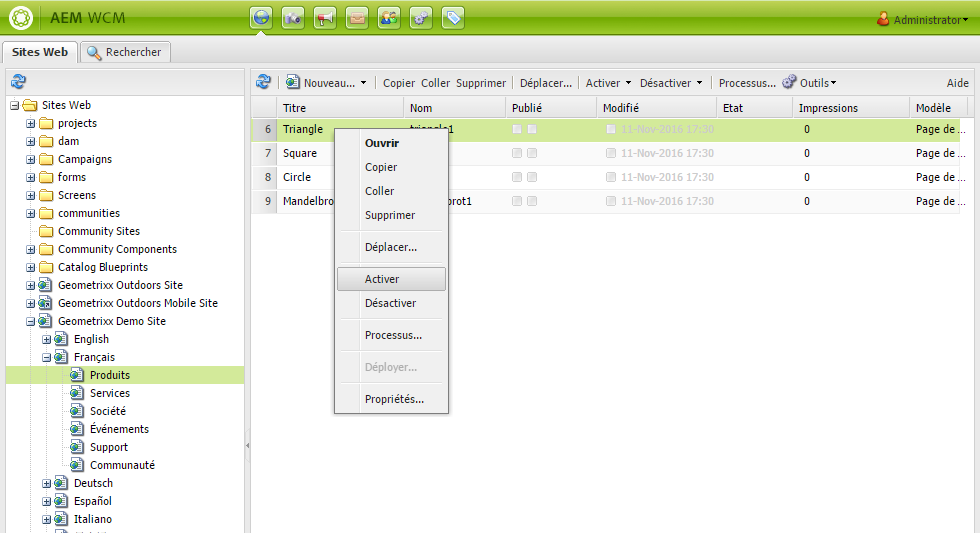

# Publication de pages{#publishing-pages}

Une fois le contenu créé et révisé dans l’environnement de création, l’objectif est de le rendre disponible sur votre site web public (votre environnement de publication).

On parle alors de publication d’une page, ou d’annulation de publication lorsque vous souhaitez retirer une page de l’environnement de publication. En cas de publication et d’annulation de la publication, la page reste disponible pour d’autres modifications dans l’environnement de création jusqu’à ce que vous la supprimiez.

Vous pouvez également publier/annuler la publication d’une page immédiatement ou à une date/heure prédéfinies.

>[!NOTE]
>
>Certains termes relatifs à la publication peuvent prêter à confusion :
>
>* **Publier/Annuler la publication**
   >  Termes principalement utilisés pour évoquer les opérations qui rendent votre contenu publiquement accessible dans votre environnement de publication (ou non).
   >
   >
* **Activer/Désactiver**
   >  Ces termes sont synonymes de publication/annulation de la publication.
   >
   >
* **Répliquer/Réplication**
   >  Il s’agit des termes techniques décrivant le déplacement des données (par exemple, contenu de page, fichiers, code, commentaires d’utilisateur) d’un environnement à l’autre, comme lors de la publication ou de la réplication inverse des commentaires d’utilisateur.
>

>[!NOTE]
>
>Si vous ne possédez pas les privilèges requis pour publier une page spécifique :
>
>* Un workflow est déclenché afin d’aviser la personne concernée de votre demande de publication.
>* Un message s’affiche (pendant un bref laps de temps) pour vous en informer.

>

## Publication d’une page {#publishing-a-page}

Pour activer une page, vous pouvez procéder de deux manières :

* [depuis la console Sites web](#activating-a-page-from-the-websites-console)
* [depuis le sidekick sur la page proprement dite](#activating-a-page-from-sidekick)

>[!NOTE]
>
>Vous pouvez également activer une sous-arborescence de plusieurs pages à l’aide de l’option [Activer l’arborescence](#howtoactivateacompletesectiontreeofyourwebsite) sur la console Outils.

### Activation d’une page à partir de la console Sites web {#activating-a-page-from-the-websites-console}

Vous pouvez activer des pages dans la console Sites web. Après avoir ouvert une page et modifié son contenu, vous revenez à la console Sites web : 

1. Dans la console Sites web, sélectionnez la page à activer.
1. Sélectionnez **Activer** dans le menu supérieur ou dans le menu déroulant de l’élément de page sélectionné. 

   Pour activer le contenu de la page et toutes ses pages secondaires, utilisez la console [**Outils**](/help/sites-classic-ui-authoring/classic-page-author-publish-pages.md#howtoactivateacompletesectiontreeofyourwebsite).

   

   >[!NOTE]
   >
   >Au besoin, AEM vous demande d’activer ou de réactiver toute ressource liée à la page. Vous pouvez activer ou désactiver les cases à cocher pour activer ces ressources.

1. Au besoin, AEM vous demande d’activer ou de réactiver toute ressource liée à la page. Vous pouvez activer ou désactiver les cases à cocher pour activer ces ressources.

   

1. La Gestion de contenu web AEM active le contenu sélectionné. La ou les pages publiées apparaissent dans la console [Sites web](/help/sites-classic-ui-authoring/author-env-basic-handling.md#page-information-on-the-websites-console) (avec une marque verte), accompagnées d’informations sur la personne qui a activé le contenu, ainsi que la date et l’heure de l’activation.

   

### Activating a Page from Sidekick {#activating-a-page-from-sidekick}

Vous pouvez également activer une page ouverte à des fins d’édition.

Après avoir ouvert la page et modifié son contenu, procédez comme suit :

1. Sélectionnez l’onglet **Page** dans le sidekick.
1. Cliquez sur **Activer la page**.
Un message s’affiche dans le coin supérieur droit de la fenêtre pour confirmer l’activation de la page.

## Annulation de publication d’une page {#unpublishing-a-page}

Pour supprimer une page de l’environnement de publication, désactivez le contenu.

Pour désactiver une page :

1. Dans la console Sites web, sélectionnez la page à désactiver.
1. Sélectionnez **Désactiver** dans le menu supérieur ou dans le menu déroulant de l’élément de page sélectionné. Vous êtes invité à confirmer la suppression.

   

1. Actualisez la [console Sites web](/help/sites-classic-ui-authoring/author-env-basic-handling.md#page-information-on-the-websites-console) et le contenu est marqué en rouge, ce qui indique qu’il n’est plus publié.

   

## Activer/Désactiver ultérieurement {#activate-deactivate-later}

### Activer plus tard {#activate-later}

Pour planifier l’activation à une heure ultérieure :

1. Dans la console Sites Web, accédez au menu **Activer** et sélectionnez ensuite **Activer plus tard**.
1. Dans la boîte de dialogue qui s’ouvre, indiquez la date et l’heure de l’activation et cliquez sur **OK**. Cette opération crée une version de la page qui est activée à l’heure spécifiée.

   

L’activation différée lance un workflow pour activer cette version de la page à l’heure indiquée. À l’inverse, la désactivation différée lance un workflow pour désactiver cette version de la page à l’heure indiquée.

Pour annuler cette activation/désactivation, rendez-vous dans la [console Worfklow](/help/sites-administering/workflows-administering.md#main-pars_title_3-yjqslz-refd) pour mettre un terme au workflow correspondant.

### Désactiver plus tard  {#deactivate-later}

Pour planifier la désactivation à une heure ultérieure :

1. Dans la console Site Web, accédez au menu **Désactiver**, puis sélectionnez **Désactiver plus tard**.

1. Dans la boîte de dialogue qui s’ouvre, indiquez la date et l’heure de désactivation, puis cliquez sur **OK**.

   

La **désactivation différée** lance un workflow pour désactiver cette version de la page à l’heure indiquée.

Pour annuler cette désactivation, rendez-vous dans la [console Worfklow](/help/sites-administering/workflows-administering.md#main-pars_title_3-yjqslz-refd) pour mettre un terme au workflow correspondant.

## Activation/désactivation planifiée (heure d’activation/désactivation)  {#scheduled-activation-deactivation-on-off-time}

Pour programmer les heures de publication/annulation de publication d’une page, utilisez les options **Heure d’activation** et **Heure de désactivation** dans les [Propriétés de la page](/help/sites-classic-ui-authoring/classic-page-author-edit-page-properties.md).

### Définition de l’état de publication de la page {#determining-page-publication-status-classic-ui}

Vous pouvez vérifier l’état dans la [console Sites web](/help/sites-classic-ui-authoring/author-env-basic-handling.md#page-information-on-the-websites-console). Les couleurs indiquent l’état de publication.

## Activation d’une section (arborescence) complète de votre site web  {#activating-a-complete-section-tree-of-your-website}

Vous pouvez activer les différentes pages à partir de l’onglet **Sites web**. Après avoir saisi ou mis à jour un nombre élevé de pages de contenu (toutes résidant sous la même page racine), il peut s’avérer plus simple d’activer toute l’arborescence en une seule opération. Vous pouvez également effectuer une exécution d’essai afin d’émuler une activation et de mettre en surbrillance les pages à activer.

1. Ouvrez la console **Outils** en la sélectionnant dans la page **Bienvenue**, puis cliquez sur **Réplication** en doublon pour ouvrir la console ( `https://localhost:4502/etc/replication.html`).

   

1. Sur la console **Réplication**, cliquez sur **Activer l’arborescence**.

   La fenêtre suivante ( `https://localhost:4502/etc/replication/treeactivation.html`) s&#39;affiche.

   

1. Saisissez le **chemin d’accès au Début**. Ceci spécifie le chemin d&#39;accès à la racine de la section que vous souhaitez activer (publier). Cette page et toutes les pages situées en dessous sont prises en compte pour l’activation (ou utilisées dans l’émulation si une exécution à sec est sélectionnée).
1. Activez les critères de sélection suivant vos besoins :

   * **Uniquement Modifié** : active uniquement les pages qui ont été modifiées.
   * **Uniquement Activé** : active uniquement les pages qui ont (déjà) été activées. Cette option agit, en quelque sorte, comme une réactivation.
   * **Ignorer Désactivé** : ignore les pages qui ont été désactivées.

1. Sélectionnez l’opération à effectuer :

   1. Sélectionnez **Exécution sèche** si vous souhaitez vérifier quelles pages *seront* activées. Il ne s&#39;agit que d&#39;une émulation, aucune page ne sera activée.

   1. Sélectionnez **Activer** si vous souhaitez activer les pages.
