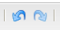

# Éditeur de texte enrichi {#rich-text-editor}

L’éditeur de texte enrichi est une composante essentielle à la saisie de contenu texte dans AEM. Il constitue la base de divers composants, dont :

* Text (Texte)
* Texte et Image
* Tableau

## Éditeur de texte enrichi {#rich-text-editor-1}

La boîte de dialogue d’édition WYSIWYG (tel écrit, tel écran) fournit un large éventail de fonctionnalités :

>[!NOTE]
>
>Les fonctions disponibles peuvent être configurées pour chaque projet ; elles peuvent donc varier pour votre installation.

## Édition statique {#in-place-editing}

Outre le mode d’édition de texte enrichi basé sur la boîte de dialogue, AEM propose un mode d’édition statique qui permet l’édition directe du texte tel qu’il est affiché dans la mise en page.

Cliquez deux fois sur un paragraphe (double-clic lent) pour passer en mode d’édition statique (le bord du composant devient orange).

Vous aurez la possibilité de modifier directement le texte sur la page, au lieu de passer par une boîte de dialogue. Il vous suffit d’effectuer vos modifications pour qu’elles soient enregistrées automatiquement.

>[!NOTE]
>
>Si l’outil de recherche de contenu est ouvert, une barre d’outils comportant les options de mise en forme de l’éditeur de texte enrichi s’affiche en haut de l’onglet (comme illustré ci-dessus).
>
>Dans le cas contraire, la barre d’outils ne s’affiche pas.

Pour l’heure, le mode Modifier statique est activé pour les éléments de page générés par les composants **Texte** et **Titre**.

>[!NOTE]
>
>Le composant [!UICONTROL Titre] a été conçu pour contenir un texte court sans saut de ligne. Lorsque vous modifiez un titre en mode d’édition statique, saisir un saut de ligne entraîne l’ouverture d’un nouveau composant **Texte** sous le titre.

## Fonctions de l’Editeur de texte enrichi  {#features-of-the-rich-text-editor}

L’Editeur de texte enrichi fournit une gamme de fonctionnalités, qui [dépendent de la configuration](/help/sites-administering/rich-text-editor.md) du composant individuel. Les fonctionnalités sont disponibles pour l’interface utilisateur classique et optimisée pour les écrans tactiles.

### Formats de caractères de base {#basic-character-formats}

Ces options vous permettent d’appliquer une mise en forme aux caractères que vous avez sélectionnés (mis en surbrillance). Certaines d’entre elles disposent également de touches de raccourci :

* Gras (Ctrl+B)
* Italique (Ctrl+I)
* Souligné (Ctrl+U)
* Indice
* Exposant

Toutes ces options fonctionnent selon le principe de bascule, ce qui signifie qu’une nouvelle sélection supprime la mise en forme.

### Styles et formats prédéfinis  {#predefined-styles-and-formats}

Votre installation peut inclure des styles et des mises en forme prédéfinis. Ils sont disponibles dans les listes déroulantes **[!UICONTROL Style]** et **[!UICONTROL Format]**, et peuvent être appliqués au texte que vous avez sélectionné.

Un style peut être appliqué à une chaîne spécifique (un style est mis en corrélation avec CSS) :

Tandis qu’une mise en forme est appliquée à l’intégralité d’un paragraphe texte (une mise en forme est basée sur le langage HTML) :

Une mise en forme spécifique peut uniquement être modifiée (la valeur par défaut est **[!UICONTROL Paragraphe]**).

Un style peut être supprimé ; placez le curseur dans le texte auquel le style a été appliqué, puis cliquez sur l’icône de suppression :

>[!CAUTION]
>
>Abstenez-vous de resélectionner une partie du texte auquel le style a été appliqué. Cela entraînerait, en effet, la désactivation de l’icône.

### Couper, Copier, Coller  {#cut-copy-paste}

Les fonctions **[!UICONTROL Couper]** et **[!UICONTROL Copier]** standard sont disponibles. Plusieurs versions de la fonction **[!UICONTROL Coller]** sont fournies afin de pourvoir aux différents formats.

* Couper (Ctrl-X)
* Copier (Ctrl-C)
* Coller
Il s’agit du mécanisme de collage par défaut (Ctrl-V) pour le composant ; lorsqu’il est installé prêt à l’emploi, il est configuré pour être [!UICONTROL Coller à partir de Word].

* Coller comme texte : Supprime tous les styles et la mise en forme pour coller uniquement le texte brut.

* Coller à partir de Word : Cette opération colle le contenu au format HTML (avec quelques reformatages nécessaires).

### Annuler, Rétablir {#undo-redo}

AEM conserve un historique des 50 dernières actions effectuées dans le composant en cours, classées par ordre chronologique. Au besoin, ces opérations peuvent être annulées (puis rétablies) dans un ordre strictement défini.

>[!CAUTION]
>
>L’historique est conservé uniquement pour la session d’édition en cours ; il est redémarré à chaque fois que vous ouvrez le composant en vue de le modifier.

>[!NOTE]
>
>Le nombre de tâches par défaut est limité à 50 ; il se peut toutefois que cette valeur soit différente pour votre installation.

### Alignement {#alignment}

Le texte peut être aligné à gauche, au centre ou à droite.

### Indentation {#indentation}

La mise en retrait d’un paragraphe peut être augmentée ou réduite. Lorsque le paragraphe sélectionné est mis en retrait, tout nouveau texte saisi conserve le niveau de mise en retrait actuel.

### Listes {#lists}

Vous pouvez créer des listes à puces et numérotées dans votre texte. Vous pouvez soit sélectionner le type de liste et commencer la saisie, soit mettre en surbrillance le texte à convertir. Dans les deux cas, un saut de ligne génère un nouvel élément de liste.

Vous pouvez créer des listes imbriquées en mettant en retrait un ou plusieurs éléments de liste.

Vous pouvez modifier le style d’une liste en positionnant simplement le curseur dans la liste, puis en sélectionnant un autre style. Une sous-liste peut également présenter un style différent de sa liste parent ; vous pouvez lui appliquer ce style après l’avoir créée (par mise en retrait).

### Liens {#links}

Un lien vers une URL (que ce soit dans votre site Web ou dans un emplacement externe) est généré en mettant en surbrillance le texte requis, puis en cliquant sur l’icône d’hyperlien :

Une boîte de dialogue vous permet de spécifier l’URL cible, ainsi que de déterminer si elle doit s’ouvrir dans une nouvelle fenêtre.

Vous pouvez :

* Saisissez directement une URI.
* Utiliser la carte du site pour sélectionner une page de votre site Web
* Saisissez l’URI, puis ajoutez l’ancre de cible ; par ex. `www.TargetUri.org#AnchorName`
* Saisissez une ancre uniquement (pour faire référence à &quot;la page active&quot;); Par exemple, `#anchor`
* Recherchez une page dans l’outil de recherche de contenu, puis faites glisser et déposez l’icône de page dans la boîte de dialogue Hyperlien.

>[!NOTE]
>
>Vous pouvez faire précéder l’URI de l’un des protocoles configurés pour votre installation. Dans une installation standard, il s&#39;agit de `https://`, `ftp://` et `mailto:`. Les protocoles non configurés pour votre installation seront refusés et marqués comme non valides.

Pour rompre le lien, placez le curseur dans le texte du lien et cliquez ensuite sur l’icône [!UICONTROL Rompre le lien] : 

### Ancres  {#anchors}

Une ancre peut être créée n’importe où dans le texte en positionnant le curseur ou en sélectionnant du texte. Cliquez ensuite sur l’icône **Ancre** pour ouvrir la boîte de dialogue.

Saisissez le nom de l’ancre et cliquez ensuite sur **OK** pour l’enregistrer.

L’ancre s’affiche lorsque le composant est en cours d’édition ; elle peut désormais être utilisée dans une cible pour les liens.

### Rechercher et remplacer {#find-and-replace}

AEM met à votre disposition une fonction de **recherche** et de **remplacement** (Rechercher et remplacer).

Ces deux fonctions sont pourvues d’un bouton **Rechercher le suivant** permettant de rechercher le texte spécifié dans le composant ouvert. Vous pouvez également indiquer s’il faut tenir compte de la casse (respect des majuscules / minuscules) dans la recherche.

La recherche commence toujours à la position du curseur dans le texte. Arrivé à la fin du composant, un message vous informe que l’opération de recherche suivante commencera au début.

L’option **Remplacer** permet de **rechercher**, puis de **remplacer** une instance par le texte indiqué ou de **remplacer toutes** les instances du composant actif.

### Images {#images}

Vous pouvez faire glisser des images à partir de l’Outil de recherche de contenu afin de les ajouter au texte.

>[!NOTE]
>
>AEM propose également des composants spécialisés permettant une configuration d’image plus détaillée ; Par exemple, les composants **Image** et **Image de texte** sont disponibles.

### Vérificateur orthographique {#spelling-checker}

Le vérificateur orthographique vérifie l’intégralité du texte dans le composant actif.

Toute faute d’orthographe est mise en surbrillance :

>[!NOTE]
>
>Le correcteur orthographique fonctionne dans la langue du site web soit en prenant la propriété de langue de la sous-arborescence, soit en extrayant la langue de l’URL ;  d’autres termes, la vérification sera effectuée en anglais pour la branche `en`en, en allemand pour la branche `de`, etc.

### Tables {#tables}

Des tableaux sont disponibles :

* en tant que composant **Tableau**

   

* à l’intérieur du composant **Texte**

   

   >[!NOTE]
   >
   >Bien que les tables soient disponibles dans le RTE, il est recommandé d&#39;utiliser le composant **Table** lors de la création de tableaux.

Dans les composants **Texte** et **Tableau**, la fonctionnalité de tableau est accessible par le biais du menu contextuel (qui s’ouvre généralement à l’aide du bouton droit de la souris) ; par exemple :

>[!NOTE]
>
>Une barre d’outils spécialisée est également disponible dans le composant **Tableau**. Elle contient plusieurs fonctions standard de l’éditeur de texte enrichi, ainsi qu’un sous-ensemble de fonctions spécifiques au tableau.

Les fonctions spécifiques au tableau sont les suivantes :

* [Propriétés du tableau](#table-properties)
* [Cell Properties](#cell-properties)
* [Add or Delete Rows](#add-or-delete-rows)
* [Add or Delete Columns](#add-or-delete-columns)
* [Selecting Entire Rows or Columns](#selecting-entire-rows-or-columns)
* [Merge Cells](#merge-cells)
* [Split Cells](#split-cells)
* [Tableaux imbriqués](#creating-nested-tables)
* [Supprimer le tableau](#remove-table)

#### Table Properties {#table-properties}

Les propriétés de base du tableau peuvent être configurées avant de cliquer sur **OK** pour l’enregistrement :

* **Largeur** : Largeur totale du tableau.

* **Hauteur** : Hauteur totale du tableau.

* **Bordure** : Taille de la bordure du tableau.

* **Marge intérieure** des cellules : Cela définit l’espace blanc entre le contenu de la cellule et ses bordures.

* **Espacement** des cellules : Cela définit la distance entre les cellules.

>[!NOTE]
>
>Quelques propriétés de cellule, telles que Largeur et Hauteur, peuvent être définies en pixels ou en pourcentages.

>[!CAUTION]
>
>Adobe vous recommande de définir une largeur pour votre tableau.

#### Propriétés de la cellule {#cell-properties}

Les propriétés d’une cellule spécifique ou d’une série de cellules peuvent être configurées :

* **Largeur**
* **Hauteur**
* **Alignement**  horizontal - Gauche, Centre ou Droite
* **Alignement**  vertical - Haut, Moyen, Bas ou Ligne de base
* **Type** de cellule - Données ou En-tête
* **Appliquer à : cellule** unique, rangée entière, colonne entière

#### Ajouter ou supprimer des lignes {#add-or-delete-rows}

Vous pouvez ajouter des lignes au-dessus ou sous la ligne en cours.

La ligne en cours peut également être supprimée.

#### Ajouter ou Supprimer des colonnes  {#add-or-delete-columns}

Vous pouvez ajouter des colonnes à gauche ou à droite de la colonne en cours.

La colonne en cours peut également être supprimée.

#### Sélectionner des lignes ou colonnes entières  {#selecting-entire-rows-or-columns}

Cette option sélectionne toute la ligne ou la colonne en cours. Vous pouvez alors exécuter des actions spécifiques (fusionner des éléments, par exemple).

#### Fusionner des cellules {#merge-cells}

 

* Si vous avez sélectionné un groupe de cellules, vous pouvez toutes les fusionner en une seule.
* Si une seule cellule est sélectionnée, vous pouvez la fusionner avec celle située à sa droite ou en dessous.

#### Diviser des cellules  {#split-cells}

Sélectionnez une seule cellule pour la diviser :

* La division d’une cellule dans le sens horizontal génère une nouvelle cellule à droite de la cellule actuelle, dans la colonne en cours.
* La division d’une cellule dans le sens vertical génère une nouvelle cellule sous la cellule actuelle, mais dans la ligne en cours.

#### Création de tableaux imbriqués  {#creating-nested-tables}

La création d’un tableau imbriqué génère un nouveau tableau autonome dans la cellule en cours.

>[!NOTE]
>
>Certaines opérations supplémentaires dépendent du navigateur :
>
>* Windows IE : utilisez la combinaison Ctrl + bouton principal de la souris (il s’agit généralement du bouton gauche) pour sélectionner plusieurs cellules.
>* Firefox : Faites glisser le pointeur pour sélectionner une plage de cellules.

#### Remove Table {#remove-table}

Utilisez l&#39;option pour supprimer le tableau du composant **[!UICONTROL Texte]**.

### Caractères spéciaux {#special-characters}

Des caractères spéciaux peuvent être mis à la disposition de votre éditeur de texte enrichi ; ces caractères peuvent varier en fonction de l’installation.

Survolez un caractère à l’aide du pointeur de la souris pour en afficher une version agrandie, puis cliquez pour l’insérer à l’emplacement actuel dans votre texte.

### Mode d’édition de source  {#source-editing-mode}

Le mode d’édition source vous permet d’afficher et de modifier le code HTML sous-jacent du composant.

Par conséquent, le texte :

Se présentera comme suit dans le mode source (la source étant bien souvent plus longue, un défilement s’avérera nécessaire) :

>[!CAUTION]
>
>Lors de la sortie du mode source, AEM effectue certains contrôles de validation (pour s’assurer, par exemple, que le texte est contenu/imbriqué correctement dans des blocs). Cela peut avoir une incidence sur les modifications que vous avez effectuées.
