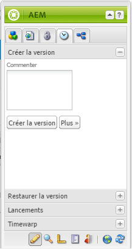
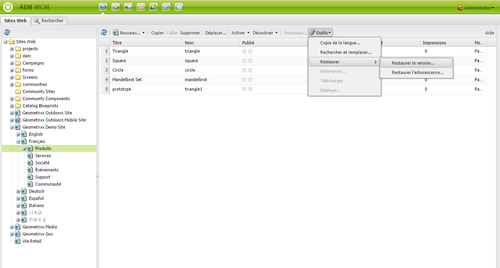
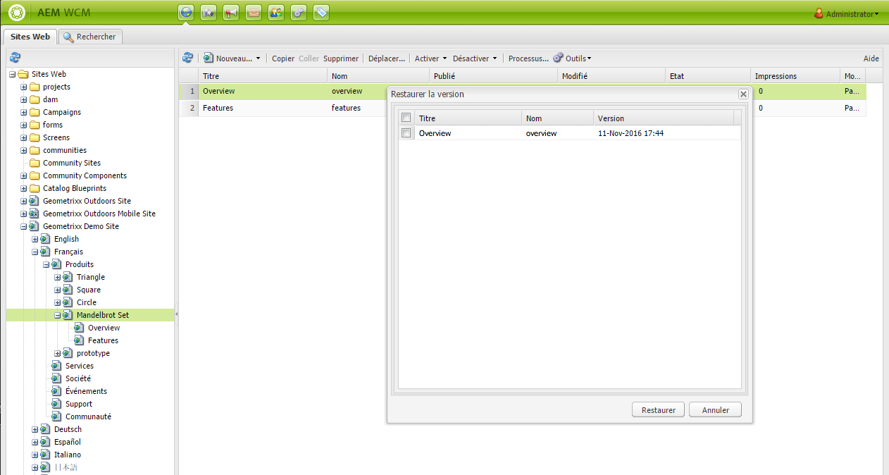
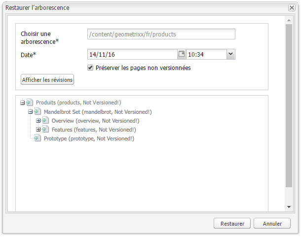
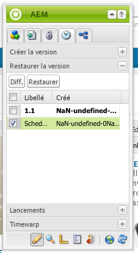
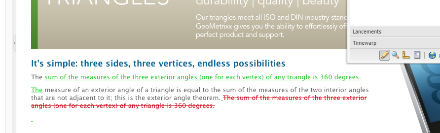
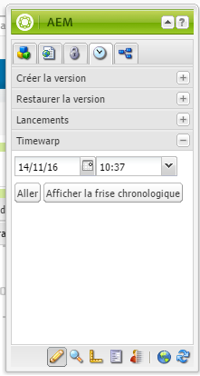
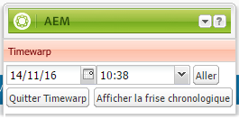
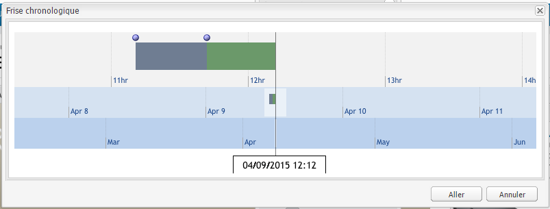
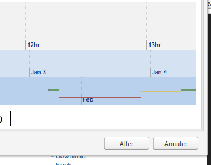

# Utilisation des versions de page{#working-with-page-versions}

Le contrôle de version permet de créer un « instantané » d’une page à un moment donné. Avec le contrôle de version, vous pouvez effectuer les opérations suivantes :

* Créer une version d’une page donnée.
* Restaurer la version précédente d’une page (pour annuler une modification apportée à une page, par exemple).
* Comparer la version actuelle d’une page avec une version précédente (les différences dans le texte et les images sont mises en évidence).

## Création d’une version   {#creating-a-new-version}

Pour créer une version d’une page :

1. Dans votre navigateur, ouvrez la page pour laquelle vous souhaitez créer une version.
1. Dans le sidekick, sélectionnez l’onglet **Création de versions**, puis le sous-onglet **Créer la version**.

   

1. Entrez un commentaire dans la zone **Commenter** (facultatif).
1. Pour définir une étiquette sur la version (facultatif), cliquez sur le bouton **Plus &quot;** et définissez **Label** pour nommer la version. Si le libellé n’est pas défini, la version est un nombre incrémenté automatiquement.
1. Cliquez sur **Créer une version**. Un message grisé s’affiche sur la page ; par exemple :
Version 1.2 créée pour : Chemises.

>[!NOTE]
>
>Une version est automatiquement créée lorsque la page est activée.

## Restauration de la version d’une page à partir du sidekick  {#restoring-a-page-version-from-sidekick}

Pour restaurer une version précédente de la page :

1. Ouvrez la page pour laquelle restaurer une version précédente.
1. Dans le sidekick, sélectionnez l’onglet **Création de versions**, puis le sous-onglet **Restaurer la version**.

   

1. Sélectionnez la version à restaurer, puis cliquez/appuyez sur **Restaurer**.

## Restauration de la version d’une page à partir de la console {#restoring-a-page-version-from-the-console}

Appliquez cette méthode pour restaurer une version de page. Vous pouvez également l’appliquer pour restaurer des pages qui ont été précédemment supprimées :

1. Dans la console **Sites web**, accédez à la page à restaurer, puis sélectionnez-la.
1. Dans le menu supérieur, sélectionnez **Outils**, puis **Restaurer** :

   

1. Si vous sélectionnez **Restaurer la version**, les versions de documents dans le dossier actif sont répertoriées. Même si une page a été supprimée, sa dernière version est répertoriée :

   

1. Sélectionnez la version à restaurer et cliquez sur **Restaurer**. AEM restaure la ou les versions (ou arborescences) sélectionnées.

### Restauration d’une arborescence à partir de la console  {#restoring-a-tree-from-the-console}

Appliquez cette méthode pour restaurer une version de page. Vous pouvez également l’appliquer pour restaurer des pages qui ont été précédemment supprimées :

1. Dans la console **Sites web**, accédez au dossier à restaurer, puis sélectionnez-le.
1. Dans le menu supérieur, sélectionnez **Outils**, puis **Restaurer** :
1. Sélectionnez **Restaurer l’arborescence** pour afficher une boîte de dialogue qui permet de sélectionner l’arborescence à restaurer :

   

1. Cliquez sur **Restaurer**. AEM restaure l’arborescence que vous avez sélectionnée.

## Comparaison à une version précédente {#comparing-with-a-previous-version}

Pour comparer la version actuelle de la page avec une version précédente :

1. Dans votre navigateur, ouvrez la page pour laquelle vous souhaitez effectuer une comparaison avec une version précédente.
1. Dans le Sidekick, sélectionnez l&#39;onglet **Versioning**, puis le sous-onglet **Restore Versio** n.

   

1. Sélectionnez la version pour laquelle effectuer la comparaison, puis cliquez sur le bouton **Diff**.
1. Les différences entre la version actuelle et la version sélectionnée s’affichent comme suit :

   * Le texte qui a été supprimé apparaît en rouge et est barré.
   * Le texte qui été ajouté apparaît en vert et est souligné.
   * Une image qui a été ajoutée ou supprimée apparaît dans un cadre vert.

   

1. Dans le sidekick, sélectionnez le sous-onglet **Restaurer la version**, puis cliquez sur le bouton **&lt;&lt;Précédent** pour afficher la version actuelle.

## Distorsion du temps Timewarp  {#timewarp}

La fonction de distorsion du temps Timewarp permet de simuler l’état ***publié*** d’une page à des moments spécifiques dans le passé.

L’objectif est de vous permettre d’effectuer le suivi d’un site web publié au moment sélectionné. Cette fonction utilise les activations de page pour déterminer l’état de l’environnement de publication.

Pour ce faire :

* Le système recherche la version de page qui était active à l’heure sélectionnée.
* Cela signifie que la version affichée a été créée/activée *avant* le moment sélectionné dans Timewarp.
* Si vous accédez à une page qui a été supprimée, celle-ci est également affichée, à condition toutefois que les anciennes versions de la page soient toujours disponibles dans le référentiel.
* Si aucune version publiée n’a été trouvée, la fonction Timewarp revient à l’état actuel de la page sur l’environnement de création (et ce, afin d’éviter une erreur/page 404, ce qui rendrait impossible toute poursuite de la navigation).

>[!NOTE]
>
>Si des versions sont supprimées du référentiel, Timewarp n’est pas en mesure d’afficher la vue correcte. De même, si des éléments (tels que du code, des feuilles css, des images, etc.) destinés au rendu du site web ont été modifiés, la vue sera différente de ce qu’elle était initialement, étant donné que ces éléments ne sont pas versionnés dans le référentiel.

### Utilisation du calendrier Timewarp  {#using-the-timewarp-calendar}

La fonctionnalité Timewarp est disponible à partir du sidekick.

La version Calendrier est utilisée si vous souhaitez visualiser un jour spécifique :

1. Ouvrez l’onglet **Création de versions**, puis cliquez sur **Timewarp** (dans la partie inférieure du sidekick). La boîte de dialogue suivante s’ouvre :

   

1. Utilisez les sélecteurs de date et d’heure pour indiquer la date/l’heure de votre choix, puis cliquez sur **Aller**.

   Timewarp affiche la page telle qu’elle se présentait dans son état publié avant la date choisie ou à cette date.

   >[!NOTE]
   >
   >Toutes les fonctionnalités de Timewarp ne sont disponibles que si vous avez publié la page précédemment. Dans le cas contraire, Timewarp affiche la page en cours dans l’environnement de création.

   >[!NOTE]
   >
   >Si vous accédez à une page qui a été supprimée du référentiel, elle s’affiche correctement si d’anciennes versions sont toujours disponibles dans le référentiel.

   >[!NOTE]
   >
   >Vous ne pouvez pas modifier l’ancienne version de la page. Elle est disponible uniquement à des fins d’affichage. Si vous souhaitez restaurer l’ancienne version, vous devrez procéder manuellement à l’aide de la fonction [Restaurer](/help/sites-classic-ui-authoring/classic-page-author-work-with-versions.md#restoring-a-page-version-from-sidekick).

1. Une fois la consultation de la page terminée, cliquez sur :

   * **Quitter Timewarp** pour quitter la fonctionnalité et revenir à la page de création en cours.
   * [Afficher la frise chronologique](#using-the-timewarp-timeline) pour afficher la frise chronologique.

   

### Utilisation de la frise chronologique Timewarp {#using-the-timewarp-timeline}

Vous pouvez utiliser la version Frise chronologique si vous souhaitez afficher un aperçu des activités de publication sur la page.

Pour afficher la frise chronologique du document :

1. Pour afficher la frise chronologique, deux possibilités s’offrent à vous :

   1. Ouvrez l’onglet **Création de versions**, puis cliquez sur **Timewarp** (dans la partie inférieure du sidekick). 

   1. Utilisez la boîte de dialogue du sidekick qui s’affiche après avoir [utilisé le calendrier Timewarp](#using-the-timewarp-calendar).

1. Cliquez sur **Afficher la frise chronologique**. La frise chronologique du document s’affiche alors, par exemple :

   

1. Pour naviguer dans la frise chronologique du document, procédez par glisser-déplacer.

   * Toutes les lignes indiquent les versions publiées.
Une nouvelle ligne commence lorsqu’une page est activée. Une nouvelle couleur apparaît chaque fois que le document est modifié.
Dans l’exemple ci-dessous, la ligne rouge indique que la page a été modifiée au cours de la période correspondant à la version verte initiale, tandis que la ligne jaune indique qu’elle a été modifiée pendant la version rouge, etc.

   

1. Cliquez sur:

   1. **Aller** pour afficher le contenu de la page publiée au moment sélectionné.
   1. **Quitter Timewarp** pour quitter la fonctionnalité et revenir à la page de création en cours.

### Limites du mode Timewarp {#timewarp-limitations}

Timewarp s’efforce de reproduire au mieux une page à un moment donné. Toutefois, en raison de la complexité de la création continue de contenu dans AEM, cela n’est pas toujours possible. Ces restrictions doivent être prises en compte lors de l’utilisation de Timewarp.

* **Timewarp fonctionne sur la base de pages publiées** : toutes les fonctionnalités de Timewarp ne sont disponibles que si vous avez publié la page précédemment. Dans le cas contraire, Timewarp affiche la page en cours dans l’environnement de création.
* **Timewarp utilise des versions de page** : si vous accédez à une page qui a été supprimée du référentiel, elle s’affiche correctement si d’anciennes versions sont toujours disponibles dans le référentiel.
* **Les versions supprimées affectent Timewarp** : si des versions sont supprimées du référentiel, Timewarp n’est pas en mesure d’afficher la vue correcte.

* **Timewarp est en lecture seule** : vous ne pouvez pas modifier l’ancienne version de la page. Elle est disponible uniquement à des fins d’affichage. Si vous souhaitez restaurer l’ancienne version, vous devrez procéder manuellement à l’aide de la fonction [Restaurer](#main-pars-title-1).

* **Timewarp est basé uniquement sur le contenu de page** : si des éléments destinés au rendu du site web (tels que du code, des feuilles css, des ressources/images, etc.) ont été modifiés, la vue sera différente de ce qu’elle était initialement, étant donné que ces éléments n’ont pas de suivi de version dans le référentiel.

>[!CAUTION]
>
>Timewarp est conçu comme un outil permettant aux auteurs de comprendre et de créer leur contenu. Il ne s’agit pas d’un journal d’audit et il n’est pas destiné à des fins juridiques.
