# Utilisation d’Adobe Campaign 6.1 et d’Adobe Campaign Standard{#working-with-adobe-campaign-and-adobe-campaign-standard}

Vous pouvez créer le contenu d’un courrier électronique dans AEM et le traiter dans les courriers électroniques Adobe Campaign. À cet effet, vous devez suivrez cette procédure :

1. Créez une newsletter dans AEM à partir d’un modèle spécifique à Adobe Campaign.
1. Sélectionnez [un service Adobe Campaign](#selectingtheadobecampaigncloudservice) avant de modifier le contenu pour accéder à toutes les fonctionnalités.
1. Modifiez le contenu.
1. Validez le contenu.

Le contenu peut alors être synchronisé avec une diffusion dans Adobe Campaign. Ce document contient des instructions détaillées.

>[!NOTE]
>
>Avant de pouvoir utiliser cette fonctionnalité, vous devez configurer AEM de manière à l’intégrer à [Adobe Campaign](/help/sites-administering/campaignonpremise.md) ou à [Adobe Campaign Standard](/help/sites-administering/campaignstandard.md).

## Envoi du contenu d’un courrier électronique via Adobe Campaign {#sending-email-content-via-adobe-campaign}

Une fois que vous avez configuré AEM et Adobe Campaign, vous pouvez créer du contenu à diffuser par courrier électronique directement dans AEM, puis le traiter dans Adobe Campaign.

Lorsque vous créez du contenu Adobe Campaign dans AEM, vous devez créer un lien vers un service Adobe Campaign avant de modifier le contenu pour accéder à toutes les fonctionnalités.

Deux cas de figure peuvent se présenter :

* Le contenu peut être synchronisé avec une diffusion à partir d’Adobe Campaign. Cela vous permet d’utiliser du contenu AEM dans une diffusion.
* (Version locale d’Adobe Campaign uniquement) Le contenu peut être envoyé directement vers Adobe Campaign, qui génère automatiquement une nouvelle diffusion par courrier électronique. Ce mode comporte des limitations.

Ce document contient des instructions détaillées.

### Création de contenu de courrier électronique  {#creating-new-email-content}

>[!NOTE]
>
>Lors de l’ajout de modèles de courrier électronique, veillez à les ajouter sous **/content/campaigns** pour les rendre disponibles.

1. Dans AEM, sélectionnez le dossier **Sites Web**, puis parcourez votre explorateur pour trouver où sont gérées vos campagnes par courriel. Dans l’exemple suivant, le noeud concerné est **Sites Web** > **Campagnes** > **Geometrixx Outdoors** > **Campagnes par courriel**.

   >[!NOTE]
   >
   >[Les exemples de messages électroniques ne sont disponibles que dans Geometrixx](/help/sites-developing/we-retail.md#weretail). Téléchargez un exemple de contenu Geometrixx à partir de Package Share.

   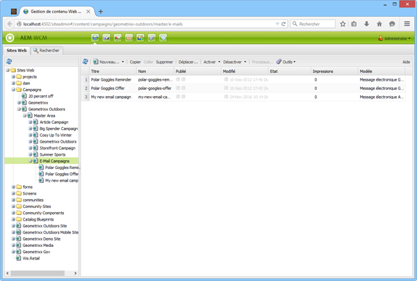

1. Sélectionnez **Nouveau** > **Nouvelle page** pour créer un nouveau contenu de courrier électronique.
1. Sélectionnez l’un des modèles disponibles spécifiques à Adobe Campaign, puis renseignez les propriétés générales de la page. Par défaut, trois modèles sont disponibles :

   * **Adobe Campaign Email (AC 6.1)** : permet d’ajouter du contenu à un modèle prédéfini avant de l’envoyer vers Adobe Campaign 6.1 pour diffusion.
   * **Adobe Campaign Email (ACS)** : permet d’ajouter du contenu à un modèle prédéfini avant de l’envoyer vers Adobe Campaign Standard pour diffusion.

   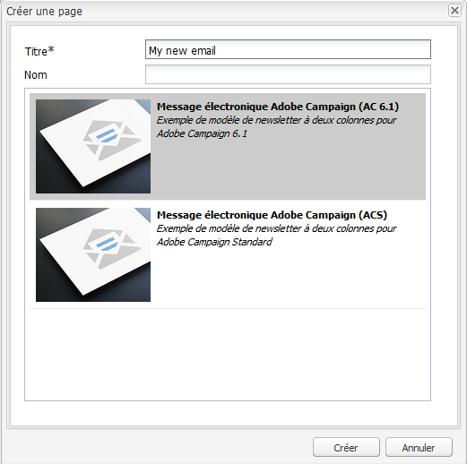

1. Cliquez sur **Créer** pour créer votre courriel ou votre bulletin d&#39;information.

### Sélection du service de cloud et du modèle d’Adobe Campaign {#selecting-the-adobe-campaign-cloud-service-and-template}

Pour l’intégration à Adobe Campaign, vous devez ajouter un service de cloud Adobe Campaign dans la page. Cela vous permet d’accéder à la personnalisation et à d’autres informations Adobe Campaign.

De plus, vous pouvez également avoir à sélectionner le modèle Adobe Campaign et à modifier l’objet et ajouter du texte brut pour les utilisateurs qui ne lisent pas le courrier électronique au format HTML.

1. Sélectionnez l&#39;onglet **Page** dans le panneau latéral, puis **Propriétés de la page.**
1. Dans l’onglet **Services Cloud** de la fenêtre contextuelle, sélectionnez **Ajouter le service** pour ajouter le service Adobe Campaign et cliquez sur **OK**.

   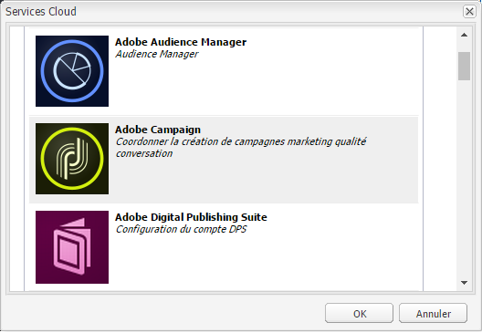

1. Sélectionnez la configuration qui correspond à votre instance Adobe Campaign dans la liste déroulante, puis cliquez sur **OK**.

   >[!NOTE]
   >
   >Après avoir ajouté le service de cloud, veillez à appuyer/cliquer sur **OK** ou **Appliquer**. Cela permet à l’onglet **Adobe Campaign** de fonctionner correctement.

1. Si vous souhaitez appliquer un modèle de diffusion de messagerie spécifique (à partir de Adobe Campaign), autre que le modèle par défaut **mail**, sélectionnez à nouveau **Propriétés de page**. Dans l&#39;onglet **Adobe Campaign**, saisissez le nom interne du modèle de diffusion de messagerie dans l&#39;instance Adobe Campaign associée.

   Dans Adobe Campaign Standard, le modèle est **Diffusion avec contenu AEM**. Dans Adobe Campaign 6.1, le modèle est **Diffusion par courrier électronique avec contenu AEM**.

   Lorsque vous sélectionnez le modèle, AEM active automatiquement les composants **Adobe Campaign Newsletter**.

### Modification du contenu d’un courrier électronique {#editing-email-content}

Vous pouvez modifier le contenu d’un courrier électronique dans l’interface utilisateur classique ou l’interface utilisateur optimisée pour les écrans tactiles.

1. Saisissez l’objet et la version textuelle du courrier électronique en sélectionnant **Propriétés de page** > **Courriel** dans la boîte à outils.

   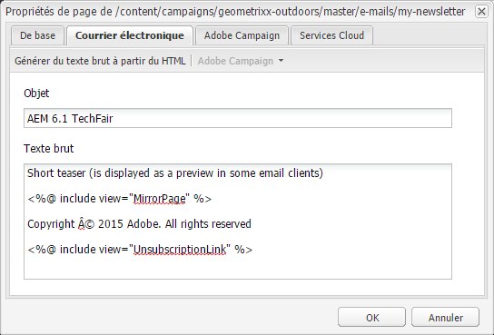

1. Modifiez le contenu du courrier électronique en ajoutant les éléments de votre choix disponibles dans le sidekick. À cet effet, faites-les glisser. Ensuite, double-cliquez sur l’élément à modifier.

   Par exemple, vous pouvez ajouter du texte contenant des champs de personnalisation.

   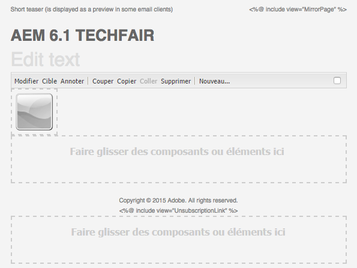

   Pour une description des composants disponibles pour les campagnes de newsletter/courrier électronique, reportez-vous à la section [Composants Adobe Campaign](/help/sites-classic-ui-authoring/classic-personalization-ac-components.md).

   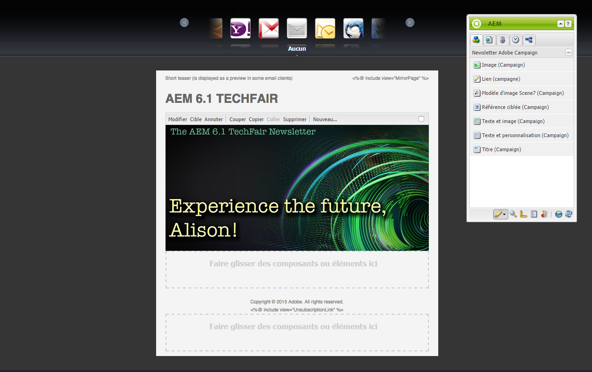

### Insertion d’une personnalisation {#inserting-personalization}

Lorsque vous modifiez votre contenu, vous pouvez insérer les éléments suivants :

* Champs de contexte Adobe Campaign. Il s’agit de champs que vous pouvez insérer dans votre texte et qui s’adapteront en fonction des données du destinataire (par exemple, prénom, nom ou toute donnée de la dimension cible).
* Blocs de personnalisation Adobe Campaign. Il s’agit de blocs de contenu prédéfini qui ne sont pas liés aux données du destinataire, tels qu’un logo de marque ou un lien vers une page miroir.

Pour une description complète des composants Adobe Campaign, reportez-vous à la section [Composants Adobe Campaign](/help/sites-classic-ui-authoring/classic-personalization-ac-components.md).

>[!NOTE]
>
>* Seuls les champs de la dimension cible **Profils** d’Adobe Campaign sont pris en compte.
>* Lors de l’affichage des propriétés à partir de **Sites**, vous n’avez pas accès aux champs contextuels Adobe Campaign. Vous pouvez y accéder directement à partir du courrier électronique en cours de modification.

>

1. Insérez un nouveau composant **Newsletter** > **Texte et personnalisation (Campaign)**.
1. Ouvrez le composant en double-cliquant dessus. La fenêtre **Modifier** dispose d’une fonctionnalité, qui permet d’insérer des éléments de personnalisation.

   >[!NOTE]
   >
   >Les champs de contexte disponibles correspondent à la dimension cible de **Profils** dans Adobe Campaign.
   >
   >Voir [Liaison d’une page d’AEM à un courriel Adobe Campaign](/help/sites-classic-ui-authoring/classic-personalization-ac-campaign.md#linkinganaempagetoanadobecampaignemail).

   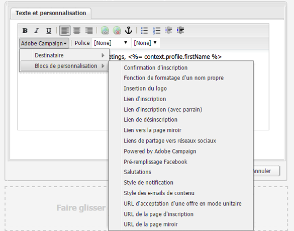

1. Sélectionnez **Client Context** dans le panneau latéral pour tester les champs de personnalisation à l’aide des données des profils personnels.

   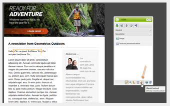

1. Une fenêtre s’affiche et vous permet de sélectionner le persona de votre choix. Les champs de personnalisation sont remplacés automatiquement par des données du profil sélectionné.

   

### Aperçu d’une newsletter {#previewing-a-newsletter}

Vous pouvez prévisualiser la newsletter telle qu’elle se présentera, ainsi que la personnalisation.

1. Ouvrez la newsletter pour laquelle vous souhaitez afficher un aperçu et cliquez sur Aperçu (loupe) pour réduire le sidekick.
1. Cliquez sur l’une des icônes de client de messagerie pour découvrir comment se présente votre newsletter dans les différents clients de messagerie.

   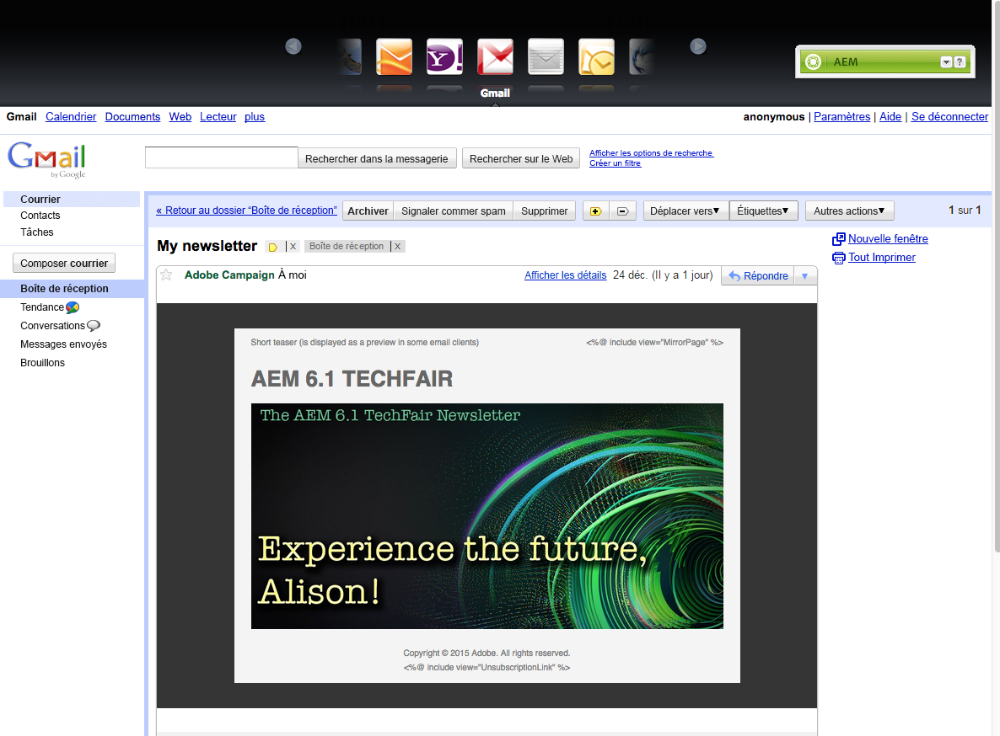

1. Développez le sidekick pour reprendre la modification.

### Approbation du contenu dans AEM  {#approving-content-in-aem}

Une fois le contenu terminé, vous pouvez commencer la procédure d’approbation. Accédez à l&#39;onglet **Workflow** de la boîte à outils et sélectionnez le processus **Approuver pour Adobe Campaign**.

Ce worfklow prêt à l’emploi comporte deux étapes : révision, puis approbation ou révision puis rejet. Néanmoins, ce worfklow peut être étendu et adapté à une procédure plus complexe.

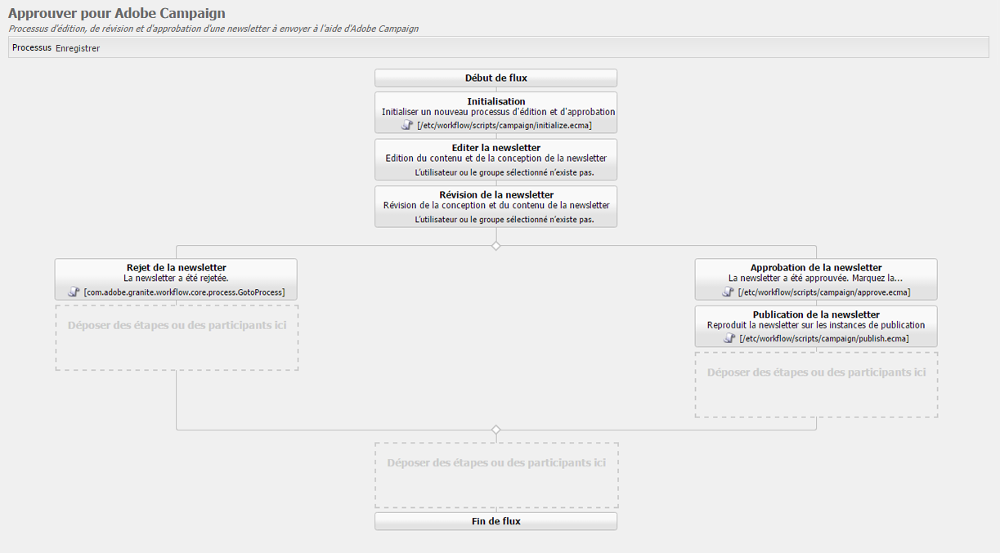

Pour approuver le contenu pour Adobe Campaign, appliquez le worfklow en sélectionnant **Worfklow** dans le sidekick et en sélectionnant **Approuver pour Adobe Campaign** et cliquez sur **Démarrer le worfklow**. Parcourez les étapes et approuvez le contenu. Vous pouvez également rejeter le contenu en sélectionnant **Rejeter** au lieu de **Approuver** dans la dernière étape du worfklow.

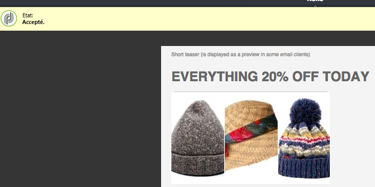

Une fois le contenu approuvé, il s’affiche comme approuvé dans Adobe Campaign. Le courrier électronique peut alors être envoyé.

Dans Adobe Campaign Standard :

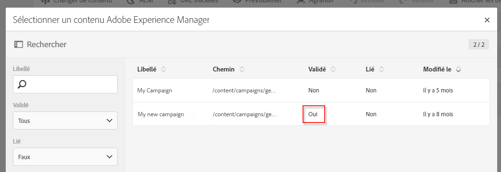

Dans Adobe Campaign 6.1 :

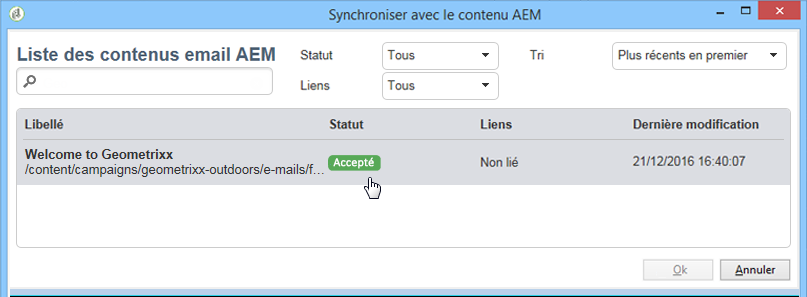

>[!NOTE]
>
>Le contenu non approuvé peut être synchronisé avec une diffusion dans Adobe Campaign, mais la diffusion ne peut pas être exécutée. Seul le contenu approuvé peut être envoyé via les diffusions Adobe Campaign.

## Liaison d’AEM à Adobe Campaign Standard et à Adobe Campaign 6.1  {#linking-aem-with-adobe-campaign-standard-and-adobe-campaign}

>[!NOTE]
>
>Pour plus d’informations, voir [Liaison d’AEM avec Adobe Campaign Standard et Adobe Campaign 6.1](/help/sites-authoring/campaign.md#linking-aem-with-adobe-campaign-standard-and-adobe-campaign-classic) sous [Utilisation de Adobe Campaign 6.1 et Adobe Campaign Standard](/help/sites-authoring/campaign.md) dans la documentation de création standard.

