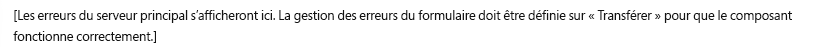

# Composants d’Adobe Campaign{#adobe-campaign-components}

Lors de l’intégration à Adobe Campaign, des composants sont disponibles pour l’utilisation de newsletters et de formulaires. Tous deux sont décrits dans ce document.

>[!CAUTION]
>
>Les composants d’e-mail AEM ont été abandonnés. En raison de la nature de l’e-mail, en particulier son contenu et son style, les composants d’e-mail fournis prêts-à-l’emploi par AEM ne sont que rarement réutilisés par les clients car ils ont besoin d’implémenter des styles personnalisés dans les composants requis pour les projets.
>
>Les composants d’e-mail peuvent être implémentés au niveau du projet. Les composants d’e-mail AEM obsolètes illustrent la manière dont cela peut être réalisé. Toutefois, n’utilisez pas ces composants obsolètes sur les projets.

## Composants Newsletter Adobe Campaign {#adobe-campaign-newsletter-components}

Tous les composants d’Adobe Campaign appliquent les méthodes recommandées décrites dans les [bonnes pratiques pour les modèles d’e-mail](/help/sites-administering/best-practices-for-email-templates.md) et dépendent du langage de balisage [HTL](https://helpx.adobe.com/fr/experience-manager/htl/using/overview.html) d’Adobe.

Lorsque vous ouvrez une newsletter ou un e-mail configuré de manière à être intégré à Adobe Campaign, les composants ci-dessous doivent s’afficher dans la section **Newsletter Adobe Campaign** :

* En-tête (Campaign)
* Image (Campaign)
* Lien (Campaign)
* Modèle d’image Scene7 (Campaign)
* Référence ciblée (Campaign)
* Texte et image (Campaign)
* Texte et personnalisation (Campaign)

Vous trouverez une description de ces composants dans la section suivante.

### En-tête (Campaign) {#heading-campaign}

Le composant d’en-tête peut :

* Afficher le nom de la page active en laissant vide le champ **Titre**.
* Afficher un texte que vous spécifiez dans le champ **Titre**.

Vous modifiez directement le composant **En-tête (Campagne)**. Laissez-le vide pour utiliser le titre de la page.

Vous pouvez configurer les éléments suivants :

* **Titre**
Si vous souhaitez utiliser un autre nom que le titre de la page, saisissez-le ici.

* **Niveau de titre (1, 2, 3, 4)**
Niveau de titre d’après la catégorie de titre HTML 1-4.

L’exemple ci-dessous présente le composant Titre (Campaign) affiché.

### Image (Campaign) {#image-campaign}

Le composant image (campagne) affiche une image et le texte qui l’accompagne selon les paramètres spécifiés.

Vous pouvez charger une image, puis la modifier et la manipuler (par exemple, la recadrer, la faire pivoter ou y ajouter un lien/titre/texte).

Vous pouvez télécharger une image, puis la modifier et la manipuler (par exemple, la recadrer, la faire pivoter, ajouter un lien/titre/texte). Vous pouvez faire glisser et déposer une image à partir de l’[Outil de recherche de contenu](/help/sites-authoring/author-environment-tools.md#thecontentfinderclassicui) directement sur le composant ou sa boîte de dialogue d’édition. Vous pouvez également double-cliquer dans la zone centrale de la boîte de dialogue d’édition pour parcourir votre système de fichiers local et charger une image. Les deux onglets de la boîte de dialogue d’édition contrôlent également toutes les définitions, ainsi que la manipulation de l’image :

Lorsqu’une image est chargée, vous pouvez configurer ce qui suit :

* **Mapper**
Pour faire correspondre une image, sélectionnez Mapper. Vous spécifiez ensuite comment créer l’image interactive (rectangle, polygone, etc.) et l’emplacement où doit pointer la zone.

* **Recadrer**
Sélectionnez cette option pour recadrer une image à l’aide de la souris.

* **Rotation**
Pour faire pivoter une image, sélectionnez Rotation, à plusieurs reprises si nécessaire.

* **Effacer**
Permet de supprimer l’image actuelle.

* Barre de zoom (IU classique uniquement)
Pour effectuer un zoom avant ou arrière sur l’image, utilisez le curseur situé sous l’image (au-dessus des boutons OK et Annuler).
* **Titre**
Titre de l’image.

* **Texte de remplacement**
Texte de remplacement à utiliser lors de la création de contenu accessible.

* **Lier à**
Créez un lien vers les ressources ou d’autres pages de votre site Web.

* **Description**
Description de l’image.

* **Taille**
Permet de définir la hauteur et la largeur de l’image.

>[!NOTE]
>
>Saisissez les informations dans le champ **Texte de remplacement** dans le champ **Avancé** ou l’image ne peut pas être enregistrée et le message d’erreur suivant s’affiche :
>
>`Validation failed. Verify the values of the marked fields.`
>

L’exemple ci-dessous présente le composant Image (Campaign) affiché.

### Lien (Campaign) {#link-campaign}

Le composant Lien (Campaign) vous permet d’ajouter un lien à votre newsletter. Ce composant n’est disponible que dans l’interface utilisateur classique, bien que vous puissiez en ajouter un dans l’interface utilisateur optimisée pour les écrans tactiles et l’ouvrir en mode compatibilité.

Vous pouvez configurer les éléments ci-dessous sur les onglets **Affichage**, **Informations d’URL** ou **Avancé** :

* **Légende du lien**
Légende du lien. Il s’agit du texte que les utilisateurs voient.

* **Info-bulle du lien**
Ajoute des informations supplémentaires sur l’utilisation du lien.

* **LinkType**
Dans la liste déroulante, sélectionnez entre un **URL personnalisée** et un **Document adaptatif**. Ce champ est obligatoire. Si vous sélectionnez URL personnalisée, vous pouvez fournir l’URL du lien. Si vous sélectionnez Document adaptatif, vous pouvez fournir le chemin du document.

* **Paramètre d’URL supplémentaire**
Ajoutez des paramètres d’URL supplémentaires. Cliquez sur Ajouter un élément pour ajouter plusieurs éléments.

>[!NOTE]
>
>Saisissez les informations dans le champ **Type de lien** dans le champ **Informations sur l’URL** ou le composant ne peut pas enregistrer et le message d’erreur suivant s’affiche :
>
>`Validation failed. Verify the values of the marked fields.`
>

L’exemple ci-dessous présente le composant Lien (Campaign) affiché.

### Référence ciblée (Campaign) {#targeted-reference-campaign}

Le composant Référence ciblée (Campaign) permet de créer une référence à un paragraphe ciblé.

Dans ce composant, vous accédez au paragraphe ciblé pour le sélectionner.

Cliquez sur le menu déroulant pour accéder au paragraphe à référencer. Une fois terminé, cliquez sur **OK**.

### Texte et image (Campaign) {#text-image-campaign}

Le composant Texte et image (Campaign) permet d’ajouter un bloc de texte et une image.

Comme pour les composants Texte et personnalisation (Campaign) et Image (Campaign), vous pouvez configurer :

* **Texte**
Permet de saisir du texte. Utilisez la barre d’outils pour modifier la mise en forme, créer des listes et ajouter des liens.

* **Image**
Faites glisser une image à partir de l’Outil de recherche de contenu ou cliquez pour accéder à une image. Vous pouvez la recadrer ou la faire pivoter le cas échéant.

* **Propriétés de l’image** (**Propriétés d’image avancées**)
Permet de spécifier ce qui suit :

   * **Titre**
Titre du bloc ; il est affiché en pointant la souris dessus.

   * **Texte de remplacement**
Texte de remplacement à afficher lorsque l’image ne peut pas être affichée.

   * **Lier à**
Créez un lien vers les ressources ou d’autres pages de votre site Web.

   * **Description**
Description de l’image.

   * **Taille**
Permet de définir la hauteur et la largeur de l’image.

>[!NOTE]
>
>Le champ **Texte de remplacement** sur l’onglet **Avancé** est obligatoire. Autrement, vous ne pouvez pas enregistrer le composant, et le message d’erreur ci-dessous s’affiche :
>
>`Validation failed. Verify the values of the marked fields.`
>

L’exemple ci-dessous présente le composant Texte et image (Campaign) affiché.

### Texte et personnalisation (Campaign) {#text-personalization-campaign}

Le composant Texte et personnalisation (Campaign) permet de saisir un bloc de texte en utilisant un éditeur WYSIWYG, avec les fonctionnalités de l’[éditeur de texte enrichi](/help/sites-authoring/rich-text-editor.md). De plus, ce composant permet d’utiliser des champs de contexte et des blocs de personnalisation, disponibles dans Adobe Campaign. Reportez-vous également à la section [Insertion d’une personnalisation](/help/sites-classic-ui-authoring/classic-personalization-ac-campaign.md#inserting-personalization).

Une série d’icônes permet de mettre en forme le texte (attributs de police, alignement, liens, listes et mise en retrait).

Ajoutez du texte comme vous le feriez normalement dans l’éditeur de texte enrichi. Ajoutez une personnalisation en sélectionnant la liste déroulante Adobe Campaign et en sélectionnant les champs appropriés.

Vous ajoutez des champs de texte et de contexte ou des blocs de personnalisation pour créer du contenu. Sélectionnez ensuite le contexte client pour tester les données dans les profils de personas. Après avoir sélectionné une persona, les champs de personnalisation sont automatiquement remplacés par les données du profil sélectionné.

>[!NOTE]
>
>Seuls les champs définis dans le schéma **nms:seedMember** ou l’une de ses extensions sont pris en compte. Les attributs des tables liés à `nms:seedMember` ne sont pas disponibles.

## Composants Formulaire d’Adobe Campaign {#adobe-campaign-form-components}

Vous utilisez les composants Adobe Campaign pour créer un formulaire que les utilisateurs et utilisatrices remplissent pour s’abonner ou se désinscrire d’une newsletter, ou mettre à jour leurs profils utilisateur. Voir [Création de formulaires Adobe Campaign](/help/sites-classic-ui-authoring/classic-personalization-ac-forms.md) pour plus d’informations.

Chaque champ de composant peut être associé à un champ de base de données Adobe Campaign. Les champs disponibles varient en fonction du type de données qu’ils contiennent, comme décrit dans la section [Composants et type de données](#components-and-data-type). Si vous étendez votre schéma de destinataires dans Adobe Campaign, les nouveaux champs seront disponibles dans les composants dont les types de données correspondent.

Lorsque vous ouvrez un formulaire configuré pour être intégré à Adobe Campaign, les composants ci-dessous de la section **Adobe Campaign** s’affichent :

* Case à cocher (Campaign)
* Champ de date (Campaign) et champ de date/HTML 5 (Campaign)
* Clé primaire chiffrée (Campaign)
* Affichage d’erreur (campagne)
* Clé de réconciliation masquée (Campaign)
* Champ numérique (Campaign)
* Champ d’option (Campaign)
* Liste de contrôle d’abonnements (Campaign)
* Champ de texte (Campaign)

Cette section décrit en détail chaque composant.

### Composants et type de données {#components-and-data-type}

Le tableau suivant décrit les composants disponibles pour afficher et modifier les données de profil Adobe Campaign. Chaque composant peut être mappé à un champ de profil Adobe Campaign pour afficher sa valeur et mettre à jour le champ lors de l’envoi du formulaire. Les différents composants ne peuvent être associés qu’à des champs d’un type de données approprié.

<table>
 <tbody>
  <tr>
   <td>
<strong>Composant</strong>
 </td>
   <td>
<strong>Type de données du champ Adobe Campaign</strong>
 </td>
   <td>
<strong>Exemple de champ</strong>
 </td>
  </tr>
  <tr>
   <td>
Case à cocher (Campaign)
 </td>
   <td>
booléen
 </td>
   <td>
Ne plus contacter (quel que soit le canal)
 </td>
  </tr>
  <tr>
   <td>
Champ de date (Campaign)
 
Champ de date/HTML 5 (Campaign)
 </td>
   <td>
date
 </td>
   <td>
Date de naissance
 </td>
  </tr>
  <tr>
   <td>
Champ numérique (Campaign)
 </td>
   <td>
numérique (octet, court, long, double)
 </td>
   <td>
Âge
 </td>
  </tr>
  <tr>
   <td>
Champ d’option (Campaign)
 </td>
   <td>
octet avec valeurs associées
 </td>
   <td>
Genre
 </td>
  </tr>
  <tr>
   <td>
Champ de texte (Campaign)
 </td>
   <td>
chaîne
 </td>
   <td>
E-mail
 </td>
  </tr>
 </tbody>
</table>

### Paramètres communs à la plupart des composants {#settings-common-to-most-components}

Les paramètres des composants Adobe Campaign sont communs à tous les composants (à l’exception des composants Clé de Principal chiffrée et Clé de réconciliation masquée).

Dans la plupart des composants, vous pouvez configurer les éléments suivants :

#### Titre et texte {#title-and-text}

* **Titre**
Si vous souhaitez utiliser un autre nom que le nom de l’élément, saisissez-le ici.

* **Masquer le titre**
Cochez cette case si vous ne voulez pas afficher le titre.

* **Description**
Ajoutez une description dans ce champ pour donner des informations supplémentaires pour les utilisateurs.

* **N’afficher que la valeur**
Affiche uniquement la valeur, le cas échéant.

#### Adobe Campaign {#adobe-campaign}

Vous pouvez configurer les éléments suivants :

* **Correspondance**
Sélectionnez un champ de personnalisation Adobe Campaign, si cela est approprié.

* **Clé de réconciliation**
Cochez cette case si ce champ fait partie de la clé de réconciliation.

#### Contraintes {#constraints}

* **Obligatoire** - Cochez cette case pour que ce composant soit obligatoire. En d’autres termes, les utilisateurs doivent saisir une valeur.
* **Message Obligatoire** - Si vous le souhaitez, ajoutez un message indiquant que le champ est obligatoire.

#### Style {#styling}

* **CSS**
Indiquez les classes CSS à utiliser pour ce composant.

### Case à cocher (Campaign) {#checkbox-campaign}

Le composant Case à cocher (Campaign) permet à l’utilisateur ou à l’utilisatrice de modifier les champs de profil Adobe Campaign qui sont de type données booléennes. Par exemple, vous pouvez avoir un composant Case à cocher (Campaign) qui permet au destinataire ou à la destinataire d’indiquer qu’il ou elle ne souhaite être contacté(e) via aucun canal.

Vous pouvez [configurer des paramètres communs à la plupart des composants d’Adobe Campaign](#settings-common-to-most-components) dans le composant Case à cocher (Campaign).

L’exemple ci-dessous présente le composant Case à cocher (Campaign) affiché.

### Champ de date (Campaign) et champ de date/HTML 5 (Campaign) {#date-field-campaign-and-date-field-html-campaign}

Utilisez le champ date pour permettre aux destinataires d&#39;indiquer une date, par exemple si vous souhaitez que les destinataires indiquent leur date de naissance. Le format des dates correspond au format utilisé dans votre instance Adobe Campaign.

Outre les [paramètres communs à la plupart des composants Adobe Campaign](#settings-common-to-most-components), vous pouvez configurer les éléments suivants :

* **Contraintes – Contrainte** Vous pouvez sélectionner **Aucune** ou **Date** pour ajouter une contrainte de date ou aucune contrainte. Si vous sélectionnez Date, la réponse que les utilisateurs renseignent dans le champ doit correspondre à un format de date.

* **Message de contrainte** - De plus, vous pouvez ajouter un message de contrainte afin que les utilisateurs sachent quel format suivre pour leur réponse.
* **Style - Largeur** - Ajustez la largeur du champ en cliquant ou en appuyant sur les icônes « **+** » et « **-** » ou saisissez un nombre.

L’exemple ci-dessous présente le composant Champ de date (Campaign), dont la largeur ajustée, affiché.

### Clé primaire chiffrée (Campaign) {#encrypted-primary-key-campaign}

Ce composant définit le nom du paramètre d’URL qui contiendra l’identifiant d’un profil Adobe Campaign (**Identifiant de ressource principal** ou **Clé primaire chiffrée** dans Adobe Campaign Standard et la version 6.1, respectivement).

Chaque formulaire affichant et modifiant les données de profil Adobe Campaign **doit** inclure un composant Clé primaire chiffrée.

Vous pouvez configurer les éléments ci-dessous dans le composant Clé primaire chiffrée (Campaign) :

* **Titre et texte – Nom d’élément** - Par défaut, la valeur encryptedPK est proposée. Il suffit de modifier le nom de l’élément lorsqu’il entre en conflit avec le nom d’un autre élément du formulaire. Deux champs de formulaire ne peuvent pas avoir le même nom d’élément.
* **Adobe Campaign – Paramètre d’URL** - Ajoutez le paramètre d’URL de l’EPK. Par exemple, vous pouvez utiliser la valeur **epk**.

L’exemple ci-dessous présente le composant Clé primaire chiffrée (Campaign) affiché.

### Affichage d’erreur (campagne) {#error-display-campaign}

Ce composant vous permet d’afficher les erreurs du serveur principal. La gestion des erreurs du formulaire doit être définie sur Transférer pour que le composant fonctionne correctement.

L’exemple suivant présente le composant Affichage d’erreur (Campaign) affiché.

### Clé de réconciliation masquée (Campaign) {#hidden-reconciliation-key-campaign}

Le composant Clé de réconciliation masquée (Campaign) permet d’ajouter des champs masqués dans le cadre de la clé de réconciliation d’un formulaire.

Vous pouvez configurer les éléments ci-dessous dans le composant Clé de réconciliation masquée (Campaign) :

* **Titre et texte - Nom d’élément** - Par défaut, reconcilKey est proposé. Il suffit de modifier le nom de l’élément lorsqu’il entre en conflit avec le nom d’un autre élément du formulaire. Deux champs de formulaire ne peuvent pas avoir le même nom d’élément.
* **Adobe Campaign - Mappage** - Associez-la à un champ de personnalisation Adobe Campaign.

L’exemple ci-dessous présente le composant Clé de réconciliation masquée (Campaign) affiché.

### Champ numérique (Campaign) {#numeric-field-campaign}

Utilisez le champ numérique pour permettre aux destinataires de saisir des nombres, par exemple leur âge.

Outre les [paramètres communs à la plupart des composants Adobe Campaign](#settings-common-to-most-components), vous pouvez configurer les éléments suivants :

* Liste déroulante **Contraintes – Contrainte**
Vous pouvez sélectionner - **Aucune** ou **Numérique -** pour ajouter une contrainte de nombre ou aucune contrainte. Si vous sélectionnez Numérique, la réponse saisie par les utilisateurs dans le champ doit être numérique.

* **Message de contrainte** - De plus, vous pouvez ajouter un message de contrainte afin que les utilisateurs sachent quel format suivre pour leur réponse.
* **Style - Largeur** - Ajustez la largeur du champ en cliquant ou en appuyant sur les icônes « **+** » et « **-** » ou saisissez un nombre.

L’exemple ci-dessous présente le composant Champ numérique (Campaign), dont la largeur est configurée.

### Champ d’option (Campaign) {#option-field-campaign}

Cette liste déroulante vous permet de sélectionner une option. Par exemple, le genre ou le statut d’un ou une destinataire.

Vous pouvez [configurer des paramètres communs à la plupart des composants d’Adobe Campaign](#settings-common-to-most-components) dans le composant Champ d’option (Campaign). Pour remplir la liste déroulante, sélectionnez le champ approprié dans les champs de personnalisation d’Adobe Campaign en cliquant ou en appuyant sur le symbole Adobe Campaign et en accédant au champ.

L’exemple ci-dessous présente le composant Champ d’option (Campaign) affiché.

### Liste de contrôle d’abonnements (Campaign) {#subscriptions-checklist-campaign}

Utilisez le composant **Liste de contrôle d’abonnements (Campaign)** pour modifier les abonnements associés à un profil Adobe Campaign.

Lorsque vous ajoutez ce composant à un formulaire, il affiche tous les abonnements disponibles sous forme de cases à cocher et permet à l’utilisateur de sélectionner les abonnements souhaités. Lorsque les utilisateurs envoient le formulaire, ce composant abonne l’utilisateur aux services sélectionnés ou l’en désabonne en fonction du type d’action de formulaire (**Adobe Campaign : S’abonner à des services** ou **Adobe Campaign : Se désabonner de services**).

>[!NOTE]
>
>Le composant ne vérifie pas les services auxquels l’utilisateur est déjà abonné/dont il est désabonné.

Vous pouvez [configurer des paramètres communs à la plupart des composants d’Adobe Campaign](#settings-common-to-most-components) dans le composant Liste de contrôle des abonnements (Campaign). (Aucune configuration Adobe Campaign n’est disponible pour ce composant.)

L’exemple ci-dessous montre l’affichage du composant Liste de contrôle des abonnements (Campaign).

### Champ de texte (Campaign) {#text-field-campaign}

Le composant Champ de texte (Campaign) qui vous permet de saisir des données de type chaîne, telles qu’un prénom, un nom, une adresse, une adresse e-mail, etc.

Outre les [paramètres communs à la plupart des composants Adobe Campaign](#settings-common-to-most-components), vous pouvez configurer les éléments suivants :

* Liste déroulante **Contraintes – Contrainte**
Vous pouvez sélectionner - **Aucune**, **E-mail** ou **Nom** (pas de trémas) pour ajouter une contrainte d’adresse électronique, de nom ou aucune contrainte. Si vous sélectionnez l’option E-mail, la réponse saisie par les utilisateurs dans le champ doit correspondre à une adresse électronique. Si vous sélectionnez Nom, il doit s’agit d’un nom (les trémas ne sont pas autorisés).

* **Message de contrainte** - De plus, vous pouvez ajouter un message de contrainte afin que les utilisateurs sachent quel format suivre pour leur réponse.
* **Style - Largeur** - Ajustez la largeur du champ en cliquant ou en appuyant sur les icônes « **+** » et « **-** » ou saisissez un nombre.

L’exemple ci-dessous présente le composant Champ de texte (Campaign) affiché.

