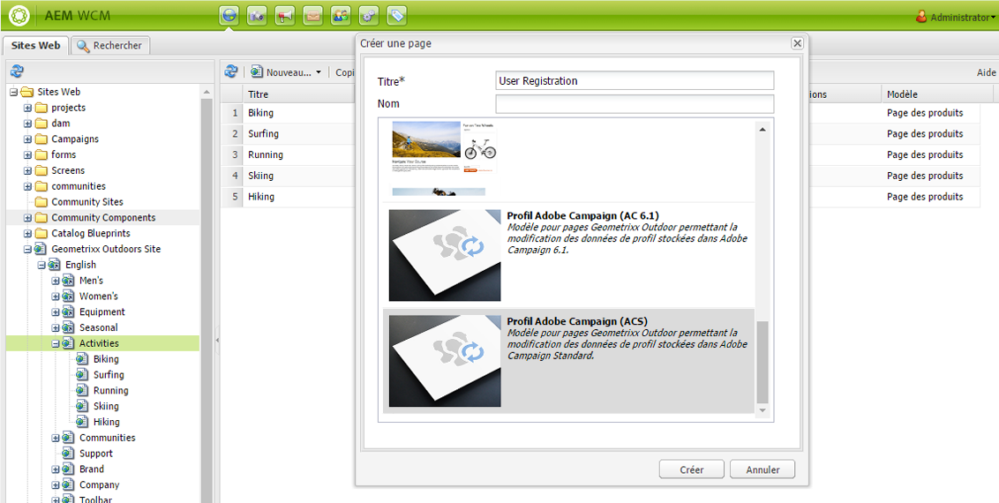
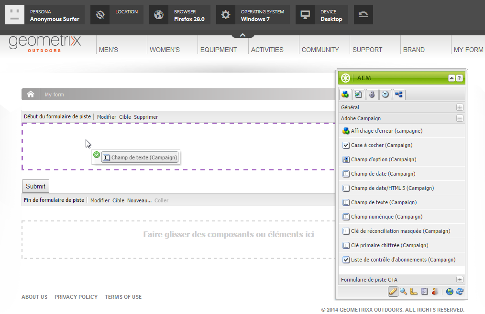

# Création de formulaires Adobe Campaign dans AEM{#creating-adobe-campaign-forms-in-aem}

AEM vous permet de créer et d’utiliser des formulaires qui interagissent avec Adobe Campaign sur votre site web. Vous pouvez insérer des champs spécifiques dans vos formulaires et les mapper à la base de données Adobe Campaign.

Vous pouvez également gérer les nouveaux abonnements des contacts, les désabonnements et les données de profil utilisateur, tout en intégrant leurs données dans votre base de données Adobe Campaign.

Pour utiliser des formulaires Adobe Campaign dans AEM, suivez les étapes décrites dans ce document :

1. Rendre un modèle disponible.
1. Créer un formulaire.
1. Modifier le contenu du formulaire.

Trois types de formulaires, spécifiques à Adobe Campaign, sont disponibles par défaut :

* Enregistrement d’un profil
* Abonnement à un service
* Désabonnement d’un service

Ces formulaires définissent un paramètre d’URL qui accepte la clé primaire chiffrée d’un profil Adobe Campaign. Selon ce paramètre d’URL, le formulaire met à jour les données du profil Adobe Campaign associé.

Même si vous créez ces formulaires individuellement, dans un cas d’utilisation standard, vous générez un lien personnalisé sur une page de formulaire à l’intérieur du contenu de la newsletter, afin que les destinataires puissent ouvrir le lien et modifier les données de leur profil (qu’il s’agisse pour eux de se désabonner, de s’abonner ou de mettre à jour leur profil).

Le formulaire est mis à jour automatiquement en fonction de l’utilisateur. Voir [Modification du contenu d’un formulaire](#editing-form-content) pour plus d’informations.

## Rendre un modèle disponible {#making-a-template-available}

Avant de pouvoir créer des formulaires spécifiques à Adobe Campaign, vous devez rendre les différents modèles disponibles dans votre application AEM.

To do this, see the [Templates documentation](/help/sites-developing/page-templates-static.md#templateavailability).

Tout d’abord, vérifiez la connexion entre les instances de création et de publication et assurez-vous qu’Adobe Campaign est en cours d’exécution. Voir [Intégration à Adobe Campaign standard](/help/sites-administering/campaignstandard.md) ou [Intégration à Adobe Campaign 6.1](/help/sites-administering/campaignonpremise.md).

>[!NOTE]
>
>Vérifiez que la propriété **acMapping** sur le nœud **jcr:content** de la page est définie sur **mapRecipient** ou **profile**, lorsque vous utilisez Adobe Campaign 6.1.x ou Adobe Campaign standard, respectivement.

### Création d’un formulaire {#creating-a-form}

1. Commencez dans siteadmin.
1. Parcourez l’arborescence jusqu’à atteindre l’emplacement où vous souhaitez créer le formulaire dans le site web sélectionné.
1. Select **New** > **New page...**.
1. Select either **Adobe Campaign Profile (AC 6.1)** or **Adobe Campaign Profile (ACS)** template and enter the page properties.

   >[!NOTE]
   >
   >If the template is not available, refer to the [Making a template available](/help/sites-classic-ui-authoring/classic-personalization-ac.md#activatingatemplate) section.

1. Click **Create** to create the form.

   

   Vous pouvez ensuite [modifier et configurer le contenu de votre formulaire](#editing-form-content). 

## Modification du contenu d’un formulaire {#editing-form-content}

Les formulaires dédiés à Adobe Campaign présentent des composants spécifiques. Ces composants disposent d’une option pour vous permettre de lier chaque champ du formulaire à un champ dans la base de données Adobe Campaign.

>[!NOTE]
>
>If the desired template is not available, see [Making a template available](/help/sites-classic-ui-authoring/classic-personalization-ac.md#activatingatemplate).

Cette section présente uniquement les liens spécifiques à Adobe Campaign. For more information on a more general overview of how to use forms in Adobe Experience Manager, see [Editmode components](/help/sites-classic-ui-authoring/classic-page-author-edit-mode.md).

1. Accédez au formulaire que vous souhaitez modifier.
1. In the toolbox, select **Page** > **Page Properties...** then go to the **Cloud Services** tab of the pop-up window.
1. Add the Adobe Campaign service by clicking **Add service**, and then selecting the configuration that corresponds to your Adobe Campaign instance in the service&#39;s drop down list. Cette configuration est effectuée lors de la configuration de la connexion entre les différentes instances. For more information, see [Connecting AEM to Adobe Campaign](/help/sites-administering/campaignonpremise.md#connecting-aem-to-adobe-campaign).

   >[!NOTE]
   >
   >Le cas échéant, déverrouillez la configuration en cliquant sur l’icône en forme de cadenas pour pouvoir ajouter le service Adobe Campaign.

1. Access the form&#39;s general parameters using the **Edit** button found at the start of the form. The **Form** tab allows you to select a thank you page to which the user will be redirected after having validated the form.

   The **Advanced** form allows you to select the type of form. The **Post Options** field gives you the choice between three types of Adobe Campaign forms:

   * **Adobe Campaign : enregistrer le profil** : vous permet de créer ou de mettre à jour un destinataire dans Adobe Campaign (valeur par défaut).
   * **Adobe Campaign : s’abonner aux services** : vous permet de gérer les abonnements d’un destinataire dans Adobe Campaign.
   * **Adobe Campaign : se désabonner des services** : vous permet d’annuler les abonnements d’un destinataire dans Adobe Campaign.

   The **Action Configuration** field lets you specify whether or not you would like to create the recipient profile in the Adobe Campaign database if it does not yet exist. To do this, check the **Create user if not existing** option.

1. Ajoutez vos composants sélectionnés en les faisant glisser depuis la boîte à outils et en les plaçant dans le formulaire. Pour plus d’informations sur les éléments spécifiques d’Adobe Campaign disponibles, voir [Composants de formulaire Adobe](/help/sites-classic-ui-authoring/classic-personalization-ac-components.md).

   

1. Configurez les champs ajoutés en cliquant deux fois dessus. The **Adobe Campaign** tab lets you link the field to a field in the Adobe Campaign recipient table. Vous pouvez également indiquer si le champ fait partie de la clé de réconciliation qui permet aux destinataires qui sont déjà présents dans la base de données Adobe Campaign d’être reconnus.

   >[!CAUTION]
   >
   >The **Element Name** must be different for each form field. Modifiez-le si nécessaire.
   >
   >Each form must contain an **Encrypted Primary Key** component in order to correctly manage recipients in the Adobe Campaign database.

1. Activate the page by selecting **Page** > **Activate Page** in the toolbox. La page est activée sur votre site. Vous pouvez l’afficher en accédant à votre instance de publication AEM. Les données de la base de données Adobe Campaign sont mises à jour une fois qu’un formulaire est validé.

## Test d’un formulaire {#testing-a-form}

Une fois que vous avez créé un formulaire et modifié son contenu, il est conseillé de tester manuellement que le formulaire fonctionne comme prévu.

>[!NOTE]
>
>You must have an **Encryted Primary Key** component on each form. Dans Composants, sélectionnez Adobe Campaign afin que seuls ces composants soient visibles.
>
>Même si dans cette procédure vous saisissez le numéro d’EPK manuellement, dans la pratique, les utilisateurs recevront un lien vers cette page (pour se désabonner, s’abonner ou mettre à jour leur profil) dans une newsletter. En fonction de l’utilisateur, l’EPK est mis à jour automatiquement.
>
>To create that link, you use the variable **Main resource identifier**(Adobe Campaign Standard) or **Encrypted identifier** (Adobe Campaign 6.1) (for example, in a **Text &amp; Personalization (Campaign)** component), which links to the epk in Adobe Campaign.

Pour ce faire, vous devez obtenir manuellement l’EPK d’un profil Adobe Campaign et ensuite l’ajouter à l’URL :

1. Pour obtenir la clé primaire chiffrée (EPK) d’un profil Adobe Campaign :

   * In Adobe Campaign Standard - Navigate to **Profiles and Audiences** > **Profiles**, which lists the existing profiles. Make sure the table displays the **Main Resource Identifier** field in a column (This can be configured by clicking/tapping **Configure list**). Copiez l’identifiant de ressource principale du profil souhaité.
   * In Adobe Campaign 6.11, go to **Profiles and Targets** >  **Recipients**, which lists the existing profiles. Make sure the table displays the **Encrypted identifier** field in a column (This can be configured by right-clicking on an entry and selecting **Configure list...**). Copiez l’identifiant chiffré du profil souhaité.

1. In AEM, open the form page on the publish instance and append the EPK from step 1 as a URL parameter: use the same name that you previously defined in the EPK component when authoring the form (for example: `?epk=...`)
1. Le formulaire peut maintenant être utilisé pour modifier les données et les abonnements associés au profil Adobe Campaign lié. Après avoir modifié certains champs et envoyé le formulaire, vous pouvez vérifier dans Adobe Campaign que les données ont été mises à jour.

Les données de la base de données Adobe Campaign sont mises à jour une fois qu’un formulaire est validé.
