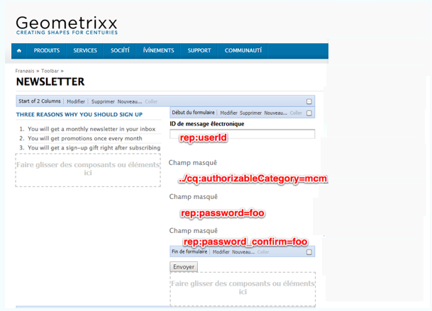
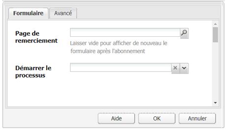
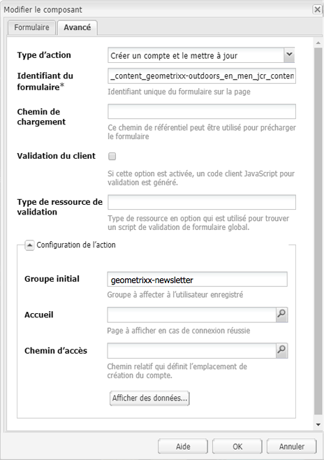
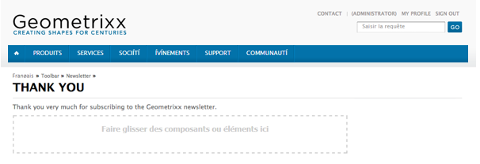
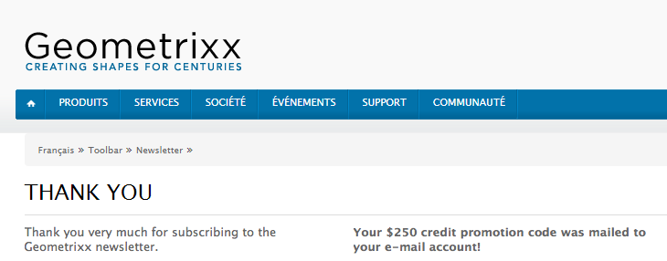

# Création d’une page d’entrée efficace pour une newsletter{#creating-an-effective-newsletter-landing-page}

Une page d’entrée efficace pour newsletter vous permet d’inciter autant de personnes que possible à s’abonner à votre newsletter (ou à toute autre campagne de marketing par messagerie électronique). Vous pouvez utiliser les informations que vous collectez via les abonnements à votre newsletter pour obtenir des pistes.

Pour créer une page d’entrée efficace pour votre newsletter, vous devez procéder comme suit :

1. Créez une liste pour la newsletter afin que des personnes puissent s’y abonner.
1. Créez le formulaire d’abonnement. Pour ce faire, ajoutez une étape de workflow qui ajoute automatiquement dans votre liste de pistes la personne qui s’abonne à la newsletter.
1. Créez une page de confirmation qui remercie les utilisateurs de s’être abonnés et qui leur fournit, le cas échéant, une offre promotionnelle.
1. Ajoutez des teasers.

>[!NOTE]
>
>Adobe ne prévoit pas d’optimiser cette fonctionnalité (Gestion des pistes et des listes).
> Il est conseillé d’[utiliser Adobe Campaign et l’intégration à AEM](/help/sites-administering/campaign.md). 

## Création d’une liste pour la newsletter {#creating-a-list-for-the-newsletter}

Créez une liste, par exemple, **Geometrixx Newsletter**, dans MCM pour la newsletter à laquelle les personnes doivent s’abonner. La création de listes est décrite dans la section [Création de listes](/help/sites-classic-ui-authoring/classic-personalization-campaigns.md#creatingnewlists). 

Voici un exemple de liste :

## Création d’un formulaire d’inscription {#create-a-sign-up-form}

Créez un formulaire d’inscription pour newsletter qui permet aux utilisateurs de s’abonner aux balises. L’extrait de site web Geometrixx fournit une page de newsletter dans la barre d’outils Geometrixx dans laquelle vous pouvez créer votre formulaire.

Pour créer votre propre formulaire de newsletter, reportez-vous aux informations sur la création de formulaires de la section [Documentation sur les formulaires](/help/sites-authoring/default-components.md#form). La newsletter utilise les balises de la bibliothèque de balises. Pour ajouter des balises supplémentaires, reportez-vous à la section [Administration des balises](/help/sites-authoring/tags.md#tagadministration).

Les champs masqués dans l’exemple suivant fournissent un minimum d’informations (courrier électronique) ; vous pouvez ajouter davantage de champs ultérieurement mais ceci impacte le taux de conversion.

L’exemple suivant est un formulaire créé à l’adresse https://localhost:4502/cf#/content/geometrixx/en/toolbar/newsletter.html.

1. Créez le formulaire.

   

1. Cliquez sur **Modifier** dans le composant de formulaire pour configurer le formulaire d’une page de remerciement (reportez-vous à la section [Création de pages de remerciement](#creating-a-thank-you-page)).

   

1. Définissez l’action de formulaire (ce qui se passe lorsque vous envoyez le formulaire) et configurez le groupe pour affecter les utilisateurs inscrits à la liste que vous avez créée précédemment (par exemple, geometrixx-newsletter).

   

### Création d’une page de remerciement {#creating-a-thank-you-page}

Lorsque les utilisateurs cliquent sur **S’abonner maintenant**, vous souhaitez qu’une page de remerciement s’affiche automatiquement. Créez la page de remerciement dans la page Geometrixx Newsletter. Une fois le formulaire Newsletter créé, modifiez le composant de formulaire et ajoutez le chemin d’accès à la page de remerciement.

Lorsqu’il envoie la requête, l’utilisateur est amené à une page de **remerciement** qui est suivie par un courrier électronique. Cette page de remerciement a été créée à l’adresse /content/geometrixx/en/toolbar/newsletter/thank_you.

### Ajout de teasers {#adding-teasers}

Ajoutez des [teasers](/help/sites-classic-ui-authoring/classic-personalization-campaigns.md#teasers) pour cibler des audiences spécifiques. Par exemple, vous pouvez ajouter des teasers aux pages de remerciement et d’abonnement à la Newsletter.

Ajout de teasers pour créer une page d’accueil efficace pour newsletter :

1. Créez un paragraphe de teaser pour un cadeau d’abonnement. Sélectionnez **Première** comme stratégie et insérez le texte pour les informer du cadeau qu’ils vont recevoir.

   

1. Créez un paragraphe de teaser pour la page de remerciement. Sélectionnez **Première** comme stratégie et insérez du texte pour indiquer que le cadeau a été expédié.

   

1. Créez une campagne avec les deux teasers -- affectez un avec un tag commercial et un autre sans tag.

### Pousser du contenu vers les abonnés {#pushing-content-to-subscribers}

Poussez toute modification des pages via la fonctionnalité Newsletter dans MCM. Vous pouvez alors envoyer du contenu mis à jour aux abonnés.

Reportez-vous à la section [Envoi de newsletters](/help/sites-classic-ui-authoring/classic-personalization-campaigns.md#newsletters).
